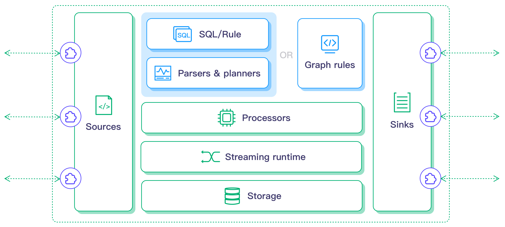

# LF Edge eKuiper - 超轻量物联网边缘数据分析软件
[](https://github.com/lf-edge/ekuiper/releases)
[](https://hub.docker.com/r/lfedge/ekuiper)
[](https://slack.lfedge.org/)
[](https://twitter.com/EMQTech)
[](https://askemq.com/c/kuiper/)
[](https://www.youtube.com/channel/UCir_r04HIsLjf2qqyZ4A8Cg)

[English](README.md) | [简体中文](README-CN.md)

## 概览

LF Edge eKuiper 是 Golang 实现的轻量级物联网边缘分析、流式处理开源软件，可以运行在各类资源受限的边缘设备上。eKuiper 设计的一个主要目标就是将在云端运行的实时流式计算框架（比如 [Apache Spark](https://spark.apache.org)，[Apache Storm](https://storm.apache.org) 和 [Apache Flink](https://flink.apache.org) 等）迁移到边缘端。eKuiper 参考了上述云端流式处理项目的架构与实现，结合边缘流式数据处理的特点，采用了编写基于``源 (Source)``，``SQL (业务逻辑处理)``, ``目标 (Sink)`` 的规则引擎来实现边缘端的流式数据处理。



**应用场景**

eKuiper 可以运行在各类物联网的边缘使用场景中，比如工业物联网中对生产线数据进行实时处理；车联网中的车机对来自汽车总线数据的即时分析；智能城市场景中，对来自于各类城市设施数据的实时分析。通过 eKuiper 在边缘端的处理，可以提升系统响应速度，节省网络带宽费用和存储成本，以及提高系统安全性等。

## 功能

- 超轻量

  - 核心服务安装包约 4.5MB，初始运行时占用内存约 10MB

- 跨平台

  - 流行 CPU 架构：X86 AMD * 32, X86 AMD * 64; ARM * 32, ARM * 64位; PPC
  - 常见 Linux 发行版、OpenWrt 嵌入式系统、MacOS、Docker
  - 工控机、树莓派、工业网关、家庭网关、MEC 边缘云等

- 完整的数据分析

  - 通过 SQL 支持数据抽取、转换和过滤
  - 数据排序、分组、聚合、连接
  - 60+ 各类函数，覆盖数学运算、字符串处理、聚合运算和哈希运算等
  - 4 类时间窗口，以及计数窗口

- 高可扩展性

  提供插件扩展机制，可以支持在``源 (Source)``，``SQL 函数 ``, ``目标 (Sink)`` 三个方面的扩展

  - 源 (Source) ：内置支持 MQTT 数据的接入，提供了扩展点支持任意的类型的接入
  - 目标(Sink)：内置支持 MQTT、HTTP，提供扩展点支持任意数据目标的支持
  - SQL 函数：内置支持60+常见的函数，提供扩展点可以扩展自定义函数

- 管理能力
  - [基于 Web 的管理控制台](https://hub.docker.com/r/emqx/ekuiper-manager)，用于节点，插件，流和规则的管理
  - 通过命令行和 REST API 对流、规则和插件进行管理
  - 与 [KubeEdge](https://github.com/kubeedge/kubeedge)、[K3s](https://github.com/rancher/k3s)、[Baetyl](https://github.com/baetyl/baetyl) 等基于边缘 Kubernetes 框架的集成能力

- 与 EMQ X Edge 集成

  提供了与 EMQ X Neuron 和 EMQ X Edge 的无缝集成，实现在边缘端从消息接入到数据分析端到端的场景实现能力

## 快速入门

- [eKuiper 5分钟快速入门](docs/zh_CN/quick_start_docker.md)
- [EdgeX 规则引擎教程](docs/zh_CN/edgex/edgex_rule_engine_tutorial.md)

## 社区

你可通过以下途径与 EMQ 社区及开发者联系:
- [Forum](https://askemq.com/c/kuiper/)
- [Weibo](https://weibo.com/emqtt)
- [Blog](https://www.emqx.cn/blog)
- [Slack](https://slack.lfedge.org/): 加入 [ekuiper](https://lfedge.slack.com/archives/C024F4P7KCK) 或者 [ekuiper-user](https://lfedge.slack.com/archives/C024F4SMEMR) 频道。
- [Twitter](https://twitter.com/EMQTech)
- [Reddit](https://www.reddit.com/r/emqx/)
- [Facebook](https://www.facebook.com/emqxmqtt)

欢迎你将任何 bug、问题和功能请求提交到 [lf-edge/ekuiper](https://github.com/lf-edge/ekuiper/issues)。

### 会议

欢迎订阅[社区日历](https://lists.lfedge.org/g/ekuiper-tsc/calendar?calstart=2021-08-06) 。

欢迎参加社区周会，每周五早上 10:30 举行。
- [zoom 会议链接](https://zoom.us/j/95097577087?pwd=azZaOXpXWmFoOXpqK293RFp0N1pydz09 )
- [会议纪要](https://wiki.lfedge.org/display/EKUIPER/Weekly+Development+Meeting)

## 贡献

感谢您的贡献！请参阅 [CONTRIBUTING.md](./docs/CONTRIBUTING.md) 获取详细信息。

## 性能测试结果

### MQTT 吞吐量测试支持

- 使用 JMeter MQTT 插件来发送数据到 EMQ X 服务器，消息类似于 ``{"temperature": 10, "humidity" : 90}``， 温度与湿度的值是介于 0 ～ 100 之间的随机整数值
- eKuiper 从 EMQ X 服务器订阅消息，并且通过 SQL 分析数据： ``SELECT * FROM demo WHERE temperature > 50 `` 
- 分析结果通过 [文件插件](docs/zh_CN/extension/native/sinks/file.md) 写到本地的文件系统里

| 设备                                                 | 每秒发送消息数 | CPU 使用        | 内存 |
| ---------------------------------------------------- | -------------- | --------------- | ---- |
| 树莓派 3B+                                           | 12k            | sys + user: 70% | 20M  |
| AWS t2.micro (x86: 1 Core * 1 GB) <br />Ubuntu 18.04 | 10k            | sys + user: 25% | 20M  |

### EdgeX 吞吐量测试

- 一个 [Go 应用](test/edgex/benchmark/pub.go) 用于向 ZeroMQ 消息总线发送数据，数据如下。

  ```
  {
    "Device": "demo", "Created": 000, …
    "readings": 
    [
       {"Name": "Temperature", value: "30", "Created":123 …},
       {"Name": "Humidity", value: "20", "Created":456 …}
    ]
  }
  ```

- eKuiper 从 EdgeX ZeroMQ 消息总线订阅数据，并且使用 ``SELECT * FROM demo WHERE temperature > 50 `` 来分析数据，其中 90% 数据被规则所过滤。

- 分析结果将被发送到 [nop sink](docs/zh_CN/rules/sinks/nop.md)，所有的数据都被忽略。

|                                                | 每秒发送消息数 | CPU 使用      | 内存 |
| ---------------------------------------------- | -------------- | ------------- | ---- |
| AWS t2.micro( 1 Core * 1 GB) <br />Ubuntu18.04 | 11.4 k         | sys+user: 75% | 32M  |

### 最大规则数支持

- 8000 条规则，吞吐量为 800 条消息/秒
- 配置
  - AWS 2 核 * 4GB 内存 
  - Ubuntu
- 资源消耗
  - 内存: 89% ~ 72%
  - CPU: 25%
  - 400KB - 500KB / 规则
- 规则
  - 源: MQTT
  - SQL: SELECT temperature FROM source WHERE temperature > 20 (90% 数据被过滤) 
  - 目标: 日志

## 文档

- [开始使用](docs/zh_CN/getting_started.md) 

- [参考指南](docs/zh_CN/reference.md)
  - [安装与操作](docs/zh_CN/operation/overview.md)
  - [命令行界面工具-CLI](docs/zh_CN/operation/cli/overview.md)
  - [eKuiper SQL参考](docs/zh_CN/sqls/overview.md)
  - [规则](docs/zh_CN/rules/overview.md)
  - [扩展eKuiper](docs/zh_CN/extension/overview.md)
  - [插件](docs/zh_CN/extension/native/develop/overview.md)

## 视频教程

- [基于 KubeEdge 和 Kuiper的边缘流式数据处理实践](https://www.bilibili.com/video/BV1h54y167CL?from=search&seid=9124550685624172830)
- [云边协同高效实现物联网边缘流式业务处理 - 华为 IEF & EMQ X Kuiper 轻量级边缘数据解决方案](https://www.bilibili.com/video/BV1hQ4y1A7Vy?from=search&seid=9124550685624172830)
- [Edge X 规则引擎实战](https://zoom.us/rec/play/DgWxHH6_d33nTzlsQP3WgHu0jJCezPG2sXOK72GVb3RcSZvubFMIYvJiY9gwPIIRYXK7t-5XaYdCmBLi.9eDmWb-Fncv8J6_v?startTime=1627005637000)

## 从源码编译

#### 准备

+ Go version >= 1.13

#### 编译

+ 编译二进制：

  - 编译二进制文件: `$ make`

  - 编译支持 EdgeX 的二进制文件: `$ make build_with_edgex`

  - 编译核心包的二进制文件: `$ make build_core`

+ 安装文件打包：

  - 安装文件打包：: `$ make pkg`

  - 支持 EdgeX 的安装文件打包: `$ make pkg_with_edgex`

+ Docker 镜像：`$ make docker`

  > Docker 镜像默认支持 EdgeX


项目版本页面里提供了预编译的二进制文件。如果您的操作系统或架构没有预编译的文件，请使用交叉编译自行构建，请参考[此文档](docs/zh_CN/operation/compile/cross-compile.md)。

编译时，用户可通过 go build tags 选择需要编译的功能编译出自定义的仅包含所需功能的二进制包从而减少可执行文件的大小。在资源受限的环境中，包的大小尤其重要。进一步的信息，请参考[功能](docs/zh_CN/features.md)。

## 开源版权

[Apache 2.0](LICENSE)
