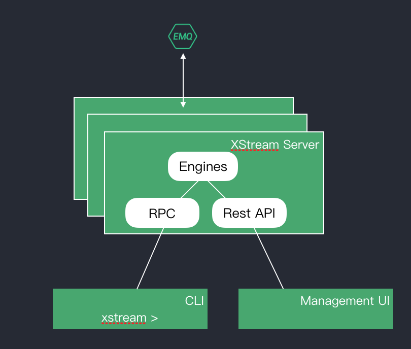

The XStream CLI (command line interface) tools provides streams and rules management. 

The XStream CLI acts as a client to the XStream server. The XStream server runs the engine that executes the stream or rule queries. This includes processing stream or rule definitions, manage rule status and io.

*XStream CLI Architecture*

- [Streams](streams.md)
- [Rules](rules.md)

