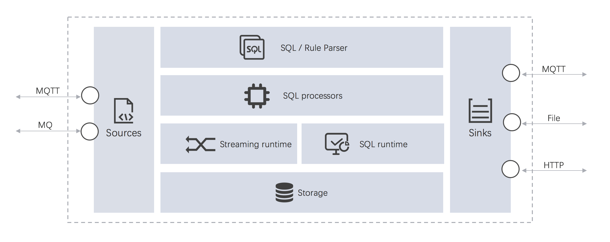

# LF Edge eKuiper - Lightweight data stream processing engine for IoT edge

LF Edge eKuiper is a lightweight IoT data analytics and stream processing engine running on resource-constraint edge
devices. The major goal for eKuiper is to provide a streaming software framework (similar
to [Apache Flink](https://flink.apache.org)) in edge side. eKuiper's **rule engine** allows user to provide either
SQL-based or graph based (similar to Node-RED) rules to create IoT edge analytics applications within few minutes.

## Features

- Lightweight

  - Core server package is only about 4.5M, memory footprint is about 10MB.

- Cross-platform

  - CPU Arch：X86 AMD 32/64; ARM 32/64; PPC
  - Popular Linux distributions, OpenWrt Linux, MacOS and Docker
  - Industrial PC, Raspberry Pi, industrial gateway, home gateway, MEC edge cloud server

- Data analysis support

  - Support data ETL
  - Data order, group, aggregation and join with different data sources (the data from databases and files)
  - 60+ functions, includes mathematical, string, aggregate and hash etc
  - 4 time windows & count window

- Highly extensible

  It supports extending at `Source`, `Functions` and `Sink` with Golang or Python.

  - Source: allows users to add more data sources for analytics.
  - Sink: allows users to send the analysis result to different customized systems.
  - UDF functions: allow users to add customized functions for data analysis (for example, AI/ML function invocation)

- Management

  - [A free web based management dashboard](https://hub.docker.com/r/emqx/ekuiper-manager) for visualized management
  - Plugins, streams and rules management through CLI, REST API and config maps(Kubernetes)
  - Easily be integrated with Kubernetes
    frameworks [KubeEdge](https://github.com/kubeedge/kubeedge), [OpenYurt](https://openyurt.io/), [K3s](https://github.com/rancher/k3s) [Baetyl](https://github.com/baetyl/baetyl)

- Integration with EMQX products

  Seamless integration with [EMQX](https://www.emqx.io/), [Neuron](https://neugates.io/) & [NanoMQ](https://nanomq.io/), and provided an end-to-end solution from IIoT, IoV

## Understand eKuiper

Learn about eKuiper and its fundamental concepts.

- [Why eKuiper](./concepts/ekuiper.md)
- [Stream Processing Concept](./concepts/streaming/overview.md)
- [Rule Composition](./concepts/rules.md)
- [Source](./concepts/sources/overview.md)
- [Sink](./concepts/sinks.md)
- [Rule logic by SQL](./concepts/sql.md)
- [Extension](./concepts/extensions.md)

[View Concepts](./concepts/ekuiper.md)

## Try eKuiper

Follow tutorials to learn how to use eKuiper.

- [Getting started locally](./getting_started/getting_started.md)
- [Getting started in Docker](./getting_started/quick_start_docker.md)
- [Getting started by dashboard](./operation/manager-ui/overview.md)
- [Run as EdgeX Foundry rule engine](./edgex/edgex_rule_engine_tutorial.md)
- [Deploy by OpenYurt](./integrations/deploy/openyurt_tutorial.md)

[View Tutorials](./guide/ai/tensorflow_lite_tutorial.md)

## Look up reference information

Refer to the syntax and properties.

- [Rule Syntax](./guide/rules/overview.md)
- [Available Sources](./guide/sources/overview.md)
- [Available Sinks](./guide/sinks/overview.md)
- [Available Functions](./sqls/functions/overview.md)
- [SQL Reference](./sqls/overview.md)

[View Reference](./sqls/overview.md)

## Learn how to use eKuiper

Learn how to create and manage rules and how to modify configurations, etc.

- [Configuration](./configuration/configuration.md)
- [Rest API](./api/restapi/overview.md)
- [CLI](./api/cli/overview.md)

## Develop extensions

Learn how to develop custom extensions.

- [Native go plugin development](./extension/native/develop/overview.md)
- [Portable go plugin development](./extension/portable/go_sdk.md)
- [Python plugin development](./extension/portable/python_sdk.md)

[View Extension Programming](./extension/overview.md)

## Get Help

If you get stuck, check out our community support resources.

- Open GitHub [issue](https://github.com/lf-edge/ekuiper/issues).
- Ask in the [forum](https://askemq.com/c/ekuiper).
- Join our [Slack](https://slack.lfedge.org/), and then join [ekuiper](https://lfedge.slack.com/archives/C024F4P7KCK) or [ekuiper-user](https://lfedge.slack.com/archives/C024F4SMEMR) channel.
- Mail to eKuiper help [mail list](mailto:ekuiper+help@lists.lfedge.org).
- Join WeChat group, scan the below QR code and mark "eKuiper".
  
  

## Contribute

Anyone can contribute for anything, not just code.

- [Edit Doc in GitHub](https://github.com/lf-edge/ekuiper/tree/master/docs)
- [How to contribute](./CONTRIBUTING.md)
