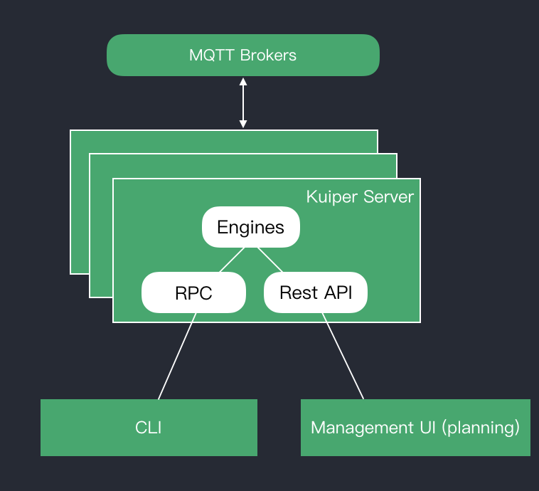

# Command Line Tool

The eKuiper CLI (command line interface) tool provides streams and rules management.

The eKuiper CLI acts as a client to the eKuiper server. The eKuiper server runs the engine that executes the stream or rule queries. This includes processing stream or rule definitions, managing rule status, and io.

_eKuiper CLI Architecture_

- [Streams](streams.md)
- [Rules](rules.md)
- [Plugins](plugins.md)
