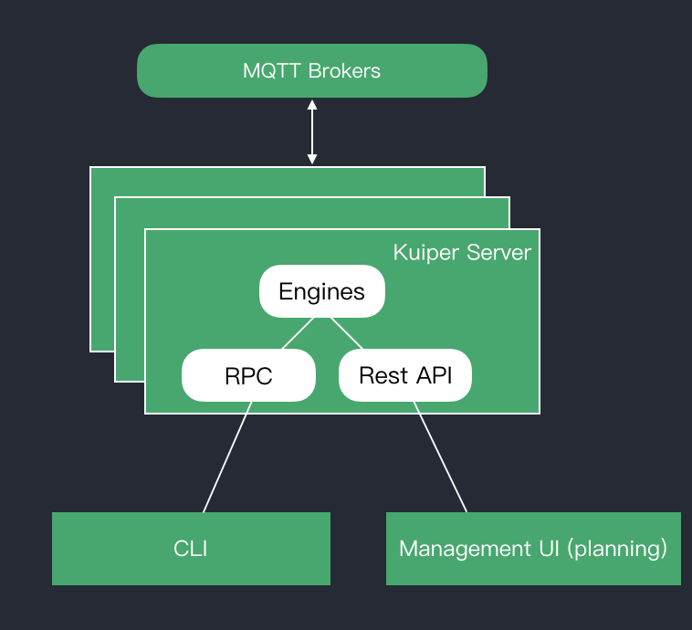

The Kuiper CLI (command line interface) tools provides streams and rules management. 

The Kuiper CLI acts as a client to the Kuiper server. The Kuiper server runs the engine that executes the stream or rule queries. This includes processing stream or rule definitions, manage rule status and io.

*Kuiper CLI Architecture*

- [Streams](streams.md)
- [Rules](rules.md)
- [Plugins](plugins.md)

