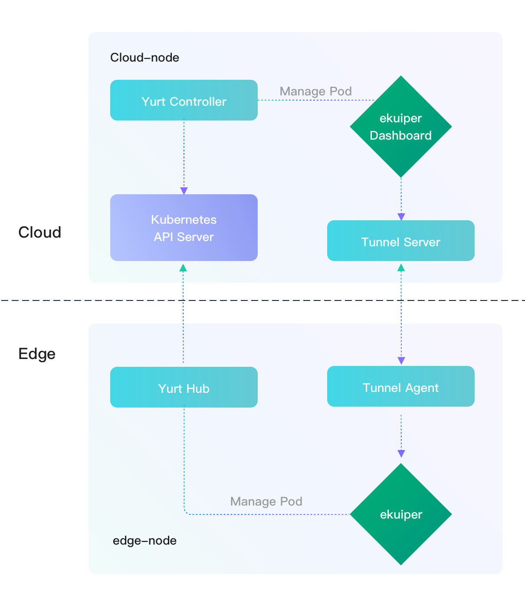
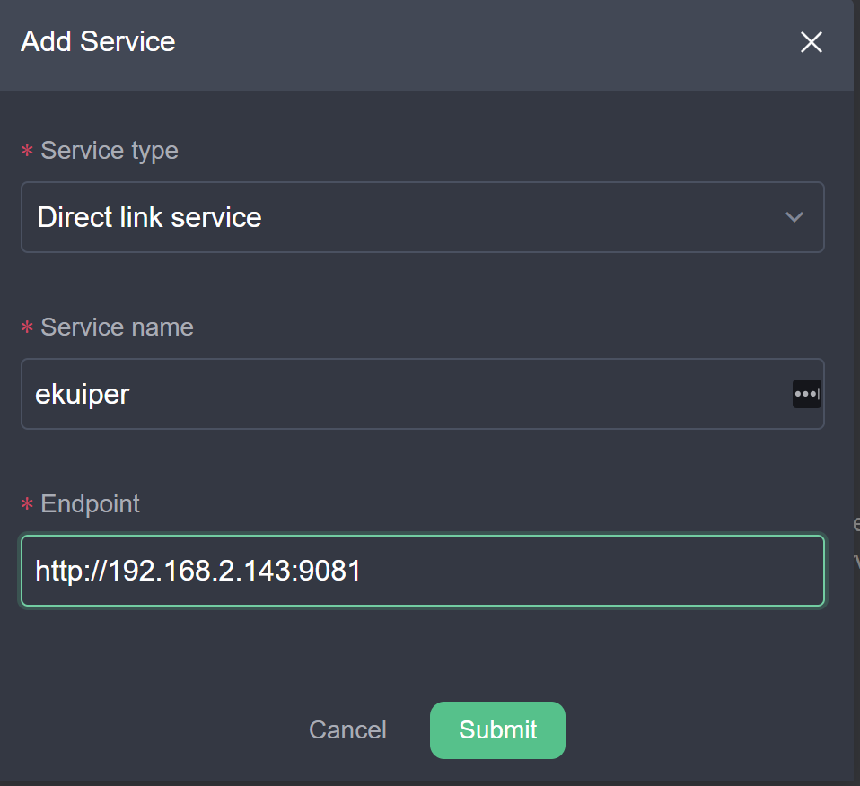

# Deploy and Manage eKuiper with OpenYurt

LF Edge eKuiper is lightweight IoT data analytics and streaming software which is usually running in the edge side.
A [manager dashboard](../manager-ui/overview.md) is provided to manage one or multiple eKuiper instances. Typically, the
dashboard is deployed in a cloud node to manage eKuiper instances across many edge nodes.

In most circumstances, the edge node is physically un-accessible from the cloud node due to security or other
considerations. This makes deployment hard and cloud to edge management
impossible. [OpenYurt](https://github.com/openyurtio/openyurt) sheds light on this scenario. OpenYurt is built based on
native Kubernetes and targets to extend it to support edge computing seamlessly. In a nutshell, OpenYurt enables users
to manage applications that run in the edge infrastructure as if they were running in the cloud infrastructure.

In this tutorial, we will show how to deploy eKuiper and its dashboard in the OpenYurt cluster and leverage the yurt
tunnel to enable the management from cloud to the edge. To mimic the real scenario where the cloud node and edge nodes
may locate in separate network regions, we use a two-nodes kubernetes cluster. The eKuiper instance will be deployed to
the edge node, and the dashboard will be deployed to the cloud node.



## Prerequisite

In this tutorial, both the cloud node and edge node must install kubernetes and its dependencies. In the cloud node,
additional tools are needed like OpenYurt and helm to deploy the eKuiper.

Make sure your cloud node has an external ip so that the edge node can access it. Also make sure the edge node is
internal so that the cloud node cannot access it.

### Installation in the cloud node

Firstly, install kubeadm and its dependency like docker engine. Please
check [official doc to install kubeadm](https://kubernetes.io/docs/setup/production-environment/tools/kubeadm/install-kubeadm/)
for detail. **Notice that, OpenYurt does not support kubernetes versions bigger than 1.20, so please install versions
1.20.x or below.** For debian-like system, install with command like:

```shell
sudo apt-get install -y kubelet=1.20.8-00 kubeadm=1.20.8-00 kubectl=1.20.8-00
```

Next, [install Golang](https://golang.org/doc/install) and
then [build OpenYurt](https://github.com/openyurtio/openyurt#getting-started).

Finally, [install helm](https://helm.sh/docs/intro/install/) as we will deploy eKuiper by helm chart.

Across this tutorial, the host name of the cloud node is `cloud-node`. You can modify your host name to match this, or
you will have to update all occurrence of `cloud-node` in this tutorial to your cloud node host name.

### Installation in the edge node

Just install `kubeadm` in the edge node.

Across this tutorial, the host name of the edge node is `edge-node`. You can modify your host name to match this, or you
will have to update all occurrence of `edge-node` in this tutorial to your edge node host name.

## Setup Kubernetes Cluster

We will provision the kubernetes cluster by `kubeadm` and let the edge node join to the cluster.

Assume your external IP of cloud node is `34.209.219.149`. In the cloud node, type the following command and we will get
a similar result as below.

```shell
# sudo kubeadm init --control-plane-endpoint 34.209.219.149 --kubernetes-version stable-1.20 
[init] Using Kubernetes version: v1.20.8
...
Your Kubernetes control-plane has initialized successfully!

To start using your cluster, you need to run the following as a regular user:

  mkdir -p $HOME/.kube
  sudo cp -i /etc/kubernetes/admin.conf $HOME/.kube/config
  sudo chown $(id -u):$(id -g) $HOME/.kube/config

Alternatively, if you are the root user, you can run:

  export KUBECONFIG=/etc/kubernetes/admin.conf

You should now deploy a pod network to the cluster.
Run "kubectl apply -f [podnetwork].yaml" with one of the options listed at:
  https://kubernetes.io/docs/concepts/cluster-administration/addons/

You can now join any number of control-plane nodes by copying certificate authorities
and service account keys on each node and then running the following as root:

  kubeadm join 34.209.219.149:6443 --token i24p5i.nz1feykoggszwxpq \
    --discovery-token-ca-cert-hash sha256:3aacafdd44d1136808271ad4aafa34e5e9e3553f3b6f21f972d29b8093554325 \
    --control-plane

Then you can join any number of worker nodes by running the following on each as root:

kubeadm join 34.209.219.149:6443 --token i24p5i.nz1feykoggszwxpq \
    --discovery-token-ca-cert-hash sha256:3aacafdd44d1136808271ad4aafa34e5e9e3553f3b6f21f972d29b8093554325
```

In the command we specify the external ip as the control plane endpoint so that the edge node can access and also
specify the kubernetes version to 1.20 which is the latest supported version in OpenYurt.

Follow the instruction in the output to set the kubeconfig. And then copy the `kubeadm join` command to be used in the
edge node.

**In the edge node**, run the copied command:

```shell
sudo kubeadm join 34.209.219.149:6443 --token i24p5i.nz1feykoggszwxpq \
    --discovery-token-ca-cert-hash sha256:3aacafdd44d1136808271ad4aafa34e5e9e3553f3b6f21f972d29b8093554325
```

If everything goes well, go back to the cloud node and type the below command to get the k8s node list and make sure you
got 2 nodes as well:

```shell
$ kubectl get nodes -o wide
NAME         STATUS     ROLES                  AGE   VERSION   INTERNAL-IP     EXTERNAL-IP   OS-IMAGE             KERNEL-VERSION     CONTAINER-RUNTIME
cloud-node   NotReady   control-plane,master   17m   v1.20.8   172.31.6.118    <none>        Ubuntu 20.04.2 LTS   5.4.0-1045-aws     docker://20.10.7
edge-node    NotReady   <none>                 17s   v1.20.8   192.168.2.143   <none>        Ubuntu 20.04.2 LTS   5.4.0-77-generic   docker://20.10.7
```

If the node status is 'NotReady', it could be that the container network is not configured. We can install a kubernetes
network addon as described [here](https://kubernetes.io/docs/concepts/cluster-administration/addons/). For example,
install Weave Net addon:

```shell
$ kubectl apply -f "https://cloud.weave.works/k8s/net?k8s-version=$(kubectl version | base64 |
tr -d '\n')"
```

After several minutes, run `kubectl get nodes -o wide`, the nodes should all be ready.

By now, we have created a k8s cluster with two nodes: cloud-node and edge-node.

### Make Cloud Node Accessible

In the `kubectl get nodes -o wide` result, if the internal IP of the cloud-node is not an accessible external IP, we
will need to make it accessible. You can specify an external IP for the node. However, in most Cloud platform like AWS,
the machine does not have an external IP, we will add iptables rules to forward the access of the internal IP to the
external IP. Assume the internal IP of cloud node is `172.31.0.236`, add an iptables rule in the cloud-node.

```shell
$ sudo iptables -t nat -A OUTPUT -d 172.31.0.236 -j DNAT --to-destination 34.209.219.149
```

Add another iptables rule in the edge-node.

```shell
$ sudo iptables -t nat -A OUTPUT -d 172.31.0.236 -j DNAT --to-destination 34.209.219.149
```

Make sure in the edge node, `172.31.0.236` is accessible by `ping 172.31.0.236`.

## Deploy eKuiper instance to edge

As an edge streaming software, eKuiper usually deploys in the edge side. We will use eKuiper helm chart to accelerate
the deployment.

```shell
$ git clone https://github.com/lf-edge/ekuiper
$ cd ekuiper/deploy/chart/Kuiper
```

In order to deploy the eKuiper to the edge-node, we will modify the template file in the helm chart.
Edit `template/StatefulSet.yaml` line 38 to add nodeName and hostNetwork as below. Whereas, `edge-node` is the host of
the edge node, if your hostname is different, change to fit your edge hostname.

```yaml
...
spec:
   nodeName: edge-node
   hostNetwork: true
   volumes:
        {{- if not .Values.persistence.enabled }}
...
```

Save the change and deploy eKuiper by helm command:

```shell
$ helm install ekuiper .
```

You will have two new services running.

```shell
$ kubectl get services
NAME               TYPE        CLUSTER-IP       EXTERNAL-IP   PORT(S)              AGE
ekuiper            ClusterIP   10.99.57.211     <none>        9081/TCP,20498/TCP   22h
ekuiper-headless   ClusterIP   None             <none>        <none>               22h
```

Verify the pods, the ekuiper should run in `edge-node`.

```shell
$ kubectl get pods -o wide
NAME                        READY   STATUS    RESTARTS   AGE   IP           NODE           NOMINATED NODE   READINESS GATES
ekuiper-0                   1/1     Running   0          22h   10.244.1.3   edge-node   <none>           <none>
```

The `ekuiper` rest service is running inside cluster with port 9081. We can check the service connection by typing the
following commands in the edge node where `192.168.2.143` is the edge node intranet ip.

```shell
$ curl http://192.168.2.143:9081
{"version":"1.2.0","os":"linux","upTimeSeconds":81317}
```

## Deploy the eKuiper dashboard to cloud

We will deploy ekuiper dashboard in the cloud node by kubectl tool with [kmanager.yaml](./kmanager.yaml). In the
configuration file, we define a deployment and a service for eKuiper manager which is a web based UI. First, we need to
revise the manager docker tag to the correct version that matches the eKuiper version in line 21:

```yaml
...
containers:
   - name: kmanager
     image: emqx/kuiper-manager:1.2.1
...
```

Then, running the kubectl command:

```shell
$ kubectl apply -f kmanager.yaml
```

Run get service, you should find

```shell
$kubectl get svc
NAME               TYPE        CLUSTER-IP      EXTERNAL-IP   PORT(S)              AGE
ekuiper            ClusterIP   10.99.57.211    <none>        9081/TCP,20498/TCP   120m
ekuiper-headless   ClusterIP   None            <none>        <none>               120m
kmanager-http      NodePort    10.99.154.153   <none>        9082:32555/TCP       15s
kubernetes         ClusterIP   10.96.0.1       <none>        443/TCP              33h
```

The dashboard is run in the cloud node with port `32555`. So open the dashboard with url http://34.209.219.149:32555 in
your browser. Login with default username and password: admin/public.

Our goal is to manage eKuiper instance in the edge node. So we will add a the eKuiper service in the edge node which is
set up in the last section as a service in the dashboard.

1. Create `Add Service` and fill in the form as below.

   

2. After service created, click the service name `ekuiper` and switch to `system` tab. The connection should be broken
   so that we will get errors about connection. That is because `http://192.168.2.143:9081/` is the intranet address of
   eKuiper service in the edge side. It is not accessible from the cloud side directly.

In next section, we will setup the yurt tunnel to let the dashboard manage the eKuiper instance in the edge side.

## Setup the yurt-tunnel

We will use OpenYurt to setup the tunnel as the communication pipeline between the cloud and the edge node. Because we
need to connect to port `9081` in the edge, we will have to setup the port mapping in the yurt tunnel.

In the cloud node, open `openyurt/config/setup/yurt-tunnel-server.yaml` file and edit the
configmap `yurt-tunnel-server-cfg` in line 31 to add nat-ports-pair as below.

```yaml
apiVersion: v1
kind: ConfigMap
metadata:
  name: yurt-tunnel-server-cfg
  namespace: kube-system
data:
  dnat-ports-pair: "9081=10264"
```

Then edit line 175 to add the cloud-node external ip as the cert ip. This is only required if the cloud node does not
have a public ip and [setup with NAT rules](#make-cloud-node-accessible).

```yaml
...
args:
  - --bind-address=$(NODE_IP)
  - --insecure-bind-address=$(NODE_IP)
  - --proxy-strategy=destHost
  - --v=2
  - --cert-ips=34.209.219.149
...
```

Then, we will convert the kubernetes cluster to OpenYurt cluster.

```shell
$ _output/bin/yurtctl convert --cloud-nodes cloud-node --provider kubeadm
```

Next we will setup the yurt-tunnel manually by deploying yurrt-tunnel-server and yurt-tunnel-agent separately.

To set up the yurt-tunnel-server, let's first add a label to the cloud node

```shell
$ kubectl label nodes cloud-node openyurt.io/is-edge-worker=false
```

Then, we can deploy the yurt-tunnel-server:

```shell
$ kubectl apply -f config/setup/yurt-tunnel-server.yaml
```

Next, we can set up the yurt-tunnel-agent. Like before, we add a label to the edge node, which allows the
yurt-tunnel-agent to be run on the edge node:

```shell
kubectl label nodes edge-node openyurt.io/is-edge-worker=true
```

And, apply the yurt-tunnel-agent yaml:

```shell
kubectl apply -f config/setup/yurt-tunnel-agent.yaml
```

After the agent and the server are running, we should be able to manage ekuiper from the dashboard again. Go back to the
dashboard in the browser, click the service name `ekuiper` and switch to `system` tab, we should find the service is
healthy like the below screenshot:


Great! Now we can manage the eKuiper in the edge by the dashboard, as if it was deployed in the cloud. Follow
the [manager ui tutorial](../manager-ui/overview.md) to create and manage your stream, rule and plugins and any other
management works of eKuiper from the cloud.

## Extended Reading

If you want to explore more features of eKuiper or OpenYurt, please refer to below resources.

- [eKuiper Github code repository](https://github.com/lf-edge/ekuiper/)
- [eKuiper reference guide](https://github.com/lf-edge/ekuiper/blob/edgex/docs/en_US/reference.md)
- [OpenYurt tutorials](https://github.com/openyurtio/openyurt/tree/master/docs/tutorial)
- [eKuiper manager ui tutorial](../manager-ui/overview.md)