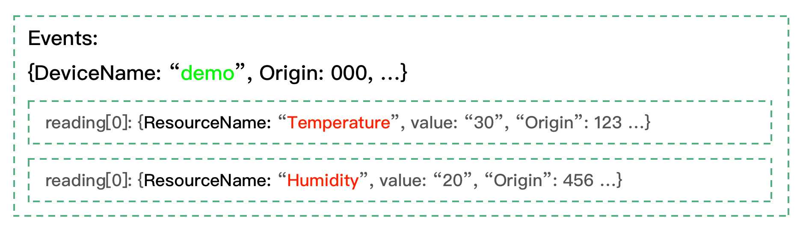

# How to use meta function to extract addtional data from EdgeX message bus?

When data are published into EdgeX message bus, besides the actual device value, it also has some additional values, such as event created time, modified time etc in the event. Sometimes these values are required for data analysis. This article describes how to use functions provided by eKuiper to achieve the goal.

## Events data model received in EdgeX message bus

The data structure received from EdgeX message bus is list as in below. An `Event` structure encapsulates related metadata (ID, DeviceName, ProfileName, SourceName, Origin, Tags), along with the actual data (in `Readings` field) collected from device service.  

Similar to `Event`, `Reading` also has some metadata (ID, DeviceName... etc). 

- Event
  - ID
  - DeviceName
  - ProfileName
  - SourceName
  - Origin
  - Tags
  - Readings
    - reading [0]
      - Id
      - Origin
      - DeviceName
      - ResourceName
      - ProfileName
      - ValueType
      - Value
    - reading [1]
      - ... // The same as in reading[0]
      - ...
    - reading [n] ...
  
### Breaking changes from EdgeX v1

If upgrading from eKuiper versions v1.2.0 and before which integrates with EdgeX v1, there will be some breaking changes of the meta datas due to the refactor of EdgeX v2.

1. The metadata `Pushed`, `Created` and `Modified` for both events and readings are removed. 
2. The metadata `Device` for both events and readings are renamed to `DeviceName`.
3. The metadata `Name` of readings is renamed to `ResourceName`.

## EdgeX data model in eKuiper

So how the EdgeX data are managed in eKuiper? Let's take an example.

As in below - firstly, user creates an EdgeX stream named `events` with yellow color.


Secondly, one message is published to message bus as in below. 

- The device name is `demo` with green color
- Reading name `temperature` & `Humidity` with red color. 
- It has some `metadata` that is not necessary to "visible", but it probably will be used during data analysis, such as `DeviceName` field in `Event` structure. eKuiper saves these values into message tuple named metadata, and user can get these values during analysis. **Notice that, metadata name `DeviceName` was renamed from `Device` in EdgeX v2.**



Thirdly, a SQL is provided for data analysis. Please notice that,

- The `events` in FROM clause is yellow color, which is a stream name defined in the 1st step.
- The SELECT fields `temperature` & `humidity` are red color, which are the `Name` field of readings.
- The WHERE clause `meta(deviceName)` in green color, which is ued for extracting `DeviceName` field from `Events` structure. The SQL statement will filter data that device names are not `demo`.


Below are some other samples that extract other metadata through `meta` function.

1. `meta(origin)`: 000 

   Get 'Origin' metadata from Event structure

2. `meta(temperature -> origin)`: 123 

   Get 'origin' metadata from reading[0], key with 'temperature'

3. `meta(humidity -> origin)`: 456 

   Get 'origin' metadata from reading[1], key with 'humidity'

Please notice that if you want to extract metadata from readings, you need to use `reading-name -> key` operator to access the value. In previous samples, `temperature` & `humidity` are `reading-names`, and `key` is the field names in readings.  

However, if you want to get data from `Events`, just need to specify the key directly. As the 1st sample in previous list.

The `meta` function can also be used in `SELECT` clause, below is another example. Please notice that if multiple `meta` functions are used in `SELECT` clause, you should use `AS` to specify an alias name, otherwise, the data of previous fields will be overwritten.

```sql
SELECT temperature,humidity, meta(id) AS eid,meta(origin) AS eo, meta(temperature->id) AS tid, meta(temperature->origin) AS torigin, meta(Humidity->deviceName) AS hdevice, meta(Humidity->profileName) AS hprofile FROM demo WHERE meta(deviceName)="demo2"
```

## Summary

`meta` function can be used in eKuiper to access metadata values. Below lists all available keys for `Event` and `Reading`.

- Event: id, deviceName, profileName, sourceName, origin, tags, correlationid
- Reading: id, deviceName, profileName, origin, valueType