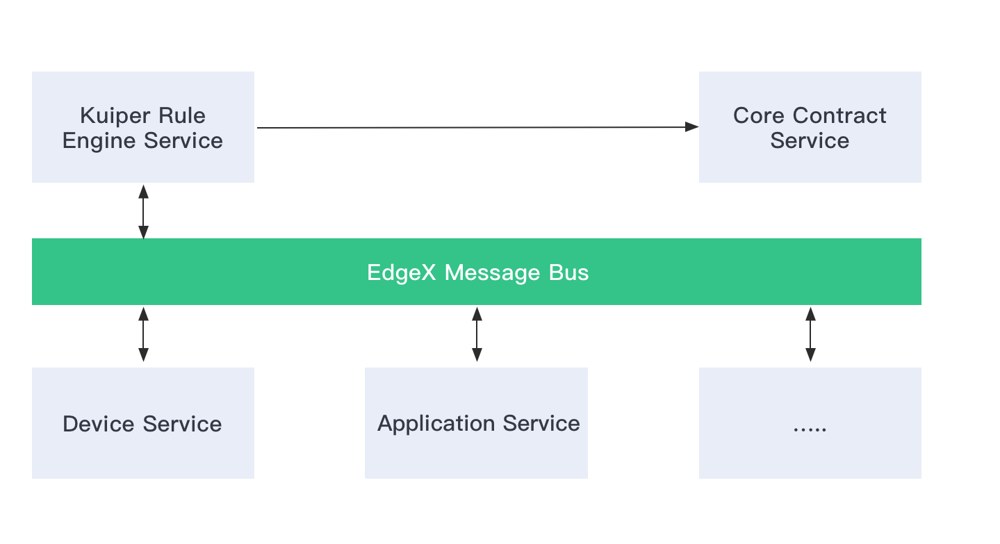

# EdgeX rule engine tutorial

## Overview

In EdgeX Geneva, [LF Edge eKuiper - an SQL based rule engine](https://github.com/lf-edge/ekuiper) is integrated with EdgeX. Before diving into this tutorial, let's spend a little time on learning basic knowledge of eKuiper. eKuiper is an edge lightweight IoT data analytics / streaming software implemented by Golang, and it can be run at all kinds of resource constrained edge devices. eKuiper rules are based on ``Source``, ``SQL`` and ``Sink``.

- Source: The data source of streaming data, such as data from MQTT broker. In EdgeX scenario, the data source is EdgeX message bus, which could be ZeroMQ or MQTT broker.
- SQL: SQL is where you specify the business logic of streaming data processing. eKuiper provides SQL-like statements to allow you to extract, filter & transform data. 
- Sink: Sink is used for sending analysis result to a specified target. For example, send analysis result to another MQTT broker, or an HTTP rest address.


Following three steps are required for using eKuiper.

- Create a stream, where you specify the data source.
- Write a rule.
  - Write a SQL for data analysis
  - Specify a sink target for saving analysis result
- Deploy and run rule.

The tutorial demonstrates how to use eKuiper to process the data from EdgeX message bus.

## eKuiper EdgeX integration

EdgeX uses [message bus](https://github.com/edgexfoundry/go-mod-messaging) to exchange information between different micro services. It contains the abstract message bus interface and implementations for ZeroMQ & MQTT. The integration work for eKuiper & EdgeX includes following 3 parts. 

- An EdgeX message bus source is extended to support consuming data from EdgeX message bus.  

- To analyze the data, eKuiper need to know data types that passed through it. Generally, user would be better to specify data schema for analysis data when a stream is created. Such as in below, a ``demo`` stream has a field named ``temperature`` field. It is very similar to create table schema in relational database system. After creating the stream definition, eKuiper can perform type checking during compilation or runtime, and invalid SQLs or data will be reported to user.

  ```shell
  CREATE STREAM demo (temperature bigint) WITH (FORMAT="JSON"...)
  ```

  However, data type definitions are already specified in the EdgeX events/readings and to improve the using experience, user are NOT necessary to specify data types when creating stream. For any data sending from message bus, it will be converted into [corresponding data types](../rules/sources/edgex.md).

- An EdgeX message bus sink is extended to support send analysis result back to EdgeX Message Bus. User can also choose to send analysis result to RestAPI, eKuiper already supported it. 



## Migrate to EdgeX V2

Since eKuiper v1.2.1, we will only support EdgeX v2(Ireland and later). There are several breaking changes to migrate to the new combintion.

1. EdgeX source does not rely on `Core contract Service` anymore. Users can remove the `serviceServer` property in the `edgex.yaml` configuration.
2. [Breaking changes in metadata](./edgex_meta.md#breaking-changes-from-edgex-v1). For example, metadata `Device` is now renamed to `DeviceName`.

## Start to use

In out tutorial, we will use [Random Integer Device Service](https://github.com/edgexfoundry/device-random) which is shipped in official EdgeX release, and run rules against the data generated by this sample device service.

### Run EdgeX Docker instances

Go to [EdgeX-compose project](https://github.com/edgexfoundry/edgex-compose), and download related Docker compose file for Ireland release,  then bring up EdgeX Docker instances. 

```shell
$ docker-compose -f ./docker-compose-no-secty.yml up -d --build
```

After all of the Docker instances are started, you can use ``docker ps`` command to verify all services are running correctly.

```shell
$ docker ps
CONTAINER ID   IMAGE                                                           COMMAND                  CREATED
 STATUS          PORTS                                                                                  NAMES
c7cb2c07dc4f   nexus3.edgexfoundry.org:10004/device-virtual:latest             "/device-virtual --c…"   13 minutes ago   Up 13 minutes   127.0.0.1:59900->59900/tcp                                                             edgex-device-virtual
d7089087c301   nexus3.edgexfoundry.org:10004/device-rest:latest                "/device-rest --cp=c…"   13 minutes ago   Up 13 minutes   127.0.0.1:59986->59986/tcp                                                             edgex-device-rest
32cd339157e2   nexus3.edgexfoundry.org:10004/app-service-configurable:latest   "/app-service-config…"   13 minutes ago   Up 13 minutes   48095/tcp, 127.0.0.1:59701->59701/tcp                                                  edgex-app-rules-engine
62c2174d4b45   nexus3.edgexfoundry.org:10004/sys-mgmt-agent:latest             "/sys-mgmt-agent -cp…"   13 minutes ago   Up 13 minutes   127.0.0.1:58890->58890/tcp                                                             edgex-sys-mgmt-agent
5b9f9cfb4307   nexus3.edgexfoundry.org:10004/core-data:latest                  "/core-data -cp=cons…"   13 minutes ago   Up 13 minutes   127.0.0.1:5563->5563/tcp, 127.0.0.1:59880->59880/tcp                                   edgex-core-data
b455b06e2e7c   nexus3.edgexfoundry.org:10004/core-command:latest               "/core-command -cp=c…"   13 minutes ago   Up 13 minutes   127.0.0.1:59882->59882/tcp                                                             edgex-core-command
6de994ce09d6   nexus3.edgexfoundry.org:10004/core-metadata:latest              "/core-metadata -cp=…"   13 minutes ago   Up 13 minutes   127.0.0.1:59881->59881/tcp                                                             edgex-core-metadata
1b62bf57dd34   nexus3.edgexfoundry.org:10004/support-notifications:latest      "/support-notificati…"   13 minutes ago   Up 13 minutes   127.0.0.1:59860->59860/tcp                                                             edgex-support-notifications
38776815a286   nexus3.edgexfoundry.org:10004/support-scheduler:latest          "/support-scheduler …"   13 minutes ago   Up 13 minutes   127.0.0.1:59861->59861/tcp                                                             edgex-support-scheduler
5176ddff9f08   emqx/kuiper:1.2.1-alpine                                        "/usr/bin/docker-ent…"   13 minutes ago   Up 13 minutes   9081/tcp, 20498/tcp, 127.0.0.1:59720->59720/tcp                                        edgex-kuiper
c78419bc5096   consul:1.9.5                                                    "docker-entrypoint.s…"   13 minutes ago   Up 13 minutes   8300-8302/tcp, 8301-8302/udp, 8600/tcp, 8600/udp, 127.0.0.1:8500->8500/tcp             edgex-core-consul
d4b236a7b561   redis:6.2.4-alpine                                              "docker-entrypoint.s…"   13 minutes ago   Up 13 minutes   127.0.0.1:6379->6379/tcp                                                               edgex-redis
```

#### Connection reuse

When eKuiper gets data from messageBus and send back the processed result, user needs to specify the connection info separately when creating the source and sink.
Since `eKuiper 1.4.0` and `EdgeX Jakarta`, there is a new feature that user can specify the connection info in a fixed place and then source and sink can make a reference to it.
* ``redis`` messageBus: this is especially useful when EdgeX use `secure` mode, in which case the client credentials will be injected into that share place automatically when services bootstrap.
In order to use this feature, users need do some modifications on the target ``docker-compose`` file's `rulesengine` service part
add these in ``environment`` part and make sure the image is ``1.4.0`` or later. 
  ```yaml
  environment:
      CONNECTION__EDGEX__REDISMSGBUS__PORT: 6379
      CONNECTION__EDGEX__REDISMSGBUS__PROTOCOL: redis
      CONNECTION__EDGEX__REDISMSGBUS__SERVER: edgex-redis
      CONNECTION__EDGEX__REDISMSGBUS__TYPE: redis
      EDGEX__DEFAULT__CONNECTIONSELECTOR: edgex.redisMsgBus
  ```
  
* ``mqtt/zeromq`` messageBus: adjust the parameters accordingly and specify the client credentials if have.
  There is a ``mqtt`` message bus example, make sure the connection info exists in ``etc/connections/connection.yaml``, for [more info](../rules/sources/edgex.md#connectionselector) please check this. 
  ```yaml
  environment:
      CONNECTION__EDGEX__MQTTMSGBUS__PORT: 1883
      CONNECTION__EDGEX__MQTTMSGBUS__PROTOCOL: tcp
      CONNECTION__EDGEX__MQTTMSGBUS__SERVER: edgex-mqtt
      CONNECTION__EDGEX__MQTTMSGBUS__TYPE: mqtt
      CONNECTION__EDGEX__MQTTMSGBUS__OPTIONAL__USERNAME: username
      CONNECTION__EDGEX__MQTTMSGBUS__OPTIONAL__PASSWORD: password
      EDGEX__DEFAULT__CONNECTIONSELECTOR: edgex.mqttMsgBus
  ```
After these modifications and eKuiper starts up, please read [this](../rules/sinks/edgex.md#connection-reuse-publish-example) to learn how to refer to the connection info

#### Use Redis as KV storage

Since `1.4.0`, eKuiper supports redis to store the KV metadata, user can make some modifications on the target ``docker-compose`` file's `rulesengine` service part to apply this change.
Users can add these in ``environment`` part and make sure the image is ``1.4.0`` or later.
  ```yaml
  environment:
    KUIPER__STORE__TYPE: redis
    KUIPER__STORE__REDIS__HOST: edgex-redis
    KUIPER__STORE__REDIS__PORT: 6379
  ```

#### Run with native

For performance reason, reader probably wants to run eKuiper with native approach. But you may find
that [EdgeX cannot be used](https://github.com/lf-edge/ekuiper/issues/596) with the downloaded eKuiper binary packages.
It's because that EdgeX message bus relies on `zeromq` library. If `zeromq` library cannot be found in the library
search path, it cannot be started. So it will have those eKuiper users who do not want to use EdgeX install the `zeromq`
library as well. For this reason, the default downloaded eKuiper package **<u>does NOT have embedded support</u>**
for `EdgeX`. If reader wants to support `EdgeX` in native packages, you can either make a native package by running
command `make pkg_with_edgex`, or just copy the binary package from docker container.

### Create a stream

There are two approaches to manage stream, you can use your preferred approach.

#### Option 1: Use Rest API

Notice: Rest API of eKuiper in EdgeX uses ``59720`` instead of default ``9081``. So please change 9081 to 59720 in all
of documents when you use EdgeX eKuiper Rest API.

The next step is to create a stream that can consume data from EdgeX message bus. Please change ``$kuiper_docker`` to
eKuiper docker instance IP address.

```shell
curl -X POST \
  http://$kuiper_docker:59720/streams \
  -H 'Content-Type: application/json' \
  -d '{
  "sql": "create stream demo() WITH (FORMAT=\"JSON\", TYPE=\"edgex\")"
}'
```

For other Rest APIs, please refer to [this doc](../restapi/overview.md).

#### Option 2: Use eKuiper CLI

Run following command to enter the running eKuiper docker instance.

```shell
docker exec -it edgex-kuiper /bin/sh
```

Use following command to create a stream named ``demo``.

```shell
bin/kuiper create stream demo'() WITH (FORMAT="JSON", TYPE="edgex")'
```

For other command line tools, please refer to [this doc](../cli/overview.md).

------

Now the stream is created. But you may be curious about how eKuiper knows the message bus IP address & port, because such information are not specified in ``CREATE STREAM`` statement. Those configurations are managed in ``etc/sources/edgex.yaml`` , you can type ``cat etc/sources/edgex.yaml`` command to take a look at the contents of file.  If you have different server, ports & service server configurations, please update it accordingly. As mentioned previously, these configurations could be overrode when bring-up the Docker instances.

```yaml
#Global Edgex configurations
default:
  protocol: tcp
  server: localhost
  port: 5566
  topic: events
.....  
```

For more detailed information of configuration file, please refer to [this doc](../rules/sources/edgex.md).

### Create a rule

Let's create a rule that send result data to an MQTT broker, for detailed information of MQTT sink, please refer to [this link](../rules/sinks/mqtt.md).  Similar to create a stream, you can also choose REST or CLI to manage rules. 

So the below rule will get all of values from ``event`` topic. The sink result will 

- Published to topic ``result`` of public MQTT broker ``broker.emqx.io``. 
- Print to log file.

#### Option 1: Use Rest API

```shell
curl -X POST \
  http://$kuiper_server:59720/rules \
  -H 'Content-Type: application/json' \
  -d '{
  "id": "rule1",
  "sql": "SELECT * FROM demo",
  "actions": [
    {
      "mqtt": {
        "server": "tcp://broker.emqx.io:1883",
        "topic": "result",
        "clientId": "demo_001"
      }
    },
    {
      "log":{}
    }
  ]
}'
```

#### Option 2: Use eKuiper CLI

You can create a rule file with any text editor, and copy following contents into it. Let's say the file name is ``rule.txt``.  

```json
{
  "sql": "SELECT * from demo",
  "actions": [
    {
      "mqtt": {
        "server": "tcp://broker.emqx.io:1883",
        "topic": "result",
        "clientId": "demo_001"
      }
    },
    {
      "log":{}
    }
  ]
}
```

In the running eKuiper instance, and execute following command.

```shell
$ bin/kuiper create rule rule1 -f rule.txt
Connecting to 127.0.0.1:20498...
Creating a new rule from file rule.txt.
Rule rule1 was created successfully, please use 'cli getstatus rule rule1' command to get rule status.
```

------

If you want to send analysis result to another sink, please refer to [other sinks](../rules/overview.md#sinksactions)
that supported in eKuiper.

Now you can also take a look at the log file under ``log/stream.log``, or through command ``docker logs edgex-kuiper ``
to see detailed info of rule.

```
time="2021-07-08 01:03:08" level=info msg="Serving kuiper (version - 1.2.1) on port 20498, and restful api on http://0.0.0.0:59720. \n" file="server/server.go:144"
Serving kuiper (version - 1.2.1) on port 20498, and restful api on http://0.0.0.0:59720. 
time="2021-07-08 01:08:14" level=info msg="Successfully subscribed to edgex messagebus topic rules-events." file="extensions/edgex_source.go:111" rule=rule1
time="2021-07-08 01:08:14" level=info msg="The connection to server tcp://broker.emqx.io:1883 was established successfully" file="sinks/mqtt_sink.go:182" rule=rule1
time="2021-07-08 01:08:20" level=info msg="sink result for rule rule1: [{\"Float32\":-2.4369560555943686e+38}]" file="sinks/log_sink.go:16" rule=rule1
time="2021-07-08 01:08:20" level=info msg="sink result for rule rule1: [{\"Float64\":-1.488582e+308}]" file="sinks/log_sink.go:16" rule=rule1
time="2021-07-08 01:08:20" level=info msg="sink result for rule rule1: [{\"Uint64\":9544048735510870974}]" file="sinks/log_sink.go:16" rule=rule1
time="2021-07-08 01:08:20" level=info msg="sink result for rule rule1: [{\"Uint16\":33714}]" file="sinks/log_sink.go:16" rule=rule1
time="2021-07-08 01:08:20" level=info msg="sink result for rule rule1: [{\"Uint8\":57}]" file="sinks/log_sink.go:16" rule=rule1
time="2021-07-08 01:08:20" level=info msg="sink result for rule rule1: [{\"Uint32\":3860684797}]" file="sinks/log_sink.go:16" rule=rule1
...
```

### Monitor analysis result

Since all of the analysis result are published to  ``tcp://broker.emqx.io:1883``, so you can just use below ``mosquitto_sub`` command to monitor the result. You can also use other [MQTT client tools](https://www.emqx.io/blog/mqtt-client-tools).

```shell
$ mosquitto_sub -h broker.emqx.io -t result
[{"Bool":false}]
[{"Int64":228212448717749920}]
[{"Int8":-70}]
[{"Int16":16748}]
[{"Int32":728167766}]
[{"Uint16":32311}]
[{"Uint8":133}]
[{"Uint64":16707883778643919729}]
[{"Uint32":1453300043}]
[{"Bool":false}]
[{"Float32":1.3364580409833176e+37}]
[{"Float64":8.638344e+306}]
[{"Int64":-2517790659681968229}]
[{"Int16":-31683}]
[{"Int8":96}]
[{"Int32":-1245869667}]
...
```

You can also type below command to look at the rule execution status. The corresponding REST API is also available for getting rule status, please check [related document](../restapi/overview.md).

```shell
# bin/kuiper getstatus rule rule1
Connecting to 127.0.0.1:20498...
{
  "source_demo_0_records_in_total": 29,
  "source_demo_0_records_out_total": 29,
  "source_demo_0_exceptions_total": 0,
  "source_demo_0_process_latency_ms": 0,
  "source_demo_0_buffer_length": 0,
  "source_demo_0_last_invocation": "2020-04-17T10:30:09.294337",
  "op_filter_0_records_in_total": 29,
  "op_filter_0_records_out_total": 21,
  "op_filter_0_exceptions_total": 0,
  "op_filter_0_process_latency_ms": 0,
  "op_filter_0_buffer_length": 0,
  "op_filter_0_last_invocation": "2020-04-17T10:30:09.294362",
  "op_project_0_records_in_total": 21,
  "op_project_0_records_out_total": 21,
  "op_project_0_exceptions_total": 0,
  "op_project_0_process_latency_ms": 0,
  "op_project_0_buffer_length": 0,
  "op_project_0_last_invocation": "2020-04-17T10:30:09.294382",
  "sink_mqtt_0_0_records_in_total": 21,
  "sink_mqtt_0_0_records_out_total": 21,
  "sink_mqtt_0_0_exceptions_total": 0,
  "sink_mqtt_0_0_process_latency_ms": 0,
  "sink_mqtt_0_0_buffer_length": 1,
  "sink_mqtt_0_0_last_invocation": "2020-04-17T10:30:09.294423"
}
```

### Summary

In this tutorial,  we introduce a very simple use of EdgeX eKuiper rule engine. If having any issues regarding to use of eKuiper rule engine, you can open issues in EdgeX or eKuiper Github respository.

### More Excecise 

Current rule does not filter any data that are sent to eKuiper, so how to filter data?  Please [drop rule](../cli/rules.md) and change the SQL in previous rule accordingly.  After update the rule file, and then deploy the rule again. Please monitor the ``result`` topic of MQTT broker, and please verify see if the rule works or not.

#### Extended Reading

- Starting from eKuiper 0.9.1 version, [a visualized web UI](../manager-ui/overview.md) is released with a separated Docker image. You can manage the streams, rules and plugins through web page. 
- Read [EdgeX source](../rules/sources/edgex.md) for more detailed information of configurations and data type conversion.
- [How to use meta function to extract additional data from EdgeX message bus?](edgex_meta.md) There are some other information are sent along with device service, such as event created time, event id etc. If you want to use such metadata information in your SQL statements, please refer to this doc.
- [Use Golang template to customize analaysis result in eKuiper](../rules/data_template.md) Before the analysis result is sent to different sinks, the data template can be used to make more processing. You can refer to this doc for more scenarios of using data templates.
- [EdgeX message bus sink doc](../rules/sinks/edgex.md). The document describes how to use EdgeX message bus sink. If you'd like to have your analysis result be consumed by other EdgeX services, you can send analysis data with EdgeX data format through this sink, and other EdgeX services can subscribe new message bus exposed by eKuiper sink.
- [eKuiper plugin development tutorial](../plugins/plugins_tutorial.md): eKuiper plugin is based on the plugin mechanism of Golang, users can build loosely-coupled plugin applications,  dynamic loading and binding when it is running. You can refer to this article if you're interested in eKuiper plugin development.

 If you want to explore more features of eKuiper, please refer to below resources.

- [eKuiper Github code repository](https://github.com/lf-edge/ekuiper/)
- [eKuiper reference guide](https://github.com/lf-edge/ekuiper/blob/edgex/docs/en_US/reference.md)

