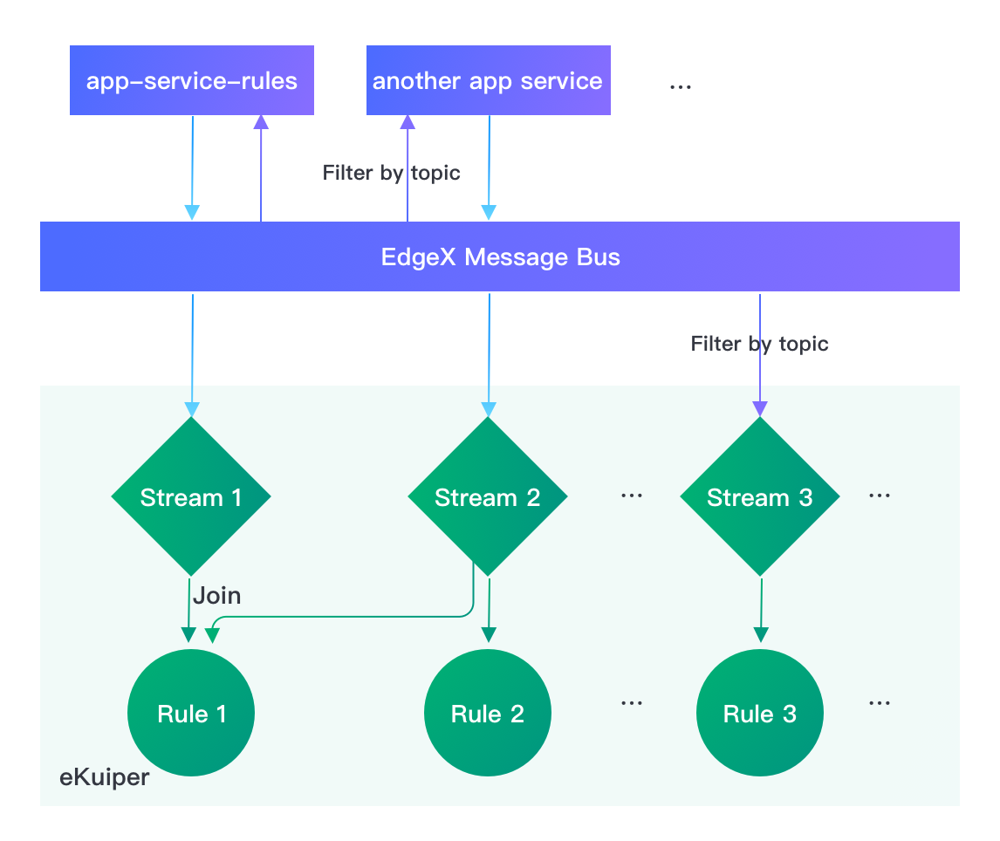

# Configure the data flow from EdgeX to eKuiper

Sources feed data into eKuiper from other systems such as EdgeX foundry which are defined as streams. [EdgeX source](../rules/sources/builtin/edgex.md) defines the properties to configure how the data feed into eKuiper from EdgeX. In this tutorial, we will demonstrate the various data flow from EdgeX to eKuiper and how to configure the source to adopt any kind of data flow.

## Typical Data Flow Model

Typically, there are two kinds of data flow from EdgeX to eKuiper:

- From EdgeX app service to eKuiper
- From EdgeX message bus directly to eKuiper



Notice that, the EdgeX message bus receives messages from various service such as device service and core data. Even for the first kind of data flow, the app service result is also  publish to the message bus and then consumed by eKuiper. The differences between the two kinds is whether app service processed the message before consuming by eKuiper.

By default, the first kind of data flow is used which allow users to prepare (transformed, enriched, filtered, etc.) and groom (formatted, compressed, encrypted, etc.) before sending to the eKuiper rule engine. If users don't need to transform the data and would like to process the raw data in eKuiper to reduce the overhead, they can connect to the message bus directly.

The full properties list of EdgeX source can be found [here](../rules/sources/builtin/edgex.md#global-configurations). There are two critical properties that define the connection model: `topic` and `messageType`. Let's explore how to configure them to adopt the connection models.

## Connect to the App Service

In the default EdgeX [docker compose file](https://github.com/edgexfoundry/edgex-compose/blob/main/docker-compose.yml), a default app service `app-service-rules` is defined as the upstream of eKuiper. The default publish topic is `rules-events` which is defined in the [default configuration](https://github.com/edgexfoundry/app-service-configurable/blob/main/res/rules-engine/configuration.toml). In the same docker compose file `rulesengine` section, there is an environment variable definition `EDGEX__DEFAULT__TOPIC: rules-events`. This means eKuiper edgeX source default topic is "rules-events" which just matches the publish topic of `app-service-rules`. Thus, when create an edgex type stream with default configuration, the data will flow from `app-service-rules` to eKuiper automatically.

### Modify the connected app service

In some case, users may have multiple app services to do different kinds of data transformation. To let eKuiper connect to another app service, just change the topic to match the new topic name. So modify the docker compose file, add an environment variable `TRIGGER_EDGEXMESSAGEBUS_PUBLISHHOST_PUBLISHTOPIC` to the app service to explicitly specify the publish topic. Then update the `EDGEX__DEFAULT__TOPIC` in rulesengine to match the new topic to connect them.

```yaml
...
  app-service-rules:
    ...
    environment:
      ...
      TRIGGER_EDGEXMESSAGEBUS_PUBLISHHOST_PUBLISHTOPIC: new-rules-events
      ...
  ...
  rulesengine:
    ...
    environment:
      ...
      EDGEX__DEFAULT__TOPIC: new-rules-events
      ...
```

## Connect to the Message Bus

To bypass the app service and gain some performances boost, users can connect to the message bus directly. Besides setting up the topics, users also need to configure the messageType property.

EdgeX v2 message bus has multi level topics so that consumers can filter message by topic efficiently. Please refer to the [topics filter examples](https://docs.edgexfoundry.org/2.0/microservices/application/Triggers/#filter-by-topics).

For example, if the rules only consider the data from `Random-Integer-Device`, we can modify the docker compose file for rulesengine as below to changethe topic and modify the message type to `request`.

```yaml
...
  ...
  rulesengine:
    ...
    environment:
      ...
      EDGEX__DEFAULT__TOPIC: edgex/events/#/Random-Integer-Device/#
      EDGEX__DEFAULT__MESSAGETYPE: request
      ...
```

By this way, the eKuiper detach from the app service and connect to the message bus directly. When create a EdgeX stream with default configuration:

```sql
CREATE STREAM edgeXAll() with (FORMAT="JSON", TYPE="edgex")
```

Only the events from the `Random-Integer-Device` will be received.

## Multiple Streams

In the real world, users usually have multiple rules. Some rules only concern about a specific profile, device or even reading of the message bus. It is a best practice to create multiple streams to map multiple points of interest and each rule only process the subset of messages.

In this scenario, users will have multiple topics in the EdgeX message bus either by app services or directly by message bus filtered topic. In eKuiper, edgex source configuration can map to each topic. An example edgex config file `edgex.yaml` with multiple configurations is as below:

```yaml
# Default conf connect app-service-rules
default:
  protocol: tcp
  server: localhost
  port: 5563
  topic: rules-events
  type: redis
  messageType: event
#Override the global configurations
device_conf: # Filter only Random-Integer-Device
  topic: edgex/events/#/Random-Integer-Device/#
  messageType: request
another_app_service_conf:
  topic: new-rules-events
int8_conf: # Filter only Random-Integer-Device int8 reading
  topic: edgex/events/#/Random-Integer-Device/int8
  messageType: request
```

With this configuration, users have 3 confkey that would connect to different edgeX data flows. For example, if a user have two rules: rule1 need to process all events while rule2 only process the int8 reading of Random-Integer-Device. Then the user can create two streams: edgexAll and edgexInt8.

```sql
CREATE STREAM edgexAll() WITH (FORMAT="JSON", TYPE="edgex")
```

With this definition, the default confkey will be used and the rules using this stream will receive all events.

```sql
CREATE STREAM edgexInt8(int8 bigint) WITH (FORMAT="JSON", TYPE="edgex", CONF_KEY="int8_conf")
```

Differently, the edgexInt8 specify the confkey explicitly to use `int8_conf` which configures to filtered topic for Random-Integer-Device device int8 reading. Thus, it will only receive int8 reading for every event and the event structure is fixed. So, the stream definition also define the schema instead of schemaless.

Similarly, users can create streams for each confkey. And each rule can pick the streams depending on its interests.

### Shared instance

When rules are running, each rule have an individual source instance and are separated from each other even using the same stream definition. Sometimes to reduce the overhead and guarantee the same data sequence across rules, many rules may want to share the same instance of source. This is even common for the edgex default stream which reads all events in the message bus and multiple instance may have a lot of overhead.

So for edgexAll stream, we recommend creating a shared instance and let all rules that need the full data use it.

```sql
CREATE STREAM edgexAll() WITH (FORMAT="JSON", TYPE="edgex", SHARED="true")
```

## Summary

In the previous tutorial, we usually create an overall stream for edgeX, and it is not obvious to know how to configure and filter the edgeX events. In this tutorial, we learn the configuration in both edgeX and eKuiper together to filter the events into multiple streams and let the rules only process events of interests. Finally, we discuss how to use shared instance of source for performance and consistency.