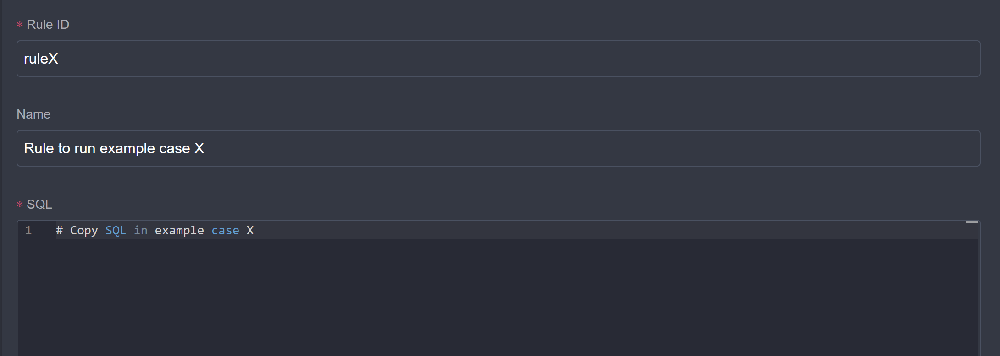

# Run Examples

This page explains how to use eKuiper to run the examples in this document. Before running the examples, you need to [install eKuiper](../installation.md).

You can use SQL to define rules in the example documents. You can run rules using eKuiper manager management console UI or eKuiper’s REST API or command-line tool.

## Data Preparation

In each example, we provide an input sample data to help users quickly understand the input data format of the example. Users can also customize input data according to their needs. If users already have running data sources, they can also use the output of the data source as input for the example. The specific method is to save a section of data from an existing data source as a file through a data recording rule and then use the file as input for the example.

### Record Data

eKuiper provides many kinds of data source access methods and the File sink output methods. Therefore, you can save the data of an existing data source as a file through a rule and then use the file as input for the example. For example, you can use MQTT data source and eKuiper manager UI to record data. Before using it, please [install and configure eKuiper manager](../installation.md#running-ekuiper-with-management-console).

1. Create Data Source: In the eKuiper manager UI, click **Source** in the top navigation bar to enter the stream management page. Click **Create Stream**, in the pop-up dialog box, fill in the stream name `mqttDemoStream`, select the stream type as `mqtt`, fill in the data source (MQTT topic) as `demo/#`. If you need to change the default MQTT connection configuration, click **Add configuration key** to configure it. Click **OK** to create the stream. By now, we have created a stream named `mqttDemoStream` that subscribe to the MQTT topic wildcard `demo/#`. 

2. Create and run the rule: In the eKuiper manager UI, click **Rules** in the navigation bar to enter the rule management page. Click **Create rule**, and in the pop-up dialog box, fill in the RuleId, Rule Name and Rule SQL.  At the rule actions section, click **Add** to enter the action editing dialog. Select Sink as `file`, Path of file as `data/mock.lines`, File type as `lines`, and Check Interval as 10000 so that the received data will be stored in the `data/mock.lines` file.
   
   Click **OK** to create the rule. Back in the rule list page, make sure the rule status is **Running**. Click on the rule status to make sure the rule has received and processed data.

3. View data: Depending on the configuration of the rule action, the data will be saved to the `data/mock.lines` file. The storage format is a JSON string lines. The file can be opened with a text editor for editing.

## Run Examples

To run an example, we recommend that you use File source as input for ease of debugging. After the example runs successfully, you can replace the input data source with your own data source according to your needs.

When running an example, most examples will follow these conventions, and the following will not be repeated.

- We will create a data stream, the data source is file source, the data stream name is `demoStream`. Through the file source, we can conveniently **"replay"** the data prepared in the first step.
- The output action of the rule is MQTT sink, which outputs the data to the `result/{{ruleId}}` topic.

Next, we will introduce how to use the eKuiper manager UI to run an example. When we open an example document, the steps to run the example are as follows:

1. Prepare data: Read the input sample part, **copy the sample data to a file**, or [use your own data](#record-data) and save it to a file.
2. Upload data: In the eKuiper manager UI, click **Configuration** in the navigation bar to enter the configuration management page, select the **Files Management** tab, click **Create File**, upload the saved file, such as `mock.lines`.
3. Create file stream: In the eKuiper manager UI, click **Source** in the navigation bar to enter the stream management page. Click **Create stream**, in the pop-up dialog box, set stream name to `demoStream`,select **file** for stream type and fill in the data source as the file name uploaded in the second step.  Click **Add configuration key** button, in the stream configuration, set **File path** to the path of the file uploaded in the files management.  Click **OK** to create the stream.
4. Subscribe to the result: Use [MQTT X](https://mqttx.app/), subscribe to the `result/{{ruleId}}` topic, and prepare to view the output results of the rule.
5. Create rule: In the eKuiper manager UI, click **Rules** in the navigation bar to enter the rule management page. Click **Create rule**, and in the pop-up dialog box, fill in the RuleId, Rule Name and Rule SQL. **The rule SQL is the SQL in the specific example document.**  At the rule actions section, click **Add** to enter the action editing dialog. Select Sink as `mqtt`, and fill in the MQTT topic as `result/{{ruleId}}`. By this way, the rule result will be sent to that topic so that we can view it in MQTT X.  Click **OK** to create the rule. Back in the rule list page, make sure the rule status is **Running**. Click on the rule status to make sure the rule has received and processed data.
6. View result: Use MQTT X to view the output result of the rule.

## Summary

This document introduces how to use eKuiper manager to run the examples in this document. In actual use, users can use eKuiper’s REST API or eKuiper CLI to process data according to their needs. After the case runs successfully, users can also modify the SQL statements in the case to play around and achieve their own needs.
