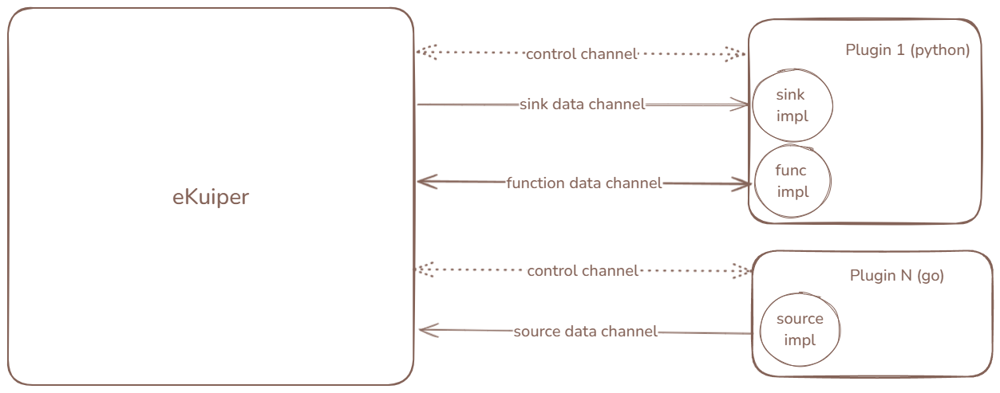

# Portable Plugin

As a supplement to the native plugin, portable plugins aims to provide the equal functionality while allow to run in more general environments and created by more languages. Similar to native plugins, portable plugins also support to customize source, sink and function extensions.

## Architecture

Unlike native plugins, Portable plugins operate as independent processes from the main program, with an architecture as
shown in the figure below. The plugin process communicates with the main process through nanomsg. Each Portable plugin
can define any number of sources, sinks, and functions. When a plugin is installed or initialized at startup, the main
program will launch the installed plugin processes and establish a control channel connection. When a rule utilizes a
source/sink/function from the plugin, the main program will establish the corresponding data channel (various data
channels in the figure) and notify the plugin process via the control channel to execute the corresponding
source/sink/function implementation. During runtime, data is transferred between the main program and the plugin through
the data channel. When the rule stops, the main program notifies the plugin process to stop the corresponding
source/sink operation and closes the data channel via the control channel.



In versions 2.0 and later, to avoid tricky asynchronous timing issues, the system no longer adopts the lazy loading
method for plugins; plugins start running immediately after installation or system initialization. Installed plugins
will create plugin processes, establish control channels, and maintain them throughout the system's lifecycle until the
main program is closed or the plugin is deleted. The source/sink data channels will be turned on and off in accordance
with the rules. Functions may be shared by multiple rules, thus once the function data channel is opened, it will not
actively close and will keep running until the system shuts down.

### Hot Update

Relying on the automatic reconnection capability of the nanomsg channel, Portable plugins support hot updates without
the need to restart the rules. After the plugin is updated, the rules using the plugin's source/sink/function will
automatically use the new version. In the internal implementation, when the plugin is updated, the plugin process will
stop, but the server side of the control channel and data channel, i.e., the main program side, will still be
maintained. Once the new plugin is installed, the new plugin process will automatically connect to the existing
channels, thus achieving rule updates without downtime.

## Development

The steps to create plugin is similar to the native plugin.

1. Develop the plugin with SDK.
   1. Develop each plugin symbol(source, sink and function) by implementing corresponding interfaces
   2. Develop the main program to serve all the symbols as one plugin
2. Build or package the plugin depending on the programing language.
3. Register the plugin by eKuiper file/REST/CLI.

We aim to provide SDK for all mainstream language. Currently, [go SDK](go_sdk.md) and [python SDK](python_sdk.md) are
supported.

Unlike the native plugin, a portable plugin can bundle multiple _symbols_. Each symbol represents an extension of source, sink or function. The implementation of a symbol is to implement the interface of source, sink or function similar to the native plugin. In portable plugin mode, it is to implement the interface with the selected language.

Then, the user need to create a main program to define and serve all the symbols. The main program will be run when starting the plugin. The development varies for languages, please check [go SDK](go_sdk.md) and [python SDK](python_sdk.md) for the detail.

### Debugging

We provide a portable plugin test server to simulate the eKuiper main program part while the developers can start the plugin side manually to support debug.

You can find the tool in `tools/plugin_test_server`. It only supports to test a single plugin Testing process.

1. Edit the testingPlugin variable to match your plugin meta.
2. Start this server, and wait for handshake.
3. Start or debug your plugin. Make sure the handshake completed.
4. Issue startSymbol/stopSymbol REST API to debug your plugin symbol. The REST API is like:

   ```shell
   POST http://localhost:33333/symbol/start
   Content-Type: application/json

   {
     "symbolName": "pyjson",
     "meta": {
       "ruleId": "rule1",
       "opId": "op1",
       "instanceId": 1
     },
     "pluginType": "source",
     "config": {}
   }
   ```

## Package

After development, we need to package the result into a zip to be installed. Inside the zip file, the file structure must follow this convention with the correct naming:

- {pluginName}.json: the file name must be the same as the plugin name which defines in the plugin main program and the REST/CLI command.
- the executable file for the plugin main program
- sources/sinks/functions directory: hold the json or yaml file for all defined symbols by category

Optionally, we can package the supportive files like `install.sh` and the dependencies.

In the json file, we need to depict the metadata of this plugin. The information must match the definitions in the plugin main program. Below is an example:

```json
{
  "version": "v1.0.0",
  "language": "go",
  "executable": "mirror",
  "sources": ["random"],
  "sinks": ["file"],
  "functions": ["echo"]
}
```

A plugin can contain multiple sources, sinks and functions, define them in the corresponding arrays in the json file. A
plugin must be implemented in a single language, and specify that in the _language_ field. Additionally, the
_executable_ field is required to specify the plugin main program executable. Please refer
to [mirror.zip](https://github.com/lf-edge/ekuiper/blob/master/internal/plugin/testzips/portables/mirror.zip) as an
example.

If using Python plugin, users can specify a virtual environment for the python script by specifying the below
properties:

- virtualEnvType: the virtual environment type, currently only `conda` is supported.
- env: the virtual environment name to be run.

For detail, please check [run in virtual environment](./python_sdk.md#virtual-environment).

## Management

The portable plugins can be automatically loaded in start up by putting the content(the json, the executable and all
supportive files) inside `plugins/portables/${pluginName}` and the configurations to the corresponding directories
under `etc`.

To manage the portable plugins in runtime, we can use the [REST](../../api/restapi/plugins.md)
or [CLI](../../api/cli/plugins.md) commands. Using [Status API](../../api/restapi/plugins.md#portable-plugin-status), we
can examine the plugin process pid and other status information.

## Restrictions

Currently, there are two limitations compared to native plugins:

1. Support less context methods. For example, [State](../native/overview.md#state-storage) and Connection API are not supported; dynamic properties are required to be parsed by developers. Whereas, state is planned to be supported in the future.
2. In the function interface, the arguments cannot be transferred with the AST which means the user cannot validate the argument types. The only validation supported may be the argument count. In the sink interface, the collect function parameter data will always be a json encoded `[]byte`, developers need to decode by themselves.
