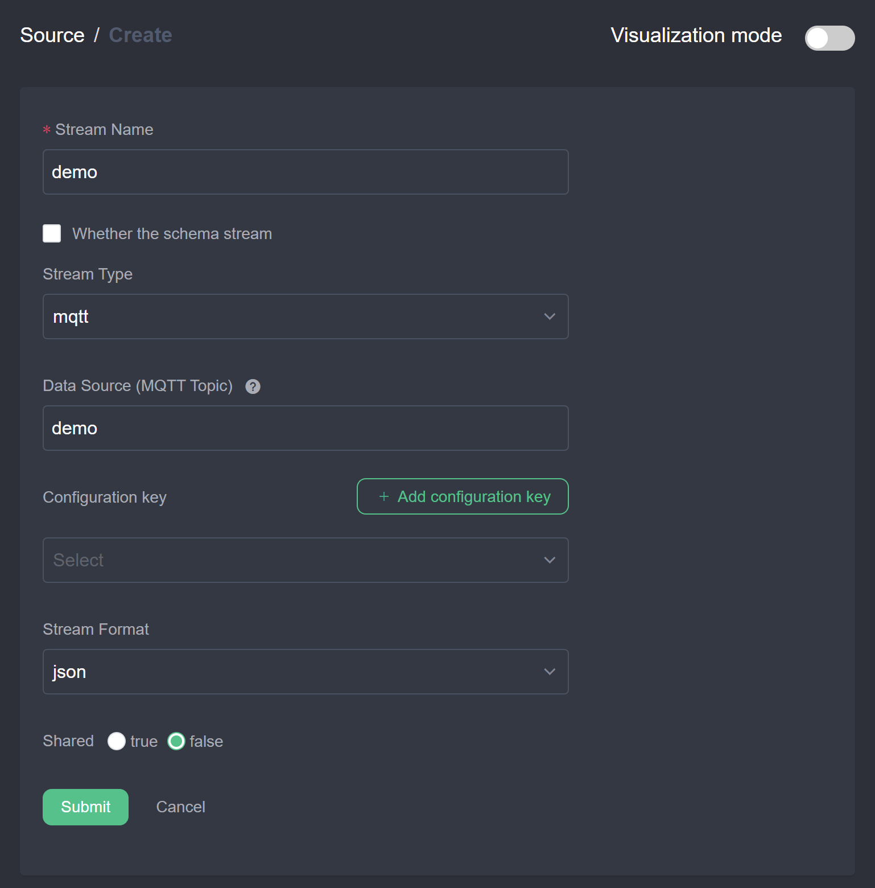
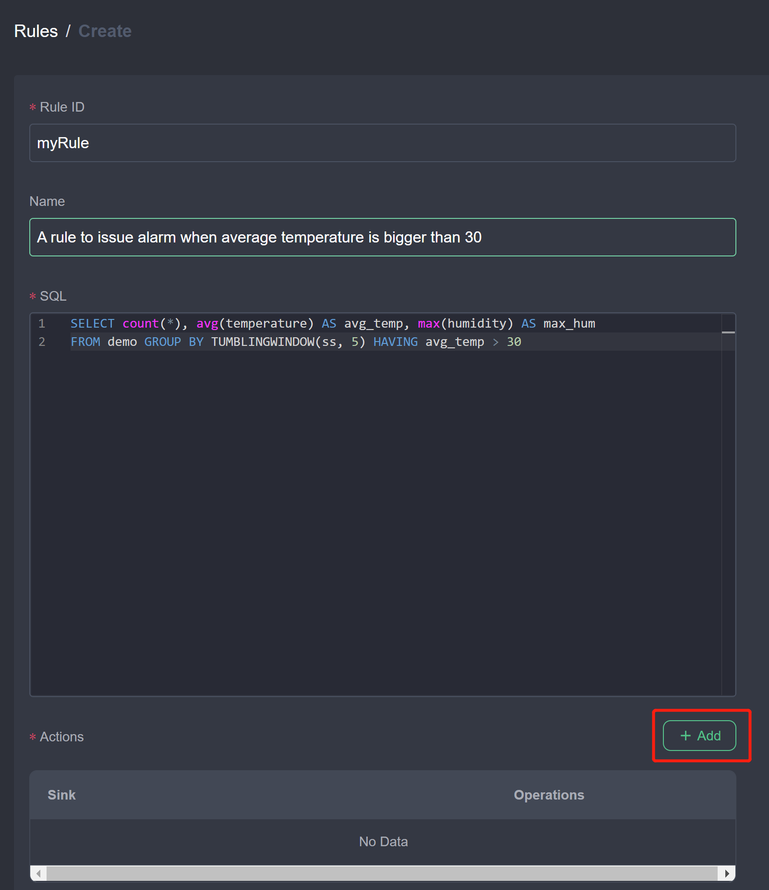
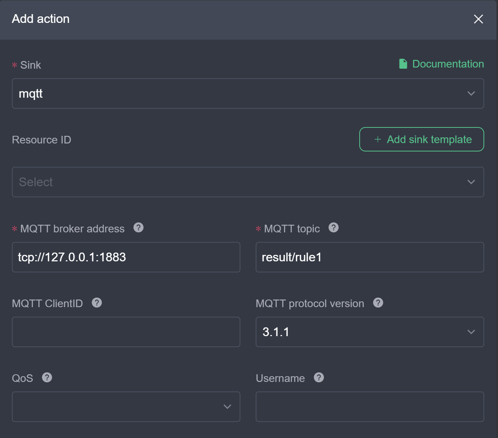
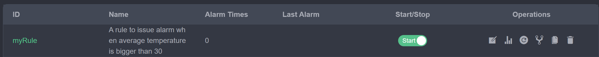
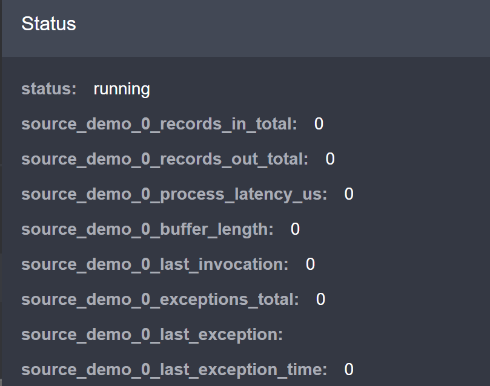
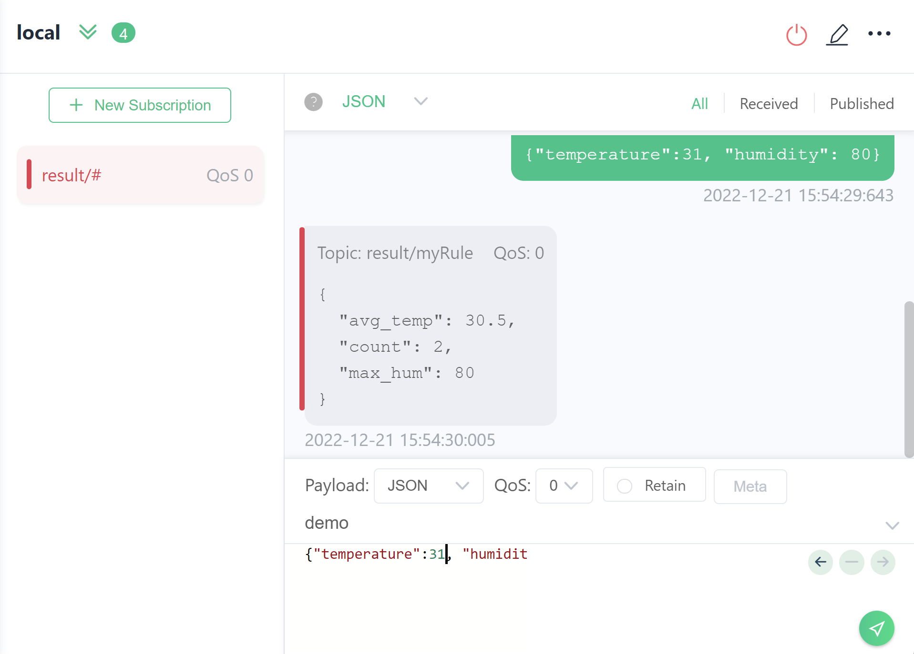

# Getting Started

Starting from download and installation, this document will guide you to start eKuiper and run the first rule.

## Install eKuiper

eKuiper provides docker image, binary package and helm chart to install. 

In this tutorial, we provide both web UI and CLI to create and manage the rules. If you want to run the eKuiper manager which is the web management console for eKuiper, please refer to [running eKuiper with management console](../installation.md#running-ekuiper-with-management-console).

### Running in docker

Docker deployment is the fastest way to start experimenting with eKuiper. 

```shell
docker run -p 9081:9081 -d --name kuiper -e MQTT_SOURCE__DEFAULT__SERVER="tcp://broker.emqx.io:1883" lfedge/ekuiper:$tag
```

For more information about docker installation, please refer to [running eKuiper in docker](../installation.md#running-ekuiper-in-docker).

### Running in Kubernetes

For Kubernetes, eKuiper offers helm chart. Please refer to [install via helm](../installation.md#install-via-helm--k8sk3s-) for detail.

### Running in a VM or on bare metal

eKuiper can be deployed directly to bare metal servers or virtual machines.

eKuiper has prebuilt packages downloadable for Linux such as CentOS, Debian and Ubuntu and macOS. You can [install from zip](../installation.md#install-from-zip) or [from packages](../installation.md#install-from-package).

For other platforms, you may [build the runnable from source code](../installation.md#compile-from-source-code).

## Create and manage the first rule

As a rule engine, eKuiper allows the user to submit stream processing job aka. rules and manage rules through CLI, REST API or management console. In this tutorial, we will walk you through the rule creation and management by management console and CLI respectively.

eKuiper rule is composed by a SQL and multiple actions. eKuiper SQL is an easy to use SQL-like language to specify the logic of a rule. eKuiper has a lot of built-in functions and extensions available for complex analysis to be used in your SQL. You can find more information about the syntax and its functions from the [eKuiper SQL reference](../sqls/overview.md).

### Prerequisite

We assume there is already a MQTT broker as the data source of our eKuiper rule. If you don't have one, EMQX is recommended. Please follow the [EMQ Installation Guide](https://docs.emqx.io/en/broker/latest/getting-started/install.html) to set up a mqtt broker.

You can also use the public MQTT test server `tcp://broker.emqx.io:1883` hosted by [EMQ](https://www.emqx.io).

Remember your broker address, we will use it in our MQTT configurations in this tutorial.

### Scenario

Let's consider a sample scenario where we are receiving temperature and humidity event from a sensor through MQTT service, and we want to issue an alert when the average temperature is bigger than 30 degree Celsius in a time window. We can write an eKuiper rule for the above scenario using the following several steps.

1. Create a stream to define the data source that we want to proceed. The stream needs to have a name and an optional schema defining the data structure that each incoming event should contain. For this scenario, we will use an MQTT source to consume temperature events.
2. Create the rule to define how to proceed the stream and the actions after proceed.
3. Get the rule status and manage it like start, stop and delete.

We will do these steps in management console and CLI respectively to create the same rule.

### Management console

Please make sure eKuiper manager has installed and configured.

### Defining the stream

1. In Source/Stream page, click `Create stream` button.
2. Create a stream named `demo` which consumes MQTT `demo` topic as specified in the DATASOURCE property. The MQTT source will connect to MQTT broker at `tcp://localhost:1883`. If your MQTT broker is in another location, click `Add configuration key` to set up a new configuration and use.
    
3. Click `Submit`. You should find the `demo` stream in the stream list.

### Compose the rule

1. Go to Rules page, click `Create rule`.
2. Write the rule id, name and SQL as below. Then click `Add` to add actions. The SQL is `SELECT count(*), avg(temperature) AS avg_temp, max(humidity) AS max_hum FROM demo GROUP BY TUMBLINGWINDOW(ss, 5) HAVING avg_temp > 30`.

3. Add MQTT action and fill in the configurations as below. Select `mqtt` in the Sink type dropdown. Set the broker address to your broker and set the topic to `result/rule1`. ClientID is optional, if not set an uuid will assign to it. If set, please make sure the id is unique and only use in one rule. Set the other properties like username, password according to your MQTT broker setting.

4. Click `Submit`. You should find the `myRule` rule in the rule list and started.

By now, we have created a rule by specifying SQL as the logic, and add one MQTT action. As you could see, the actions could be multiple, you can add more actions like log, REST and file to issue the alarm.

### Manage the rule

In the Rules page, we could find all the created rules and its status as below.



You can start or stop the rule by touching the switch button. In the Operations column, the second operation is status, which will show the running status and [metrics](../operation/usage/monitor_with_prometheus.md) of the rule. Once the data source has data in, you should find the metrics number rising.



You can edit, duplicate and delete the rules by clicking the button in the Operations column.

### CLI

eKuiper provide CLI binary after installation. It is used to run locally without any external tools to manage the rule engine.

### Defining the stream

We create a stream named `demo` which consumes MQTT `demo` topic as specified in the DATASOURCE property.

```sh
$ bin/kuiper create stream demo '(temperature float, humidity bigint) WITH (FORMAT="JSON", DATASOURCE="demo")'
```

The MQTT source will connect to MQTT broker at `tcp://localhost:1883`. If your MQTT broker is in another location, specify it in the `etc/mqtt_source.yaml`.  You can change the server configuration as in below.

```yaml
default:
  qos: 1
  sharedsubscription: true
  server: "tcp://127.0.0.1:1883"
```

You can use command `bin/kuiper show streams` to see if the `demo` stream was created or not.

### Testing the stream through query tool

Now the stream is created, it can be tested from `kuiper query` command. The `kuiper` prompt is displayed as below after typing `cli query`.

```sh
$ bin/kuiper query
kuiper > 
```

In the `kuiper` prompt, you can type SQL and validate the SQL against the stream.

```sh
kuiper > select count(*), avg(humidity) as avg_hum, max(humidity) as max_hum from demo where temperature > 30 group by TUMBLINGWINDOW(ss, 5);

query is submit successfully.
```

Now if any data are published to the MQTT server available at `tcp://127.0.0.1:1883`, then it prints message as following.

```
kuiper > [{"avg_hum":41,"count":4,"max_hum":91}]
[{"avg_hum":62,"count":5,"max_hum":96}]
[{"avg_hum":36,"count":3,"max_hum":63}]
[{"avg_hum":48,"count":3,"max_hum":71}]
[{"avg_hum":40,"count":3,"max_hum":69}]
[{"avg_hum":44,"count":4,"max_hum":57}]
[{"avg_hum":42,"count":3,"max_hum":74}]
[{"avg_hum":53,"count":3,"max_hum":81}]
...
```

You can press `ctrl + c` to break the query, and server will terminate streaming if detecting client disconnects from the query. Below is the log print at server.

```
...
time="2019-09-09T21:46:54+08:00" level=info msg="The client seems no longer fetch the query result, stop the query now."
time="2019-09-09T21:46:54+08:00" level=info msg="stop the query."
...
```

### Writing the rule

As part of the rule, we need to specify the following:
* rule id: the id of the rule. It must be unique
* rule name: the description of the rule
* sql: the query to run for the rule
* actions: the output actions for the rule

We can run the `kuiper rule` command to create rule and specify the rule definition in a file

```sh
$ bin/kuiper create rule myRule -f myRule
```

The content of `myRule` file as below. It publishes the result to the mqtt topic `result/myRule` when the average temperature in a 5-second tumbling window is bigger than 30.

```json
{
    "sql": "SELECT count(*), avg(temperature) as avg_temp, max(humidity) as max_hum from demo group by TUMBLINGWINDOW(ss, 5) HAVING avg_temp > 30;",
    "actions": [{
        "mqtt":  {
          "server": "tcp://127.0.0.1:1883",
          "topic": "result/myRule",
          "sendSingle": true
        }
    }]
}
```
You should see a successful message `rule myRule created` in the stream log, and the rule is now set up and running.

### Managing the rules

You can use command line tool to stop the rule for a while and restart it and other management work. The rule name is the identifier of a rule. 

```sh
$ bin/kuiper stop rule myRule
```

## Testing the rule

Now the rule engine is ready to receive events from MQTT `demo`  topic. To test it, just use a MQTT client such as [MQTT X](https://mqttx.app/) to publish message to the `demo` topic. The message should be in json format like this:

```json
{"temperature":31.2, "humidity": 77}
```

Since we publish the alarm to MQTT topic `result/myRule`, we can use a MQTT client to subscribe to the topic. We should receive message if the 5-second average temperature is bigger than 30.

Below is an example data and the output in MQTT X.



## Further Reading

Refer to the following topics for guidance on using the eKuiper.

- [Installation](../installation.md)
- [Rules](../guide/rules/overview.md)
- [SQL reference](../sqls/overview.md)
- [Stream](../guide/streams/overview.md)
- [Sink](../guide/sinks/overview.md)
- [Command line interface tools - CLI](../api/cli/overview.md)
- [Management Console](../guide/rules/overview.md)
