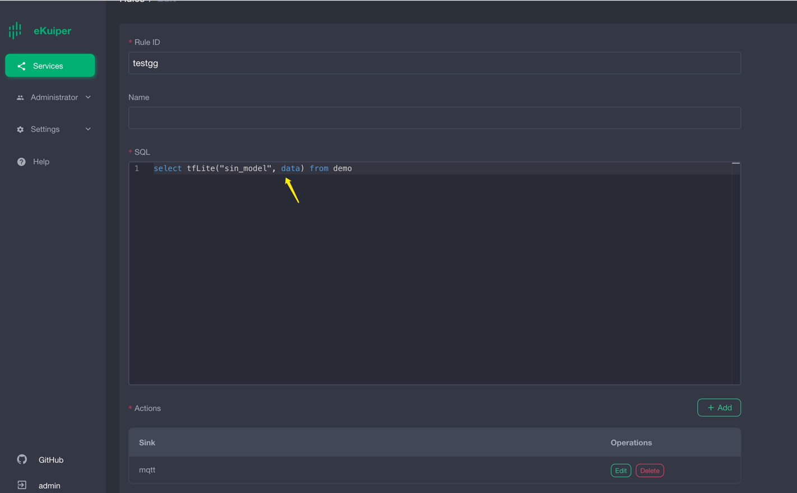
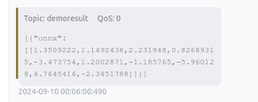
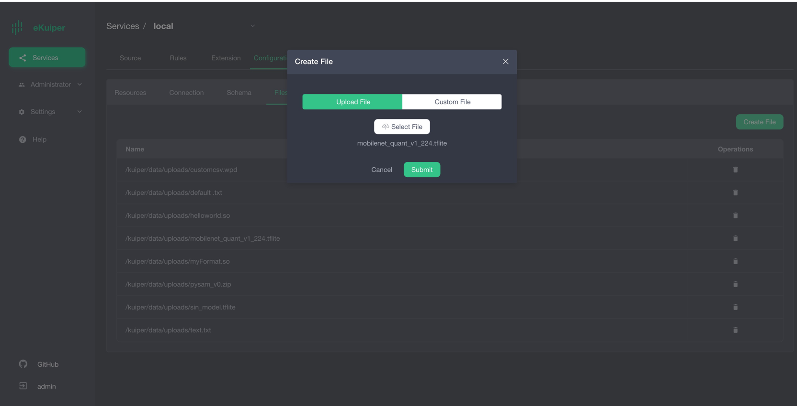
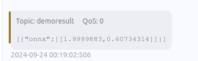

# Running ONNX Models with eKuiper Function Plugin

[LF Edge eKuiper](https://www.lfedge.org/projects/ekuiper/) is a lightweight IoT data analysis/streaming software
designed for various resource-constrained IoT devices.

[ONNX](https://onnx.ai/get-started.html) is an open file format designed for machine learning to store trained models.
It allows different AI frameworks to store model data and interact using the same format.

By integrating eKuiper and ONNX, users can simply upload pre-built ONNX models and use them in rules to analyze streaming data. This tutorial demonstrates how to quickly invoke pre-trained ONNX models using eKuiper.

## Prerequisites

### Download Models

To run the ONNX interpreter, a trained model is needed. This tutorial will not cover training or model specifics; you can learn how to do this by checking the [ONNX tutorials](https://github.com/onnx/tutorials#converting-to-onnx-format).
We can either train a new model or choose an existing one.
In this tutorial, we will use the [yalue/go onnxruntime](https://github.com/yalue/onnxruntime_go_examples) [sum_and_difference](https://github.com/yalue/onnxruntime_go_examples/tree/master/sum_and_difference) model and [MNIST-12](https://github.com/onnx/models/tree/ddbbd1274c8387e3745778705810c340dea3d8c7/validated/vision/classification/mnist) for demonstration.

### Running eKuiper

This tutorial uses the eKuiper v2 and Rest API released by the team. If you want to use the eKuiper manager Docker, you can find installation and usage details [here](https://hub.docker.com/r/emqx/ekuiper-manager).

### ONNX Plugin Installation

Before running model inference, the ONNX plugin needs to be installed.
Installing the ONNX plugin does not require manual building of the C API like TensorFlow Lite; it can be built similarly to other plugins like Echo. For details, refer to [Function Extensions](https://ekuiper.org/docs/zh/latest/extension/native/develop/function.html).

## Running the MNIST-12 Model

Download the [MNIST-12 model](https://github.com/onnx/models/blob/ddbbd1274c8387e3745778705810c340dea3d8c7/validated/vision/classification/mnist/model/mnist-12.onnx) to predict digits in images.
Users need to prepare an MQTT Broker and create an MQTT source to send data to the eKuiper rule for processing and return the inference results to the MQTT Broker.

### MQTT Source

Note that the model input data format must be a float array, so the data type must be specified in the data source, which will preprocess it into a byte array.

```shell
POST /streams
Content-Type: application/json

{
  "sql": "CREATE STREAM onnxPubImg (data array(float)) WITH (DATASOURCE=\"onnxPubImg\", FORMAT=\"json\")"
}
```

### Model Upload

Users can upload the model file to eKuiper via the eKuiper manager as shown in the image below. Alternatively, place the model file in the `{$build_output}/data/uploads` directory.


### Calling the Model

After installing the ONNX plugin, users can call the model in SQL like a normal built-in function. The first parameter is the model name, and the second is the data to be processed.
The following image shows using the Rest API to call the model.


Rest API rule creation to call the model:

```shell
{
    "id": "ruleOnnx",
    "sql": "SELECT onnx(\"mnist\",data) FROM onnxPubImg",
    "actions": [
        {
            "log": {},
            "mqtt": {
                "server": "tcp://127.0.0.1:1883",
                "topic": "demoresult"
            }
        }
    ]
}
```

### Verifying Results

The results are shown in the image below, indicating the predicted probabilities of different digits in the input image.



You can use a program like the one below to send images located in the ONNX directory.

```go
func TestPic(t *testing.T) {
const TOPIC = "onnxPubImg"

images := []string{
"img.png",
// 其他你需要的图像
}
    opts := mqtt.NewClientOptions().AddBroker("tcp://localhost:1883")
    client := mqtt.NewClient(opts)
    if token := client.Connect(); token.Wait() && token.Error() != nil {
        panic(token.Error())
    }
for _, image := range images {
fmt.Println("Publishing " + image)
inputImage, err := NewProcessedImage(image, false)

if err != nil {
fmt.Println(err)
continue
}
// payload, err := os.ReadFile(image)
payloadF32 := inputImage.GetNetworkInput()

data := make([]any, len(payloadF32))
for i := 0; i < len(data); i++ {
data[i] = payloadF32[i]
}
payloadUnMarshal := MqttPayLoadFloat32Slice{
Data: payloadF32,
}
payload, err := json.Marshal(payloadUnMarshal)
if err != nil {
fmt.Println(err)
continue
} else {
fmt.Println(string(payload))
}
if token := client.Publish(TOPIC, 2, true, payload); token.Wait() && token.Error() != nil {
fmt.Println(token.Error())
} else {
fmt.Println("Published " + image)
}
time.Sleep(1 * time.Second)
}
    client.Disconnect(0)
}
```

## Running the Sum_and_difference Model

Download the[sum_and_difference model](https://github.com/yalue/onnxruntime_go_examples/blob/master/sum_and_difference/sum_and_difference.onnx) , the model estimate the sum and maximum difference of input values.
For example, if the input is [0.2, 0.3, 0.6, 0.9], the estimated sum is 2 and the maximum difference is 0.7. Users need to prepare an MQTT Broker and create an MQTT source for sending data to the eKuiper rule for processing and returning the inference results.

### Uploading the Sum_and_difference Model

Users can upload the model file to eKuiper via the eKuiper manager as shown below. Alternatively, place the model file in the `{$build_output}/data/uploads` directory.



### Calling the Sum_and_difference Model

After installing the ONNX plugin, users can call the model in SQL like a normal built-in function. The first parameter is the model name, and the second is the data to be processed.
The following image shows using the Rest API to call the model.


```shell
POST /rules
Content-Type: application/json

{
    "id": "ruleSum",
    "sql": "SELECT onnx(\"sum_and_difference\",data) FROM sum_diff_stream",
    "actions": [
        {
            "log": {},
            "mqtt": {
                "server": "tcp://127.0.0.1:1883",
                "topic": "demoresult"
            }
        }
    ]
}
```

### Verifying Sum_and_difference Model Inference Results

The results are shown in the image below, with the inference returning:

```json
[
  {
    "onnx": [[1.9999883, 0.60734314]]
  }
]
```



Send test data like below through MQTT client.

```json
{
  "data": [0.2, 0.3, 0.6, 0.9]
}
```

## Conclusion

In this tutorial, we directly invoked pre-trained ONNX models in eKuiper using the precompiled ONNX plugin, simplifying the inference steps without writing code.
By supporting ONNX, we can easily implement various model inferences in eKuiper, including Pytorch and TensorFlow models.
