# Run TensorFlow Lite model with eKuiper function plugin

[LF Edge eKuiper](https://www.lfedge.org/projects/ekuiper/) is an edge lightweight IoT data analytics / streaming
software which can be run at all kinds of resource constrained IoT devices.

[TensorFlow Lite](https://www.tensorflow.org/lite/guide) is a set of tools to help developers run TensorFlow models on
mobile, embedded, and IoT devices. It enables on-device machine learning inference with low latency and a small binary
size.


By integrating eKuiper and TensorFlow Lite, users only need to upload a pre-built TensorFlow model, which can be used in rules to analyze data in the flow. In this tutorial, we will demonstrate how to quickly call a pre-trained TensorFlow model through ekuiper.


## Prerequisite

### Model Download

To run the TensorFlow Lite interpreter, we need a trained model. In this tutorial, we will not describe how to train and cover this model, you can see how to do it by looking at [tflite converter](https://www.tensorflow.org/lite/convert). We can either train a new model or select a trained model online.
In this tutorial we will use the [sin](https://github.com/mattn/go-tflite/tree/master/_example/sin) model and [mobilenet_v1_1.0_224](https://tfhub.dev/tensorflow/lite-model/mobilenet_v1_1.0_224/1/default/1) demo.

### eKuiper Start up

This tutorial uses the eKuiper Docker image `lfedge/ekuiper:1.8.0-slim` and the eKuiper manager Docker image `emqx/ekuiper-manager:1.8.0` released by the team to demonstrate. Please refer to [here]( https://hub.docker.com/r/emqx/ekuiper-manager) on how to use them.

### TensorFlow Lite Plugin Download


TensorFlow Lite is provided as a precompiled plug-in, and users need to download and install it themselves.

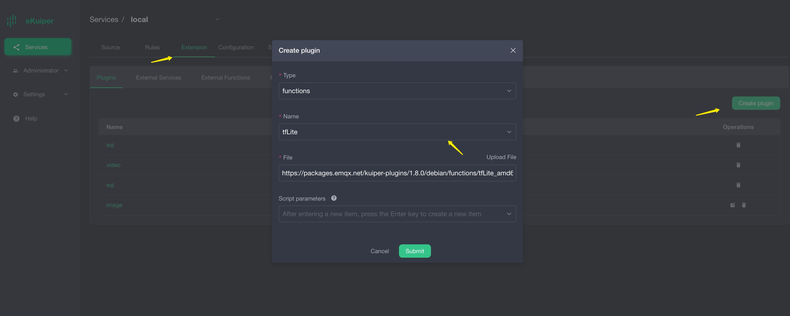
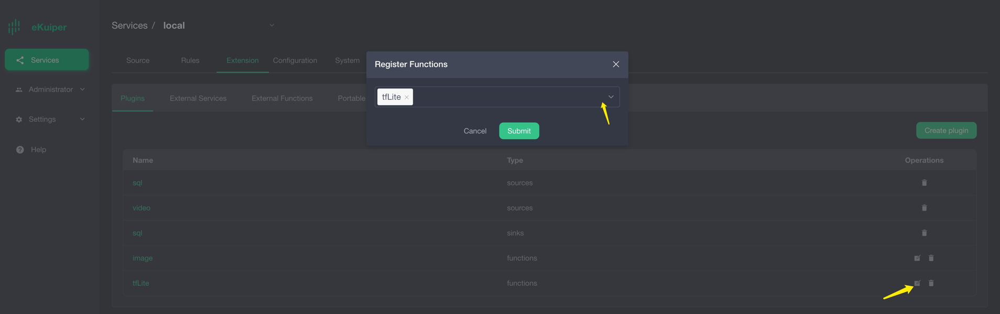

## Sin Mode Set up

Please download the [sin model](https://github.com/mattn/go-tflite/blob/master/_example/sin/sin_model.tflite), which returns inference results based on input values. For example, if the user enters π/2, let us take 1.57, the calculation result of sin 1.57 is about 1.
Users need to prepare MQTT Broker and create an MQTT source to send data to be processed to eKuiper rule and send inference results back to MQTT Broker.

### MQTT Source

Note that the model input data format must be a byte array, and json does not support the byte type, so the data type needs to be specified in the data source, and the source will preprocess it into a byte array.
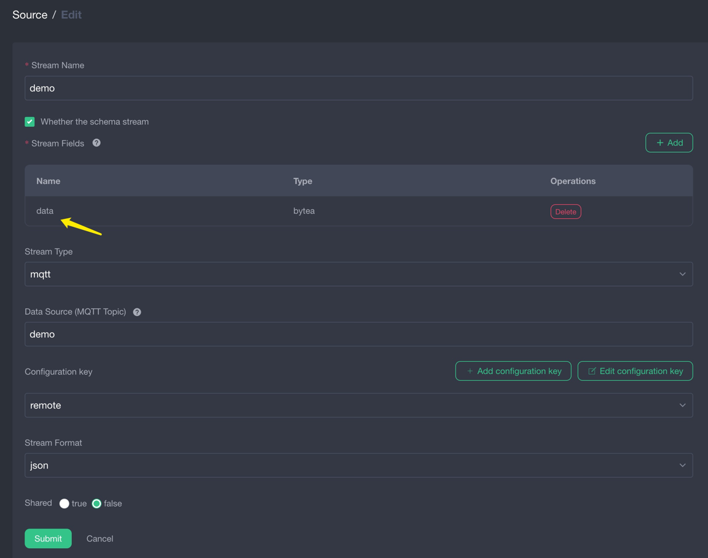

### Model Upload

Users can upload model files to eKuiper through eKuiper manager. As shown below.
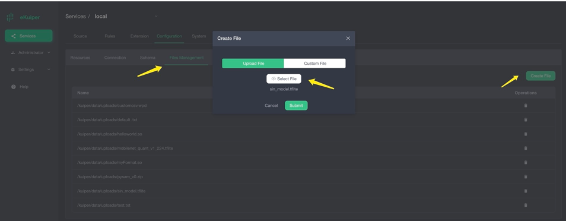


### Call Model in TensorFlow Lite

After users install the TensorFlow Lite plugin, they can call the model in SQL as normal built-in functions. The first parameter is the model name, and the second parameter is the data to be processed.


### Validation results

The result is shown in the figure below, when the input is 1.57, the derivation result is about 1.
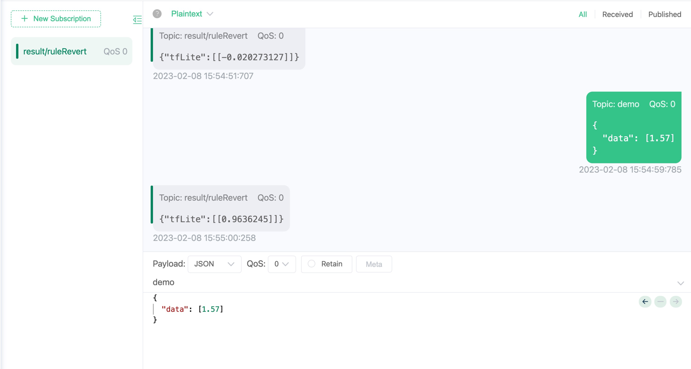


## MobileNet V1 Model Set up

Please download the [MobileNet V1 model](https://tfhub.dev/tensorflow/lite-model/mobilenet_v1_1.0_224/1/default/1), this model inputs image information of 224 * 224 pixels, and returns a size of 1001 float array.
In order to obtain image information, we use another precompiled video plug-in to regularly extract images from the live stream as the input of the rules, and send the inference results to the MQTT Broker.

### video source install and configure

The video source periodically pulls data from the live source and extracts image data from it. [This link](https://gcwbcdks.v.kcdnvip.com/gcwbcd/cdrmipanda_1/index.m3u8) can be used as the live broadcast source. The figure below shows the video plug-in download and configuration respectively.

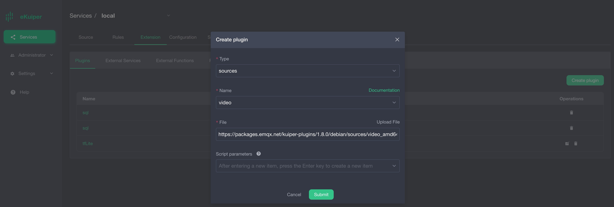
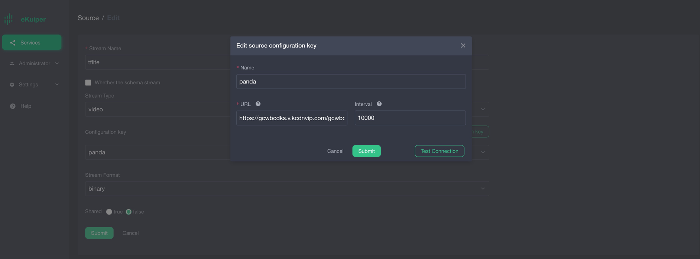

*Note*: The source data format part should be selected as binary type.

### image function plugin install

Since the precompiled model requires 224 * 224 pixel image data, another precompiled plugin image needs to be installed to resize the image.

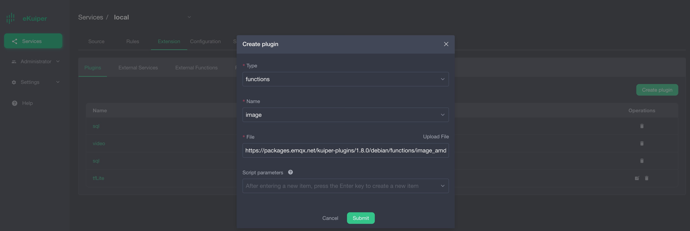
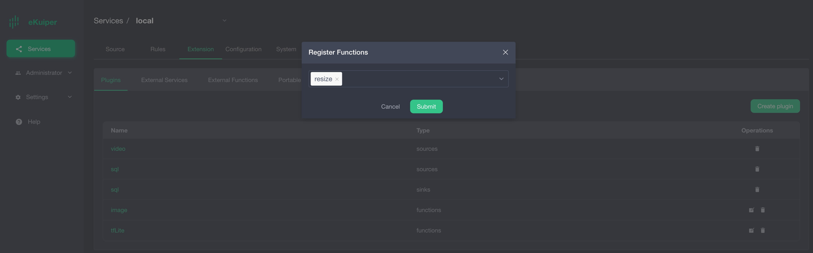


### Model Upload

Users can upload model files to eKuiper through eKuiper manager. As shown below.


### Call Model in TensorFlow Lite

After users install the TensorFlow Lite plugin, they can call the model in SQL as normal built-in functions. The first parameter is the model name, and the second parameter is the return result of calling the resize function. Where `self` is the key corresponding to the binary data.
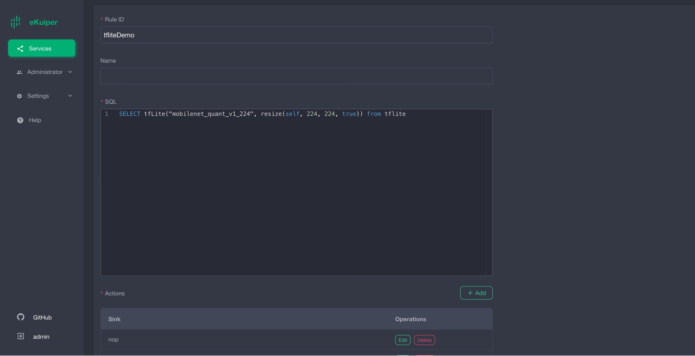

### Validation results

The result is shown in the figure below. After the image data is inferred, the returned result is a byte array (encoded by base64).
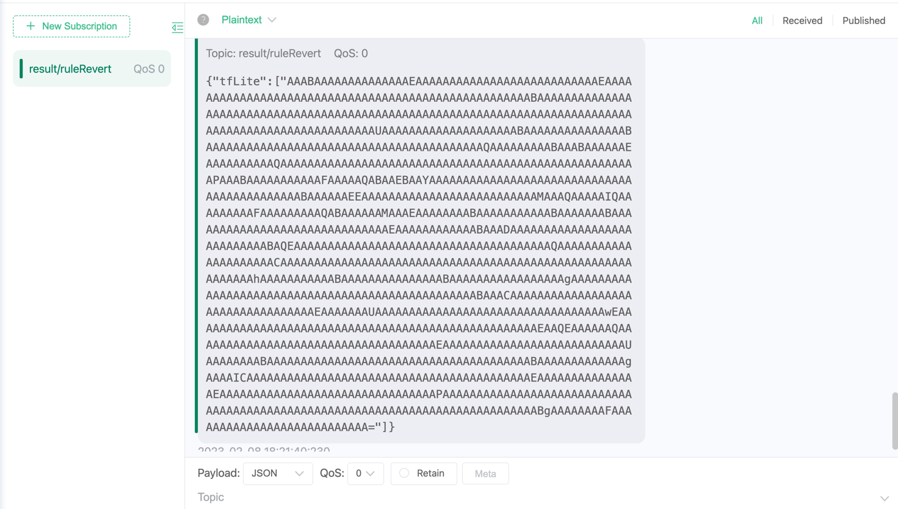

The following is the byte array obtained after base64 decoding, with a total of 1001 elements. Its significance needs to be interpreted in conjunction with the model being tested.
In this example, the test model is an image recognition model, which supports a total of 1001 item classifications, so the 1001 elements in the derivation result correspond to the 1001 items in sequence. For example, the first array element matches the first item, and the value of the element represents the matching degree, and the larger the value, the higher the matching degree.
A list of items is available [here](https://github.com/lf-edge/ekuiper/blob/master/extensions/functions/labelImage/etc/labels.txt).


Users can write code to filter out the item tags with the highest matching degree, the following is the sample code

```go
package demo

import (
	"bufio"
	"os"
	"sort"
)

func loadLabels() ([]string, error) {
	labels := []string{}
	f, err := os.Open("./labels.txt")
	if err != nil {
		return nil, err
	}
	defer f.Close()
	scanner := bufio.NewScanner(f)
	for scanner.Scan() {
		labels = append(labels, scanner.Text())
	}
	return labels, nil
}

type result struct {
	score float64
	index int
}

func bestMatchLabel(keyValue map[string]interface{}) (string, bool) {
	labels, _ := loadLabels()
	resultArray := keyValue["tfLite"].([]interface{})
	outputArray := resultArray[0].([]byte)
	outputSize := len(outputArray)
	
	var results []result
	for i := 0; i < outputSize; i++ {
		score := float64(outputArray[i]) / 255.0
		if score < 0.2 {
			continue
		}
		results = append(results, result{score: score, index: i})
	}
	sort.Slice(results, func(i, j int) bool {
		return results[i].score > results[j].score
	})
	// output is the biggest score labelImage
	if len(results) > 0 {
		return labels[results[0].index], true
	} else {
		return "", true
	}

}
```

## in conclusion

In this tutorial, we use the pre-compiled TensorFlow Lite plugin to directly call the pre-trained TensorFlow Lite model in ekuiper, which avoids writing code and simplifies the inference steps.