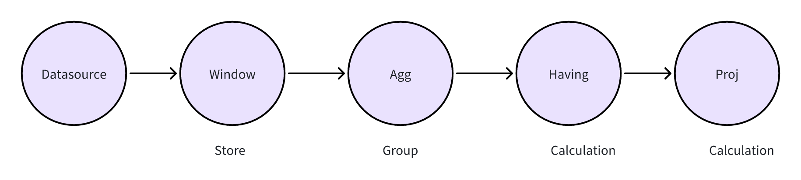
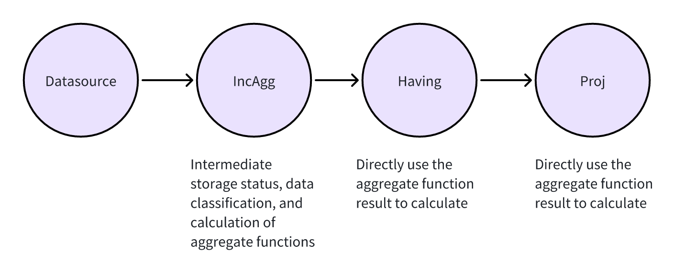
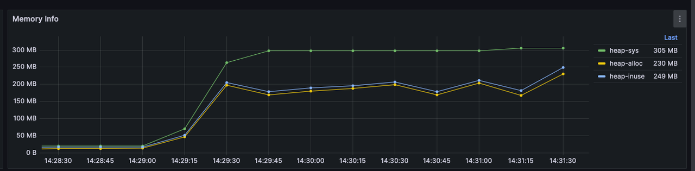
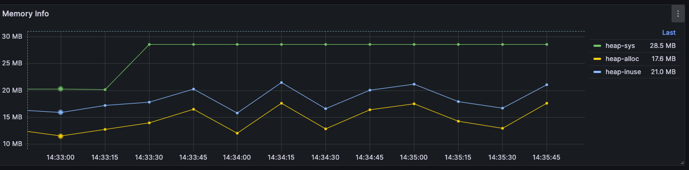

# Incremental Computation

## Background

In the current ekuiper, when performing aggregate calculations on data, we often need to split the stream data into windows, aggregate it, and then perform the calculations. Take the following SQL as an example:

```sql
select avg(a) from stream group by tumblingWindow(ss,10),b;
```

In ekuiper's operator model, aggregate calculations are split into three operators:

```txt
Window Operator -> Group By Operator -> Proj (Calculation) Operator
```

That is, streaming data is first aggregated in the Window operator, then sorted in the Group By operator, and finally calculated in the Project operator. This approach is applicable to any aggregation calculation, but has the following issues:
1. When the window is too large, it consumes more memory.
2. The streaming processing capabilities of some aggregation functions are not utilized.

For the avg aggregation function, when processing streaming data, we do not need to wait for all data to be aggregated in the window before performing the calculation. We can update two intermediate states, sum and count, each time a data item is read. After the window data is read, the required avg value can be directly obtained using sum/count.

## How to Implement Incremental Computation

Before discussing how to implement incremental computation, let's first look at how the previous eKuiper created rules for the following SQL statement:

```sql
select sum(b) from demo group by tumblingwindow(ss, 10),c  having avg(a) > 0; 
```

```sql
{"op":"ProjectPlan_0","info":"Fields:[ Call:{ name:sum, args:[demo.b] } ]"}
        {"op":"HavingPlan_1","info":"Condition:{ binaryExpr:{ Call:{ name:avg, args:[demo.a] } > 0 } }, "}
                        {"op":"AggregatePlan_2","info":"Dimension:{ demo.c }"}
                                        {"op":"WindowPlan_3","info":"{ length:10, windowType:TUMBLING_WINDOW, limit: 0 }"}
                                                        {"op":"DataSourcePlan_4","info":"StreamName: demo, StreamFields:[ a, b, c ]"}
```



### Operator Perspective

From an operator perspective, to implement incremental computation, we need to move away from the previous approach of implementing storage, aggregation, and computation as separate operators and instead combine these three into a single operator.

For incremental computation aggregation operators, we need to combine storage, aggregation, and computation into a single operator, rather than implementing them separately. That is, as data arrives, we directly pass it to the aggregation operator for computation. Within each window, the data is categorized in real time by the group-by column, computed using the aggregate function, and the intermediate results saved.

In this way, there is no need to save the original data and the results can be calculated in real time. As for the subsequent Having operator and Proj operator, they do not need to calculate the value of the aggregate function, but directly use the already calculated aggregate function value for calculation. To achieve this goal, we need to create a new operator to implement this function.



In the eKuiper implementation, when incremental computing is enabled, eKuiper aggregates and computes data in real time using the IncAggWindow operator, as shown in the following figure.

```sql
{"op":"ProjectPlan_0","info":"Fields:[ Call:{ name:bypass, args:[$$default.inc_agg_col_1] } ]"}
        {"op":"HavingPlan_1","info":"Condition:{ binaryExpr:{ Call:{ name:bypass, args:[$$default.inc_agg_col_2] } > 0 } }, "}
                        {"op":"IncAggWindowPlan_2","info":"wType:TUMBLING_WINDOW, Dimension:[demo.c], funcs:[Call:{ name:inc_sum, args:[demo.b] }->inc_agg_col_1,Call:{ name:inc_avg, args:[demo.a] }->inc_agg_col_2]"} {"op":"DataSourcePlan_3","info":"StreamName: demo, StreamFields:[ a, b, c, inc_agg_col_1, inc_agg_col_2 ]"}
```

## Enabling Incremental Calculation

For the following scenario, we use `count` to perform aggregate calculations within a window:

```json
{
  "id": "rule",
  "sql": "SELECT count(*) from demo group by countwindow(4)",
  "actions": [
    {
      "log": {
      }
    }
  ],
  "options" :{
  }
}
```

For the above rules, we can query the query plan of the rules through the [explain api](../../api/restapi/rules.md#Query rule plan):

```txt
{"op":"ProjectPlan_0","info":"Fields:[ Call:{ name:count, args:[*] } ]"}
    {"op":"WindowPlan_1","info":"{ length:4, windowType:COUNT_WINDOW, limit: 0 }"}
            {"op":"DataSourcePlan_2","info":"StreamName: demo"}
```

From the query plan above, we can see that when the above rule is actually run, data is cached in memory and recalculated after the window ends, which may result in excessive memory consumption.

We can enable incremental calculation in `options`. Take the following rule as an example:

```json
{
  "id": "rule",
  "sql": "SELECT count(*) from demo group by countwindow(4)",
  "actions": [
    {
      "log": {
      }
    }
  ],
  "options" :{
    "planOptimizeStrategy": {
      "enableIncrementalWindow": true
    }
  }
}
```

Then look at the query plan:

```txt
{"op":"ProjectPlan_0","info":"Fields:[ Call:{ name:bypass, args:[$$default.inc_agg_col_1] } ]"}
    {"op":"IncAggWindowPlan_1","info":"wType:COUNT_WINDOW, funcs:[Call:{ name:inc_count, args:[*] }->inc_agg_col_1]"}
            {"op":"DataSourcePlan_2","info":"StreamName: demo, StreamFields:[ inc_agg_col_1 ]"}
```

From the query plan above, you can see that when this rule runs, its plan changes from `WindowPlan` to `IncAggWindowPlan`. This means that data entering this window will be directly calculated instead of being cached in memory.

## Scenarios Where Incremental Calculation Cannot Be Used

If an aggregate function itself cannot be incrementally calculated, enabling incremental calculation will have no effect, as shown in the following rule:

```json
{
    "id": "rule",
    "sql": "SELECT count(*), stddev(a) from demo group by countwindow(4)",
    "actions": [
        {
            "log": {
            }
        }
    ],
    "options" :{
        "planOptimizeStrategy": {
            "enableIncrementalWindow": true
        }
    }
}
```

View query plan:

```txt
{"op":"ProjectPlan_0","info":"Fields:[ Call:{ name:count, args:[*] }, Call:{ name:stddev, args:[demo.a] } ]"}
    {"op":"WindowPlan_1","info":"{ length:4, windowType:COUNT_WINDOW, limit: 0 }"}
            {"op":"DataSourcePlan_2","info":"StreamName: demo"}
```

As you can see, because `stddev` is an aggregate function that doesn't support incremental computation, incremental computation is not enabled in the query plan for this rule.

## Comparison of Memory Usage Before and After Enabling Incremental Computation

For the following rules, we can compare memory usage with and without incremental computation enabled, given the same amount of data:

```json
{
  "id": "rule1",
  "sql": "select sum(b) from demo group by tumblingwindow(ss, 10) having avg(a) > 0;",
  "options": {
      "planOptimizeStrategy" : {
          "enableIncrementalWindow": true
      }
  },
  "actions": [
      {
          "log":{}
      }
  ]
}
```

### Incremental calculation disabled



### Incremental calculation enabled


