# Use eKuiper to process Protocol Buffers data

LF Edge eKuiper connects external systems with various communication protocols such as MQTT, HTTP, etc. via source and sink. eKuiper supports codecs for configuring source/sink transport data, currently supporting JSON, ProtoBuf and Binary formats. Protocol Buffers (Protobuf) is a language-neutral, platform-neutral and extensible mechanism for serializing structured data in a binary transfer format. Protobuf is widely used because it is more efficient and faster than conventional data transfer formats such as JSON or XML, and saves transfer bandwidth.

This tutorial takes Protobuf format as an example to explain how to set up the codec format in eKuiper, read and parse the data in this format by source, and write using this format to encode data in sink. This tutorial uses eKuiper Manager for rule creation and management, please refer to [UI Tutorial](../../operation/manager-ui/overview.md). You can also use the [REST API](../../api/restapi/overview.md) or run the [command line tool](../../api/cli/overview.md) on the same machine of the eKuiper instance to perform the same rule management operation.

Before starting the hands-on operation, the following environment needs to be prepared.

- MQTT broker for data transfer. This tutorial uses the MQTT server located at `tcp://broker.emqx.io:1883`. It is a public MQTT server provided by [EMQ](https://www.emqx.cn). If you are running eKuiper locally, you need to change `etc/mqtt_source.yaml` and change the configuration server to "tcp://broker.emqx.io:1883"; if you are using docker to start, you should set the environment variable MQTT_SOURCE__DEFAULT__SERVER=" tcp://broker.emqx.io:1883".
- To easily observe the results, we need to install an MQTT client, e.g. [MQTT X](https://mqttx.app/).

## Schema Registry

Compared with the schema-free JSON format, Protobuf needs to define the data structure, i.e. the schema, in advance. In the proto file, it can contain multiple messages and definitions of other entities, but only the definition of message can be used in the configuration of the codec format. In this tutorial, we use the following schema for the definition of data structures. The file defines a message structure named Book, which contains title of string type and price of integer type, and the transmitted data will be coded and decoded as binary data for the book data based on this structure.

```protobuf
message Book {
  required string title = 1; 
  required int32 price = 2;
}
```

1. Register the schema. In the management console, open Configuration->Schema and click Create Schema.
   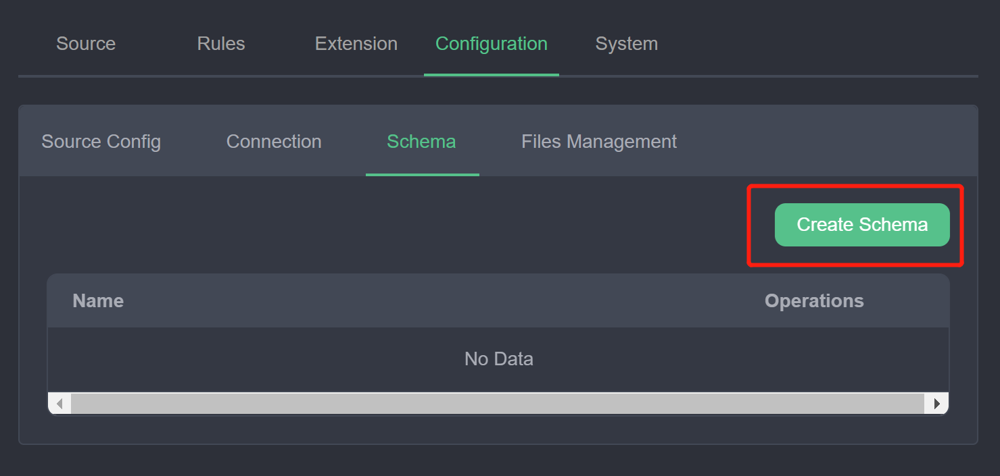
2. In the schema creation window, fill in the fields as shown in the following figure. The schema type is `protobuf`; the schema name can be entered as a custom unique name to identify the schema id in the subsequent rule creation; the schema content can be filled in as a file or text content. If you choose file, you need to fill in the url of the file; the schema used in this tutorial is simple, so you can choose content and fill in the text of the proto file in the content box.
   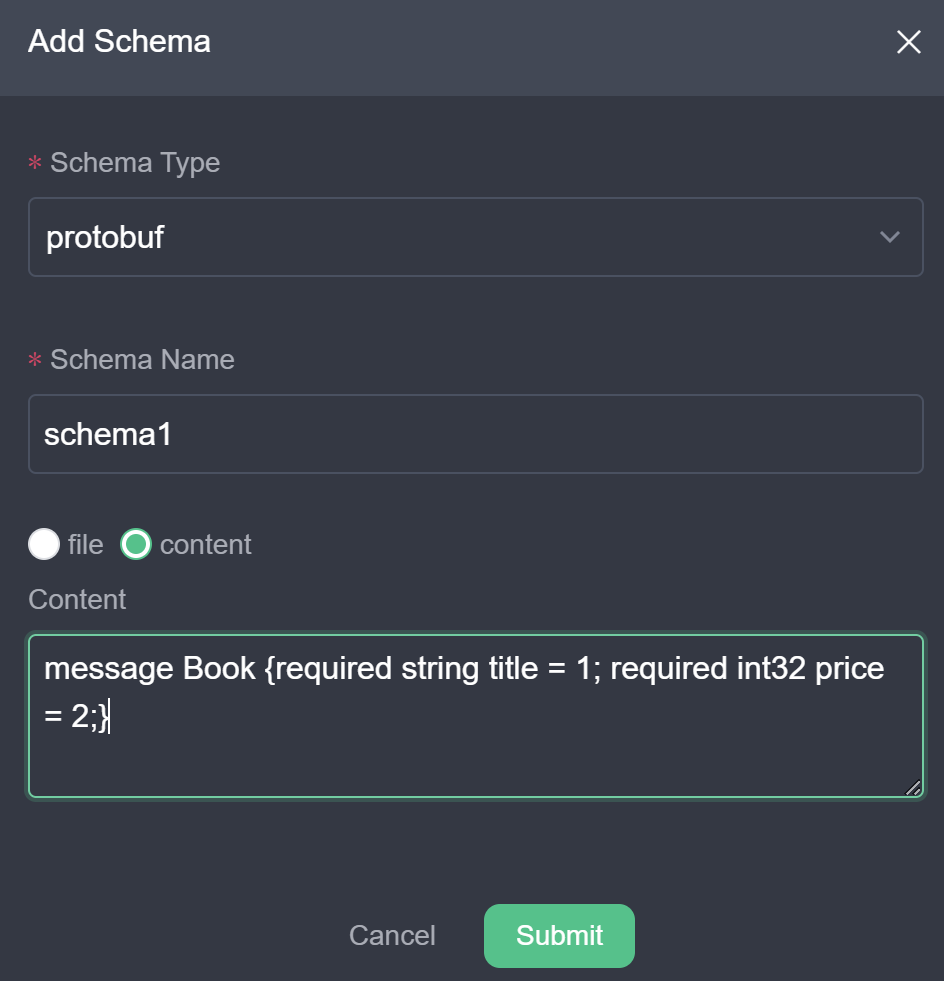
3. Click Submit. You should be able to see the newly created schema in the list of schemas. You can then use the buttons in the action bar to modify or delete it.
   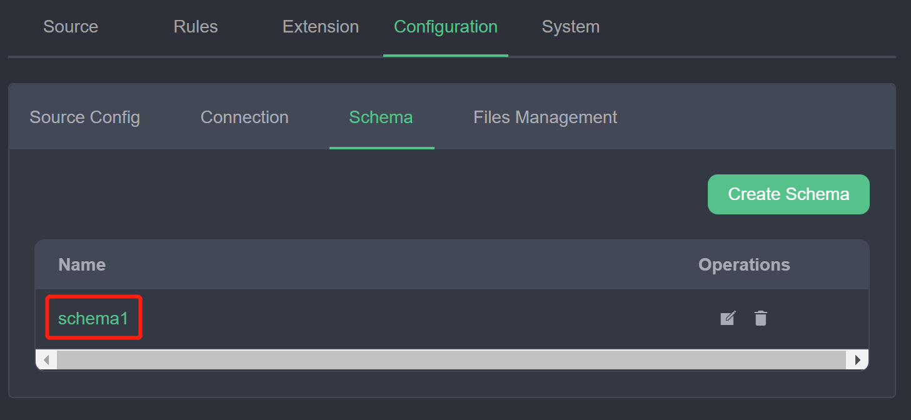

At this point, we have registered a schema named `schema1`, which defines the type `Book`, and the registered schema can be used in the source and sink of the rule. Users can also continue to register and manage more schemas in this page.


## Read Protobuf Data

In this section, we will use the MQTT source as an example to describe how to access and parse data transmitted based on Protobuf format so that it can be computed by eKuiper rules. Note that in Source, the encoding format is not bound to the transport protocol. Any source type such as MQTT, httpPull, etc. can be used with different encoding formats, such as ProtoBuf and JSON.

Suppose we have an MQTT topic `demo` with Protobuf-encoded binary data for the purpose of saving transmission bandwidth. Next, we will configure the eKuiper data source to access the data from this topic and process it.

1. Create a data stream: In the management console, select Source ->Stream and click Create Stream.
2. Configure the stream and its format: the stream name can be set to a custom unique name; the data source is the MQTT topic to listen to; the stream type is set to mqtt; the stream format is selected as `protobuf`; the schema name is selected as `schema1` registered in the previous step; the schema message is set to the message `Book` defined in the proto file. This configuration means that the stream `protoDemo` will listen to the MQTT topic `protoDemo` and when it receives the binary data it will be decoded in protobuf using the format of `Book` in `schema1`. Clicking submit should list the newly created stream in the stream list.
   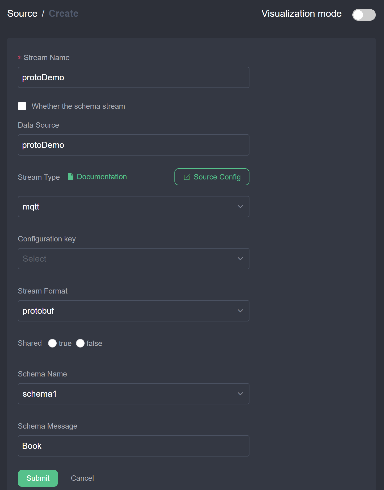
3. Create a rule: Select the rule and click New Rule to enter the rule creation interface. As shown in the figure below, click the top right corner switch button to enter text mode, enter a custom rule ID, rule name, and enter the JSON text of the rule in the text content. The rule represents the content of the selected stream `protoDemo`, sent to the MQTT topic `result/protobuf`.
   ```json
   {
      "id": "ruleDecode",
      "sql": "SELECT * FROM protoDemo",
      "actions": [{
        "mqtt": {
          "server": "tcp://broker.emqx.io:1883",
          "topic": "result/protobuf",
          "sendSingle": true
        }
      }]
   }
   ```
   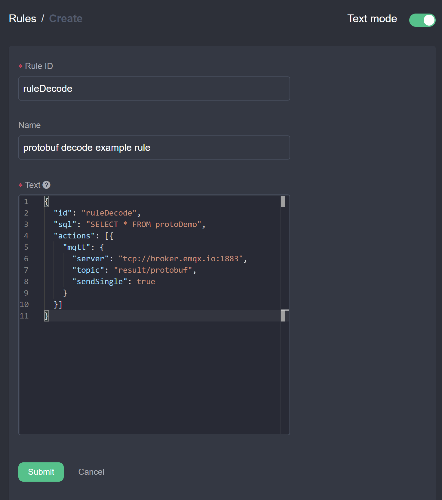
4. Send data and see the result: We will use MQTTX to send Protobuf encoded binary data to the `protoDemo` topic and observe if the result received is the correct data after decoding.
   1. Open MQTT X and connect to the cloud `tcp://broker.emqx.io:1883`.
   2. Subscribe to the topic `result/protobuf` which is the topic defined in the rule action.
   3. In the message sending pane, set the topic to `protoDemo` and the Payload format to `Hex`, sending binary data encoded according to the Book format in schema1, e.g. `0a1073747265616d696e672073797374656d107b`.
      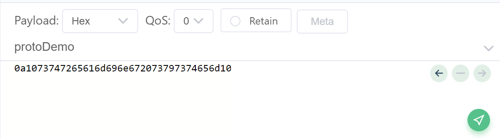
   4. Ensure that the receiver window receives the correct JSON data, as shown below.
      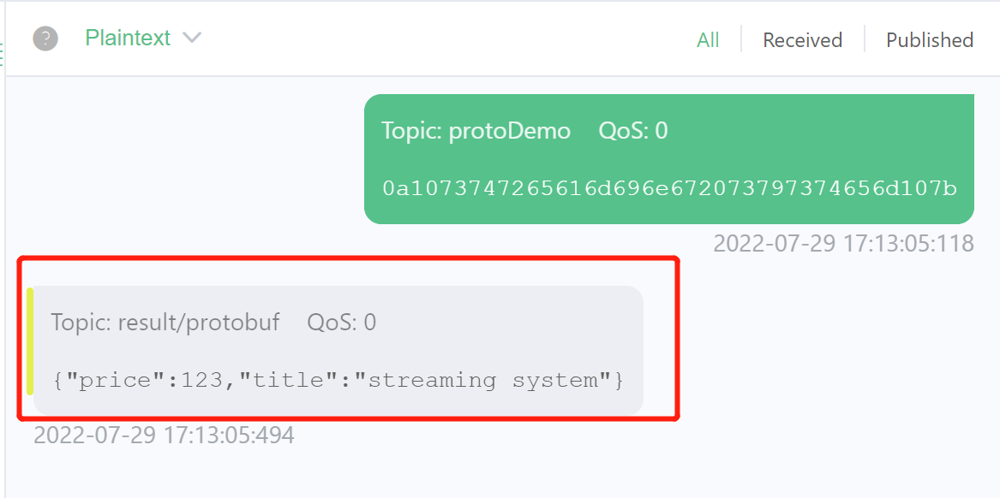

At this point, we have finished reading and decoding Protobuf data and processing the output with simple rules. The user can create a variety of rules just like with normal JSON format data. If you do not get the expected result, you can check the rule status in the rule list page of the management console to ensure that the rule data is coming in and out with the expected metrics.

## Write Protobuf Data

In this section, we show the usage of reading JSON formatted data, processing it and sending it to the cloud MQTT broker using Protobuf format. In the IoT edge-cloud collaboration scenario, this usage saves the bandwidth overhead of edge-cloud transfers. The eKuiper deployed at the edge accesses the local MQTT broker without consuming bandwidth and can be accessed through the faster processing JSON format. After the rules are calculated, the results need to be sent to the cloud MQTT broker and can be encoded using Protobuf to save bandwidth.

1. Create stream: In the management console, select Source ->Stream and click Create Stream. As shown in the figure below, create a stream with JSON format data connected to the demo topic.
   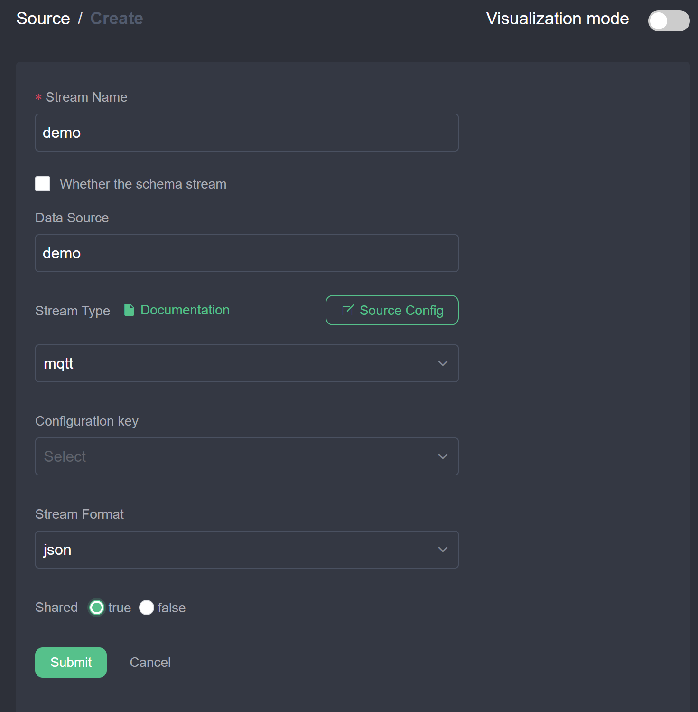
2. Create a rule to send to the cloud using the Protobuf format.
   1. Click New Rule, enter a custom Rule ID and name, enter SQL `SELECT * FROM demo`.
   2. Click the New button to the right of the actions to configure the MQTT action. The MQTT server address is configured as the cloud broker address, the MQTT subject is `result/protobufOut`; the data is sent by item is configured as true to ensure that the data received is a single item in matching format; the stream format is configured as `protobuf`, the schema name is `schema1` registered in the first section, and the schema message is ` Book`. The rule will read the JSON data and then encode it into binary data in the Book format and send it to the `result/protobufOut` topic. Click Submit to complete the action configuration.
      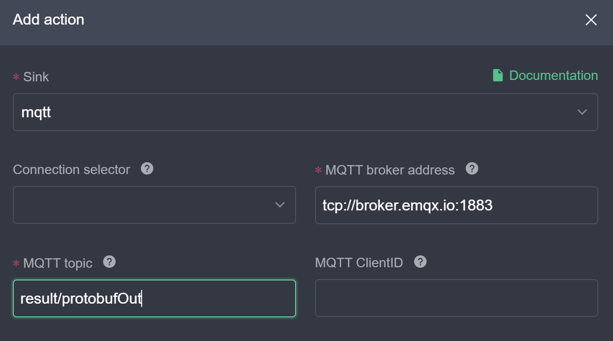
      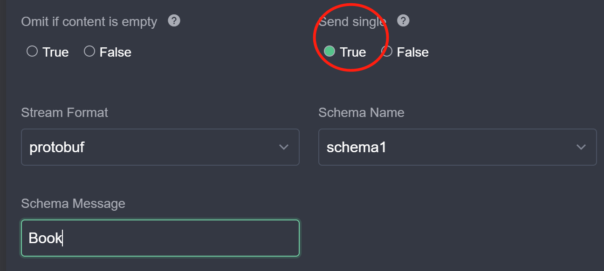
   3. Each rule can have multiple actions and the encoding format used for each action is independent. The user can continue to configure the rest of the actions. After all configurations are completed, click Submit to finish creating the rule.
3. Send the data and view the results, the process is similar to the previous section. This time we will send JSON data to the demo topic and expect to see the protobuf-encoded binary data in the subscribed `result/protobufOut` topic. As you can see in the figure below, pay attention to the configuration of the data format to avoid displaying garbled code.
   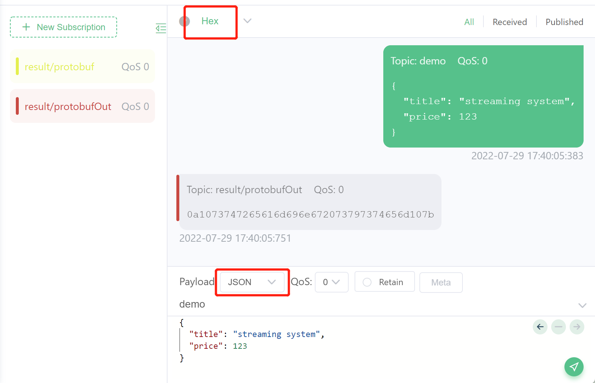

## Summary

This tutorial describes how to read and write Protobuf data in eKuiper. ProtoBuf format is one of the formats that eKuiper connects to external systems and any combination of formats can be used as the internal format representation is used after integrating into the system. Firstly, the user needs to define the schema of Protobuf; after that, the Protobuf format can be configured in the stream creation and action creation, and the defined schema can be selected to encode and decode the data.

## Further Readings

- [Codecs](./serialization.md)
- [Schema Management REST API](../../api/restapi/schemas.md)
- [Schema Management CLI](../../api/cli/schemas.md)
