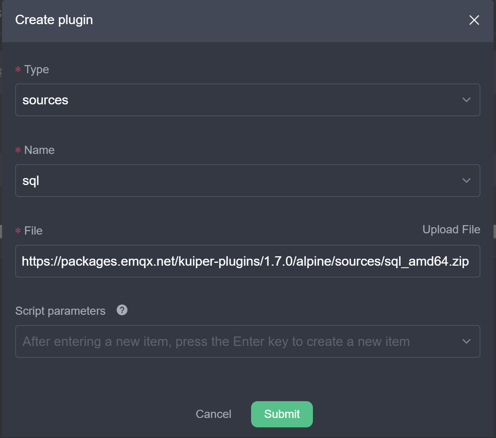

# Lookup Table Scenarios

Not all data will change often, even in real-time computing. In some cases, you may need to supplement the stream data with externally stored static data. For example, user metadata may be stored in a relational database, and the only data in the stream data is data that changes in real time, requiring a connection between the stream data and the batch data in the database to make up the complete data.

In earlier versions, eKuiper supported the Table concept for keeping a small amount of stream data in memory as a snapshot of the data for other streams to join and query. Such scan table is suitable for scenarios where there is less state and the state need to query very often. In version 1.7.0 and later, eKuiper added the new concept of lookup table for binding external static data, which can handle the needs of large number of batch data joins. This tutorial introduces how to perform batch stream binding calculations based on lookup tables.

## Dynamic alerting scenarios

Alerting function is one of the most common scenarios in edge computing. When alert criteria are fixed, we can usually match alert conditions and trigger actions with a simple `WHERE` statement. However, in more complex scenarios, the alert conditions may be dynamically configurable and have different alert values depending on different data dimensions, such as device type. Next, we will explain how to create rules for this scenario. Once the data is collected, the rule needs to filter the alerting based on the dynamic alerting criteria.

### Scenario Inputs

In this scenario, we have two inputs.

- The event data stream, which contains real-time events from multiple devices. In this tutorial, the collected data stream is sent in real time via the MQTT protocol.
- Alerting condition data, each type of device has a corresponding alerting threshold value, and the threshold value can be updated. In this tutorial, the threshold value data is stored in Redis.

For both inputs, we create streams and lookup tables to model them separately.

1. Create a data stream. Assuming that the data stream is written to the MQTT Topic `scene1/data`, we can create a data stream named `demoStream` using the following REST API.
   ```json
    {"sql":"CREATE STREAM demoStream() WITH (DATASOURCE=\"scene1/data\", FORMAT=\"json\", TYPE=\"mqtt\")"}
    ```
2. Create a lookup table. Assuming that the threshold value data is stored in Redis database 0, create a lookup table named `alertTable`. Here, if you use other storage methods, you can replace `type` with the corresponding source type, such as `sql`.
   ```json
    {"sql":"CREATE TABLE alertTable() WITH (DATASOURCE=\"0\", TYPE=\"redis\", KIND=\"lookup\")"}
    ```

### Update alertTable Dynamically

Alerting threshold values are stored in external storage such as Redis or SQL databases. They can be updated by the user through customized application or automatically by rules through the `Updatable Sink` feature provided by eKuiper. This tutorial will use rules to dynamically update the Redis lookup table which is defined above via Redis sink.

The updating table rule is the same as the regular rule, the user can access any data source and do any data calculation, just make sure the output contains the update command field `action`, for example `{"action": "upsert", "id":1, "alarm":50}`. In this tutorial, we use the MQTT input update command to update Redis data via rules. 

1. Create an MQTT stream to bind the alert update command data stream. Assume that the update command is published through the MQTT topic `scene1/alert`.
   ```json
   {"sql": "CREATE STREAM alertStream() WITH (DATASOURCE=\"scene1/alert\", FORMAT=\"json\", TYPE=\"mqtt\")"}
   ```
2. Create the threshold value update rule. The rule accesses the command stream created in the previous step, the rule SQL simply gets all the instructions and then uses the redis sink that supports dynamic updates in the action. Redis address is configured to store the data type; the field name used for the key is set to `id` and the field name used for the update command type is set to `action`. Configured as below, you only need to ensure that the command stream contains the `id` and `action` fields in order to update Redis.

   ```json
   {
     "id": "ruleUpdateAlert",
     "sql": "SELECT * FROM alertStream",
     "actions":[
      {
        "redis": {
          "addr": "127.0.0.1:6379",
          "dataType": "string",
          "field": "id",
          "rowkindField": "action",
          "sendSingle": true
        }
     }]
   }
   ```

3. Next, we can send a command to the MQTT topic `scene1/alert` to update the alert value. For example.
   ```text
   {"action": "upsert", "id":1, "alarm":50}
   {"action": "upsert", "id":2, "alarm":80}
   {"action": "upsert", "id":3, "alarm":20}
   {"action": "upsert", "id":4, "alarm":50}
   {"action": "delete", "id":4}
   {"action": "upsert", "id":1, "alarm":55}
   ```

Looking at the Redis database, you should see data being written and updated. The rule is a streaming computation rule, which is also subsequently updated continuously based on the subscribed data.

### Dynamic alerting based on device type

In the previous section, we have created the event data stream and created a dynamically updatable lookup table of alert conditions. Next, we can create rules that connect the event data stream to the lookup table to get the alert value for the current device type, and then determine if an alert is needed.

```json
{
  "id": "ruleAlert",
  "sql": "SELECT device, value FROM demoStream INNER JOIN alertTable ON demoStream.deviceKind = alertTable.id WHERE demoStream.value > alertTable. alarm",
  "actions":[
    {
      "mqtt": {
        "server": "tcp://myhost:1883",
        "topic": "rule/alert",
        "sendSingle": true
      }
    }
  ]
}
```

In the rule, we get the alert value `alarm` for the corresponding device type in the lookup table based on a join between the deviceKind field in the event data stream and the id field in the lookup table (in this case, the key in Redis). Next, filter the collected data in the `WHERE` statement for values that exceed the alert value and send it to the MQTT `rule/alert` topic for alerting.

Send MQTT commands to the `scene1/data` topic of the event data stream and observe the rule alert results. For example, for the following data, although the event values are the same, they may differ due to different alarm thresholds for different device types.

```text
{"device": "device1", "deviceKind":1, "value":54}
{"device": "device12", "deviceKind":2, "value":54}
{"device": "device22", "deviceKind":3, "value":54}
{"device": "device2", "deviceKind":1, "value":54}
```

## Data Enrichment Scenario

Streaming data changes frequently and has a large amount of data, and usually contains only data that needs to change frequently; while data that remains unchanged or changes less is usually stored in external storage such as a database. In application processing, it is usually necessary to complete the missing static data in the stream data. For example, the stream data contains the ID of the device, but the specific name of the device, the model description data is stored in the database. In this scenario, we will describe how to combine the stream data with the batch data for automatic data completion.

### SQL Plugin Installation and Configuration

This scenario will use MySQL as an external table data storage location. eKuiper provides a pre-compiled SQL source plugin to access MySQL data and use it as a lookup table. So, before starting the tutorial, we need to install the SQL source plugin. Using eKuiper manager administration console, you can directly click Create Plugin in extension management tab and select SQL source plugin to install as shown below.



This scenario will introduce how to connect to a relational database using MySQL as an example. The user needs to start a MySQL instance. Create table `devices` in MySQL, which contains fields `id`, `name`, `deviceKind` and write the content in advance.

In the management console, create a SQL source configuration that points to the created MySQL instance. Due to the large IO latency of SQL database, you can configure whether to enable query caching and cache expiration time, etc.

```yaml
  lookup:
    cache: true # Enable caching
    cacheTtl: 600 # cache expiration time
    cacheMissingKey: true # whether to cache misses
```

### Scenario Inputs

In this scenario, we have two inputs.

- The event data stream, which is the same as in scenario 1, contains real-time event data from multiple devices. In this tutorial, the event data stream is sent in real time via the MQTT protocol.
- Device information table, with metadata such as name and model number corresponding to each type of device. In this tutorial, the device information data is stored in MySQL.

For these two inputs, we create streams and loookup tables for modeling respectively.

1. Create a data stream. Assuming that the data stream is written to the MQTT Topic `scene2/data`, we can create a data stream named `demoStream2` with the following REST API.
   ```json
    {"sql": "CREATE STREAM demoStream2() WITH (DATASOURCE=\"scene2/data\", FORMAT=\"json\", TYPE=\"mqtt\")"}
    ```
2. Create a lookup table. Assuming the device data is stored in the MySQL database devices, create a lookup table named `deviceTable`. CONF_KEY is set to the SQL source configuration created in the previous section.
   ```json
    {"sql": "CREATE TABLE deviceTable() WITH (DATASOURCE=\"devices\", CONF_KEY=\"mysql\",TYPE=\"sql\", KIND=\"lookup\")"}
    ```

### Data Enrichment Rules

Once the streams and tables are created, we can create the data enrichment rules.

```json
{
  "id": "ruleLookup",
  "sql": "SELECT * FROM demoStream2 INNER JOIN deviceTable ON demoStream.deviceId = deviceTable.id",
  "actions": [{
    "mqtt": {
      "server": "tcp://myhost:1883",
      "topic": "rule/lookup",
      "sendSingle": true
    }
  }]
}
```

In this rule, the deviceId field in the stream data is matched with the id in the device database to connect and output the complete data. The user can select the desired field in the `select` statement as needed.

## Summary

This tutorial has presented two scenarios on how to use a lookup table for stream-batch integrated calculations. We used Redis and MySQL as external lookup table types and showed how to dynamically update the externally stored data with rules, respectively. Users can use the lookup table tool to explore more stream-batch integration scenarios.