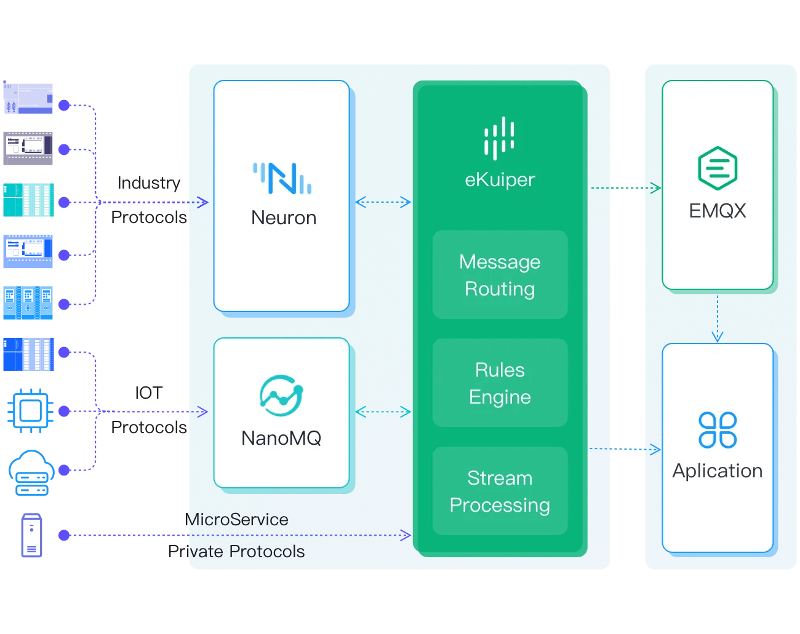

# Edge Cloud Collaboration

Base on open source products, we can build an edge cloud collaboration solution to apply on IIoT(Industrial Internet of Things), IoV(Internet of Vehicles) and other IoT applications like smart city.

In this solution, eKuiper is integrated with the below open source products:

- [Neuron](https://neugates.io/): lightweight IIoT connectivity server
- [NanoMQ](https://nanomq.io/): An ultra-lightweight and blazing-fast MQTT broker for IoT Edge
- [EMQX](https://www.emqx.io/): The Most Scalable MQTT Broker for IoT

The solution realizes the connection, movement, processing, storage and analysis of massive industrial equipment data.

eKuiper is deployed on the edge side and acts in the middle of the overall architecture for stream processing, rule engine and message routing etc. It can consume data from Neuron, NanoMQ or general HTTP on the edge, process or analyze them and publish the result to EMQX in the cloud or save them to the local storage.

For detail about how to consume data collected by neuron, please check [neuron integration tutorial](../neuron/neuron_integration_tutorial.md).
