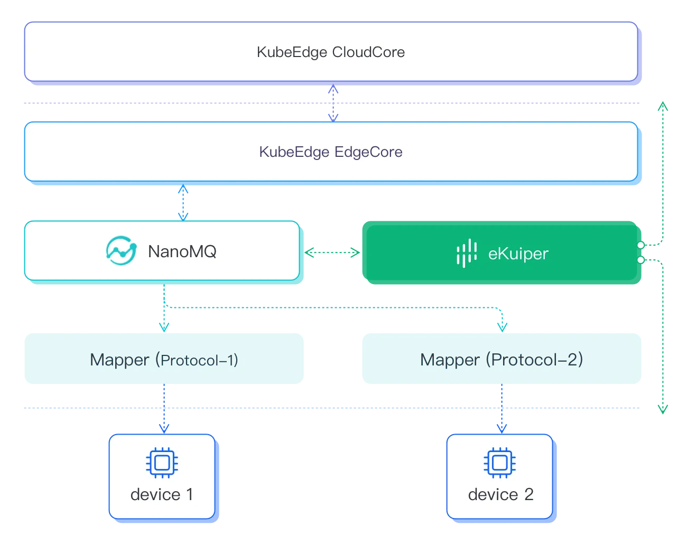

# Analytic Engine for KubeEdge

[KubeEdge](https://kubeedge.io/) is an open-source system for extending native containerized application orchestration capabilities to hosts at Edge.

As a kubernetes compliance system, KubeEdge enables the containerized deployment of the eKuiper instance. Please check [installation](../../installation.md#install-via-helm--k8sk3s-) for how to install eKuiper in k8s system.

The Edge part of KubeEdge uses MQTT for communication between deviceTwin and devices. To use KubeEdge in double mqtt or external mode, users can configure the MQTT broker to be NanoMQ in the edge node.

Follow up, eKuiper can ingest device data from MQTT and provides versatile analytic capabilities for the KubeEdge components to achieve low latency calculation on edge.
