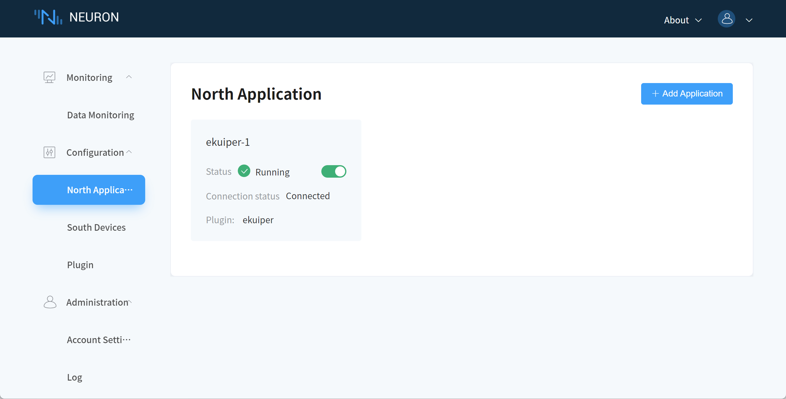
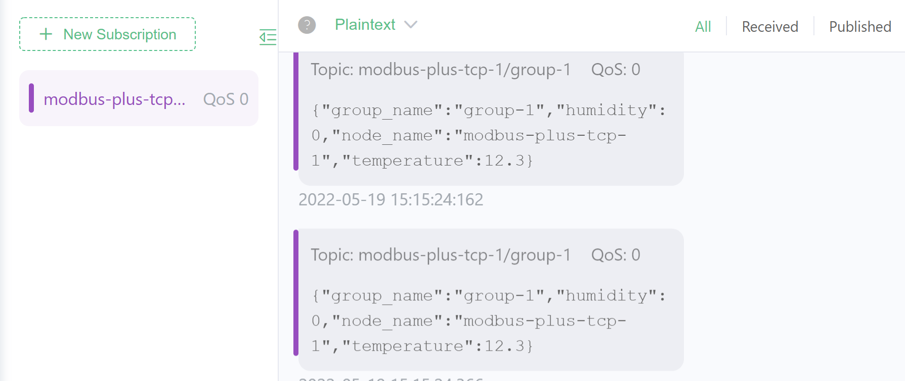
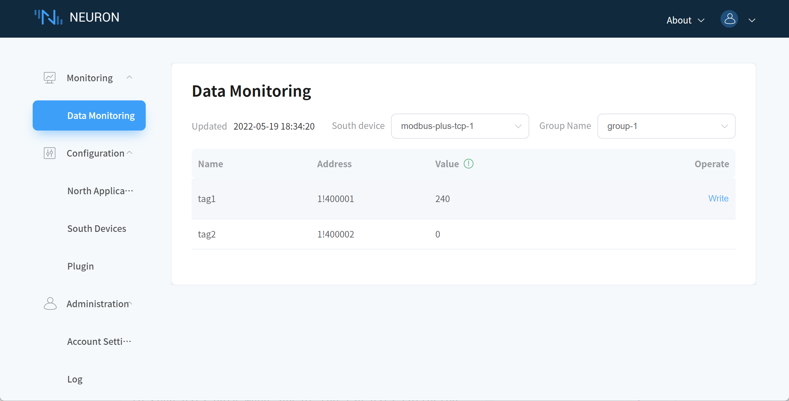

# Stream processing of data collected by Neuron using eKuiper

[Neuron](https://neugates.io) is an industrial protocol gateway software running on various IoT edge gateway hardware, aiming to solve the problem of unified access to device data in the context of Industry 4.0. By converting different protocol types of data from various industrial devices into unified standard IoT MQTT messages, it interconnects devices with industrial IoT systems and each other for remote direct control and information acquisition, and provides data support for intelligent manufacturing.

Neuron supports one-stop access and MQTT protocol conversion for multiple devices with different communication protocols and dozens of industrial protocols at the same time, and only takes up ultra-low resources, i.e. it can be deployed natively or containerized in various edge hardware of X86, ARM and other architectures. At the same time, users can achieve online gateway configuration management through a web-based management console.

In versions prior to eKuiper 1.5.0, MQTT was required as a transit between Neuron and eKuiper. At the same time, users need to handle their own data formats, including the decoding and encoding of reads and outputs. eKuiper 1.5.0 adds Neuron source and sink, allowing users to access data collected from Neuron in eKuiper for computation without configuration; and the device can be easily controlled from eKuiper via Neuron. The integration of the two products significantly reduces the resource requirements of edge computing solutions and lowers the threshold of use.

## Integration of Neuron and eKuiper

In Neuron 2.0, eKuiper support has been added to northbound applications. When Neuron opens a northbound eKuiper application, the two are connected via the NNG protocol, which significantly reduces network communication consumption and improves performance.


The integration between eKuiper and Neuron is bidirectional and the implementation consists of two main parts:

- A Neuron source is provided to support data subscription from Neuron.
- A Neuron sink is provided to support device control via Neuron.

In a typical industrial IoT edge data processing scenario, Neuron and eKuiper are deployed on the same edge machine. This is the scenario currently supported by the integration of the two. If communication over the network is required, collaboration can still be performed in the same way as before with MQTT.

The connection between Neuron and eKuiper has gone through several phases.

1. Early versions, where both sides used MQTT as a relay.
2. Neuron 2.0 and eKuiper 1.5 onwards, where the two sides use the IPC protocol for one-to-one connectivity.
3. Neuron 2.4 and eKuiper 1.9 onwards, the two sides use TCP protocol to connect and can support many-to-many connections.

## Preparation

This tutorial will take the industrial IoT data collection and cleansing scenario as an example, and introduce how to complete the data collection, data cleansing and data control of cloud-edge collaboration step by step.

In this tutorial, Neuron and eKuiper are deployed on the edge gateway or IPC near the device. data collected by Neuron is processed by eKuiper and sent to the MQTT broker in the cloud for further processing by the application in the cloud. At the same time, eKuiper can receive MQTT commands from the cloud and control the local devices through Neuron.

Before getting started, the following environment needs to be prepared.

- MQTT broker in the cloud, e.g. [Quick Start EMQX](https://www.emqx.io/docs/en/v4.4/getting-started/getting-started.html). Assume that the cloud MQTT broker address is `tcp://cloud.host:1883`, which will be used as an example in the following tutorial.
- To see the results, we need to install an MQTT client, e.g. [MQTT X](https://mqttx.app/).

## Rapid Deployment

Both Neuron and eKuiper support binary installation packages and Docker containerized deployment solutions. In this article, we take Docker solution as an example and use [docker compose](https://docs.docker.com/compose/) to quickly deploy two components on the edge with one click.

1. Copy [docker-compose.yml](https://github.com/lf-edge/ekuiper/blob/master/docs/en_US/integrations/neuron/docker-compose.yml) file to the deployment machine. The contents are as follows, containing Neuron, eKuiper, and the eKuiper manager (optional). In particular, eKuiper and neuron share a volume called nng-ipc, which is used for communication between the two. If using eKuiper alpine version, add `user: root:root` into the eKuiper section to grant the write access to the ipc file, otherwise, the connection cannot be established.

   ```yaml
   version: '3.4'

   services:
      manager:
         image: emqx/ekuiper-manager:1.9
         container_name: ekuiper-manager
         ports:
            - "9082:9082"
      ekuiper:
         image: lfedge/ekuiper:1.9
         ports:
            - "9081:9081"
            - "127.0.0.1:20498:20498"
         container_name: ekuiper
         hostname: ekuiper
         environment:
            MQTT_SOURCE__DEFAULT__SERVER: "tcp://mybroker:1883"
            KUIPER__BASIC__CONSOLELOG: "true"
            KUIPER__BASIC__IGNORECASE: "false"
            # The default neuron url. Change it if you want to use another port.
            NEURON__DEFAULT__URL: "tcp://neuron:7081"
         volumes:
            - /tmp/data:/kuiper/data
            - /tmp/log:/kuiper/log
            # Enable the following line if you want to use the IPC mode to connect to earlier version of neuron
            # - nng-ipc:/tmp
      neuron:
         image: neugates/neuron:2.4.0
         ports:
            - "7001:7001"
            # The default port to communicate with eKuiper. Change it if you want to use another port.
            - "7081:7081"
         container_name: neuron
         hostname: neuron
         volumes:
            - /tmp/neuron/data:/opt/neuron/persistence
            # Enable the following line if you want to use the IPC mode to connect to earlier version of eKuiper
            # - nng-ipc:/tmp

      # Enable the following lines if you want to use the IPC mode to connect to earlier version of eKuiper and neuron
      # volumes:
      #  nng-ipc:
   ```

   To modify the port, you need to modify Neuron's eKuiper northbound application port, as well as the parts of this document that use the port, i.e., Neuron's port exposure and eKuiper's environment variable default connection url section.

   > Notes for different version combinations
   >
   > 1. eKuiper 1.9 onwards can only interface with Neuron versions before 2.4 via ipc, you need to configure `NEURON__DEFAULT__URL: "ipc:///tmp/neuron-ekuiper.ipc"` and enable the configuration of volumes nng-ipc. Neuron does not need to expose port 7081.
   > 2. eKuiper versions before 1.9 can only interface with Neuron versions before 2.4 via ipc, you need to remove the `NEURON__DEFAULT__URL` environment variable configuration and enable the volumes nng-ipc configuration.
   > 3. eKuiper versions before 1.9 and Neuron versions after 2.4 cannot connect directly, but can be relayed through MQTT

2. In the directory where the file is located, run:

   ```shell
   # docker compose up -d
   ```

3. After all containers are started, use the `docker ps` command to make sure all containers have started properly.

   ```shell
   CONTAINER ID   IMAGE                        COMMAND                  CREATED        STATUS          PORTS                                                NAMES
   3d61c1b166e5   neugates/neuron:2.0.1        "/usr/bin/entrypoint…"   18 hours ago   Up 11 seconds   127.0.0.1:7000-7001->7000-7001/tcp                   manager-neuron
   62a74d0be2ea   lfedge/ekuiper:1.5.0-slim    "/usr/bin/docker-ent…"   18 hours ago   Up 11 seconds   0.0.0.0:9081->9081/tcp, 127.0.0.1:20498->20498/tcp   manager-ekuiper
   7deffb470c1a   emqx/ekuiper-manager:1.5.0   "/usr/bin/docker-ent…"   18 hours ago   Up 11 seconds   0.0.0.0:9082->9082/tcp                               ekuiper-manager
   ```

## Configure Neuron and eKuiper

After Neuron starts, we need to configure Neuron's southbound device and northbound eKuiper application channel, and then start the simulator for simulated data acquisition.

For southbound device and simulator configuration, please refer to the [Neuron Quick Tutorial](https://neugates.io/docs/en/latest/quick-start/southdevices-connect.html), to complete to the "Operation And Use/3. South configuration" section. The north configuration section of that tutorial is for the mqtt application, but this tutorial requires the eKuiper to be used as the northbound application.

### Neuron northbound eKuiper application configuration

Select `North Application Management` in the configuration menu to enter the northbound application management interface. No application has been added at this point, so you need to add an application manually, in this case we will create an eKuiper application.

Step 1: Add a north application.

1. Click the `Add Configuration` button in the upper right corner.
2. Fill in the name of the application, e.g., ekuiper-1.
3. The drop-down box shows the northbound applications available to us in this software version, in this case we choose the ekuiper plugin, as shown below.
   
4. After the application is created successfully, a card of the application just created will appear in the North application management interface, at this time, the application is in the initialization state and the connection state is in the disconnection state.


Step 2: Subscribe to Group.

Click any blank space in the application card ekuiper-1 in the first step to enter the Group list management screen, as shown in the figure below.


1. Click the `Create` button in the upper right corner to add a subscription.
2. Drop down box to select the southbound device, here we select the modbus-plus-tcp-1 device built above.
3. Drop down box to select the Group you want to subscribe to, here we select the group-1 built above.
4. Click Submit to complete the subscription.
5. Click `North Application Management` and tap the working status switch in the application card to put the application into running state.

At this point, Neuron is configured to collect data and send the collected data to the northbound eKuiper channel.

### eKuiper manager configuration

The eKuiper manager is a web management interface that can manage multiple eKuiper instances. Therefore, we need to set up the eKuiper instances managed by manager. Please refer to [Using the eKuiper Manager Console](../../operation/manager-ui/overview.md) for detail.

eKuiper administration can be done using the REST API, command line, and the management console. In the following tutorial, we will mainly use the REST API for administration, including stream and rule creation.

## Create the stream

Create a stream named `neuronStream` with the following command. The `type` attribute is set to `neuron`, which means that the stream will be connected to Neuron. All the data collected in Neuron will be sent, so that multiple rules in eKuiper will be processed for the same data, so the stream attribute `shared` is set to true.

```shell
curl -X POST --location http://127.0.0.1:9081/streams \
    -H 'Content-Type: application/json' \
    -d '{"sql":"CREATE STREAM neuronStream() WITH (TYPE=\"neuron\",FORMAT=\"json\",SHARED=\"true\");"}'
```

## Collection Rules

After the Neuron stream is established, we can create any number of rules in eKuiper to perform various calculations and processes on the collected data. In this tutorial, we take two acquisition rules as an example to implement an edge acquisition to cloud scenario. For more data processing capabilities of eKuiper, please refer to the extended reading section.

### Cleaning data to the cloud

Assume that the two tags set in Neuron mean:

- tag1: decimal temperature data, the actual temperature should be divided by 10
- tag2: integer humidity data.

This rule converts the collected Neuron data to the correct precision and renames it to a meaningful name. The result is sent to the MQTT dynamic topic `${nodeName}/${groupName}` in the cloud. The REST command to create the rule is as follows. Where the rule is named `ruleNAll`, the SQL for the rule is calculated for the collected values and the metadata `node_name` and `group_name` are selected. In the action, the result of the rule is sent to the MQTT broker in the cloud and the topic is a dynamic name. According to the previous configuration, we collect node_name as `modbus-plus-tcp-1` and group_name as `group-1`. So, in MQTT X, subscribing to the `modbus-plus-tcp-1/group-1` topic will give us the calculated results.

```shell
curl -X POST --location http://127.0.0.1:9081/rules \
    -H 'Content-Type: application/json' \
    -d '{
  "id": "ruleNAll",
  "sql": "SELECT node_name, group_name, values->tag1/10 as temperature, values->tag2 as humidity FROM neuronStream",
  "actions": [{
    "mqtt": {
      "server": "tcp://cloud.host:1883",
      "topic": "{{.node_name}}/{{.group_name}}",
      "sendSingle": true
    }
  }]
}'
```

Open MQTT X, connect to the cloud broker, subscribe to the `modbus-plus-tcp-1/group-1` topic, and you get the following results. Since the collection frequency is 100ms at a time, the data received here is of a similar frequency.



Modify the data in the Modbus TCP simulator to get the changed output.

### Collect changed data to the cloud

When the collection frequency is high and the data change frequency is low, users usually collect a lot of redundant and duplicate data, and uploading them all to the cloud will occupy a lot of bandwidth. eKuiper provides an application layer de-duplication function to create rules to collect the change data. The above rule is modified to add a filter condition to send data only when any of the tag data collected changes. The new rule becomes:

```shell
curl -X POST --location http://127.0.0.1:9081/rules \
    -H 'Content-Type: application/json' \
    -d '{
  "id": "ruleChange",
  "sql": "SELECT node_name, group_name, values->tag1/10 as temperature, values->tag2 as humidity FROM neuronStream WHERE HAD_CHANGED(true, values->tag1, values->tag2)",
  "actions": [{
    "mqtt": {
      "server": "tcp://cloud.host:1883",
      "topic": "changed/{{.node_name}}/{{.group_name}}",
      "sendSingle": true
    }
  }]
}'
```

Open MQTT X, connect to the cloud broker, subscribe to the `changed/modbus-plus-tcp-1/group-1` topic, and receive data much less frequently. Modify the data in the Modbus TCP simulator to receive new data.

## Control device via Neuron

Thanks to the neuron sink component, eKuiper can control the device via Neuron after data processing. In the following rules, eKuiper receives commands from MQTT to dynamically counter-control the Neuron.

Suppose there is an application scenario where a user controls a device deployed at the edge by sending control commands to a topic on the MQTT server in the cloud, such as setting the desired temperature of the target device. First, we need to create an MQTT stream in eKuiper to receive commands from other applications to the `command` MQTT topic.

```shell
curl -X POST --location "http://127.0.0.1:9081/streams" \
    -H 'Content-Type: application/json' \
    -d '{"sql":"CREATE STREAM mqttCommand() WITH (TYPE=\"mqtt\",SHARED=\"TRUE\",DATASOURCE=\"command\");"}'
```

Next, we create a rule that reads the data from this MQTT stream and writes the data via Neuron according to the rule. As before, assume tag1 is a decimal type reading of the temperature sensor. The rule reads the temperature value in the MQTT payload and multiplies it by 10 as the tag1 value; it uses the nodeName, groupName fields in the payload as the dynamic node and group names to write to Neuron.

```shell
curl -X POST --location http://127.0.0.1:9081/rules \
    -H 'Content-Type: application/json' \
    -d '{
  "id": "ruleCommand",
  "sql": "SELECT temperature * 10 as tag1, nodeName, groupName from mqttCommand",
  "actions": [{
    "log": {},
    "neuron": {
      "nodeName": "{{.nodeName}}",
      "groupName": "{{.groupName}}",
      "tags": [
        "tag1"
      ]
    }
  }]
}'
```

After the rule is run, open MQTT X and write a JSON string in the following format to the `command` topic. Note that you should make sure that the node and group are created in Neuron. In the configuration of this tutorial, only modbus-plus-tcp-1 and group-1 have been created.

```json
{
  "nodeName": "modbus-plus-tcp-1",
  "temperature": 24,
  "groupName": "group-1"
}
```

Turn on Neuron's data monitor and see the tag1 data change to 240, indicating a successful counter-control.



Also, the two rules created in the previous section should capture the new values.

## Further reading

This tutorial uses some features of Neuron source and sink, as well as some streaming scenarios. Read the following material for a more in-depth look at the features.

- For more details on the Neuron streaming data format, please read the [Neuron Source Reference](../../guide/sources/builtin/neuron.md).
- For more details about the Neuron back-control parameters, please read [Neuron Sink Reference](../../guide/sources/builtin/neuron.md).
- Understanding the [concepts and basic usage scenarios](../../concepts/ekuiper.md) of eKuiper.
- Understand [the composition and parameters of the rules](../../guide/rules/overview.md).
- Using the [eKuiper Management Console](../../operation/manager-ui/overview.md).
