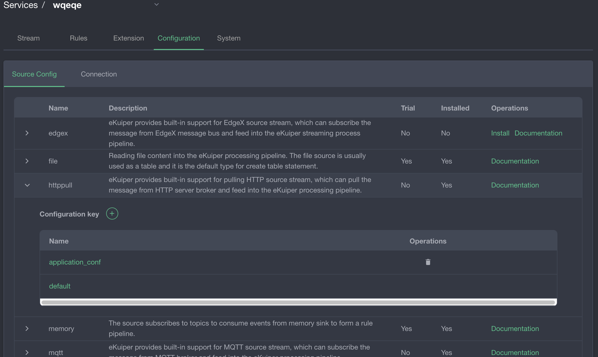

## How to display custom plugins in the installation list of the management console

### Overview

Kuiper provides a plugin extension mechanism, and users can implement custom plugins based on the extended interface. On the management console, users can install plugins directly through the interface. If readers have custom plugins and want to show them in the installation list of the management console, this article can give readers some reference.

### Plugin metadata

The plugin metadata is a json format file used to describe the information of the plugin. This information will be displayed on the management console. It can also be used for the management console to generate the plugin configuration page.

#### Metadata format

The plugin metadata is a json format file, and different plugin types support different attributes.

**Source**

For detailed configuration of source metadata, please refer to [source metadata configuration](../plugins/overview.md#source-metadata-file-format). Examples of configuration files are as follows:

```json
{
  "about": {
    "trial": true,
    "author": {
      "name": "yourname",
      "email": "your@email.com",
      "company": "your company",
      "website": "https://www.your.website"
    },
    "helpUrl": {
      "en_US": "https://yourwebsite/help_en_US.md",
      "zh_CN": "https://yourwebsite/help_zh_CN.md"
    },
    "description": {
      "en_US": "your description",
      "zh_CN": "描述"
    }
  },
  "properties": {
    "default": [
      {
        "name": "prop1",
        "default": 1000,
        "optional": false,
        "control": "text",
        "type": "int",
        "hint": {
          "en_US": "The description",
          "zh_CN": "参数用法描述"
        },
        "label": {
          "en_US": "prop display name",
          "zh_CN": "参数显示名称"
        }
      }
    ]
  }
}
```

The configuration parameters of Source metadata are mainly consist of two parts:

**about**

Describe the basic information of the plugin, including plug-in author, help file, description, etc. All attributes support multi-language description. After the plugin is installed, when the stream type is selected on the stream management page of the management console, the information defined in the plugin metadata will be displayed. After the plugin is selected, a link to the help document defined by the metadata will be displayed on the interface.


**properties**

Describe the configurable attribute information of the plugin, including parameter information and how to display on the interface. The attribute information of Source is specified by the corresponding configuration file, and multiple configuration groups can be specified in the configuration file. For details, please refer to [Source Configuration Document](../extension/source.md#Deal-with-configuration). In the metadata file, there can be multiple configuration group names under `properties`, such as `default` in the example; each configuration group has multiple attribute metadata.

On the stream management page of the management console, click `Source Configuration` to expand any source, and all configuration groups of metadata can be displayed.


Click any configuration group to view the configuration group parameters. Click the add icon to enter the parameter configuration page as shown below. The displayed name and control information of parameter configuration come from the definition of metadata JSON file.



**Sink**

Sink metadata configuration is basically the same as Source. For detailed configuration, please refer to [sink metadata configuration](../plugins/overview.md#sink-metadata-file-format).

The configuration parameters of Sink metadata mainly consist of two parts:

**about**

Describe the basic information of the plugin, including plugin author, help file, description, etc. All attributes support multi-language description. After the plugin is installed, on the rule creation page of the management console, click the `add` button in the action module, and click the drop-down box in the pop-up window to select sink. The information defined in the plugin metadata will be listed in the drop-down box.


**properties**

Describe the configurable attribute information of the plugin, including parameter information and how to display on the interface. Unlike Source, the attributes of Sink are not stored in the configuration file, but are configured when the rule is created. In the corresponding metadata configuration, it no longer has the concept of configuration group for Sink. On the rule creation page of the management console, in the pop-up window of adding action , after selecting the plugin, the help document link and the attributes defined in the metadata will be displayed. It is worth noting that Sink has some [common attributes](../rules/overview.md#sinks/actions), which will be displayed in all sinks.


**Functions**

For detailed configuration of Function metadata, please refer to [sink metadata configuration](../plugins/overview.md#functions-metadata file format). Among them, the `about` part is exactly the same as Source and Sink. The `function` part is configured with the name, examples and prompt information of the function, which are used for code prompting in the SQL editor of the new rule.


### Plugin compilation and packaging format

For plugin development, compilation and packaging, please refer to [Plugin Development Tutorial](../plugins/plugins_tutorial.md). To display custom plugins in the management console, the following principles need to be followed:

1. The name of plugin metadata file should be the same as the plugin name, which should be a json file, such as `mySource.json`.
2. The plugin metadata file should be placed in the root directory of the packaged zip file.

### Release to web server

In `etc/kuiper.yaml`, there is a `pluginHosts` configuration item, and users can configure the server list here. In addition to the official plugin releasing address, users can add their local plugin releasing address here. However, there are requirements for the structure and content of the directory when the plugin is released. The deployment service should be

```
https://$host/$folder/$version/$os/$type/$plugin.zip
```

Example:  https://127.0.0.1:9090/kuiper-plugins/0.9.1/debian/sinks/file.zip

Among them:

1. $version: Kuiper version number used for plugin compilation
2. $os: The operating system used for the plugin compilation. If the plugin is compiled in the default Kuiper Docker image, the value is debian.
3. $type: plugin type, which can be `sources`, `sinks`, `functions`.


### Limitation

Due to the limitation of `Go` language plugin mechanism, the compilation environment of the plugin must be the same as the `Kuiper` environment. Therefore, it is recommended that the plugin be compiled in a `Docker` container of the same version as `Kuiper`. At the same time, because some libraries in the `alpine` environment are missing, it is not recommended to run plugins on it. Therefore, if you need to install and run the plugin, it is recommended to use the following container:

- Kuiper: Use slim image, such as `0.9.1-slim`
- Plugin: compile with the default image of the corresponding version, such as `0.9.1`

### Summary

Kuiper management console provides a display mechanism for custom plugins. User only needs to add the plugin metadata file in the custom plugin package. At the same time, users can customize the plugin  repository, so that plugins can be installed and used conveniently from the console.