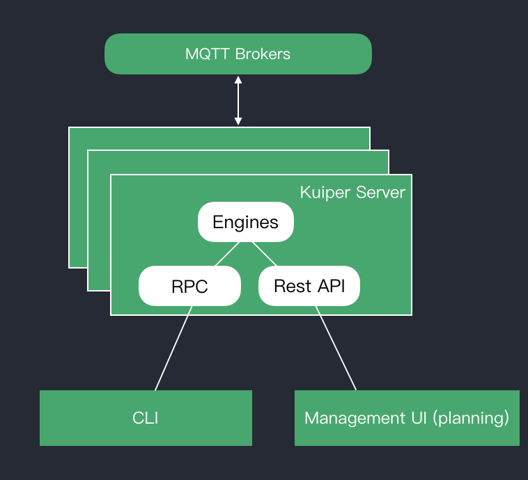

The eKuiper CLI (command line interface) tools provides streams and rules management. 

The eKuiper CLI acts as a client to the eKuiper server. The eKuiper server runs the engine that executes the stream or rule queries. This includes processing stream or rule definitions, manage rule status and io.

*eKuiper CLI Architecture*

- [Streams](streams.md)
- [Rules](rules.md)
- [Plugins](plugins.md)

