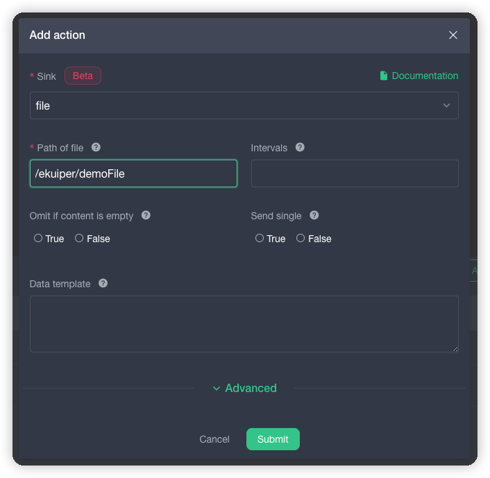

# Use of eKuiper management console

## Overview

From eKuiper version 0.9.1, whenever a new version of eKuiper is released, the corresponding version of the management console will be released. This article uses a practical example to illustrate how to use the management console to operate and manage eKuiper nodes. In the article, the data will be subscribed from the MQTT server, and be sent to the specified file after processing through the rules written by eKuiper. The demonstration is as follows:

- Create a eKuiper node through the management console
- Create a stream to subscribe to the data in the MQTT server. This example demonstrates subscribing to the MQTT server. The relevant information is shown below.
  - Address: `tcp://broker.emqx.io:1883`，
  - Topic: `devices/device_001/messages`，
  - Data: `{"temperature": 40, "humidity" : 20}`
- Create a rule to calculate the subscribed data and write the data to the sink "This example demonstrates writing the subscribed message to a file".
- eKuiper currently supports multiple sources and sinks. Users only need to install the corresponding plugins to achieve the corresponding function. "The source of this example is MQTT source, which has built-in support without the need of installation; the sink is a file, which does not have built-in support and needs to be installed separately."

## Architecture design

* UI end: a visual interface, easy for users to operate
* Kuiper-manager: Management console, which essentially is a reverse HTTP proxy service, providing the services of user management, permission verification. It can be deployed in the cloud or at the edge
* eKuiper instance: managed eKuiper node instance, Kuiper-manager can manage multiple eKuiper nodes at the same time


## Install the management console

### Install eKuiper

- Pull eKuiper's Docker image from [Docker Image Library](https://hub.docker.com/r/lfedge/ekuiper/tags). Since it is required to install the plugin in this article, you must use the `ekuiper:1.4-slim` image (`ekuiper:1.4-alpine` image is relatively small and easy to install, but due to the lack of some necessary library files, the plug-in cannot run normally. The `ekuiper:1.4` image is the development version, which is suitable for use in the development phase).

  ```shell
  docker pull lfedge/ekuiper:1.4-slim
  ```

- Run the eKuiper container (for convenience, we will use the public MQTT server provided by [EMQ](https://www.emqx.io), and the address can be set by the `-e` option when running the container). If you want to access the eKuiper instance through the host, you can expose port 9081 by adding the `-p 9081:9081` parameter when starting the container.

  ```shell
  # docker run -d --name kuiper -e MQTT_SOURCE__DEFAULT__SERVER="tcp://broker.emqx.io:1883" lfedge/ekuiper:1.4-slim
  ```
  
  When the container is running, the MQTT server address can be set through the `-e` option, and the data is written to the MQTT source configuration file, which can be viewed by the following command:
  
  ```shell
  # docker exec -it kuiper sh
  # cat etc/mqtt_source.yaml
  ```
  
  Some output of this file is shown below, and the value of `server` is set to `tcp://broker.emqx.io:1883`.
  
  ```yaml
  default:
    concurrency: 1
    qos: 1
    server: "tcp://broker.emqx.io:1883"
    sharedSubscription: true
  ....
  ```

### Install management console

- Pull the Docker image of kuiper-manager from [Docker Image Library](https://hub.docker.com/r/emqx/ekuiper-manager/tags), and `1.4-ief` is a dedicated image for Huawei IEF users, This example uses the `1.4` image.

  ```shell
  docker pull emqx/ekuiper-manager:1.4
  ```

- Run the Kuiper-manager container and expose port 9082.

  ```shell
  docker run --name kuiperManager -d -p 9082:9082 emqx/ekuiper-manager:1.4
  ```

## Getting started

### Login to kuiper-manager

You need to provide the address, user name, and password of kuiper-manager when logging in, which is shown below:

* Address: `http://$yourhost:9082`

* User name: `admin`

* Password: public

  

### Create a eKuiper service

When creating a eKuiper service, you need to fill in the "service type", "service name" and "endpoint URL".

* Service Type: Select `Direct Connect service` (`Huawei IEF service` is dedicated to Huawei users).

* * Service Type: Select `Direct Connect service` (`Huawei IEF service` is dedicated to Huawei users).
 name: self-made, this example uses `example`.

* Endpoint URL: `http://$IP:9081`, the IP acquisition command is as follows:

  ```shell
  docker inspect kuiper |  grep IPAddress
  ```

The example of creating a eKuiper service is shown in the figure below. If the port is exposed to the host, then the 9081 port address on the host can also be used directly.


### Install the plugin

In our scenario, the target plugin named file will be used. Select "Plugins" > "Install plugin", and the following dialog box will pop up: Select the target plugin named file in the drop-down list to download and install it, and the plugin will write data to the file specified by the user. As shown in the figure below, after the reader selects the plug-in with the corresponding name, the  input box of "File" will automatically be filled with the corresponding plug-in download address, Enter the extended parameter configuration of the installation plug-in script. After clicking the "Submit" button, eKuiper will automatically download the corresponding plugin from the relevant address on `https://www.emqx.io/downloads` and install it into the system automatically.


**Note: After the plug-in is installed and used through the rules, the plug-in has been loaded into the memory. Due to the limitations of the Golang language, when the plug-in is deleted, it cannot be uninstalled in practice. Therefore, if you want to reinstall the plug-in, you must restart eKuiper before it can take effect. Currently only the installation in the Docker environment of debian is supported, and other environments are not supported temporarily. **

### Create a stream

Create a stream named `demoStream`, as shown below:

- Used to subscribe to MQTT server messages with the address `tcp://broker.emqx.io:1883`

- The message topic is `devices/device_001/messages`

- The stream structure definition contains the following two fields.

  - temperature: bigint 
  - humidity: bigint

  Users can also remove "whether it is a stream with structure" to define a schemaless data source.

- "Stream Type" can be left unselected. If not selected, it is "mqtt" by default, or you can directly select "mqtt" as shown in the figure below

- "Configuration Group", similar to "Stream Type". If not selected, "default" is used by default

- "Stream format", similar to "Stream Type". If not selected, the default "json" is used


As shown above, the "default" configuration group is used. Users can also write their own configuration according to their needs. The specific operation is to click `Source Configuration` on the page of creating a steam, Jump to the configuration page, expand the type of configuration you need, and click the plus sign to create source config and a dialog box will pop up as shown below.


### Create a rule

As shown in the figure below, a rule named demoRule is created to filter out the data with temperature> 30 in the data. The SQL editor can give hints during the user's SQL writing process to facilitate the user to complete the SQL writing.


Click the "Add" button and a dialog box will pop up as shown below. The file path of `/ekuiper/demoFile` where the input result is stored is input . More information about the file sink can be found in [Help File](../../rules/sinks/plugin/file.md). The target file is in the `Beta` state and cannot be used as an actual production environment.



After the rule is created, if everything goes well, the rule is running.

### View execution results

Enter the eKuiper container to create a file:

```shell
# docker exec -it kuiper sh
# touch demoFile
# tail -f demoFile
```

Use the MQTT client tool `mosquitto_pub` to send the sensor data to the topic `devices/device_001/messages` of the MQTT server `tcp://broker.emqx.io:1883`, and the command is as follows. If everything goes well, the file named `demoFile` will receive data: `{"temperature": 40, "humidity": 20}`.

```shell
# mosquitto_pub -h broker.emqx.io -m '{"temperature": 40, "humidity" : 20}' -t devices/device_001/messages
```

**View more information of the rules**

As shown in the figure below, there are three buttons in the options. Readers can click to try it out.

- Rule running status
- Restart rules
- Delete rules


## Extended reading

- [How to display custom plugins in the installation list of the management console](plugins_in_manager.md): eKuiper provides a plugin extension mechanism, and users can implement custom plugins based on the extended interface. On the management console, users can install plugins directly through the interface. If readers have customized plugins and want to show them in the installation list of the management console, this article can give readers some reference.
- If the readers want to develop their own plug-in, they can refer to [Plugin Development Tutorial](../../extension/native/develop/plugins_tutorial.md) for more information.
- [EMQ edge-stack project](https://github.com/emqx/edge-stack): This project allows users to install and test EMQ edge series products more easily, realize industrial data analysis, edge data aggregation, and eKuiper-based edge data analysis and other one-stop edge solutions.


