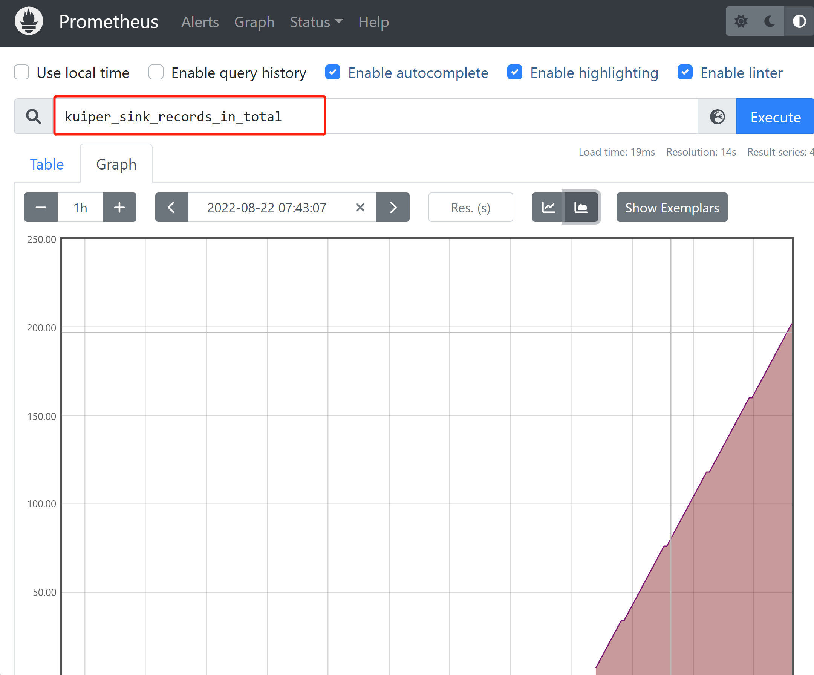

# Monitor rule status with Prometheus

Prometheus is an open source system monitoring and alerting toolkit hosted at CNCF, and has been adopted by many companies and organizations as a monitoring and alerting tool.

eKuiper's rules are continuously running streaming task. Rules are used to process unbounded streams of data, and under normal circumstances, rules are started and run continuously, producing operational status data. Until the rule is stopped manually or after an unrecoverable error. eKuiper provides a status API to get the running metrics of the rules. At the same time, eKuiper integrates with Prometheus, making it easy to monitor various status metrics through the latter. This tutorial is intended for users who are already familiar with eKuiper and will introduce rule status metrics and how to monitor specific indicators via Prometheus.

## Rule Status Metrics

Once a rule has been created and run successfully using eKuiper, the user can view the rule's operational status metrics via the CLI, REST API or the management console. For example, for an existing rule1, you can get the rule run metrics in JSON format via `curl -X GET "http://127.0.0.1:9081/rules/rule1/status"`.

```json
{
  "status": "running",
  "source_demo_0_records_in_total": 265,
  "source_demo_0_records_out_total": 265,
  "source_demo_0_process_latency_us": 0,
  "source_demo_0_buffer_length": 0,
  "source_demo_0_last_invocation": "2022-08-22T17:19:10.979128",
  "source_demo_0_exceptions_total": 0,
  "source_demo_0_last_exception": "",
  "source_demo_0_last_exception_time": 0,
  "op_2_project_0_records_in_total": 265,
  "op_2_project_0_records_out_total": 265,
  "op_2_project_0_process_latency_us": 0,
  "op_2_project_0_buffer_length": 0,
  "op_2_project_0_last_invocation": "2022-08-22T17:19:10.979128",
  "op_2_project_0_exceptions_total": 0,
  "op_2_project_0_last_exception": "",
  "op_2_project_0_last_exception_time": 0,
  "sink_mqtt_0_0_records_in_total": 265,
  "sink_mqtt_0_0_records_out_total": 265,
  "sink_mqtt_0_0_process_latency_us": 0,
  "sink_mqtt_0_0_buffer_length": 0,
  "sink_mqtt_0_0_last_invocation": "2022-08-22T17:19:10.979128",
  "sink_mqtt_0_0_exceptions_total": 0,
  "sink_mqtt_0_0_last_exception": "",
  "sink_mqtt_0_0_last_exception_time": 0
}
```

The rule status consists of two main parts, one is the status, which is used to indicate whether the rule is running properly or not, its value may be `running`, `stopped manually`, etc. The other part is the metrics for each operator of the rule. The operator of the rule is generated based on the SQL of the rule, which may be different for each rule. In this example, the rule SQL is the simplest `SELECT * FROM demo`, the action is MQTT, and the generated operators are [source_demo, op_project, sink_mqtt]. Each of these operators has the same kind of metrics, which together with the operator names form a single metric. For example, the metric for the number of records_in_total for the operator source_demo_0 is `source_demo_0_records_in_total`.

### Metric Types

The metrics are the same for each operator and are mainly the following:

- records_in_total: the total number of messages read in, indicating how many messages have been processed since the rule was started.
- records_out_total: total number of messages output, indicating the number of messages processed by the operator **correctly**.
- process_latency_us: latency of the most recent processing in microseconds. The value is instantaneous and gives an idea of the processing performance of the operator. The latency of the overall rule is generally determined by the operator with the largest latency.
- buffer_length: the length of the buffer. Since there is a difference in computation speed between operators, there is a buffer queue between each operator. A larger buffer length means the processing is slower and cannot catch up with the upstream processing speed.
- last_invocation: the time of the last run of the operator.
- exceptions_total: the total number of exceptions. Reconverable errors generated during the operation of the operator, such as broken connections, data format errors, etc., are counted as exceptions without stopping the rule.

After version 1.6.1, we added two more exception-related metrics to facilitate the debugging of exceptions.

- last_exception: the error message of the last exception.
- last_exception_time: the time of the last exception.

The numeric types of these metrics can all be monitored using Prometheus. In the next section we will describe how to configure the Prometheus service in eKuiper.

## Configuring the Prometheus Service in eKuiper

The Prometheus service comes with eKuiper, but is disabled by default. You can turn on the service by modifying the configuration in `etc/kuiper.yaml`. Where `prometheus` is a boolean value, change it to `true` to turn on the service; `prometheusPort` configures the port of the service.

```yaml
  prometheus: true
  prometheusPort: 20499
```

If you start eKuiper with Docker, you can also enable the service by configuring environment variables.

```shell
docker run -p 9081:9081 -d --name ekuiper MQTT_SOURCE__DEFAULT__SERVER="$MQTT_BROKER_ADDRESS" KUIPER__BASIC__PROMETHEUS=true lfedge/ekuiper :$tag
```

In the log of the startup, you can see information about the service startup, for example:

```text
time="2022-08-22 17:16:50" level=info msg="Serving prometheus metrics on port http://localhost:20499/metrics" file="server/prome_init.go:60 "
Serving prometheus metrics on port http://localhost:20499/metrics
```

Click on the address `http://localhost:20499/metrics` in the prompt to see the raw metrics information for eKuiper collected in Prometheus. Users can search the page for metrics like `kuiper_sink_records_in_total` after the eKuiper has rules running properly. Users can configure Prometheus to connect to eKuiper later for a richer presentation.

## Using Prometheus to monitor status

Above we have implemented the ability to export eKuiper status as Prometheus metrics, we can then configure Prometheus to access this part of the metrics and complete the monitoring.

### Installation and Configuration

Go to the [Prometheus website](https://prometheus.io/download/) to download the version for your platform and then unzip it.

Modify the configuration file so that it monitors eKuiper. open `prometheus.yml` and modify the scrape_configs section as follows.

```yaml
global:
scrape_interval: 15s
evaluation_interval: 15s

rule_files:
# - "first.rules"
# - "second.rules"

scrape_configs:
- job_name: ekuiper
  static_configs:
    - targets: ['localhost:20499']
```

This defines a monitoring job named `eKuiper`, targets pointing to the address of the service started in the previous section. After the configuration is done, start Prometheus.

```shell
. /prometheus --config.file=prometheus.yml
```

After successful startup, open `http://localhost:9090/` to access the management console.

### Simple monitoring

Monitor the number of messages received by the sink for all rules. You can enter the name of the metric to be monitored in the search box as shown in the figure, and click `Execute` to generate the monitoring table. Select `Graph` to switch to line graphs and other display methods.



Click `Add Panel` to monitor more metrics in the same way.

## Summary

This article introduced the rule metrics in eKuiper and how to use Prometheus to monitor these metrics. Users can further explore more advanced features of Prometheus based on this to improve eKuiper's operation and maintenance.
