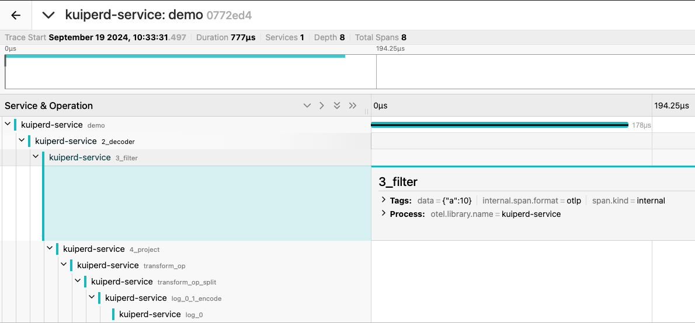
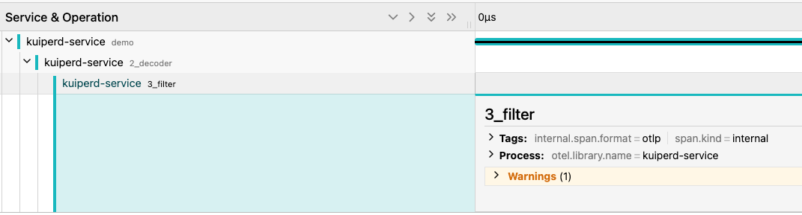

## Use Open Telemetry Tracing to track data

eKuiper's rule is a continuously running streaming computing task. Rules are used to process unbounded data flows. Under normal circumstances, rules will continue to run after they are started and continuously generate running status data. We can use open telemetry tracing to track the data changes of each piece of data in each operator.

## Open Telemetry Tracing configuration

You can expose Open Telemetry data to the remote Open Telemetry Collector through configuration. At the same time, eKuiper also supports built-in collection of Open Telemetry Trcing data. You can limit the maximum amount of saved data through the following configuration.

```yaml
openTelemetry:
  serviceName: kuiperd-service
  enableRemoteCollector: false
  remoteEndpoint: localhost:4318
  localTraceCapacity: 2048
```

## Enable rule-level tracing

You can turn on data link tracing for the corresponding rule by setting `enableRuleTracer` in the rule `options` to true. For specific settings, please see [Rules](../../guide/rules/overview.md#rules)

## Get the Trace ID of each piece of data

You can get the latest Trace ID corresponding to the rule through the Rest API.

[View the most recent Trace ID based on rule ID](../../api/restapi/trace.md#view-the-latest-trace-id-based-on-the-rule-id)

## View traced data flow changes based on Trace ID

If you configure an Open Telemetry Tracing collector, you can query the storage and query platform behind the Open Telemetry collector through the Trace ID. At the same time, you can also obtain detailed tracing data by accessing the local Rest API.

[View detailed tracing data based on Trace ID](../../api/restapi/trace.md#view-detailed-tracing-data-based-on-trace-id)

## Integrating Data Tracing with Open Telemetry Collector and Jaeger

eKuiper supports exposing Trace data to the Open Telemetry Collector, which in turn supports exposing Tracing data to Jaeger for visualization. We demonstrate this through the following example:

Launching Open Telemetry Collector and Jaeger Locally

### Start the Open Telemetry Collector and Jaeger using docker-compose

通过 docker-compose 启动 open telemetry collector 和 Jaeger

```shell
docker-compose up -d
```

```yaml
receivers:
  otlp:
    protocols:
      http:
        endpoint: 0.0.0.0:4318

exporters:
  otlp:
    endpoint: jaeger:4317
    tls:
      insecure: true

processors:
  batch:

service:
  pipelines:
    traces:
      receivers: [otlp]
      processors: [batch]
      exporters: [otlp]
```

```yaml
version: "3.8"

services:
  jaeger:
    image: jaegertracing/all-in-one:latest
    ports:
      - "16686:16686" # Jaeger UI
      - "14250:14250" # gRPC for Jaeger
      - "14268:14268" # HTTP for Jaeger
    networks:
      - otel-net

  otel-collector:
    image: otel/opentelemetry-collector-contrib:latest
    command: ["--config=/etc/otel-collector-config.yaml"]
    volumes:
      - ./collector.yaml:/etc/otel-collector-config.yaml
    ports:
      - "4318:4318" # OTLP HTTP receiver
    depends_on:
      - jaeger
    networks:
      - otel-net

networks:
  otel-net:
    driver: bridge
```

### 配置 eKuiper 开启将数据追踪发送到 Collector

```yaml
openTelemetry:
  serviceName: kuiperd-service
  enableRemoteCollector: true
  remoteEndpoint: localhost:4318
  localTraceCapacity: 2048
```

### Configuring eKuiper to Send Data Tracing to the Collector

Via REST API [Create Rules](../../api/restapi/rules.md#create-a-rule)

[Enable data tracing](../../api/restapi/trace.md#start-trace-the-data-of-specific-rule) for rules through REST API

### Access Jaeger to view Trace data

Visit localhost:16686 to view Trace data in Jaeger

## Debug rules through data tracing

In this example, we will debug the rules through data tracing to see how data is transferred among various operators in SQL.

### Create rules

First we create a rule that will filter the data based on column a

```json
{
  "id": "rule1",
  "sql": "select * from demo where a > 5",
  "actions": [
    {
      "log": {}
    }
  ]
}
```

### Send the data

Send two pieces of data, one of which will be filtered by the filter condition, and the other will not.

```json
{"a":10}
{"a":4}
```

### Get the TraceID list of rules through REST API

We can get the [TraceID list of rules](../../api/restapi/trace.md#view-the-latest-trace-id-based-on-the-rule-id) through the Rest API

### View the corresponding data trace in Jaeger through TraceID

For the data {"a":10}, you can view the transmission of this data in various operators in Jaeger:



Since column a meets the filtering conditions of SQL, the data is not filtered and is eventually output.

For the data {"a":4}, you can view the transmission of this data in various operators in Jaeger:



Since column a does not meet the filtering conditions of SQL, the data is filtered and is not output.
