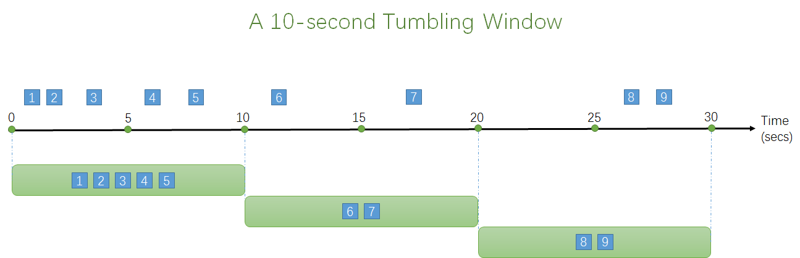
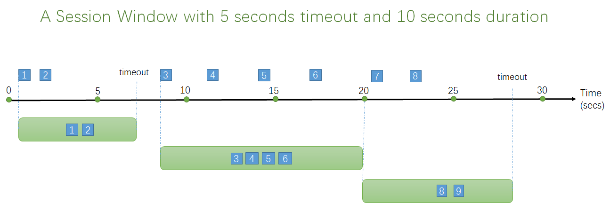
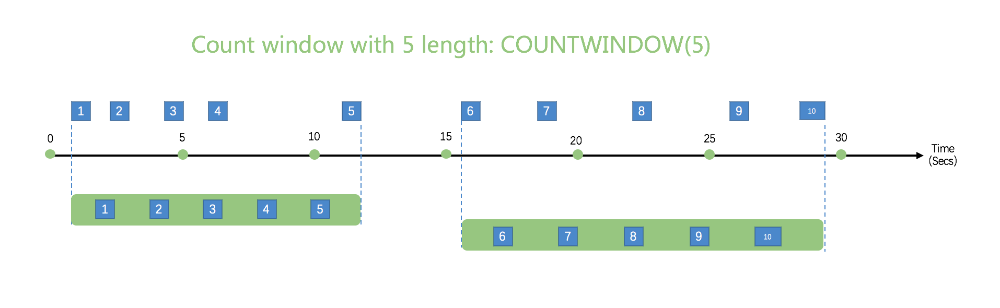
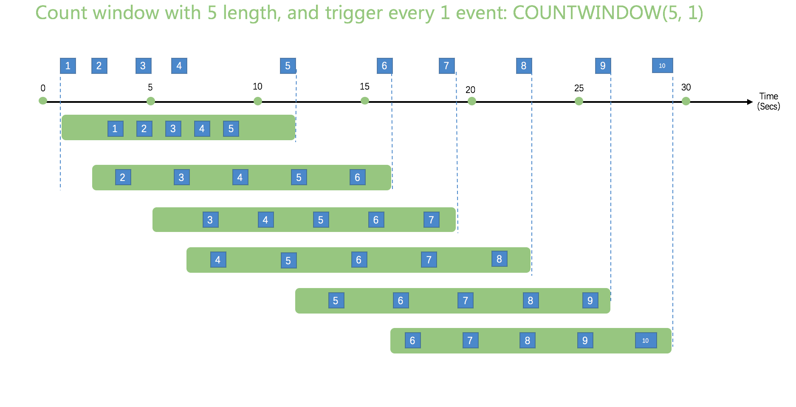

# Windows

In time-streaming scenarios, performing operations on the data contained in temporal windows is a common pattern. Kuiper has native support for windowing functions, enabling you to author complex stream processing jobs with minimal effort.

There are five kinds of windows to use: [Tumbling window](#TUMBLING WINDOW), [Hopping window](#Hopping window), [Sliding window](#Sliding window), [Session window](#Session window) and [Count Window](#Count window). You use the window functions in the GROUP BY clause of the query syntax in your Kuiper queries. 

All the windowing operations output results at the end of the window. The output of the window will be single event based on the aggregate function used. 

## Time-units

There are 5 time-units can be used in the windows. For example, ``TUMBLINGWINDOW(ss, 10)``, which means group the data with tumbling with with 10  seconds interval.

**DD**: day unit

**HH**: hour unit

**MI**: minute unit

**SS**: second unit

**MS**: milli-second unit

## Tumbling window

Tumbling window functions are used to segment a data stream into distinct time segments and perform a function against them, such as the example below. The key differentiators of a Tumbling window are that they repeat, do not overlap, and an event cannot belong to more than one tumbling window.



```sql
SELECT count(*) FROM demo GROUP BY ID, TUMBLINGWINDOW(ss, 10);
```

## Hopping window

Hopping window functions hop forward in time by a fixed period. It may be easy to think of them as Tumbling windows that can overlap, so events can belong to more than one Hopping window result set. To make a Hopping window the same as a Tumbling window, specify the hop size to be the same as the window size.


```sql
SELECT count(*) FROM demo GROUP BY ID, HOPPINGWINDOW(ss, 10, 5);
```


## Sliding window

Sliding window functions, unlike Tumbling or Hopping windows, produce an output **ONLY** when an event occurs. Every window will have at least one event and the window continuously moves forward by an € (epsilon). Like hopping windows, events can belong to more than one sliding window.


```sql
SELECT count(*) FROM demo GROUP BY ID, SLIDINGWINDOW(mm, 1);
```


## Session window

Session window functions group events that arrive at similar times, filtering out periods of time where there is no data. It has two main parameters: timeout and maximum duration.




```sql
SELECT count(*) FROM demo GROUP BY ID, SESSIONWINDOW(mm, 2, 1);
```


A session window begins when the first event occurs. If another event occurs within the specified timeout from the last ingested event, then the window extends to include the new event. Otherwise if no events occur within the timeout, then the window is closed at the timeout.

If events keep occurring within the specified timeout, the session window will keep extending until maximum duration is reached. The maximum duration checking intervals are set to be the same size as the specified max duration. For example, if the max duration is 10, then the checks on if the window exceed maximum duration will happen at t = 0, 10, 20, 30, etc.

## Count window

Please notice that the count window does not concern time, it only concern about events count.

### Tumbling count window

Tumbling count window is similar to general tumbling window, events in a tumbling window can not repeat, do not overlap, and an event cannot belong to more than one tumbling window. Below is a count window with 5 events length. 



```sql
SELECT * FROM demo WHERE temperature > 20 GROUP BY COUNTWINDOW(5)
```

The SQL will group events with 5 count window, and only get the `temperature` that is great than 20. 

### Other count windows

`COUNTWINDOW(count, interval)`,  this kind of count window is triggered by the 2nd parameter of COUNTWINDOW, which defines the event number that triggers count window.

- If the 2nd parameter value is 1, then it will be triggered with every event happen.
- Value of the 2nd parameter should not be larger than the value of the 1st parameter.

Below is picture for describing `COUNTWINDOW(5,1)`, the window size is 5, and window is triggered with every event.



Sample in below is a count window that with 5 length, and triggered with every 2 events. The output will be latest of 5 events that are received.

1. When event `2` is received, currently totally has 2 events, which is less than window size `5`,  so will not trigger window.
2. When event `4` is received, currently totally has 4 events, which is less than window size `5`,  so will not trigger window.
3. When event `6` is received, currently totally has 6 events, which is great than window size `5`,  it produces a window that include latest 5 events. Because the window size is 5, so the 1st event is ignored in the window.
4. Rests of windows are generated with the same approach as previous.


```sql
SELECT * FROM demo WHERE temperature > 20 GROUP BY COUNTWINDOW(5,1) HAVING COUNT(*) > 2
```

The SQL has following conditions,

- It's a count window with 5 length, and triggered every event.
- It only get events with temperature that is great than 20.
- Finally it has a condition that message count should be larger than 2. If `HAVING` condition is `COUNT(*)  = 5`, then it means all of values in the window should satisfy `WHERE` condition.

## Timestamp Management

Every event has a timestamp associated with it. The timestamp will be used to calculate the window. By default, a timestamp will be added when an event feed into the source which is called `processing time`. We also support to specify a field as the timestamp, which is called `event time`. The timestamp field is specified in the stream definition. In the below definition, the field `ts` is specified as the timestamp field.

``
CREATE STREAM demo (
					color STRING,
					size BIGINT,
					ts BIGINT
				) WITH (DATASOURCE="demo", FORMAT="json", KEY="ts", TIMESTAMP="ts"
``

In event time mode, the watermark algorithm is used to calculate a window.

## Runtime error in window
If the window receive an error (for example, the data type does not comply to the stream definition) from upstream, the error event will be forwarded immediately to the sink. The current window calculation will ignore the error event.