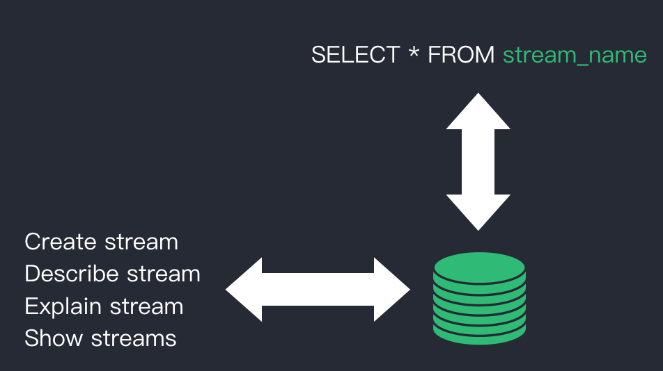

## Stream specs 


### Data types

Refer to [Azure IoT](https://docs.microsoft.com/en-us/stream-analytics-query/data-types-azure-stream-analytics), boolean type is cast to int.

| #    | Data type | Description                                                  |
| ---- | --------- | ------------------------------------------------------------ |
| 1    | bigint    |                                                              |
| 2    | float     |                                                              |
| 3    | string    |                                                              |
| 4    | datetime  | Need to specify the date format?? Such as "yyyy-MM-dd"       |
| 5    | boolean   |                                                              |
| 6    | array     | The array type, can be any types from simple data or struct type (#1 - #5, and #7). |
| 7    | struct    | The complex type.                                            |


### Language definitions

#### CREATE STREAM

```sql
CREATE STREAM   
    stream_name   
    ( column_name <data_type> [ ,...n ] )
    WITH ( property_name = expression [, ...] );
```

**The supported property names.**

| Property name | Optional | Description                                                  |
| ------------- | -------- | ------------------------------------------------------------ |
| DATASOURCE | false    | The topic names list if it's a MQTT data source. |
| FORMAT        | false    | json or Avro.<br />Currently, we just support the JSON type ? |
| KEY           | true     | It will be used in future for GROUP BY statements ??         |
| TYPE     | false    | Is it requried in future if more & more sources are supported? By default, it would be MQTT type. |
| StrictValidation     | false    | To control validation behavior of message field against stream schema. |
| KEY_CONF | false | If additional configuration items are requied to be configured, then specify the config key here.<br />Kuiper currently propose yaml file format. |

**Introduction for StrictValidation**

``` 
The value of StrictValidation can be true or false.
1) True: Drop the message if the message  is not satisfy with the stream definition.
2) False: Keep the message, but fill the missing field with default empty value.

bigint: 0
float: 0.0
string: ""
datetime: ??
boolean: false
array: zero length array
struct: null value
```

Example 1,

```sql
CREATE STREAM demo (
		USERID BIGINT,
		FIRST_NAME STRING,
		LAST_NAME STRING,
		NICKNAMES ARRAY(STRING),
		Gender BOOLEAN,
		ADDRESS STRUCT(STREET_NAME STRING, NUMBER BIGINT),
	) WITH (datasource="topics:test/, demo/test", FORMAT="AVRO", KEY="USERID", KEY_CONF="democonf");
```


Example 2,

```sql
CREATE STREAM my_stream   
    (id int, name string, score float)
    WITH ( datasource = "topic/temperature", FORMAT = "json", KEY = "id");
```


The configuration of MQTT source is specified with yaml format, and the configuration file location is at ``$kuiper/etc/mqtt_source.yaml``.  Below is the file format.

```yaml
#Global MQTT configurations
QoS: 1
Share-subscription: true
Servers:
  - 
     tcp://127.0.0.1:1883
#TODO: Other global configurations


#Override the global configurations
demo: #Conf_key
  QoS: 0
  Servers:
    - 
      tls://10.211.55.6:1883


```

#### DROP STREAM

DROP the stream.

```
DROP STREAM my_stream
```

#### DESCRIBE STREAM

Print the stream definition.

```
DESC STREAM my_stream

Fields
-----------
id     int
name   string
score  float

SOURCE: topic/temperature
Format: json
Key: id
```

#### EXPLAIN STREAM

Print the detailed runtime infomation of the stream.

```
EXPLAIN STREAM my_stream
```

#### SHOW STREAMS

Print all defined streams in system.

```
SHOW STREAMS

my_stream, iot_stream
```


### A simple CLI

A simple command line tool is implemented in ``stream/cli/main.go``. 

#### Run sql to manage streams

Run `cli stream` command, after `kuiper >` prompt shown, enter stream related sql statements such as create, drop, describe, explain and show stream statements to execute.

```bash
cli stream
kuiper > CREATE STREAM sname (count bigint) WITH (source="users", FORMAT="AVRO", KEY="USERID")
kuiper > DESCRIBE STREAM sname
...
```


#### Run query

```bash
cli query
kuiper > select USERID from demo;
...
```


### Implementation

##### How to save the stream definitions?

Refer to below, a storage is required for saving the stream definitions.



