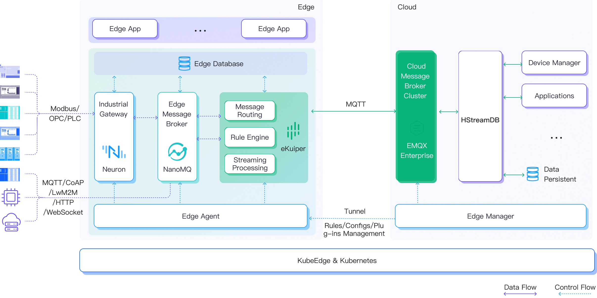
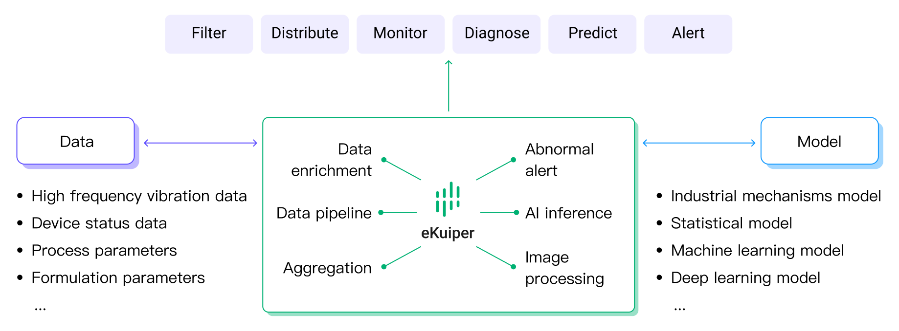

# eKuiper in IIoT (Industrial Internet of Things)

In the new wave of global industrial transformation, intelligent manufacturing is facing huge development opportunities. Thanks to cloud computing, big data and artificial intelligence technologies, industrial transformation and upgrading have entered a new stage, and people gradually realize the great value brought by new business models driven by data. The combination and collision of data and algorithmic models provide powerful data support and new engine kinetic energy for the resolution of uncertainty, insight discovery and enterprise decision-making of complex systems.

As a light-weight stream processing engine, eKuiper can be deployed on the edge side near the data source to do real-time analysis and smart decisions.

## Cloud Edge Collaborative Industrial Internet Solution

EMQ Cloud Edge Collaboration Industrial Internet Solution, through cloud-native technology and cloud edge collaboration architecture, realizes the connection, movement, processing, storage and analysis of massive industrial equipment data. The solution mainly includes the following software.

| Software                         | Name                                                                        |
|----------------------------------|-----------------------------------------------------------------------------|
| Edge Data Collection Software    | [Neuron](https://neugates.io/) - Industrial Protocol Gateway Software       |
| Edge MQTT Broker                 | [NanoMQ](https://nanomq.io/) - Ultra-lightweight Edge MQTT Messaging Server |
| Edge Computing Software          | eKuiper - Lightweight IoT edge data streaming analytics engine              |
| Edge Service Management Platform | EMQX Antares - Cloud Native Edge Service Management Platform                |

Among these, eKuiper acts in the middle of edge and cloud. It can digest the data collected, processed and routing the result.

## Edge Computing Scenarios

By analyzing the collected data in real time, eKuiper can apply on common industrial scenarios such as energy consumption monitoring, predictive maintenance, and product quality traceability. Typical scenarios include:

- Real-Time analysis of factory production data for efficient control of product quality
- Device twin: Data clean, transformation and compression
- Abnormal sensing, alarm and handling
- Production process optimization augmented by AI

Let's take the last scenario as an example.

### Production Process Optimization

Whether it is a process industry or a discrete industry, the optimization and stable control of production processes are the prerequisites for enterprises to reduce operating costs, improve production efficiency and build core competitiveness. In the context of intelligent transformation in the era of Industry 4.0, making full use of the value of massive data to achieve process optimization and on-site stability control is a proposition that enterprises continue to think about and explore, and it is also a common demand.

For example, in the steel industry, the heating furnace is important equipment in the steel rolling process. Through real-time collection of heating furnace data, combined with advanced control optimization algorithms, the furnace temperature can be guaranteed to be stable and the quality of billets can be improved on the basis of saving gas costs.

In the chemical industry, enterprises are mainly concerned about the change of raw material properties and production load adjustment. Currently, most of the testing methods are manual regular sampling and offline delivery, which are generally time-consuming and multi-step, making it difficult to achieve effective feedback and optimal control of production. Using real-time data modeling analysis, we can achieve accurate grasp of the reaction process, real-time intervention, and reduce the waste of raw materials caused by untimely intervention.

In the smart factory scenario, through real-time data collection of machine data, combined with the MES system historical data analysis and verification, the machine parameter values can be revised and iterated in real time, which can ensure less manual intervention and more stable product quality in the production process of the machine.

In the field of industrial energy saving and consumption reduction, through the collection of the whole process of energy data, combined with the kinetic energy equipment, production automation system and MES system, forming intelligent linkage between systems, based on the production plan, it can realize the fine prediction of energy demand and improve the level of energy consumption management of enterprises.

#### Integrate Data from Multiple Sources

eKuiper can provide flexible data interfacing capability for industrial sites, realize data pulling and integration of factory MES, ERP, database and various third-party applications, clean and process data through flow computing capability, and realize the interaction and collaboration between human-machine, material-law-loop in industrial sites with the ability of flow table combination. Neuron, an industrial protocol gateway software, integrates PLC, non-standard automation equipment, SCADA and various instruments in the factory for real-time data collection via edge message bus. At the same time, Neuron enables reverse control of plant equipment via MQTT and Restful API, and in combination with control optimization algorithms, enables low-latency data processing and analysis and production process optimization.

Through Neuron+eKuiper's efficient collection of multi-dimensional data, real-time data from machines and equipment in the factory, business data related to production and operation, product design and process data, and data from various production management software in the factory can be aggregated and analyzed to achieve production process optimization, reduce production loss, and improve production output.

#### Edge-side AI Model Integration for Real-time Inference Decision

eKuiper can make full use of multi-dimensional data from industrial sites, absorb and precipitate manual experience, combine industrial mechanics knowledge and data statistics methods, use machine learning and deep learning algorithms to establish optimization models of equipment production processes, optimize and control production processes, make equipment operation more reliable and stable, and improve enterprise economic efficiency.

eKuiper supports calling Python scientific computing, machine learning and deep learning algorithm libraries and C/C++ algorithm models transferred from Matlab, and realizes real-time AI inference calculation at the edge by combining real-time data streams, and sends the inference results to the automation equipment side in real time through Neuron to realize real-time optimization and continuous optimization of the production process.

## Summary

The deep integration of new-generation information technology and manufacturing industry, through the comprehensive interconnection of people, machines and things, and the construction of a new industrial production, manufacturing and service system that fully connects the whole element, the whole industrial chain and the whole value chain are the core and key to support the fourth industrial revolution.

EMQ Cloud Edge Collaborative Industrial Internet Solution, which connects artificial intelligence and cloud computing technology to traditional industrial production, helps enterprises realize the collaboration of data flow, production flow and control flow, improve production efficiency, reduce production costs, and help factories realize digitalization, real-time and intelligent transformation.
