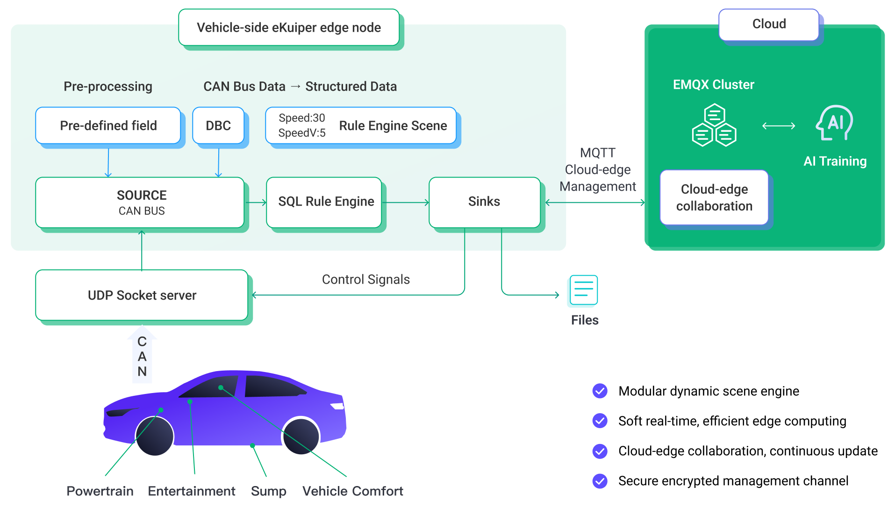
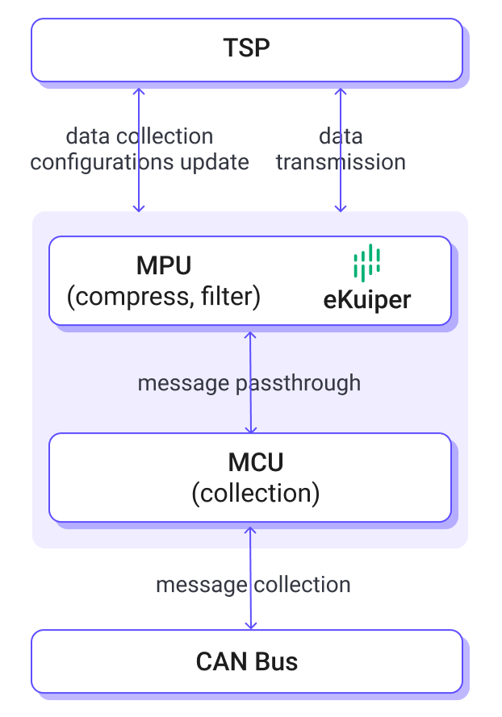
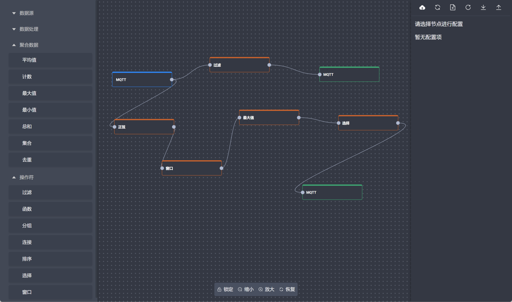
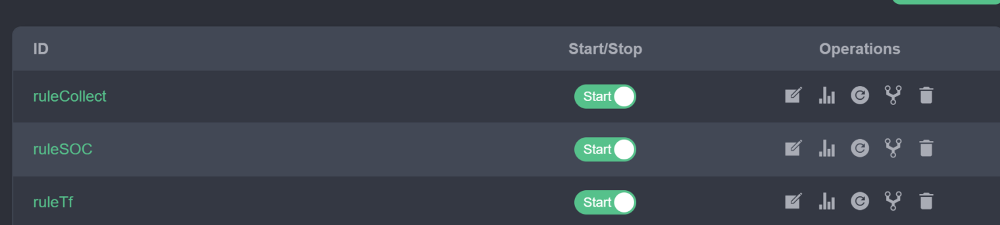

# eKuiper in IoV (Internet of Vehicles)

With the integration of Internet of Vehicles and 5G technology and the development of vehicle intelligence, the demand for data acquisition of Internet of Vehicles is growing explosively.

## Architecture

Based on a large number of IoV user cases and experiences, EMQ has introduced a Vehicle-Cloud System Solution based on eKuiper and QUIC protocols that realized easy-to-deploy and portable flexible data collection for Internet of Vehicles. Whereas, eKuiper is the core service in the vehicle side. The solution architecture is shown in the figure below.



As a light-weight stream processing engine, eKuiper has a 10 MB level footprint and 20 MB memory requirement for data collection. Thus, eKuiper is suitable to deploy to the edge side of a vehicle, such as TBOX, MPU and infotainment system.

In this solution, we use eKuiper, the stream processing at the IoT Edge to implement flexible data collect on in-vehicle terminals; and adopt [EMQX](https://www.emqx.com/en), the large-scale distributed IoT MQTT broker to realize the connection, movement and processing of the collected data as well as the control command interaction of the integrated vehicle-cloud.

## Scenarios

The most mature usage is to achieve flexible data collection, we will learn about this scenario in detail latter. The other scenarios include:

1. Vehicle side real-time and flexible (hot deploy) rule engine, which can automatically trigger actions when meet some conditions
   Typical scenario: When speed is higher than 70, close all windows.
2. Agile smart analytic. Without cloud connection, locally eKuiper can help automatically wire data and AI model (currently TF Lite) without coding. Also feed data to training model on the vehicle.
   Typical scenario: Predict and suggest drive mode by real-time data like speed, tire pressures locally (even without network connection).
3. Edge computing to reduce transfer bandwidth and reduce cloud side computing pressure. Parse, reformat and transform the data. Such as calculate the average speed for a time window to save
4. Heterogeneous data aggregation. Parse data from various protocol (TCP,UDP,HTTP,MQTT) and various format (CAN, JSON, CSV etc.) and merge them by flexible rules.
5. Message routing: decide which data to send to the cloud and which to save locally to be leveraged by other vehicle side app. For example, based on GDPR or some whitelist to determine the routing

Among these, data collection is the core of all the applications. Once data collected, eKuiper can leverage it locally inside the vehicle or transfer it to the cloud.

## Flexible Data Collection

### Why we need flexible data collection

Existing data collection solutions often collect vehicle data through the acquisition function in the firmware of T-BOX or through a self-developed acquisition program. Usually, the vehicle information collected by the acquisition program is fixed and directly solidified on the vehicle terminal. Before the era of intelligent Internet of Vehicles, this approach was feasible when the collected data types were small, and the pressure of whole collection was not too high.

With the development of Internet of Vehicles technology, the composition of the vehicle network is becoming more and more complex, and the vehicle information that can be collected is diversified. The full amount of collected data is too large and wastes valuable bandwidth resources. Therefore, it is necessary to collect according to the needs of TSP application. In addition, different vehicle models usually have different data, for example, the CAN bus data will have different DBC files on different vehicle models. Fixed acquisition program cannot be ported and must be rewritten and OTA upgraded for the acquisition program.

In general, fixed acquisition process has the following problems:

- The collected data is fixed, and the collected items cannot be changed flexibly. In fact, with the development of Internet of Vehicles, the data acquisition items will present more changes according to the application. Thus, the fixed collection method cannot meet the real needs that change frequently.

- The acquisition information schema configuration is fixed and cannot adapt to the new vehicle models or bus data changes. For example, an acquisition program that acquires CAN bus data cannot change the DBC file to match changes in bus data.

- Scaling is not easy, and new sensors or bus protocols need to be redeveloped.

Therefore, there is an urgent need for the industry to have a flexible data acquisition solution that supports weak network situations.

Note: The DBC (Data Base CAN) file was published by Victor, a German company. It is used to describe the information of each logical node in a single CAN network. Based on this file, a solution can be developed to monitor and analyze the running status of all logical nodes in a CAN network.

### How to achieve flexible data collection

To address the shortcomings of the fixed data collection process, we need a flexible data acquisition engine with the following capabilities:

- Flexible data collection point configuration and rules; hot update and hot start/stop data acquisition rules.

- Capabilities of integrating multiple data sources, such as CAN bus, HTTP signals, etc.

- The ability to flexibly configure data source parsing or decoding. The CAN bus, for example, should support flexible loading and updating of DBC files.

- Ability to distribute collected data flexibly. Rules can be created according to business. Part of the data can be saved locally, and part of the data can be transmitted back to the cloud.

- The ability to efficiently transmit back collected data under weak network conditions.

- Lightweight and efficient enough so that it can run on a wide range of vehicles, including those with limited vehicle-device resources.

In flexible scenarios, assuming eKuiper has been deployed to the vehicle-device, there are typically only two steps required to complete a task of data acquisition.

1. Access to the data stream
2. Create collection rules

In eKuiper, these two steps do not require writing code and can be configured using SQL statements or the visual Flow editor.

### Data Stream Access

CAN (Controller Area Network) is the most common bus network of Internet of Vehicles. In this article, we take CAN data access and parsing as an example to introduce how eKuiper implements in-vehicle data stream access.

The CAN data source is provided in eKuiper, where two main capabilities are implemented:

1. Protocol connection
2. Decoding CAN message according to DBC

### Connection protocol support

If eKuiper can be connected directly to CAN bus through [SocketCAN](https://docs.kernel.org/networking/can.html) protocol. For security reasons, eKuiper is also often deployed on hardware that is isolated from the bus. For example, eKuiper is deployed in MPU, while CAN bus connected to application is deployed in MCU and pass messages through TCP, UDP or MQTT protocols, etc. eKuiper also supports connections via these protocols to obtain bus data messages.



### Flexible CAN message decoding

The messages we receive from the bus are binary encoded data, which is difficult to read. CAN DBC is a text file, which is used as a description file for CAN message. By reading the description information of DBC, we can parse the data of CAN message into readable and processable information. For example, a piece of data 0x0500000000000000 with CAN ID 0x208 may be parsed into a series of signals, which can be represented as key-value pairs or JSON strings `{"temperature":10, "voltage": 100}` , etc. according to the description information of DBC.

eKuiper's CAN data source can parse data into readable key-value pairs, so that when writing data acquisition rules, readable signals can be selected directly, greatly simplifying the writing of acquisition logic. CAN message parsing feature is extremely flexible, allowing DBC file to be dynamically updated to adapt to different vehicle models or in-vehicle bus data to be upgraded without coding.

The flexibility of CAN message parsing is mainly reflected in the following aspects:

- DBC files are configurable and can be hot updated
- Support multiple DBC files
- Support CAN FD format
- Support whitelist and container ID mapping

Based on the flexible message decoding support, when the bus data structure is changed or the vehicle model is changed, only the DBC file needs to be updated for adaptation.

In eKuiper, a stream is an entity used to define the data access. We can use the following SQL statement to define a data stream that accesses the CAN bus.

```sql
CREATE STREAM canDemo () WITH ( Type="can", CONF_KEY="test", SHARED="TRUE")
```

This statement defines a stream named canDemo with type can, i.e., the type of data source to access the CAN bus. CONF_KEY indicates that the access configuration is defined in a configuration named test , where the address of the DBC file used, etc. can be configured. If SHARED is set to true, it means all rules using the data stream share a single copy of the data, ensuring that the decoding will only be done only once.

This stream will be connected to parse CAN bus data and get JSON data stream. Next, the application developer can create multiple rules on it and define how to capture the data.

#### Custom Extensions

As the improvement of automobile intelligence, the number and variety of in-vehicle sensors and data buses are increasing. eKuiper provides an extension mechanism that allows users to write plug-ins to enable access and parsing of new or private protocols. The installed plug-ins follow the usage logic, and application developers can create data streams in the same way as using the original data stream types.

### Flexible configuration of collection rules

In the previous section, we have created a data stream connected to the CAN bus. Next, we can create multiple data acquisition rules for flexible data acquisition. This section introduces some common acquisition rules. The content of the rules is JSON text data. The dynamic downward distribution and management of rules can be done through REST APIs, etc. The specific management methods will be described in the next section.

The eKuiper rules are divided into two parts. The SQL is used to write the business logic, such as what data to collect and what to do with the data. The Actions part is used to describe the actions to be performed when the rule hits, such as storing it in a local file or sending it to a topic in MQTT in the cloud. Suppose that in the data stream canDemo created in the previous section, the data in the bus is parsed to contain key-value pairs of engine related data, such as `{"rpm":2000, "inletTemperature":230, "inletPressure":27, "voltage":15,"currency":2}`. The engine related data can be engine speed (rpm), inletTemperature, inletPressure, and battery-related data such as battery voltage, battery current, etc. The following rules are configured to capture this bus data.

1. **Collection of the specified signal**. This rule can collect engine signals in real time and send them to MQTT topic collect . The rule defines the data points to be collected by the SELECT clause in the SQL statement.

    ```json
    {
        "id": "ruleCollect",
        "sql": "SELECT rpm, inletTemperature, inletPressure FROM canDemo",
        "actions": [{
          "mqtt": {
            "server": "tcp://yourserver:1883",
            "topic": "collect"
          }
        }]
    }
    ```

2. **Collection of signals with changes**. Some signals may have a long variation period. If all the signals are collected, most of them are repeated values, occupying storage and bandwidth. eKuiper provides a built-in variation capture function CHANGED_COLS, which can capture only the variation of signal values. In the following rule example, we capture the change information of the battery and save it in a local file.

    ```json
    {
      "id": "ruleChangeCollect",
      "sql": "SELECT CHANGED_COLS(\"\", true, voltage, currency) FROM canDemo",
      "actions": [{
        "file": {
        "path": "/tmp/cell"
        }
      }]
    }
    ```

3. **Collection based on events**.Some signals need to be collected only under certain circumstances, such as collecting relevant data after a collision. eKuiper has the flexibility to set the conditions for collection. In the following rule, all data is collected in the Topic exception of MQTT in case of abnormal battery voltage (not between 10 and 20).

    ```json
    {
        "id": "ruleExpCollect",
        "sql": "SELECT * FROM canDemo WHERE voltage NOT BETWEEN 10 AND 20 ",
        "actions": [{
          "mqtt": {
              "server": "tcp://yourserver:1883",
              "topic": "exception"
          }
        }]
    }
    ```

### Integrated vehicle-cloud rules management

After the rules are conceived, they need to be dynamically distributed downward and managed. EMQ provides a rules management console for the integrated vehicle-cloud. Users can write, distribute, and manage the status of the rules in the console. The management console can centrally manage multiple vehicle-edge nodes in the cloud.

#### Rules writing

A graphical interface for rules writing is provided on the management console. As shown in the figure below, the user can fill in the ID, SQL, and action of the rules on the interface. After submission, the rules can be sent to the corresponding vehicle-device node.



We will also provide a visual Flow editor interface for rules writing. Users can write their own business rules by dragging and dropping.

#### Rules Management

Rules in eKuiper can be managed flexibly. Rules can be hot added, hot updated, hot started, and stopped. In the management console, users can view the running status of the rules and perform operations such as rule modification, start/stop, and deletion.



#### Centralized management in the cloud

Data analytics applications on the edge of the vehicle can be centrally managed through the cloud.

- Massive online vehicle support: EMQX Enterprise supports connections of millions of online vehicles.
- Vehicle online automatic update application: Support offline vehicle application update and upgrade; after the vehicle is online, application will be automatically updated, and the status will be reported
- Vehicle offline status query support: The last state of application deployment can be obtained after vehicle offline
- HTTP Rest API service interface support: synchronize HTTP interface, access to front-end applications (web & mobile)

## More to explore

As a general-purpose streaming computing engine, eKuiper can implement many edge-computing functions in addition to data acquisition, making full use of in-vehicle terminal computing power. For example, eKuiper can support the following functions:

- Data transformation and formatting, such as converting the transmitted signal from integer back to floating point, or formatting the signal to the format required by the target system.
- Data analysis, such as calculating averages over a period of time and other statistical values.
- SOA service calls for scene linkage, such as automatically switching on and off the air conditioner based on in-vehicle temperature.
- AI/ML algorithm integration, such as identifying user's charging intention based on collected signals.

Readers are welcome to explore more features on their own.

## Summary

With the rapid development of hardware and software technology of Internet of Vehicles, traditional fixed data collection solution is difficult to cope with the endless collection demands. The eKuiper and EMQX-based vehicle-cloud system solution can realize flexible data collection needs from end to end. eKuiper adopts text-based business processing and application distribution, thus avoiding complex OTA upgrades, and helping enterprises in Internet of Vehicles field realize flexible data acquisition and efficient vehicle-cloud data collaboration.
