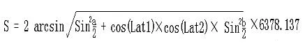
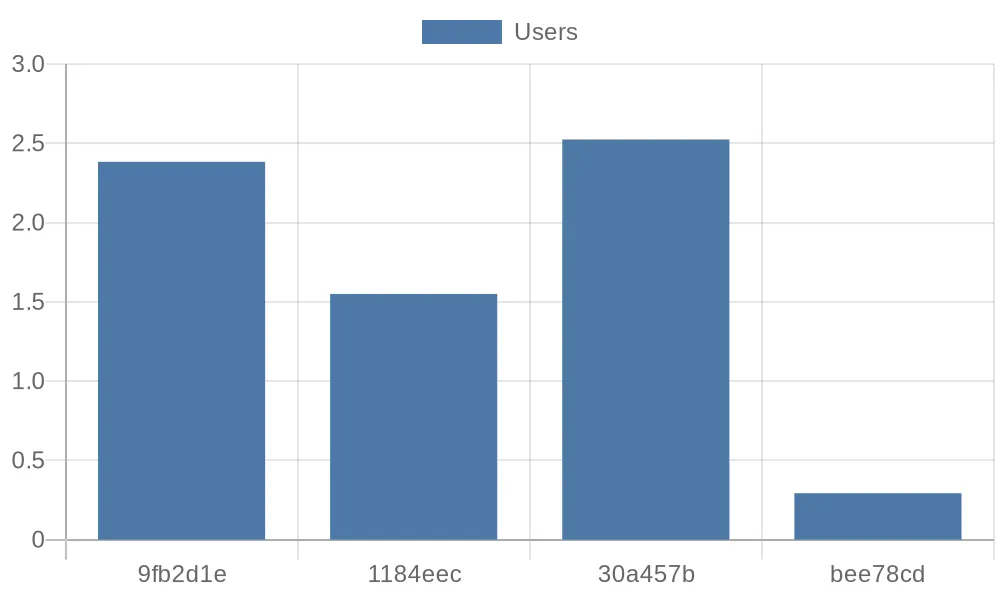

# eKuiper in Public Data Analysis

In the era of big data, there are many publicly available data sharing
platforms where valuable information can be extracted through various
processing methods. However, handling and analyzing public data typically
require programming skills, which can be a learning barrier for non-technical
users. This article uses eKuiper as an example to demonstrate how to process
public data using basic SQL statements.

## Scenario Introduction

This tutorial demonstrates how to use eKuiper to process the daily order table data of
a bike-sharing company from the Shenzhen Open Data Platform. The operating steps are:

- Subscribing to the API of the open data platform using the [HTTP Pull Source](../guide/sources/builtin/http_pull.md)
- Creating streams and rules using eKuiper's REST API interface
- Processing data using built-in SQL functions and rule pipelines
- Visualizing the processed data by storing it and using an external API

## Data Acquisition

eKuiper supports real-time data processing with millisecond-level of precision.
In this tutorial, we will use the data from [the daily order table of the Shenzhen Open Data Platform's
bike-sharing company](https://opendata.sz.gov.cn/data/api/toApiDetails/29200_00403627) as an example to demonstrate how to fetch the corresponding API
data using eKuiper for further processing.

> If you want to analyze real-time updating APIs, you can reduce the interval of the HTTP Pull Source.

The URL and parameters of the data interface are as follows:

```text
http://opendata.sz.gov.cn/api/29200_00403627/1/service.xhtml?page=1&rows=100&appKey=
```

Now let's try to use the HTTP Pull Source of eKuiper to fetch the first 100 records of message data
from the data platform's HTTP server and input it into the eKuiper processing pipeline.

The configuration file for the HTTP Pull Source is located at `etc/sources/httppull.yaml`, and we need
to configure the corresponding fields to enable eKuiper to fetch the data correctly.
Here is the content of the configuration file:

```yaml
default:
  url: "https://opendata.sz.gov.cn/api/29200_00403627/1/service.xhtml?page=1&rows=2&appKey=<token>"
  method: get
  interval: 3600000
  timeout: 5000
  incremental: false
  body: ""
  bodyType: json
  insecureSkipVerify: true
  headers:
    Accept: application/json
  responseType: code
```

After that, we need to use a REST client to create the corresponding STREAM as the source input:

```http request
###
POST http://{{host}}/streams
Content-Type: application/json

{
  "sql": "CREATE STREAM pubdata(data array(struct(START_TIME string, START_LAT string, END_TIME string, END_LNG string, USER_ID string, START_LNG string, END_LAT string, COM_ID string))) WITH (TYPE=\"httppull\")"
}
```

## Data Processing

By observing the data returned from the API, we can see that all the data we need is in the array field called `data`:

```json
{
  "total": 223838214,
  "data": [
    {
      "START_TIME": "2021-01-30 13:19:32",
      "START_LAT": "22.6364092900",
      "END_TIME": "2021-01-30 13:23:18",
      "END_LNG": "114.0155348300",
      "USER_ID": "9fb2d1ec6142ace4d7405b**********",
      "START_LNG": "114.0133088800",
      "END_LAT": "22.6320290800",
      "COM_ID": "0755**"
    }
  ]
}
```

If we want to perform calculations and processing using `SELECT` for each data record, we need to use [`UNNEST`](../sqls/functions/multi_row_functions.md#unnest) to return the data from the array as multiple rows.

```http request
###
POST http://{{host}}/rules
Content-Type: application/json

{
  "id": "demo_rule_1",
  "sql": "SELECT unnest(data) FROM pubdata",
  "actions": [{
    "log": {
    }
  }]
}
```

### Create Rule Pipelines

We can employ the [Memory Source](../guide/sources/builtin/memory.md) to integrate the results of a prior rule into succeeding rules, thereby establishing a rule pipeline for systematically handling data generated by the preceding rule.

In the first step, we just need to add a new memory target/source to the `actions` field of the `demo_rule_1`:

```json
{
  "id": "demo_rule_1",
  "sql": "SELECT unnest(data) FROM pubdata",
  "actions": [
    {
      "log": {},
      "memory": {
        "topic": "channel/data"
      }
    }
  ]
}
```

Then, using the API, we create a new STREAM based on the memory source described above:

```http request
###
POST http://{{host}}/streams
Content-Type: application/json

{"sql" : "create stream pubdata2 () WITH (DATASOURCE=\"channel/data\", FORMAT=\"JSON\", TYPE=\"memory\")"}
```

After that, we can create new rules to process the source data:

```http request
###
POST http://{{host}}/rules/
Content-Type: application/json

{
  "id": "demo_rule_2",
  "sql": "SELECT * FROM pubdata2",
  "actions": [{
    "log": {
    }
  }]
}
```

### Calculate Travel Distance with SQL

eKuiper provides a rich set of built-in SQL functions that can meet most calculation
requirements in various scenarios, even without using extended plugins.

Since we already have the starting and ending coordinates of the bikes in our data,
we can calculate the average speed of the bikes by applying the distance formula based on latitude and longitude:



The explanation of the formula is as follows:

1. Lng1 Lat1 represents the longitude and latitude of point A, and Lng2 Lat2 represents the longitude and latitude of point B.
2. `a = Lat1 – Lat2` is the difference between the latitudes of the two points, and `b = Lng1 -Lng2` is the difference between the longitudes of the two points.
3. 6378.137 is the radius of the Earth in kilometers.
4. The calculated result is in kilometers. If the radius is changed to meters, the result will be in meters.
5. The calculation precision is similar to the distance precision of Google Maps, with a difference range of less than 0.2 meters.

We can use the following `SELECT` statement to calculate the corresponding distance and duration:

```sql
SELECT
    6378.138 * 2 * ASIN(
        SQRT(
            POW(
                SIN((cast(START_LAT,"float") * PI() / 180 - cast(END_LAT,"float") * PI() / 180) / 2), 2) +
                COS(cast(START_LAT,"float") * PI() / 180) * COS(cast(END_LAT,"float") * PI() / 180) *
            POW(
                SIN((cast(START_LNG,"float") * PI() / 180 - cast(END_LNG,"float") * PI() / 180) / 2), 2))) *1000
        AS distance,
    (to_seconds(END_TIME) - to_seconds(START_TIME))
        AS duration
FROM pubdata2
```

### Calculate Travel Velocity

Once we have the distance and duration, we can continue the rule pipeline and
calculate the velocity of the bikes in the next rule.

We can create a new STREAM by using the results of the SELECT statement in the
previous step and then create the corresponding rule for the next processing step:

```http request
###
POST http://{{host}}/streams
Content-Type: application/json

{"sql" : "create stream pubdata3 () WITH (DATASOURCE=\"channel/data2\", FORMAT=\"JSON\", TYPE=\"memory\")"}
```

Now we can easily calculate the desired velocity of the bikes:

```http request
###
PUT http://{{host}}/rules/demo_rule_3
Content-Type: application/json

{
  "id": "demo_rule_3",
  "sql": "SELECT (distance / duration) AS velocity FROM pubdata3",
  "actions": [{
    "log": {
    }
  }]
}
```

In the eKuiper log, we can see similar calculation results like this:

```text
2023-07-14 14:51:09 time="2023-07-14 06:51:09" level=info msg="sink result for rule demo_rule_3: [{\"velocity\":2.52405571799467}]" file="sink/log_sink.go:32" rule=demo_rule_3
```

The `velocity` field represents the velocity of the bikes, which is the value we need.

## Visualizing the Data

Finally, we can store the calculated data in the corresponding database and display
it using an external API in the desired chart format.

```json
{
  "influx2": {
    "addr": "http://influx.db:8086",
    "token": "token",
    "org": "admin",
    "measurement": "test",
    "bucket": "pubdata",
    "tagKey": "tagKey",
    "tagValue": "tagValue",
    "fields": ["velocity", "user_id"]
  }
}
```

For example, users can easily retrieve the desired data from the InfluxDB and perform
further processing using a Python script. The following script retrieves the first four
records from the database and prints them in the format of [quickchart.io](https://quickchart.io/) parameters:

```python
from influxdb_client import InfluxDBClient, Point, WritePrecision
from influxdb_client.client.write_api import SYNCHRONOUS

url = "http://influx.db:8086"
token = "token"
org = "admin"
bucket = "pubdata"

client = InfluxDBClient(url=url, token=token)
client.switch_database(bucket=bucket, org=org)

query = f'from(bucket: "{bucket}") |> range(start: 0, stop: now()) |> filter(fn: (r) => r._measurement == "test") |> limit(n: 4)'

result = client.query_api().query(query)

params = '''{
  type: 'bar',
  data: {
    labels: {[v[:7] for v in record.values['user_id']]},
    datasets: [{
      label: 'Users',
      data: {record.values['velocity']}
    }]
  }
}'''

print(params)

client.close()
```

After that, we can visualize the average velocity of the first four users using
a bar chart interface provided by [quickchart.io](https://quickchart.io/):


