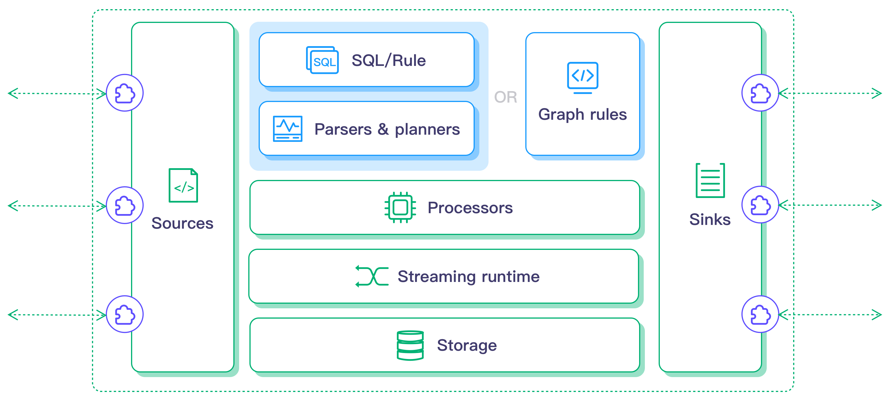

# 架构设计

LF Edge eKuiper 是物联网数据分析和流式计算引擎。它是一个通用的边缘计算服务或中间件，为资源有限的边缘网关或设备而设计。

eKuiper 采用 Go 语言编写，其架构如下图所示:

作为规则引擎，用户可以通过 REST API 或 CLI 提交计算作业即规则。eKuiper 规则/SQL 解析器或图规则解析器将解析、规划和优化规则，使其成为一系列算子的流程，如果需要的话，算子可以利用流式运行时和状态存储。

算子之间是松耦合的，通过 Go 通道进行异步通信。受益于 Go 的并发模型，规则运行时可以做到：

- 以异步和非阻塞的方式进行通信。
- 充分利用多核计算。
- 算子层可伸缩。
- 规则之间相互隔离。

这些有助于 eKuiper 实现低延迟和高吞吐量的数据处理。

## 计算组件

在 eKuiper 种，计算工作以规则的形式呈现。规则以流的数据源为输入，通过 SQL 定义计算逻辑，将结果输出到动作/sink 中。

规则定义提交后，它将持续运行。它将不断从源获取数据，根据 SQL 逻辑进行计算，并根据结果触发行动。

进一步阅读关于各计算组件的概念：

- [规则](./rules.md)
- [源](./sources/overview.md)
- [sink](./sinks.md)