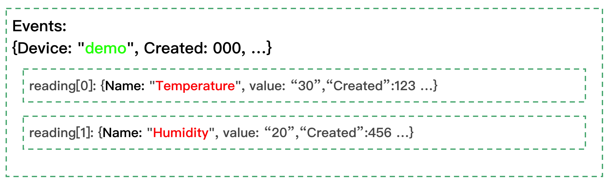

# 如何使用 meta 函数抽取在 EdgeX 消息总线中发送的其它信息?

当数据被发布到 EdgeX 消息总线的时候，除了真正的设备发出的值之外，还包含了一些额外的值，例如事件创建的时间，修改时间。有时在数据分析的时候需要这些值，本文描述如何使用 Kuiper 提供的函数来实现这个功能。

## EdgeX 消息总线上收到的消息模型

在 EdgeX 消息总线上收到的数据结构如下，一个 ``Event`` 结构体封装了相关的「元数据」(ID, Pushed, Device, Created, Modified, Origin)，以及从设备服务中采集到的实际数据 (在 ``Readings`` 字段中) 。

与``Event`` 类似， ``Reading`` 也包含了一些元数据 (ID, Pushed... 等)。

- Event
  - ID
  - Pushed
  - Device
  - Created
  - Modified
  - Origin
  - Readings
    - reading [0]
      - Id
      - Pushed
      - Created
      - Origin
      - Modified
      - Device
      - Name
      - Value
    - reading [1]
      - ... // The same as in reading[0]
      - ...
    - reading [n] ...

## Kuiper 中的 EdgeX 数据模型

那么在 Kuiper 中， EdgeX 数据是如何被管理的？让我们来看个例子。

如下所示，首先用户创建了一个名为 ``events`` 的 EdgeX 流定义（以黄色高亮标示）。


其次，如下所示，一条消息被发送到消息总线。

- Device name 为 ``demo``，以绿色高亮标示
- Reading 名称为 ``temperature`` & ``Humidity`` ，用红色高亮标示
- 这里有些 ``元数据`` 是没有必要「可见」的，但是这些值在分析的时候可能会被用到，例如``Event`` 结构体中的 ``Created`` 字段。Kuiper 将这些值保存在 Kuiper 消息中的名为 metadata 的字段中，用户在分析阶段可以获取到这些值。



最后，提供一条 SQL 用于数据分析，此处请注意，

- FROM 子句中的 ``events`` 为黄色高亮，就是在第一步中定义的流名字。
- SELECT 中的 ``temperature`` & ``humidity`` 字段为红色高亮，它们是 readings 中的 ``Name`` 字段的值。
- WHERE 子句中的 ``meta(device)`` 为绿色高亮，用于从 ``Events ``结构体中抽取 ``device`` 字段。该 SQL 语句将过滤所有设备名称不是 ``demo`` 的记录。


以下是使用 ``meta`` 函数抽取别的元数据的一些例子。

1. ``meta(created)``: 000  

   从 Event 结构体中获取 'created' 元数据

2. ``meta(temperature -> created)``: 123 

   从 reading[0] 中获取  'created' 元数据，以 'temperature'  为 key

3. ``meta(humidity -> created)``: 456 

   从 reading[1] 中获取  'created' 元数据，以 'humidity' 为 key

请注意，如果你想从 readings 中获取元数据，你需要使用 ``reading-name -> key`` 操作符来访问这些值。在前述例子中，``temperature`` & ``humidity``  是  ``reading-names``，并且  ``key`` 是 readings 中的字段名字。

但是，如果你从 ``Events`` 中获取元数据，只需直接指定 key，如第一个例子所示。

``meta`` 函数也可以用在 ``SELECT`` 子句中，以下为另外一个例子。请注意，如果在 ``SELECT`` 子句中使用了多个 ``meta`` 函数，你应该使用 ``AS`` 来指定一个别名，否则在前面的字段中的值将会被覆盖（不加别名，都有 meta 作为字段名）。

```sql
SELECT temperature,humidity, meta(id) AS eid,meta(Created) AS ec, meta(temperature->pushed) AS tpush, meta(temperature->Created) AS tcreated, meta(temperature->Origin) AS torigin, meta(Humidity->Device) AS hdevice, meta(Humidity->Modified) AS hmodified FROM demo WHERE meta(device)="demo2"
```

## 总结

Kuper 的 ``meta`` 函数可以用于访问元数据，以下列出了所有在 EdgeX 的 ``Events`` 和 ``Reading`` 中支持的 key，

- Events： id, pushed, device, created, modified, origin, correlationid
- Reading： id, created, modified, origin, pushed, device

