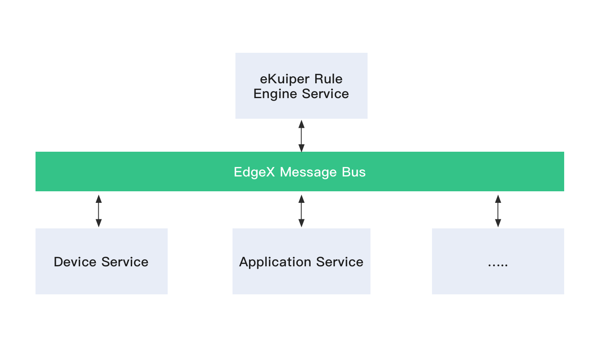

# EdgeX 规则引擎教程

## 概览

在 EdgeX Geneva 版本中, [EMQ X Kuiper - 基于 SQL 的轻量级流式数据处理软件](https://github.com/emqx/kuiper)与 EdgeX 进行了集成。在进入这篇教程之前，让我们先花一些时间来了解一些 Kuiper 的基本知识。EMQ X Kuiper 是 Golang 实现的轻量级物联网边缘分析、流式处理开源软件，可以运行在各类资源受限的边缘设备上。Kuiper 基于`源 (Source)`，`SQL (业务逻辑处理)`， `目标 (Sink)` 的方式来支持流式数据处理。

- 源（Source）：流式数据的数据源，例如来自于 MQTT 服务器的数据。在 EdgeX 的场景下，数据源就是 EdgeX 消息总线（EdgeX message bus），可以是来自于 ZeroMQ 或者 MQTT 服务器；
- SQL：SQL 是你流式数据处理指定业务逻辑的地方，Kuiper 提供了 SQL 语句可以对数据进行抽取、过滤和转换；
- 目标（Sink）：目标用于将分析结果发送到特定的目标。例如，将分析结果发送到另外的 MQTT 服务器，或者一个 HTTP Rest 地址；


使用 Kuiper，一般需要完成以下三个步骤。

- 创建流，就是你定义数据源的地方
- 写规则
  - 为数据分析写 SQL
  - 指定一个保存分析结果的目标
- 部署，并且运行规则

该教程描述如何使用 Kuiper 处理来自于 EdgeX 消息总线的数据。

## Kuiper EdgeX 集成

在不同的微服务之间，EdgeX 使用[消息总线](https://github.com/edgexfoundry/go-mod-messaging)进行数据交换。它包含了一个抽象的消息总线接口，并分别实现了 ZeroMQ 与 MQTT，在不同的微服务之间信息交互的支持。Kuiper 和 EdgeX 的集成工作包含了以下三部分，

- 扩展了一个 EdgeX 消息总线源，支持从 EdgeX 消息总线中接收数据  

- 为了可以分析数据，Kuiper 需知道传入的数据流的格式。一般来说，用户最好在创建流的时候指定被分析的流数据的格式。如下所示，一个 ``demo`` 流包含了一个名为 ``temperature`` 的字段。这与在关系型数据库中创建表格定义的时候非常像。在创建了流定义以后，Kuiper 可以在编译或者运行时对进入的数据进行类型检查，相应错误也会报告给用户。

  ```shell
  CREATE STREAM demo (temperature bigint) WITH (FORMAT="JSON"...)
  ```

  然而在 EdgeX 中，数据类型定义在 EdgeX ``Core contract Service`` 中已经指定，为了提升使用体验，用户可以在创建流的时候不指定数据类型。Kuiper 源会在初始化规则的时候，从 ``Core contract Service`` 中获取所有的 ``value descriptors`` 定义（所以如果有任何数据类型定义的变化，你需要重启规则）。当接收到来自于消息总线的数据的时候，会根规则转换为[相应的数据类型](../rules/sources/edgex.md)。

- 扩展支持 EdgeX 消息总线目标（sink），用于将处理结果写回至 EdgeX 消息总线。用户也可以选择将分析结果发送到 Kuiper 之前已经支持的 RestAPI 接口等。



## 运行 EdgeX Docker 实例

打开 [EdgeX develop-scripts 项目](https://github.com/edgexfoundry/developer-scripts/tree/master/releases)，并且下载 Geneva 版本的 Docker compose file，然后启动所有的 EdgeX 容器。

```shell
# docker-compose -f ./docker-compose-nexus-redis-no-secty.yml up -d --build
```

所有的容器启动完毕之后，请使用 ``docker ps`` 命令确定所有的容器已经正常启动。

```shell
$ docker ps
CONTAINER ID        IMAGE                                                                  COMMAND                  CREATED             STATUS              PORTS                                                                                              NAMES
5618c93027a9        nexus3.edgexfoundry.org:10004/docker-device-virtual-go:master          "/device-virtual --p…"   37 minutes ago      Up 37 minutes       0.0.0.0:49990->49990/tcp                                                                           edgex-device-virtual
fabe6b9052f5        nexus3.edgexfoundry.org:10004/docker-edgex-ui-go:master                "./edgex-ui-server"      37 minutes ago      Up 37 minutes       0.0.0.0:4000->4000/tcp                                                                             edgex-ui-go
950135a7041d        emqx/kuiper:0.3.1                                                      "/usr/bin/docker-ent…"   37 minutes ago      Up 37 minutes        0.0.0.0:20498->20498/tcp, 9081/tcp, 0.0.0.0:48075->48075/tcp                                       edgex-kuiper
c49b0d6f9347        nexus3.edgexfoundry.org:10004/docker-support-scheduler-go:master       "/support-scheduler …"   37 minutes ago      Up 37 minutes       0.0.0.0:48085->48085/tcp                                                                           edgex-support-scheduler
4265dcc2bb48        nexus3.edgexfoundry.org:10004/docker-core-command-go:master            "/core-command -cp=c…"   37 minutes ago      Up 37 minutes       0.0.0.0:48082->48082/tcp                                                                           edgex-core-command
4667160e2f41        nexus3.edgexfoundry.org:10004/docker-app-service-configurable:master   "/app-service-config…"   37 minutes ago      Up 37 minutes       48095/tcp, 0.0.0.0:48100->48100/tcp                                                                edgex-app-service-configurable-rules
9bbfe95993f5        nexus3.edgexfoundry.org:10004/docker-core-metadata-go:master           "/core-metadata -cp=…"   37 minutes ago      Up 37 minutes       0.0.0.0:48081->48081/tcp, 48082/tcp                                                                edgex-core-metadata
2e342a3aae81        nexus3.edgexfoundry.org:10004/docker-support-notifications-go:master   "/support-notificati…"   37 minutes ago      Up 37 minutes       0.0.0.0:48060->48060/tcp                                                                           edgex-support-notifications
3cfc628e013a        nexus3.edgexfoundry.org:10004/docker-sys-mgmt-agent-go:master          "/sys-mgmt-agent -cp…"   37 minutes ago      Up 37 minutes       0.0.0.0:48090->48090/tcp                                                                           edgex-sys-mgmt-agent
f69e9c4d6cc8        nexus3.edgexfoundry.org:10004/docker-core-data-go:master               "/core-data -cp=cons…"   37 minutes ago      Up 37 minutes       0.0.0.0:5563->5563/tcp, 0.0.0.0:48080->48080/tcp                                                   edgex-core-data
9e5091928409        nexus3.edgexfoundry.org:10004/docker-support-logging-go:master         "/support-logging -c…"   37 minutes ago      Up 37 minutes       0.0.0.0:48061->48061/tcp                                                                           edgex-support-logging
74e8668f892c        redis:5.0.7-alpine                                                     "docker-entrypoint.s…"   37 minutes ago      Up 37 minutes       0.0.0.0:6379->6379/tcp                                                                             edgex-redis
9b341bb217f9        consul:1.3.1                                                           "docker-entrypoint.s…"   37 minutes ago      Up 37 minutes       0.0.0.0:8400->8400/tcp, 8300-8302/tcp, 8301-8302/udp, 8600/tcp, 8600/udp, 0.0.0.0:8500->8500/tcp   edgex-core-consul
ed7ad5ae08b2        nexus3.edgexfoundry.org:10004/docker-edgex-volume:master               "/bin/sh -c '/usr/bi…"   37 minutes ago      Up 37 minutes                                                                                                          edgex-files
```

### 原生 (native) 方式运行

出于运行效率考虑，读者可能需要直接以原生方式运行 Kuiper，但是可能会发现直接使用下载的 Kuiper 软件包启动后[无法直接使用 Edgex](https://github.com/emqx/kuiper/issues/596)，这是因为 EdgeX 缺省消息总线依赖于 `zeromq` 库，如果 Kuiper 启动的时候在库文件寻找路径下无法找到 `zeromq` 库，它将无法启动。这导致对于不需要使用 EdgeX 的 Kuiper 用户也不得不去安装 `zeromq` 库 ，因此缺省提供的下载安装包中**<u>内置不支持 Edgex</u>** 。如果读者需要以原生方式运行 Kuiper 并且支持 `EdgeX`，可以通过命令 `make pkg_with_edgex` 自己来编译原生安装包，或者从容器中直接拷贝出安装包。

## 创建流

该步骤是创建一个可以从 EdgeX 消息总线进行数据消费的流。有两种方法来支持管理流，你可以选择喜欢的方式。

### 方式1: 使用 Rest API
请注意: EdgeX 中的 Kuiper Rest 接口使用``48075``端口，而不是缺省的``9081``端口。所以在 EdgeX 调用 Kuiper Rest 的时候，请将文档中所有的 9081 替换为 48075。

请将 ``$kuiper_server`` 替换为本地运行的 Kuiper 实例的地址。

```shell
curl -X POST \
  http://$kuiper_server:48075/streams \
  -H 'Content-Type: application/json' \
  -d '{
  "sql": "create stream demo() WITH (FORMAT=\"JSON\", TYPE=\"edgex\")"
}'
```

关于其它 API，请参考[该文档](../restapi/overview.md).

### 方式2: 使用 Kuiper 命令行

使用以下命令，进入运行中的 Kuiper docker 实例。

```shell
docker exec -it kuiper /bin/sh
```

使用以下命令，创建一个名为 ``demo`` 的流定义.

```shell
bin/kuiper create stream demo'() WITH (FORMAT="JSON", TYPE="edgex")'
```

其它命令行，请参考[该文档](../cli/overview.md)。

------

现在流已经创建好了，但是你可能好奇 Kuiper 是如何知道消息总线的地址和端口，因为此类信息在 ``CREATE STREAM`` 并未指定。实际上这些信息是在配置文件  ``etc/sources/edgex.yaml`` 中指定的，你可以在命令行窗口中输入 ``cat etc/sources/edgex.yaml`` 来查看文件的内容。如果你有不同的服务器、端口和服务的地址，请更新相应的配置。正如之前提到的，这些配置选项可以在容器启动的时候进行重写。

```yaml
#Global Edgex configurations
default:
  protocol: tcp
  server: localhost
  port: 5566
  topic: events
  serviceServer: http://localhost:48080
.....  
```

更多关于配置文件的信息，请参考[该文档](../rules/sources/edgex.md).

## 创建规则

让我们创建一条规则，将分析结果发送至 MQTT 服务器，关于 MQTT 目标的相关配置，请参考[这个链接](../rules/sinks/mqtt.md)。与创建流的过程类似，你可以选择使用 REST 或者命令行来管理规则。

以下例子将选出所有 ``events`` 主题上所有的数据，分析结果将被

- 发布到公共的 MQTT 服务器 ``broker.emqx.io`` 的主题``result`` 上；
- 打印至日志文件

### 选项1: 使用 Rest API

```shell
curl -X POST \
  http://$kuiper_server:9081/rules \
  -H 'Content-Type: application/json' \
  -d '{
  "id": "rule1",
  "sql": "SELECT * FROM demo",
  "actions": [
    {
      "mqtt": {
        "server": "tcp://broker.emqx.io:1883",
        "topic": "result",
        "clientId": "demo_001"
      }
    },
    {
      "log":{}
    }
  ]
}
```

### 选项2: 使用 Kuiper 命令行

你可以使用任意编辑器来创建一条规则，将下列内容拷贝到编辑器中，并命名为 ``rule.txt``。

```json
{
  "sql": "SELECT * from demo",
  "actions": [
    {
      "mqtt": {
        "server": "tcp://broker.emqx.io:1883",
        "topic": "result",
        "clientId": "demo_001"
      }
    },
    {
      "log":{}
    }
  ]
}
```

在运行的容器中，执行以下命令。

```shell
# bin/kuiper create rule rule1 -f rule.txt
Connecting to 127.0.0.1:20498...
Creating a new rule from file rule.txt.
Rule rule1 was created successfully, please use 'cli getstatus rule rule1' command to get rule status.
```

------

如想将结果发送到别的目标，请参考 Kuiper 中支持的[其它目标](../rules/overview.md#actions)。你现在可以看一下在 ``log/stream.log``中的日志文件，查看规则的详细信息。

```
time="2020-04-17T06:32:24Z" level=info msg="Serving kuiper (version - 0.3.1-4-g9e63fe1) on port 20498, and restful api on port 9081. \n" file="server.go:101"
time="2020-04-17T06:32:24Z" level=info msg="The connection to edgex messagebus is established successfully." file="edgex_source.go:95" rule=rule1
time="2020-04-17T06:32:24Z" level=info msg="Successfully subscribed to edgex messagebus topic events." file="edgex_source.go:104" rule=rule1
time="2020-04-17T06:32:24Z" level=info msg="The connection to server tcp://broker.emqx.io:1883 was established successfully" file="mqtt_sink.go:161" rule=rule1
time="2020-04-17T06:32:25Z" level=info msg="Get 24 of value descriptors from service." file="edgex_source.go:223"
time="2020-04-17T06:32:25Z" level=info msg="sink result for rule rule1: [{\"int32\":-697766590}]" file="log_sink.go:16" rule=rule1
time="2020-04-17T06:32:25Z" level=info msg="sink result for rule rule1: [{\"int8\":-47}]" file="log_sink.go:16" rule=rule1
time="2020-04-17T06:32:25Z" level=info msg="sink result for rule rule1: [{\"int16\":-318}]" file="log_sink.go:16" rule=rule1
time="2020-04-17T06:32:25Z" level=info msg="sink result for rule rule1: [{\"int64\":-8680421421398846880}]" file="log_sink.go:16" rule=rule1
time="2020-04-17T06:32:31Z" level=info msg="sink result for rule rule1: [{\"bool\":true}]" file="log_sink.go:16" rule=rule1
```

## 监控分析结果

因为所有的分析结果都被发布到``tcp://broker.emqx.io:1883``，你可以直接使用以下的  ``mosquitto_sub`` 命令来监听结果，你也可以参考别的 [MQTT 客户端工具](https://www.emqx.io/blog/mqtt-client-tools).

```shell
# mosquitto_sub -h broker.emqx.io -t result
[{"bool":true}]
[{"bool":false}]
[{"bool":true}]
[{"randomvalue_int16":3287}]
[{"float64":8.41326e+306}]
[{"randomvalue_int32":-1872949486}]
[{"randomvalue_int8":-53}]
[{"int64":-1829499332806053678}]
[{"int32":-1560624981}]
[{"int16":8991}]
[{"int8":-4}]
[{"bool":true}]
[{"bool":false}]
[{"float64":1.737076e+306}]
...
```

你也可以敲入以下的命令来查看规则执行的状态。相关的查看规则状态的 REST API 也有提供，请检查[相关文档](../restapi/overview.md).

```shell
# bin/kuiper getstatus rule rule1
Connecting to 127.0.0.1:20498...
{
  "source_demo_0_records_in_total": 29,
  "source_demo_0_records_out_total": 29,
  "source_demo_0_exceptions_total": 0,
  "source_demo_0_process_latency_ms": 0,
  "source_demo_0_buffer_length": 0,
  "source_demo_0_last_invocation": "2020-04-17T10:30:09.294337",
  "op_preprocessor_demo_0_records_in_total": 29,
  "op_preprocessor_demo_0_records_out_total": 29,
  "op_preprocessor_demo_0_exceptions_total": 0,
  "op_preprocessor_demo_0_process_latency_ms": 0,
  "op_preprocessor_demo_0_buffer_length": 0,
  "op_preprocessor_demo_0_last_invocation": "2020-04-17T10:30:09.294355",
  "op_filter_0_records_in_total": 29,
  "op_filter_0_records_out_total": 21,
  "op_filter_0_exceptions_total": 0,
  "op_filter_0_process_latency_ms": 0,
  "op_filter_0_buffer_length": 0,
  "op_filter_0_last_invocation": "2020-04-17T10:30:09.294362",
  "op_project_0_records_in_total": 21,
  "op_project_0_records_out_total": 21,
  "op_project_0_exceptions_total": 0,
  "op_project_0_process_latency_ms": 0,
  "op_project_0_buffer_length": 0,
  "op_project_0_last_invocation": "2020-04-17T10:30:09.294382",
  "sink_mqtt_0_0_records_in_total": 21,
  "sink_mqtt_0_0_records_out_total": 21,
  "sink_mqtt_0_0_exceptions_total": 0,
  "sink_mqtt_0_0_process_latency_ms": 0,
  "sink_mqtt_0_0_buffer_length": 1,
  "sink_mqtt_0_0_last_invocation": "2020-04-17T10:30:09.294423"
```

## 总结

在本教程中，我们介绍了使用 EdgeX Kuiper 规则引擎的非常简单的例子，如果使用过程中发现任何问题，请到 EdgeX，或者 Kuiper Github 中报问题。

## 更多练习

目前的规则没有过滤发送给 Kuiper 的任何数据，那么如何过滤数据呢？请使用[删除规则](../cli/rules.md)，然后试着更改一下 SQL 语句，完成更改后，重新部署规则。这时候如果监听 MQTT 服务的结果主题，检查一下相关的规则是否起作用？

### 扩展阅读

- 从 Kuiper 0.9.1 版本开始，通过一个单独的 Docker 镜像提供了 [可视化 web 用户交互界面](../manager-ui/overview.md)，您可以通过该 web 界面进行流、规则和插件等管理。
- 阅读 [EdgeX 源](../rules/sources/edgex.md) 获取更多详细信息，以及类型转换等。
- [如何使用 meta 函数抽取在 EdgeX 消息总线中发送的更多信息？](edgex_meta.md) 设备服务往总线上发送数据的时候，一些额外的信息也随之发送，比如时间创建时间，id 等。如果你想在 SQL 语句中使用这些信息，请参考这篇文章。
- [Kuiper 中使用 Golang 模版 (template) 定制分析结果](../rules/data_template.md) 分析结果在发送给不同的 sink 之前，可以使用数据模版对结果进行二次处理，参考这片文章可以获取更多的关于数据模版的使用场景。
- [EdgeX 消息总线目标](../rules/sinks/edgex.md). 该文档描述了如何使用 EdgeX 消息总线目标。如果想把你的分析结果被别的 EdgeX 服务消费，你可以通过这个 sink 发送 EdgeX 格式的数据，别的 EdgeX 服务可以通过这个 Kuiper sink 暴露出来的新的消息总线进行订阅。
- [Kuiper 插件开发教程](../plugins/plugins_tutorial.md): Kuiper 插件机制基于 Go 语言的插件机制，使用户可以构建松散耦合的插件程序，在运行时动态加载和绑定，如果您对开发插件有兴趣，请参考该文章。

如想了解更多的 EMQ X Kuiper 的信息，请参考以下资源。

- [Kuiper Github 代码库](https://github.com/emqx/kuiper/)
- [Kuiper 参考指南](https://github.com/emqx/kuiper/blob/master/docs/zh_CN/reference.md)

