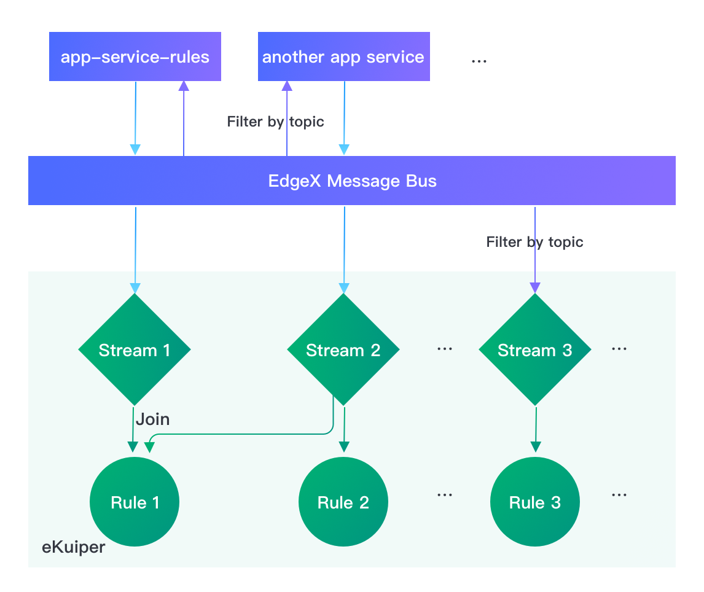

# 配置从 EdgeX 到 eKuiper 的数据流

源从其他系统（如 EdgeX foundry）将数据输入到 eKuiper，这些系统被定义为流。 [EdgeX 源](../guide/sources/builtin/edgex.md) 定义了如何将数据从 EdgeX 输入 eKuiper 的配置属性。 在本教程中，我们将演示从 EdgeX 到 eKuiper 的各种数据流以及如何针对不同类型的数据流配置源。

## 典型数据流模型

通常，从EdgeX 到 eKuiper 的数据流有两种：

- 从 EdgeX 应用服务到 eKuiper
- 从 EdgeX 消息总线直接到 eKuiper



请注意，EdgeX 消息总线接收来自各种服务（例如设备服务和核心数据）的消息。 即使是第一种数据流，应用服务结果也会发布到消息总线上，然后被 eKuiper 消费使用。 两者的区别在于 eKuiper 消费前应用服务是否对消息进行了处理。

默认情况下，使用第一种数据流，允许用户在发送到 eKuiper 规则引擎之前进行准备（转换、添加、过滤等）和修饰（格式化、压缩、加密等）。 如果用户不需要对数据进行转换，并希望在 eKuiper 中处理原始数据以减少开销，则可以直接连接到消息总线。

EdgeX 源的完整属性列表可以在 [这里](../guide/sources/builtin/edgex.md#全局配置) 查看。 有两个定义连接模型的关键属性：`topic` 和 `messageType`。 本文将探索如何配置它们，以便可以采用连接模型。

## 连接到应用服务

在默认的 EdgeX [docker compose 文件](https://github.com/edgexfoundry/edgex-compose/blob/main/docker-compose.yml) 中，默认的应用服务 `app-service-rules` 被定义为 eKuiper 的上游服务。 默认发布主题是在[默认配置](https://github.com/edgexfoundry/app-service-configurable/blob/main/res/rules-engine/configuration.toml)中定义的 `rules-events` 。在同一个 docker compose 文件 `rulesengine` 部分，有一个环境变量定义 `EDGEX__DEFAULT__TOPIC: rules-events`。 这表明 eKuiper edgeX 源默认主题是 "rules-events"，它刚好匹配发布主题 `app-service-rules`。 因此，当使用默认配置创建 edgex 类型的流时，数据将自动从 `app-service-rules` 流向 eKuiper。

### 修改连接的应用服务

在某些情况下，用户可能对多个应用服务来进行不同类型的数据转换。 要让 eKuiper 连接到另一个应用服务，只需更改主题以匹配新主题名称。因此，修改 docker compose 文件，在应用服务中添加环境变量 `TRIGGER_EDGEXMESSAGEBUS_PUBLISHHOST_PUBLISHTOPIC` 来明确指定发布主题。 然后更新规则引擎中的环境变量 `EDGEX__DEFAULT__TOPIC` 以匹配新主题并连接它们。

```yaml
...
  app-service-rules:
    ...
    environment:
      ...
      TRIGGER_EDGEXMESSAGEBUS_PUBLISHHOST_PUBLISHTOPIC: new-rules-events
      ...
  ...
  rulesengine:
    ...
    environment:
      ...
      EDGEX__DEFAULT__TOPIC: new-rules-events
      ...
```

## 连接到消息总线

为了绕过应用服务并获得一些性能提升，用户可以直接连接到消息总线。 除了设置主题，用户还需要配置 messageType 属性。

EdgeX v2 消息总线具有多级主题，以便消费者可以高效地按主题过滤消息。 请参阅[主题过滤器示例](https://docs.edgexfoundry.org/2.0/microservices/application/Triggers/#filter-by-topics)。

例如，如果规则只考虑来自 `Random-Integer-Device` 的数据，我们可以修改规则引擎的 docker compose 文件来更改主题并将消息类型修改为 `request`，如下所示。

```yaml
...
  ...
  rulesengine:
    ...
    environment:
      ...
      EDGEX__DEFAULT__TOPIC: edgex/events/#/Random-Integer-Device/#
      EDGEX__DEFAULT__MESSAGETYPE: request
      ...
```

通过这种方式，eKuiper 绕开了应用服务，直接连接到消息总线。当使用默认配置创建 EdgeX 流时：

```sql
CREATE STREAM edgeXAll() with (FORMAT="JSON", TYPE="edgex")
```

只会接收来自 `Random-Integer-Device` 的事件。

## 多个流

在实际中，用户通常有多个规则。 一些规则只涉及特定的配置文件、设备或者消息总线的读取。 最佳实践是创建多个流来映射多个关注点，并且每个规则只处理消息的子集。

在此场景中，用户将通过应用服务或直接通过消息总线过滤主题在 EdgeX 消息总线中拥有多个主题。 在 eKuiper 中，edgex 源配置可以映射到每个主题。 具有多个配置的 edgex 配置文件 `edgex.yaml` 示例如下：

```yaml
# 默认配置连接 app-service-rules
default:
  protocol: tcp
  server: localhost
  port: 5563
  topic: rules-events
  type: redis
  messageType: event
#覆盖全局配置
device_conf: # 只过滤 Random-Integer-Device
  topic: edgex/events/#/Random-Integer-Device/#
  messageType: request
another_app_service_conf:
  topic: new-rules-events
int8_conf: # 只过滤 Random-Integer-Device Int8 reading
  topic: edgex/events/#/Random-Integer-Device/Int8
  messageType: request
```

通过这种配置，用户有 3 个 confkey 可以连接到不同的 edgeX 数据流。 例如，如果用户有两个规则：rule1 需要处理所有事件，而 rule2 只处理 Random-Integer-Device 的 Int8 读取。 然后用户可以创建两个流：edgexAll 和 edgexInt8。

```sql
CREATE STREAM edgexAll() WITH (FORMAT="JSON", TYPE="edgex")
```

有了这个定义，将使用默认的 confkey， 使用这个流的规则将接收所有事件。

```sql
CREATE STREAM edgexInt8(int8 bigint) WITH (FORMAT="JSON", TYPE="edgex", CONF_KEY="int8_conf")
```

不同之处在于，edgexInt8 明确指定 confkey 使用 `int8_conf`，它配置为 Random-Integer-Device 设备 Int8 读取的筛选主题。 因此，它只会接收每个事件的 Int8 读取，并且事件结构是固定的。 因此，流定义也定义了模式，而不是无模式。

同样，用户可以为每个 confkey 创建流。 每个规则都可以根据其关注点选择流。

### 共享实例

当规则运行时，每个规则都有一个单独的源实例，即使使用相同的流定义，它们彼此也是独立的。 有时为了减少开销并保证跨规则的数据序列相同，许多规则可能希望共享同一源实例。 这对于 edgex 默认流来说极为常见，它读取消息总线中的所有事件，如果是多个实例，可能会有很多开销。

因此，对于 edgexAll 流，我们建议创建一个共享实例，并让所有需要完整数据的规则使用它。

```sql
CREATE STREAM edgexAll() WITH (FORMAT="JSON", TYPE="edgex", SHARED="true")
```

## 总结

在之前的教程中，我们通常会为 edgeX 创建一个整体流，对于 edgeX 事件如何配置和过滤并未详细介绍。 在本教程中，我们一起学习了 edgeX 和 eKuiper 的配置，以便将事件过滤到多个流中，让规则只处理感兴趣的事件。 最后，我们讨论了如何使用源的共享实例来提高性能和一致性。
