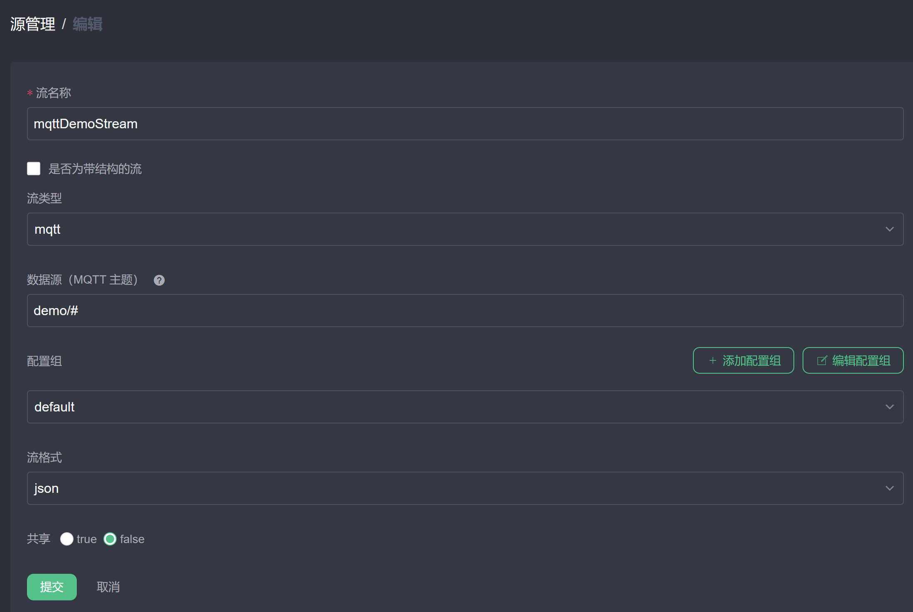
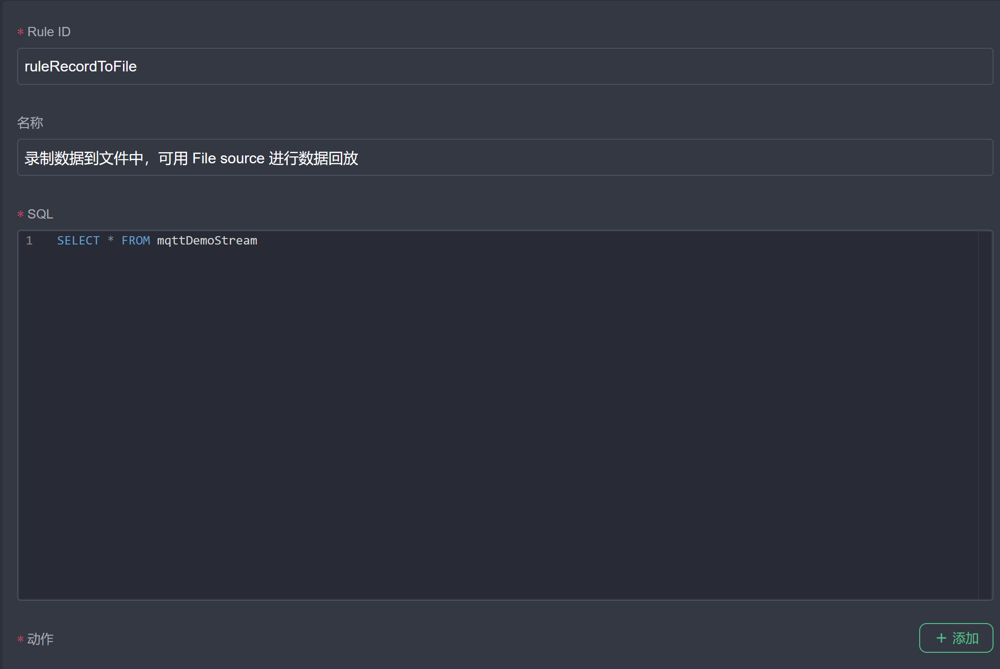
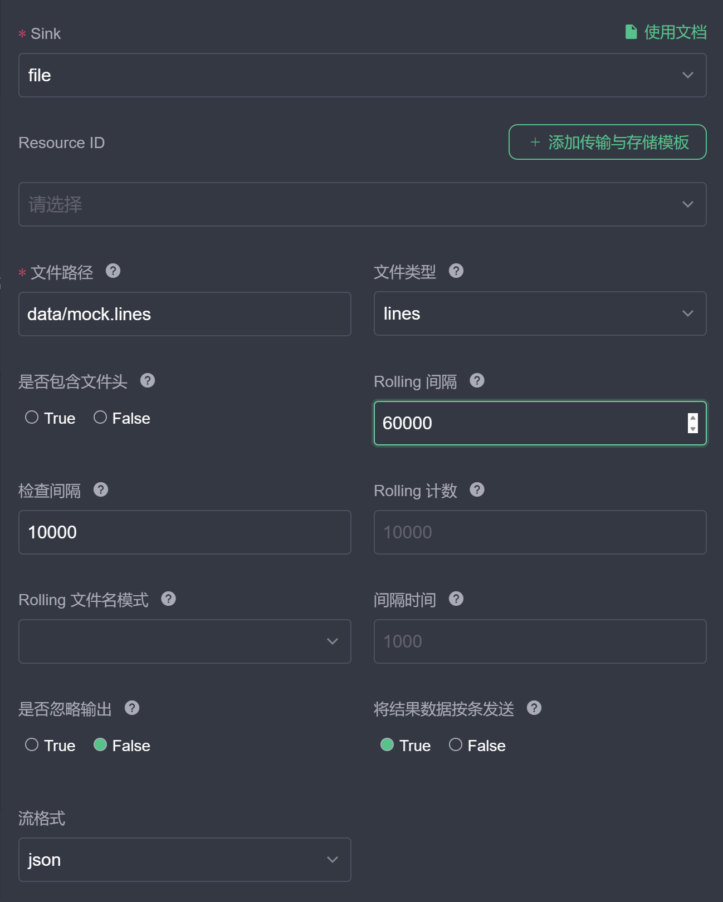
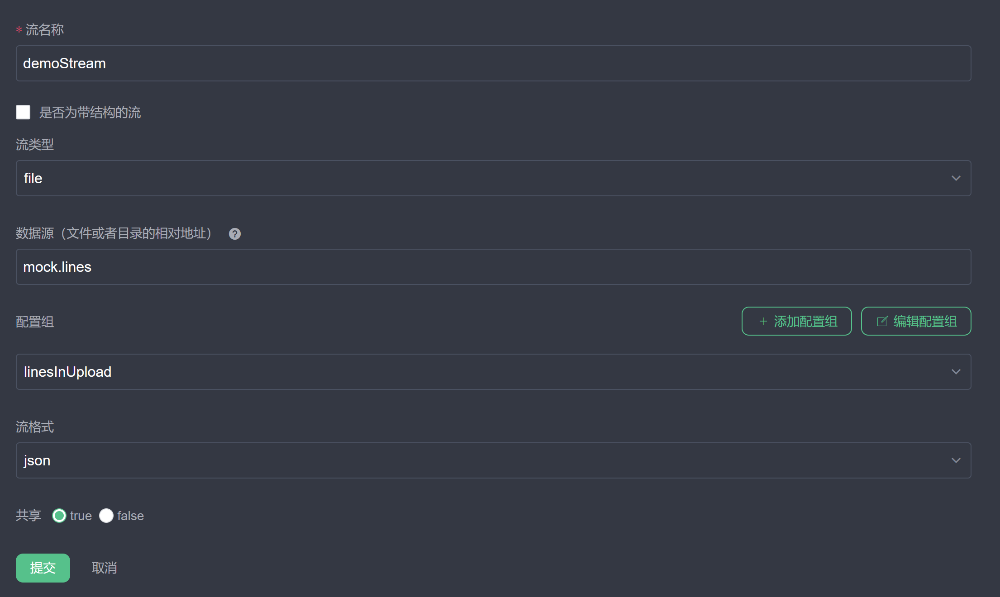
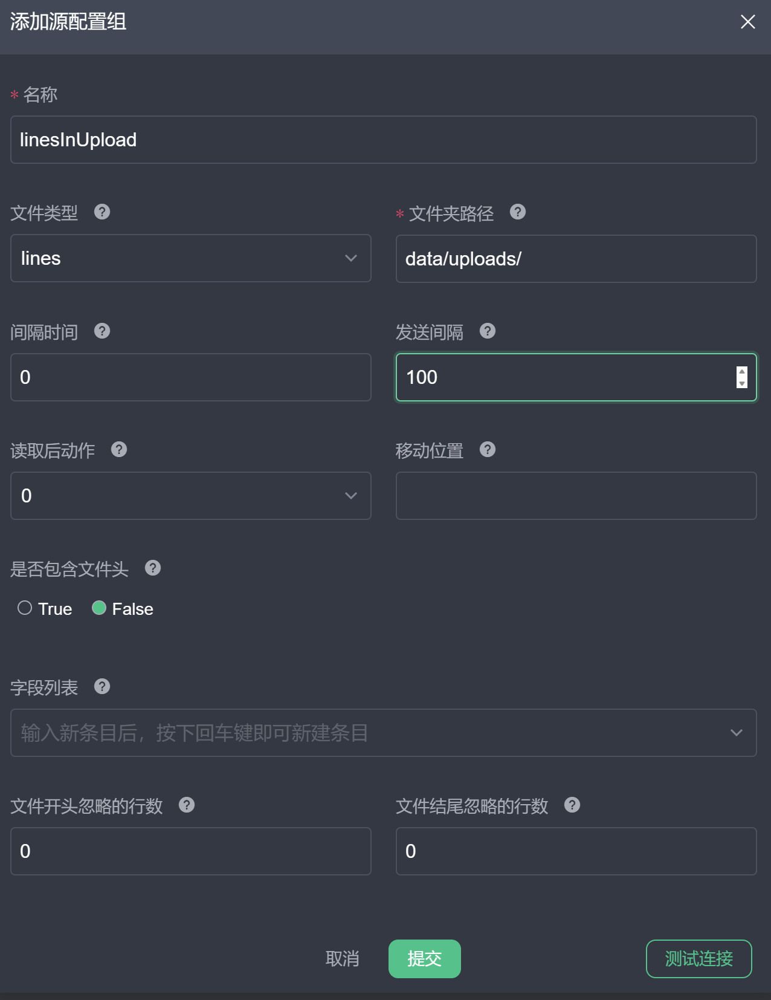
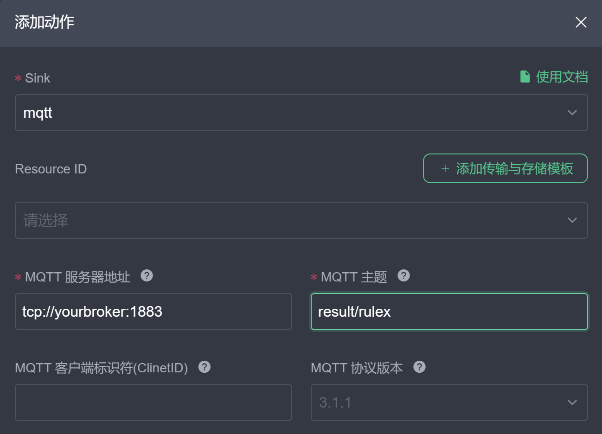

# 运行案例

详细说明如何使用 eKuiper 运行本文档中的案例。运行案例之前，需要先安装 eKuiper，具体安装方法请参考 [安装 eKuiper](../installation.md)。

在案例文档中，我们会使用 SQL 定义规则。用户可以通过 eKuiper manager 管理控制台 UI 或 eKuiper 的 REST API 或者命令行工具来运行规则。

## 准备数据

在每个案例中，我们都会提供一个输入样例数据，方便使用者快速了解案例的输入数据格式。用户也可以根据自己的需求，自定义输入数据。若用户已有运行中的数据源，也可以将数据源的输出作为案例的输入。具体做法是通过一条数据录制的规则，将已有的数据源的一段数据保存为文件，然后将文件作为案例的输入，可进行反复的重放和测试。

### 录制数据

eKuiper 提供了多种数据源接入以及 File sink 输出，因此可通过一条规则将已有数据源的数据保存为文件，然后将文件作为案例的输入。以下以 MQTT 数据源为例，采用 eKuiper manager UI 的方式，介绍如何录制数据。使用之前，请先[安装和配置 eKuiper manager](../installation.md#使用管理控制台运行)。

1. 创建数据源：在 eKuiper 管理控制台 UI 中，点击顶部导航栏的**源管理**，进入流管理页面。点击**创建流**，在弹出的对话框中，填写流名称 `mqttDemoStream`，选择流类型为 `mqtt`，填写数据源即 MQTT 主题为 `demo/#`。若需要更改默认 MQTT 连接信息，点击添加配置组进行配置。点击 **确定**，创建流。我们创建了一个名为 `mqttDemoStream` 数据流，监听 MQTT 主题 `demo/#`。

2. 创建并运行规则：在 eKuiper 管理控制台 UI 中，点击导航栏的**规则**，进入规则管理页面。点击**新建规则**，在弹出的对话框中，填写RuleId，规则名称和规则 SQL。在规则动作处，点击**添加**，进入动作编辑界面。选择 Sink 为 `file`，文件路径填写为 `data/mock.lines`，文件类型选择 `lines`，检查间隔设置为 10000。这样收到的数据就会存入 `data/mock.lines` 文件中。

 点击**确定**，创建规则。回到规则列表界面，请确保规则状态为**运行中**。点击规则状态，确定规则有收到和处理数据。

3. 查看数据：根据规则动作的配置，数据将被保存到 `data/mock.lines` 文件中。其存储格式为按行分割的 JSON 字符串。可使用文本编辑器打开文件进行编辑。

## 运行案例

为了方便调试，我们建议用户使用 File source 作为输入。案例跑通之后，用户可以根据自己的需求，将输入数据源替换为自己的数据源。

运行案例时，大部分案例将遵循这些约定，后文不再重复说明。

- 我们将创建一个数据流，数据源为 file source，数据流名字为 `demoStream`。通过文件源，我们可以方便地**“重播”**第一步准备好的数据。
- 规则的输出动作为 MQTT sink，将数据输出到 `result/{{ruleId}}` 主题。

接下来，我们将介绍如何使用 eKuiper 管理控制台 UI 为例来介绍如何运行一个案例。当我们打开一个案例文档时，运行案例的步骤如下：

1. 准备数据：阅读输入样例部分，**复制样例数据到一个文件中**，或者[使用自己的数据](#录制数据)同样保存到文件中。
2. 上传数据：在 eKuiper 管理控制台 UI 中，点击导航栏的**配置**，进入配置管理页面，选择**文件管理**标签页，点击**创建文件**，上传保存的文件，如 `mock.lines`。
3. 创建文件流：在 eKuiper 管理控制台 UI 中，点击左侧导航栏的 **数据源**，进入数据源管理页面。点击 **新建数据源**，在弹出的对话框中，流名称设置为 `demoStram`，流类型选择 `file`，并填写数据源名称为第二步上传文件的文件名。 点击**添加配置组**按钮，在数据源配置中，**文件路径**为文件管理中文件上传的路径。点击 **确定**，创建数据源。
4. 订阅结果：通过 [MQTT X](https://mqttx.app/)，订阅 `result/{{ruleId}}` 主题，准备查看规则的输出结果。
5. 创建规则：在 eKuiper 管理控制台 UI 中，点击顶部导航栏的**规则**，进入规则管理页面。点击**新建规则**，在弹出的对话框中，填写规则名称和规则 SQL。**规则 SQL 为案例文档中的 SQL 语句**。 在规则动作处，点击**添加**，进入动作编辑界面。选择 Sink 为 `mqtt`，主题设置为`result/{{ruleId}}`。这样规则运行结果将发送到 MQTT 中，从而可用在 MQTT X 中查看。 点击**确定**，创建规则。回到规则列表界面，请确保规则状态为**运行中**。点击规则状态，确定规则有收到和处理数据。
6. 查看结果：通过 MQTT X，查看规则的输出结果。

## 总结

本文通过 eKuiper manager 管理控制台 UI 的方式，介绍了如何使用 eKuiper 进行案例。在实际使用中，用户可以根据自己的需求，使用 eKuiper 的 REST API 或者 eKuiper CLI 来进行数据处理。案例运行通过后，用户也可以自行修改案例中的 SQL 语句，来实现自己的需求。
