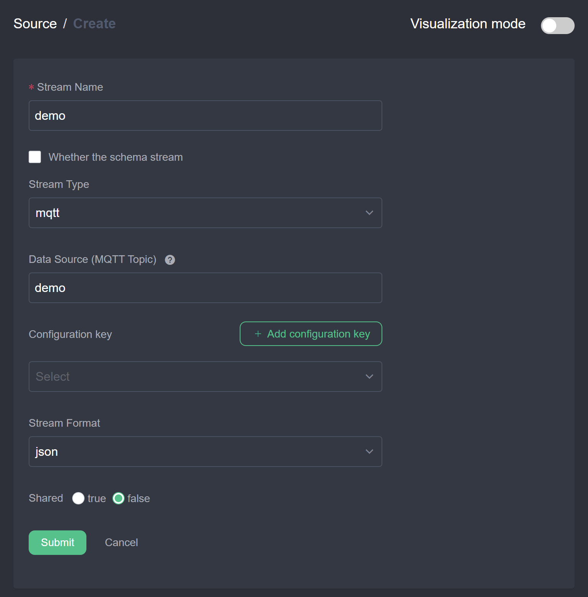
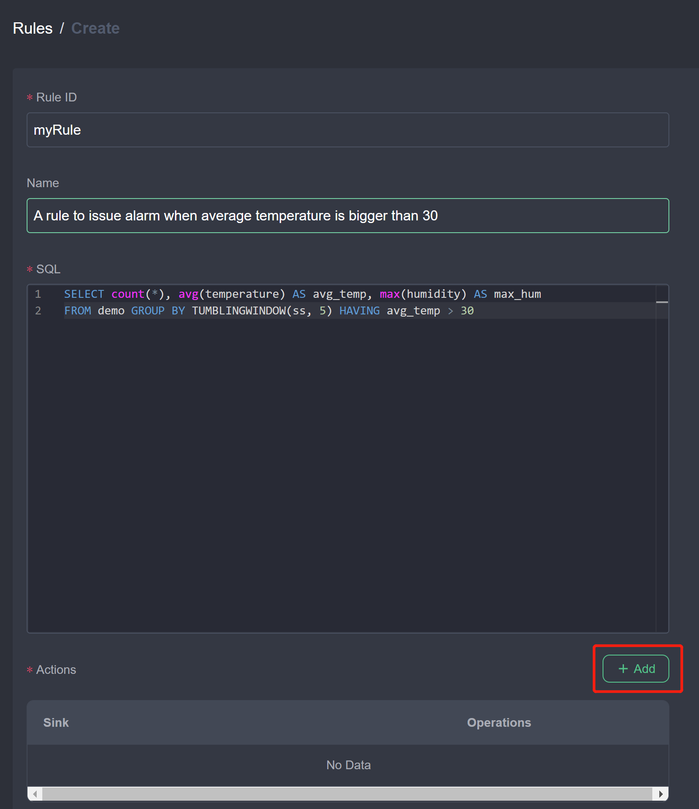
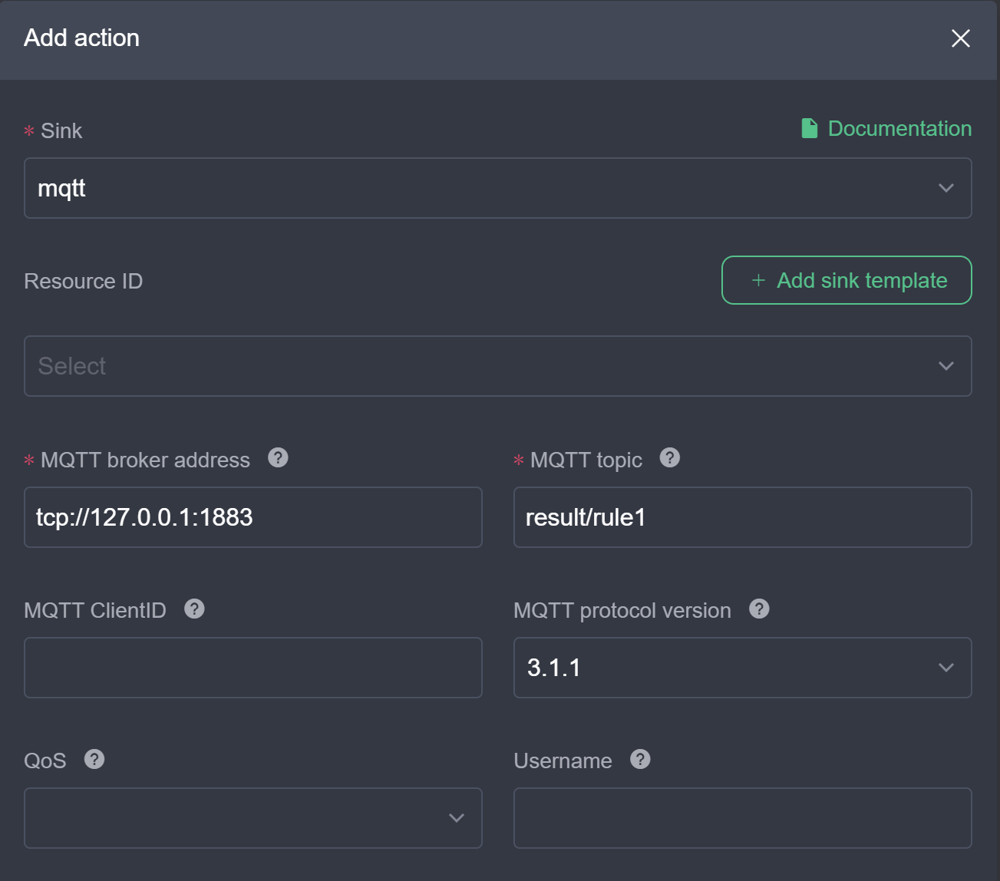
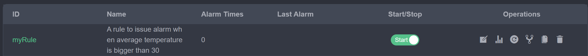
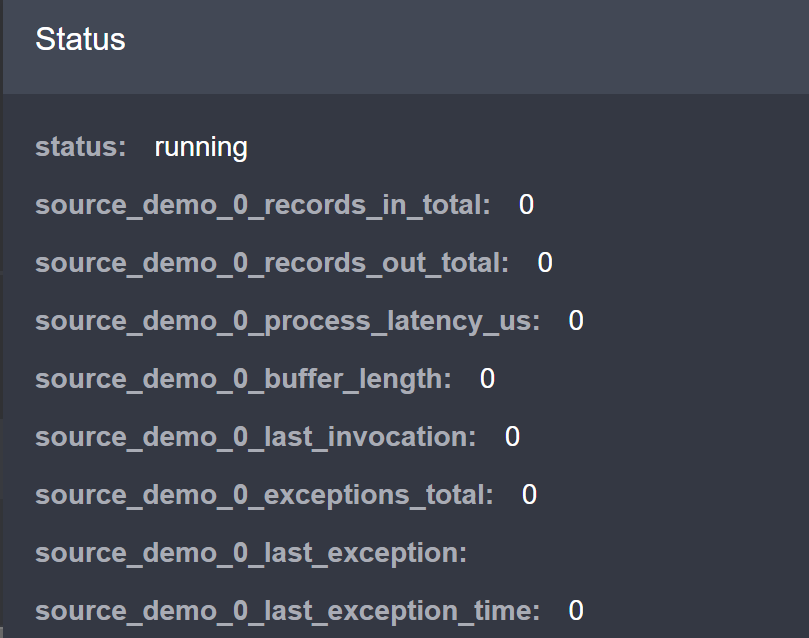
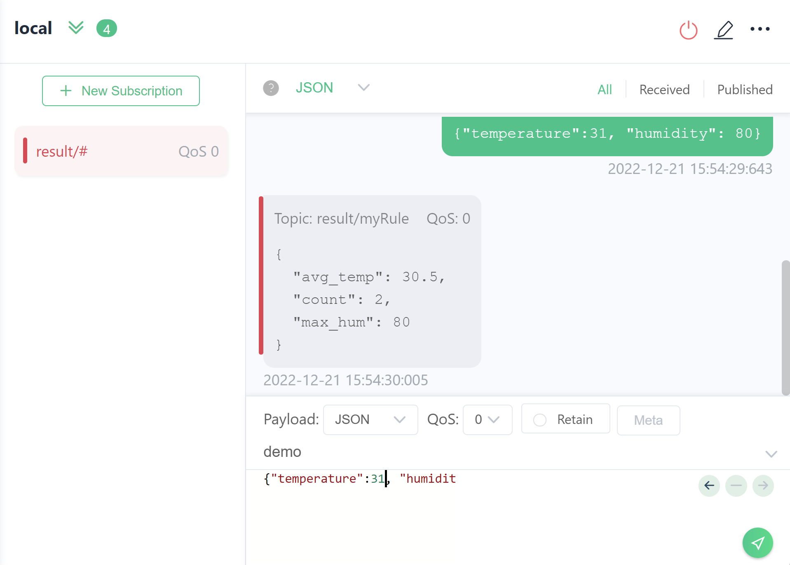

# 开始入门

本文将从下载和安装开始，指导您启动 eKuiper 并运行第一条规则。

## 安装 eKuiper

eKuiper 提供了docker镜像、二进制包和 helm 等安装方式。

在本教程中，我们同时分别使用了 Web UI 和 CLI 来创建和管理规则，您可以选择任意一种方式运行。如果你想运行 eKuiper Web UI，即eKuiper的网络管理控制台，请参考[使用管理控制台运行 eKuiper](../installation.md#使用管理控制台运行)。

### 在 Docker 中运行

Docker 部署是开始尝试 eKuiper 的最快方式。

```shell
docker run -p 9081:9081 -d -name kuiper -e MQTT_SOURCE__DEFAULT__SERVER="tcp://broker.emqx.io:1883" lfedge/ekuiper:$tag
```

关于 Docker 安装的更多信息，请参考[在 Docker 中运行eKuiper](../installation.md#在-docker-中运行)。

### 在 Kubernetes 中运行

针对 Kubernetes 运行环境，eKuiper 提供了 helm chart。请参考[install via helm](../installation.md#通过-helm-安装k8sk3s)了解详情。

### 在虚拟机或裸机上运行

eKuiper 可以直接部署在裸机服务器或虚拟机上。

eKuiper 有预先构建的软件包，可供 Linux, 如CentOS、Debian 和 Ubuntu 以及 macOS 的安装包下载下载。你可以[从压缩包安装](../installation.md#通过-zip-包安装)或[从软件包安装](../installation.md#通过软件包安装)。

对于其他平台，你可以[从源代码构建可运行程序](../installation.md#从源码编译)。

## 创建和管理第一条规则

作为规则引擎，eKuiper允许用户通过 CLI、REST API 或管理控制台提交流处理作业即规则，并管理规则。在本教程中，我们将引导你分别通过管理控制台和 CLI 来创建和管理规则。

eKuiper 规则由 SQL 和多个动作组成。eKuiper SQL 是一种易于使用的类 SQL 语言，用于指定规则的逻辑。你可以从[eKuiper SQL 参考](../sqls/overview.md)中找到更多关于语法和其功能的信息。

### 前提条件

我们假设已经有一个 MQTT 服务器作为我们 eKuiper 规则的数据源。如果你没有，建议使用 EMQX。请按照[EMQX 安装指南](https://docs.emqx.io/en/broker/latest/getting-started/install.html)来安装一个 MQTT 服务器。

你也可以使用 [EMQ](https://www.emqx.io) 托管的公共 MQTT 测试服务器`tcp://broker.emqx.io:1883`。

记住你的服务器地址，我们将在本教程的 MQTT 配置中使用它。

### 场景

让我们考虑一个示例场景，我们通过 MQTT 服务接收来自传感器的温度和湿度事件，我们希望创建一个规则，当一个时间窗口内平均温度大于 30 摄氏度时发出警报。我们可以通过以下几个步骤为上述场景编写一个 eKuiper 规则。

1. 创建一个流来定义我们要处理的数据源。该流需要有一个名称和一个可选的 schema，定义每个传入事件应包含的数据结构。对于这个方案，我们将使用一个 MQTT 源来消费温度事件。
2. 创建规则以定义如何处理流和处理后的行动。
3. 获取规则状态并管理它，如开始、停止和删除。

我们将在管理控制台和 CLI 中分别进行这些步骤来创建相同的规则。

## 管理控制台

请确保 eKuiper manager 已经安装并配置完成。

### 定义流

1. 在Source/Stream页面，点击 "创建流 "按钮。
2. 创建一个名为 `demo` 的流，消费 DATASOURCE 属性中指定的 MQTT `demo` 主题。MQTT 源将连接到 MQTT 服务器，默认地址是 `tcp://localhost:1883`。如果你的 MQTT 服务器地址不同，点击 `添加配置键` 来设置一个新的配置并使用。
  
3. 点击`提交`。你应该在流列表中找到 `demo` 流。

### 编写规则

1. 进入规则页面，点击 "创建规则"。
2. 写下规则的ID、名称和SQL，如下所示。然后点击 "添加" 来添加动作。SQL是`SELECT count(*), avg(temperature) AS avg_temp, max(hum) AS max_hum FROM demo GROUP BY TUMBLINGWINDOW(ss, 5) HAVING avg_temp > 30`。
  
3. 添加 MQTT 动作并填写配置，如下所示。在 Sink 类型下拉菜单中选择 `mqtt`。将服务器地址设为你的服务器，并将主题设为 `result/rule1`。ClientID 是可选的，如果没有设置，将自动分配一个 uuid。如果设置了，请确保该 ID 是唯一的，并且只在一条规则中使用。根据你的 MQTT 服务器的配置，设置其他属性，如用户名、密码。
   
4. 点击 "提交"。你应该在规则列表中找到`myRule`规则并开始使用。

现在，我们已经通过指定 SQL 作为业务逻辑创建了一条规则，并添加了一个 MQTT 动作。正如你所看到的，这些动作可以有很多个，你可以添加更多的动作，如日志、REST和文件来发出警报动作。

### 管理规则

在规则页面，我们可以找到所有创建的规则和它的状态，如下所示。



你可以通过点击开关按钮来启动或停止该规则。在操作栏中，第二个操作是状态，它将显示规则的运行状态和[指标](../operation/usage/monitor_with_prometheus.md)。一旦数据源有数据进入，你应该发现指标数在上升。



你可以通过点击操作栏中的按钮来编辑、复制和删除这些规则。

### CLI

eKuiper 提供 CLI 客户端，它用于本地运行，不需要任何外部工具来管理规则引擎。

### 定义输入流

我们创建一个名为 `demo` 的流，该流使用 `DATASOURCE` 属性中指定的 MQTT `demo` 主题。

```sh
$ bin/kuiper create stream demo '(temperature float, humidity bigint) WITH (FORMAT="JSON", DATASOURCE="demo")'
```

MQTT 源将通过 `tcp://localhost:1883` 连接到 MQTT 消息服务器，如果您的 MQTT 消息服务器位于别的位置，请在 `etc/mqtt_source.yaml` 中进行指定。 您可以通过修改如下配置文件来更改配置。

```yaml
default:
  qos: 1
  sharedsubscription: true
  server: "tcp://127.0.0.1:1883"
```

您可以使用 `kuiper show streams` 命令来查看是否创建了 `demo` 流。

### 通过查询工具测试流

现在已经创建了流，可以通过 `kuiper query` 命令对其进行测试。键入`kuiper query`后，显示 `kuiper`提示符。

```sh
$ bin/kuiper query
kuiper > 
```

在 `kuiper`提示符下，您可以键入 SQL 并根据流验证 SQL。

```sh
kuiper > select count(*), avg(humidity) as avg_hum, max(humidity) as max_hum from demo where temperature > 30 group by TUMBLINGWINDOW(ss, 5);

query is submit successfully.
```

现在，如果有任何数据发布到位于`tcp://127.0.0.1:1883`的 MQTT 服务器，那么它打印如下消息。

```
kuiper > [{"avg_hum":41,"count":4,"max_hum":91}]
[{"avg_hum":62,"count":5,"max_hum":96}]
[{"avg_hum":36,"count":3,"max_hum":63}]
[{"avg_hum":48,"count":3,"max_hum":71}]
[{"avg_hum":40,"count":3,"max_hum":69}]
[{"avg_hum":44,"count":4,"max_hum":57}]
[{"avg_hum":42,"count":3,"max_hum":74}]
[{"avg_hum":53,"count":3,"max_hum":81}]
...
```

您可以按 `ctrl + c` 键中断查询，如果检测到客户端与查询断开连接，服务器将终止流传输。 以下是服务器上的日志打印。

```
...
time="2019-09-09T21:46:54+08:00" level=info msg="The client seems no longer fetch the query result, stop the query now."
time="2019-09-09T21:46:54+08:00" level=info msg="stop the query."
...
```

### 编写规则

作为规则的一部分，我们需要指定以下内容：
* 规则名称：规则的 ID。 它必须是唯一的
* sql：针对规则运行的查询
* 动作：规则的输出动作

我们可以运行 `kuiper rule` 命令来创建规则并在文件中指定规则定义

```sh
$ bin/kuiper create rule myRule -f myRule
```

`myRule`文件的内容。 对于在 5 秒中的固定时间窗口中的平均温度大于30的事件，它将打印到日志中。


```json
{
    "sql": "SELECT count(*), avg(temperature) as avg_temp, max(humidity) as max_hum from demo group by TUMBLINGWINDOW(ss, 5) HAVING avg_temp > 30;",
    "actions": [{
        "mqtt":  {
          "server": "tcp://127.0.0.1:1883",
          "topic": "result/myRule",
          "sendSingle": true
        }
    }]
}
```

您应该在流日志中看到一条成功的消息`rule myRule created`。 现在，规则已经建立并开始运行。


### 管理规则

您可以使用命令行暂停规则一段时间，然后重新启动规则和其他管理工作。 规则名称是规则的标识符。

```sh
$ bin/kuiper stop rule myRule
```

### 测试规则

现在，规则引擎已准备就绪，可以接收来自 MQTT `demo` 主题的事件。 要对其进行测试，只需使用 MQTT 客户端将消息发布到 `demo` 主题即可。 该消息应为 json 格式，如下所示：

```json
{"temperature":31.2, "humidity": 77}
```

由于我们将警报发布到 MQTT 主题 `result/myRule`，我们可以使用 MQTT 客户端来订阅该主题。如果5秒钟的平均温度大于30，我们应该收到消息。

下面是一个数据例子和 MQTT X 中的输出。



## 进一步阅读

请参考以下主题，以获取有关使用 eKuiper 的指导。

- [安装](../installation.md)
- [规则](../guide/rules/overview.md)
- [SQL 参考手册](../sqls/overview.md)
- [流](../guide/streams/overview.md)
- [Sink](../guide/sinks/overview.md)
- [命令行界面 CLI](../api/cli/overview.md)
- [管理控制台](../guide/rules/overview.md)
