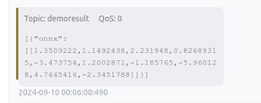
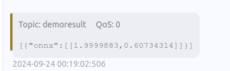

# 使用 eKuiper 函数插件运行ONNX模型

[LF Edge eKuiper](https://www.lfedge.org/projects/ekuiper/) 是一款边缘轻量级物联网数据分析/流软件，可在各种资源受限的物联网设备上运行。

[ONNX](https://onnx.ai/get-started.html) 是一种针对机器学习所设计的开放式的文件格式，用于存储训练好的模型。它使得不同的人工智能框架可以采用相同格式存储模型数据并交互。

通过集成 eKuiper 和 ONNX，用户只需要上传预先构建的 ONNX 模型， 即可在规则中使用该模型来分析流中的数据。 在本教程中，我们将演示如何通过 ekuiper 快速调用已预先训练好的 ONNX 模型。

## 先决条件

### 模型下载

如需运行 ONNX 解释器，我们需要一个经过训练的模型。在本教程中，我们将不介绍如何训练和涵盖这个模型，您可以通过查看 [ONNX tutorials](https://github.com/onnx/tutorials#converting-to-onnx-format) 了解如何做到这一点。我们既可以训练一个新的模型，也可以选择已训练好的模型。
在本教程中，我们将使用 [yalue/go onnxruntime](https://github.com/yalue/onnxruntime_go_examples) 的 [sum_and_difference](https://github.com/yalue/onnxruntime_go_examples/tree/master/sum_and_difference) 模型和 [MNIST-12](https://github.com/onnx/models/tree/ddbbd1274c8387e3745778705810c340dea3d8c7/validated/vision/classification/mnist) 演示。

### 运行 eKuiper

本教程使用团队发布的 eKuiper v2 和 Rest API 演示。如果你想使用eKuiper manager Docker也可以，其使用安装方法及简单使用方法请参考[这里](https://hub.docker.com/r/emqx/ekuiper-manager)。

### ONNX 插件安装

在运行模型推理之前，需要先安装 ONNX 插件。
安装 ONNX 插件不需要类似于 TensorFlow Lite 手动构建C API，只需像 Echo 等插件一样构建即可，详情请参考 [函数扩展](https://ekuiper.org/docs/zh/latest/extension/native/develop/function.html)。

## MNIST-12 模型运行

请自行下载[MNIST-12 模型](https://github.com/onnx/models/blob/ddbbd1274c8387e3745778705810c340dea3d8c7/validated/vision/classification/mnist/model/mnist-12.onnx), 预测图片中的数字。
用户需准备 MQTT Broker 并自行创建 MQTT 源用于向 eKuiper rule 发送待处理的数据并将推理结果发送回 MQTT Broker。

### MQTT 源

注意模型输入数据格式必须为浮点数组, 因此需要在数据源中指定数据类型，由源将其预处理为字节数组。

```shell
POST /streams
Content-Type: application/json

{
  "sql": "CREATE STREAM onnxPubImg (data array(float)) WITH (DATASOURCE=\"onnxPubImg\", FORMAT=\"json\")"
}
```

### 模型上传

用户可以通过 eKuiper manager 上传模型文件到 eKuiper。如下图所示。也可以自行将模型文件放置在`{$build_output}/data/uploads`目录下。


### 调用模型

用户安装完 ONNX 插件后，可以在 SQL 中按正常内置函数那样调用模型。第一个参数为模型名称，第二个参数为待处理数据。
类似于下图，这里选择使用Rest API 调用模型。


Rest API 创建规则以调用模型：

```shell
{
    "id": "ruleOnnx",
    "sql": "SELECT onnx(\"mnist\",data) FROM onnxPubImg",
    "actions": [
        {
            "log": {},
            "mqtt": {
                "server": "tcp://127.0.0.1:1883",
                "topic": "demoresult"
            }
        }
    ]
}
```

### 验证结果

结果如下图所示，输入图片之后，推导出图片中不同数字的输出可能性。



你可以使用类似如下程序的方式来发送图片，图片位于ONNX目录下。

```go
func TestPic(t *testing.T) {
    const TOPIC = "onnxPubImg"

    images := []string{
        "img.png",
        // 其他你需要的图像
    }
    opts := mqtt.NewClientOptions().AddBroker("tcp://localhost:1883")
    client := mqtt.NewClient(opts)
    if token := client.Connect(); token.Wait() && token.Error() != nil {
        panic(token.Error())
    }
    for _, image := range images {
        fmt.Println("Publishing " + image)
        inputImage, err := NewProcessedImage(image, false)

        if err != nil {
            fmt.Println(err)
            continue
        }
        // payload, err := os.ReadFile(image)
        payloadF32 := inputImage.GetNetworkInput()

        data := make([]any, len(payloadF32))
        for i := 0; i < len(data); i++ {
            data[i] = payloadF32[i]
        }
        payloadUnMarshal := MqttPayLoadFloat32Slice{
            Data: payloadF32,
        }
        payload, err := json.Marshal(payloadUnMarshal)
        if err != nil {
            fmt.Println(err)
            continue
        } else {
            fmt.Println(string(payload))
        }
        if token := client.Publish(TOPIC, 2, true, payload); token.Wait() && token.Error() != nil {
            fmt.Println(token.Error())
        } else {
            fmt.Println("Published " + image)
        }
        time.Sleep(1 * time.Second)
        }
    client.Disconnect(0)
}
```

## Sum_and_difference 模型运行

请自行下载[sum_and_difference 模型](https://github.com/yalue/onnxruntime_go_examples/blob/master/sum_and_difference/sum_and_difference.onnx), 此模型预估输入值的总和和最大差值。例如用户输入 [0.2 0.3 0.6 0.9], 则预估总和为 2，最大差值为 0.7。
用户需准备 MQTT Broker 并自行创建 MQTT 源用于向 eKuiper rule 发送待处理的数据并将推理结果发送回 MQTT Broker。

### Sum_and_difference模型上传

用户可以通过 eKuiper manager 上传模型文件到 eKuiper。类似于下图。也可以自行将模型文件放置在`{$build_output}/data/uploads`目录下。


### 调用Sum_and_difference模型

用户安装完 ONNX 插件后，可以在 SQL 中按正常内置函数那样调用模型。第一个参数为模型名称，第二个参数为待处理数据。
类似于下图，这里选择使用Rest API 调用模型。


```shell
POST /rules

{
    "id": "ruleSum",
    "sql": "SELECT onnx(\"sum_and_difference\",data) FROM sum_diff_stream",
    "actions": [
        {
            "log": {},
            "mqtt": {
                "server": "tcp://127.0.0.1:1883",
                "topic": "demoresult"
            }
        }
    ]
}
```

### 验证Sum_and_difference模型推理结果

结果如下图所示，数据经过推理后，返回结果为：

```json
[{ "onnx": [[1.9999883, 0.60734314]] }]
```



你可以使用 MQTT 客户端发送测试数据。

```json
{
  "data": [0.2, 0.3, 0.6, 0.9]
}
```

## 结论

在本教程中，我们通过预编译的 ONNX 插件，在 ekuiper 中直接调用预先训练好的 ONNX 模型，避免了编写代码，简化了推理步骤。通过支持ONNX，我们可以在 ekuiper 中轻松实现各种模型的推理，包括Pytorch模型、TensorFlow模型等。
