# 使用 eKuiper 函数插件运行TensorFlow Lite 模型

[LF Edge eKuiper](https://www.lfedge.org/projects/ekuiper/) 是一款边缘轻量级物联网数据分析/流软件，可在各种资源受限的物联网设备上运行。

[TensorFlow Lite](https://www.tensorflow.org/lite/guide) 是一组帮助开发人员在移动端、嵌入式和物联网设备上运行 TensorFlow
模型的工具，它使得设备上的机器学习预测具有低延迟和较小的二进制容量。

通过集成 eKuiper 和 TensorFlow Lite，用户只需要上传预先构建的 TensorFlow 模型， 即可在规则中使用该模型来分析流中的数据。 在本教程中，我们将演示如何通过 ekuiper 快速调用已预先训练好的 TensorFlow 模型。
4

## 先决条件

### 模型下载

如需运行 TensorFlow Lite 解释器，我们需要一个经过训练的模型。在本教程中，我们将不介绍如何训练和涵盖这个模型，您可以通过查看 [tflite converter](https://www.tensorflow.org/lite/convert) 了解如何做到这一点。我们既可以训练一个新的模型，也可以在线选择已训练好的模型。
在本教程中，我们将使用 [mattn/go tflite](https://github.com/mattn/go-tflite) 的 [sin](https://github.com/mattn/go-tflite/tree/master/_example/sin) 模型和 [mobilenet_v1_1.0_224](https://tfhub.dev/tensorflow/lite-model/mobilenet_v1_1.0_224/1/default/1) 演示。

### 运行 eKuiper

本教程使用团队发布的 eKuiper Docker 镜像 `lfedge/ekuiper:1.8.0-slim` 和 eKuiper manager Docker 镜像 `emqx/ekuiper-manager:1.8.0` 演示，安装方法及简单使用方法请参考[这里](https://hub.docker.com/r/emqx/ekuiper-manager)。

### TensorFlow Lite 插件下载

TensorFlow Lite 以预编译插件的形式提供，用户需自行下载安装。
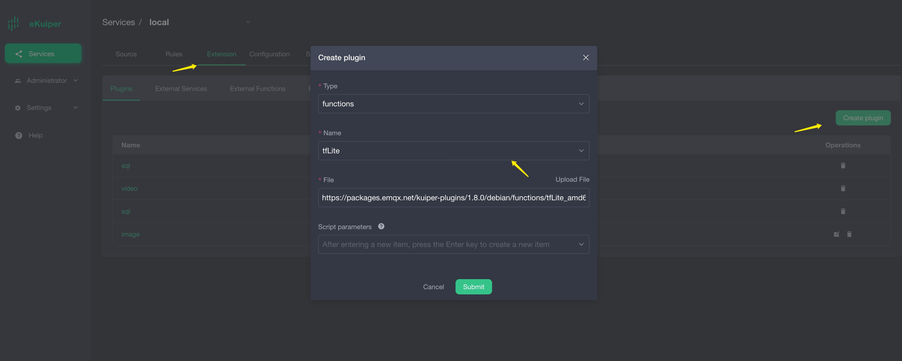
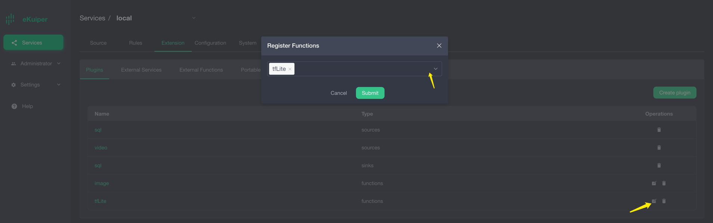

## Sin 模型运行

请自行下载 [sin 模型](https://github.com/mattn/go-tflite/blob/master/_example/sin/sin_model.tflite), 此模型根据输入值返回推理结果。例如用户输入 π/2, 取 1.57, 则计算结果 sin 1.57 约为 1。
用户需准备 MQTT Broker 并自行创建 MQTT 源用于向 eKuiper rule 发送待处理的数据并将推理结果发送回 MQTT Broker。

### MQTT 源

注意模型输入数据格式必须为字节数组, 而 json 不支持字节类型，因此需要在数据源中指定数据类型，由源将其预处理为字节数组。
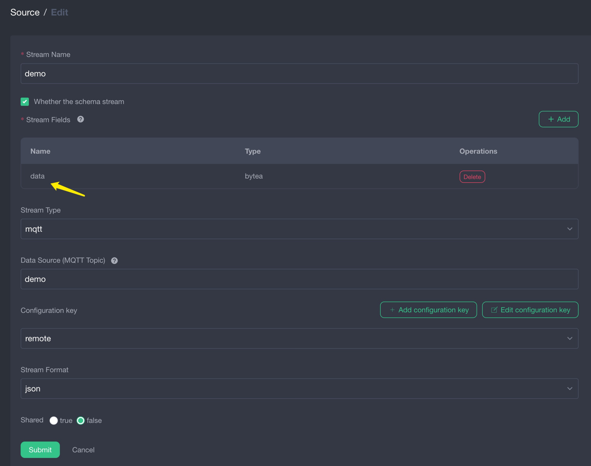

### 模型上传

用户可以通过 eKuiper manager 上传模型文件到 eKuiper。如下图所示。
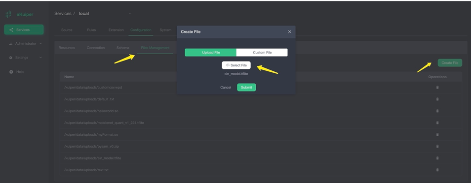

### 调用模型

用户安装完 TensorFlow Lite 插件后，可以在 SQL 中按正常内置函数那样调用模型。第一个参数为模型名称，第二个参数为待处理数据。
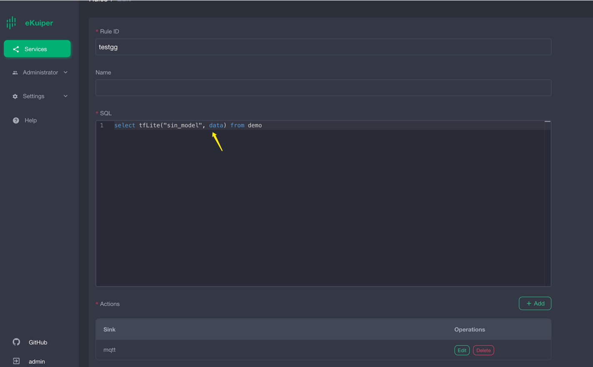

### 验证结果

结果如下图所示，当输入为 1.57 时，推导结果约为 1。
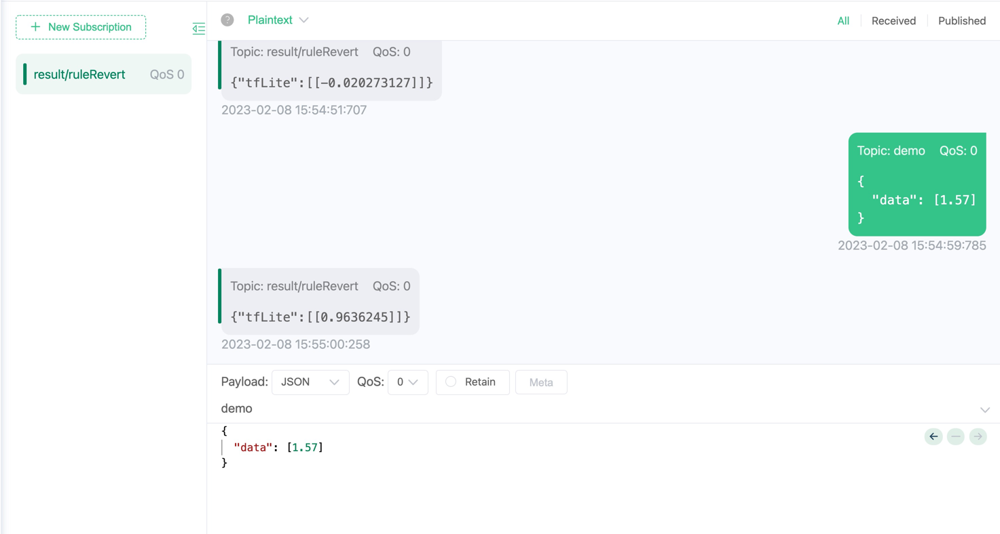

## MobileNet V1 模型运行

请自行下载 [MobileNet V1 模型](https://tfhub.dev/tensorflow/lite-model/mobilenet_v1_1.0_224/1/default/1), 此模型输入 224 * 224 像素的图像信息，返回大小为 1001 的 float 数组。
为了获取图片信息，我们利用另一个预编译 video 插件从直播源中定时提取图片作为规则的输入，并将推理结果发送到 MQTT Broker 中。

### video 源安装与配置

video 源定期从直播源中拉取数据并从中抽取图片数据。直播源可以采用[此链接](https://gcwbcdks.v.kcdnvip.com/gcwbcd/cdrmipanda_1/index.m3u8)。下图分别为 video 插件下载与配置。
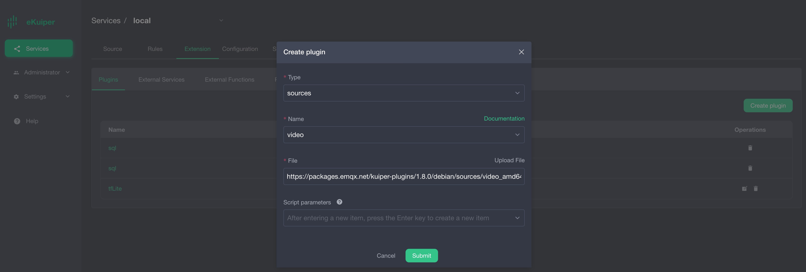
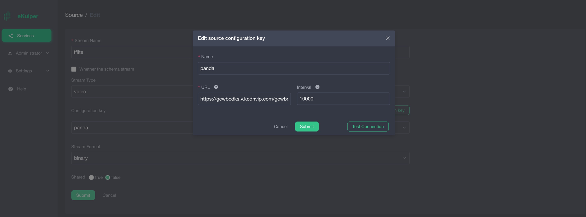

*注意*： 源数据格式部分应选为 binary 类型。

### image 函数插件安装

由于预编译模型需要 224 * 224 像素的图片数据，因此需要安装另一个预编译插件 image 来对图片进行 resize。
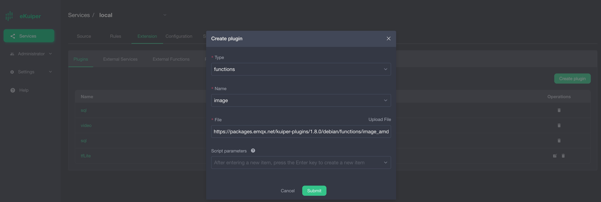
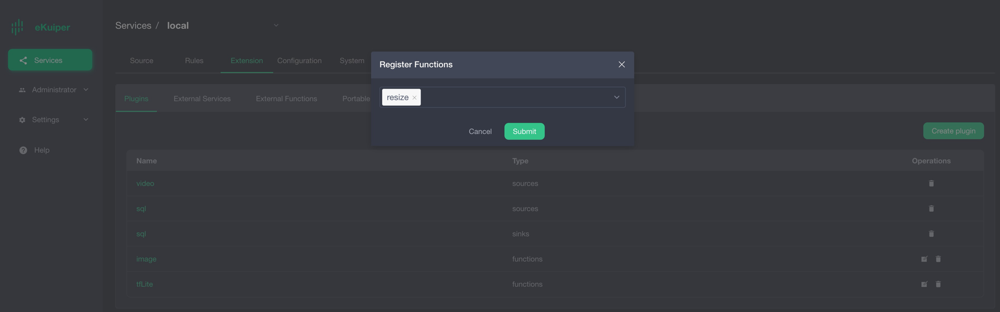

### 模型上传

用户可以通过 eKuiper manager 上传模型文件到 eKuiper。如下图所示。


### 调用模型

用户安装完 TensorFlow Lite 插件后，可以在 SQL 中按正常内置函数那样调用模型。第一个参数为模型名称，第二个参数为调用 resize 函数的返回结果。其中 `self` 为二进制数据对应的 key。
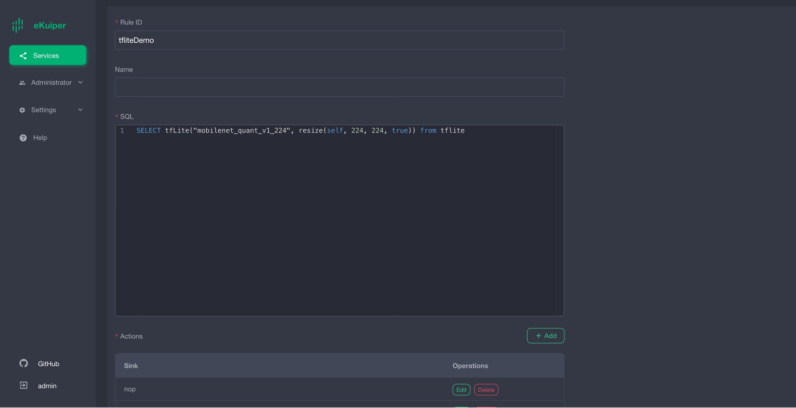

### 验证结果

结果如下图所示，图片数据经过推理后，返回结果为字节数组(经过 base64 编码)。
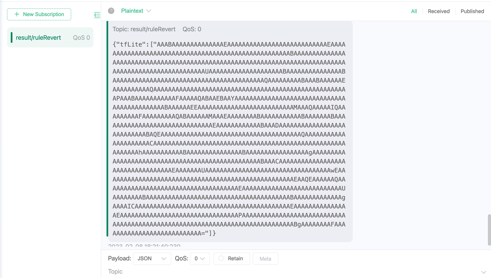

以下为经过 base64 译码后得到的字节数组，共有 1001 个元素。需要结合所测试模型来解释其意义。
在本例中，测试模型为图像识别模型，此模型共支持 1001 种物品分类，因此推导结果中的 1001 个元素与 1001 种物品按照顺序一一对应。例如第一个数组元素匹配第一个物品，其中元素的值代表匹配程度，值越大匹配度越高。
物品的列表可从[此处](https://github.com/lf-edge/ekuiper/blob/master/extensions/functions/labelImage/etc/labels.txt)获得。


用户可编写代码从中筛选出匹配度最高的物品标签,以下为示例代码

```go
package demo

import (
    "bufio"
    "os"
    "sort"
)

func loadLabels() ([]string, error) {
    labels := []string{}
    f, err := os.Open("./labels.txt")
    if err != nil {
        return nil, err
    }
    defer f.Close()
    scanner := bufio.NewScanner(f)
    for scanner.Scan() {
        labels = append(labels, scanner.Text())
    }
    return labels, nil
}

type result struct {
    score float64
    index int
}

func bestMatchLabel(keyValue map[string]interface{}) (string, bool) {
    labels, _ := loadLabels()
    resultArray := keyValue["tfLite"].([]interface{})
    outputArray := resultArray[0].([]byte)
    outputSize := len(outputArray)
    
    var results []result
    for i := 0; i < outputSize; i++ {
        score := float64(outputArray[i]) / 255.0
        if score < 0.2 {
            continue
        }
        results = append(results, result{score: score, index: i})
    }
    sort.Slice(results, func(i, j int) bool {
        return results[i].score > results[j].score
    })
    // output is the biggest score labelImage
    if len(results) > 0 {
        return labels[results[0].index], true
    } else {
        return "", true
    }

}
```

## 结论

在本教程中，我们通过预编译的 TensorFlow Lite 插件，在 ekuiper 中直接调用预先训练好的 TensorFlow Lite 模型，避免了编写代码，简化了推理步骤。
