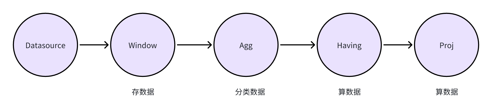
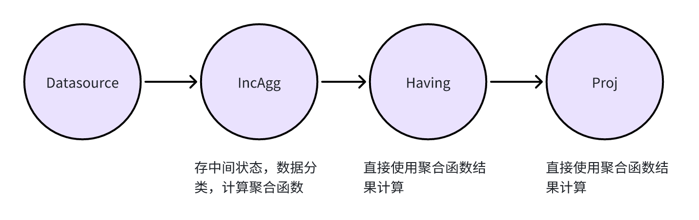
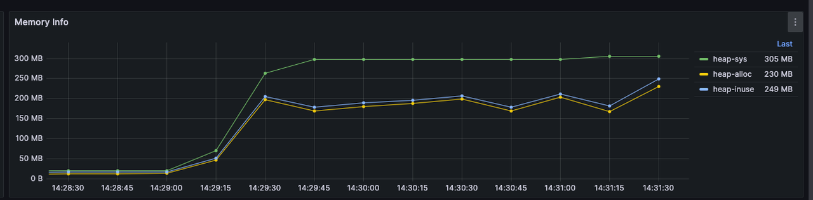
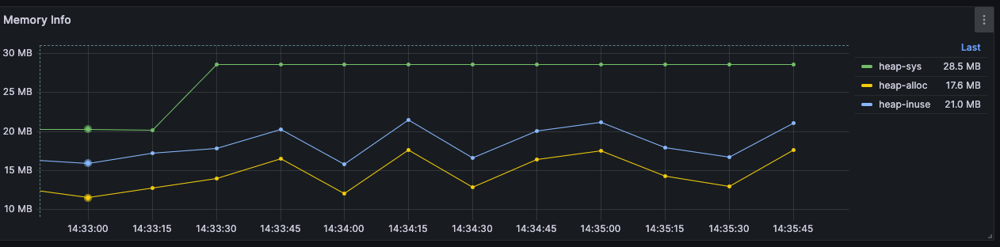

# 增量计算

## 背景

在目前的 ekuiper 中，当我们需要对数据进行聚合计算，往往需要将流数据以窗口的形式进行切分，聚合，然后再进行计算。以如下的 SQL 为例:

```sql
select avg(a) from stream group by tumblingWindow(ss,10),b;
```

在 ekuiper 的算子模型中，对于聚合计算会依次拆分为三个算子:

```txt
Window 算子 -> Group By 算子 -> Proj （计算) 算子
```

即流式数据会先在 Window 算子进行集合，然后交给 Group by 算子进行分类，最后在 Project 算子中进行计算。这个做法的对于任何聚合计算都可以适用，但存在以下问题:
1. 当窗口过大时，会占用更多内存
2. 有些聚合函数可以流式处理的特性未被利用到

对于聚合函数 avg，当这个聚合函数在处理流式数据时，我们并不需要等待所有数据在窗口中集合完毕才进行计算，我们可以每读取到一个数据时，更新 2 个中间状态，即 sum 和 count。当窗口数据读完以后，我们所需要的 avg 值也可通过 sum/count 来直接获取。

## 如何实现增量计算

在讨论如何实现增量计算之前，我们可以先看下对于如下 SQL，之前的 eKuiper 是如何创建规则的:

```sql
select sum(b) from demo group by tumblingwindow(ss, 10),c  having avg(a) > 0; 
```

```sql
{"op":"ProjectPlan_0","info":"Fields:[ Call:{ name:sum, args:[demo.b] } ]"}
        {"op":"HavingPlan_1","info":"Condition:{ binaryExpr:{ Call:{ name:avg, args:[demo.a] } > 0 } }, "}
                        {"op":"AggregatePlan_2","info":"Dimension:{ demo.c }"}
                                        {"op":"WindowPlan_3","info":"{ length:10, windowType:TUMBLING_WINDOW, limit: 0 }"}
                                                        {"op":"DataSourcePlan_4","info":"StreamName: demo, StreamFields:[ a, b, c ]"}
```

从 explain 的结果中可以看到，eKuiper 会创建 5个算子分别对流式数据进行处理。 Datasource 算子会将数据持续从 stream 中读取，而 Window 算子则会将数据按照 tumbling window 所定义的方式进行聚合。当窗口数据聚合完毕后，Aggregate 算子会将数据按照 c 列进行分类，最后 having 算子和 Project 算子会分别算出 avg(a) 和 sum(b) 这两个函数的值，并进行相应的计算。



### 算子角度

从算子角度来看，为了实现增量计算，我们需要将推倒之前的将存、聚、算，三者分开实现算子的方案，而是需要一个三者合并为一个算子的方案。

对于增量计算的聚合算子来说，和之前将存、聚、算，三者分开实现算子的方案而言，我们需要将三者合并为一个算子。即当数据来临时，我们需要将数据直接交给聚合算子进行计算，在每个窗口中实时的将数据按照 group by 列进行分类，按照聚合函数进行计算并保存中间结果。

如此一来，便无需再保存原本的数据，就能实时的计算结果。而对于后续的 Having 算子和 Proj 算子，则他们并不需要去计算聚合函数的值，而是直接用已经算好的聚合函数的值来进行计算。为了达到这个目的，我们需要创建一个新的算子来实现这一功能



在 eKuiper 的实现中，当开启增量计算后，eKuiper 会在 IncAggWindow 算子中去实现实时的将数据的聚合和计算做出结果，如下图所示。

```sql
{"op":"ProjectPlan_0","info":"Fields:[ Call:{ name:bypass, args:[$$default.inc_agg_col_1] } ]"}
        {"op":"HavingPlan_1","info":"Condition:{ binaryExpr:{ Call:{ name:bypass, args:[$$default.inc_agg_col_2] } > 0 } }, "}
                        {"op":"IncAggWindowPlan_2","info":"wType:TUMBLING_WINDOW, Dimension:[demo.c], funcs:[Call:{ name:inc_sum, args:[demo.b] }->inc_agg_col_1,Call:{ name:inc_avg, args:[demo.a] }->inc_agg_col_2]"}
                                        {"op":"DataSourcePlan_3","info":"StreamName: demo, StreamFields:[ a, b, c, inc_agg_col_1, inc_agg_col_2 ]"}
```

## 启用增量计算

对于以下场景，我们在一个窗口内用 `count` 来进行聚合计算:

```json
{
  "id": "rule",
  "sql": "SELECT count(*) from demo group by countwindow(4)",
  "actions": [
    {
      "log": {
      }
    }
  ],
  "options" :{
  }
}
```

对于以上规则，我们可以通过 [explain api](../../api/restapi/rules.md#查询规则计划) 来查询规则的查询计划:

```txt
{"op":"ProjectPlan_0","info":"Fields:[ Call:{ name:count, args:[*] } ]"}
    {"op":"WindowPlan_1","info":"{ length:4, windowType:COUNT_WINDOW, limit: 0 }"}
            {"op":"DataSourcePlan_2","info":"StreamName: demo"}
```

通过上述查询计划，我们可以了解到上述规则在实际运行时，会将数据缓存在内存中，等窗口结束后再进行计算，这可能会导致内存消耗过大。

我们可以通过在 `options` 中启用增量计算，以以下规则为例:

```json
{
  "id": "rule",
  "sql": "SELECT count(*) from demo group by countwindow(4)",
  "actions": [
    {
      "log": {
      }
    }
  ],
  "options" :{
    "planOptimizeStrategy": {
      "enableIncrementalWindow": true
    }
  }
}
```

然后查看查询计划:

```txt
{"op":"ProjectPlan_0","info":"Fields:[ Call:{ name:bypass, args:[$$default.inc_agg_col_1] } ]"}
    {"op":"IncAggWindowPlan_1","info":"wType:COUNT_WINDOW, funcs:[Call:{ name:inc_count, args:[*] }->inc_agg_col_1]"}
            {"op":"DataSourcePlan_2","info":"StreamName: demo, StreamFields:[ inc_agg_col_1 ]"}
```

通过上述查询计划，可以发现在该规则运行时，它的计划从 `WindowPlan` 改变为了 `IncAggWindowPlan`, 这代表了数据进入该窗口后会直接进行计算，而非缓存在内存内。

## 无法使用增量计算的场景

当存在某一个聚合函数本身无法被增量计算时，即使打开了增量计算也没有作用，如下述规则所示:

```json
{
    "id": "rule",
    "sql": "SELECT count(*), stddev(a) from demo group by countwindow(4)",
    "actions": [
        {
            "log": {
            }
        }
    ],
    "options" :{
        "planOptimizeStrategy": {
            "enableIncrementalWindow": true
        }
    }
}
```

查看查询计划:

```txt
{"op":"ProjectPlan_0","info":"Fields:[ Call:{ name:count, args:[*] }, Call:{ name:stddev, args:[demo.a] } ]"}
    {"op":"WindowPlan_1","info":"{ length:4, windowType:COUNT_WINDOW, limit: 0 }"}
            {"op":"DataSourcePlan_2","info":"StreamName: demo"}
```

可以看到由于 `stddev` 是一个不支持增量计算的聚合函数，所以这个规则的查询计划中并没有打开增量计算。

## 开启增量计算前后的内存使用对比

针对以下规则， 我们可以对比开启增量计算和未开启增量计算时，在同样的数据量的情况下，内存的使用对比:

```json
{
  "id": "rule1",
  "sql": "select sum(b) from demo group by tumblingwindow(ss, 10) having avg(a) > 0;",
  "options": {
      "planOptimizeStrategy" : {
          "enableIncrementalWindow": true
      }
  },
  "actions": [
      {
          "log":{}
      }
  ]
}
```

### 未开启增量计算



### 开启增量计算


