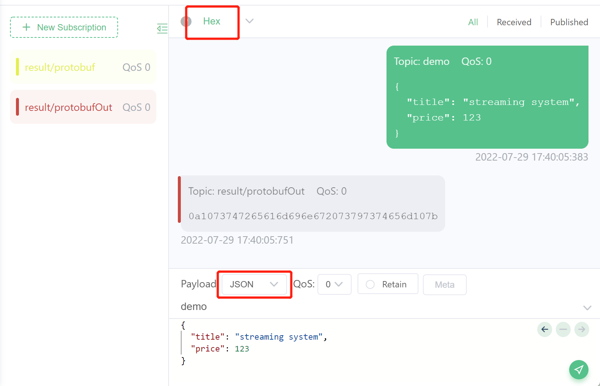

# 使用 eKuiper 处理 Protocol Buffers 数据

LF Edge eKuiper 通过 source 和 sink 连接各种通信协议，例如 MQTT，HTTP 等协议的外部系统。eKuiper 支持配置 source/sink 的传输数据的编解码格式，目前可支持 JSON，ProtoBuf 和 Binary 格式。Protocol Buffers (Protobuf) 是一种语言中立、平台中立的可扩展机制，用于序列化结构化数据的二进制传输格式。Protobuf 相比常规数据传输格式（如JSON或XML）更加高效和快速并节省传输带宽，因此得到了广泛的应用。

本教程以 Protobuf 格式为例，讲解如何在 eKuiper 中设置编解码格式，通过 source 读入并解析该格式的数据以及在sink中使用该格式编码写入。本教程采用 eKuiper Manager 进行规则的创建和管理，请参考[UI 教程](../../operation/manager-ui/overview.md)。您也可以采用[REST API](../../api/restapi/overview.md)或者在 eKuiper 运行的边端运行[命令行工具](../../api/cli/overview.md)来完成相同的规则管理操作。

开始动手操作之前，需要准备以下环境：

- MQTT broker 用于数据传输。本教程使用位于 `tcp://broker.emqx.io:1883` 的 MQTT 服务器， `broker.emqx.io` 是一个由 [EMQ](https://www.emqx.cn) 提供的公有 MQTT 服务器。若本地运行 eKuiper，需要更改 `etc/mqtt_source.yaml`，配置项 server 改为"tcp://broker.emqx.io:1883"；若使用 docker 启动，应设置环境变量 MQTT_SOURCE__DEFAULT__SERVER="tcp://broker.emqx.io:1883"。
- 为了方便观察运行结果，我们需要安装一个 MQTT 客户端，例如 [MQTT X](https://mqttx.app/) 。

## 模式注册（Schema Registry）

相比于无模式的 JSON 格式，Protobuf 需要提前定义数据结构，即模式。在 proto 文件中，可以包含多个 message 以及其他实体的定义，但是在编解码格式的配置中，只有 message 的定义可以被使用。 本教程中，我们使用以下模式进行数据结构的定义。该文件定义了一个名为 Book 的 message 结构，其中包含字符串类型的 title 和整型的 price。传输的数据将依据此结构对书籍数据进行二进制数据的编解码。

```protobuf
message Book {
  required string title = 1; 
  required int32 price = 2;
}
```

1. 注册模式。在管理控制台中，打开配置->模式，点击创建模式。
   
2. 在模式创建窗口中，如下图所示填写。其中，模式类型选择`protobuf`；模式名称可输入自定义的不重复的名称作为后续规则创建中模式的标识 id；模式内容可采用文件或者文本内容填写。选择 file 的情况下，需要填写文件所在的 url；本教程使用的模式较为简单，因此可选择 content，然后在内容框中填入 proto 文件的文本。
   
3. 点击提交。在模式列表中应当能够看到新创建的模式。后续可使用操作栏中的按钮进行修改或删除的操作。
   

至此，我们已经注册了名为`schema1`的模式，其中定义了`Book`这种类型，在规则的 source 和 sink 中可以使用该注册的模式。用户也可以继续在此界面进行更多的模式注册和管理工作。

## 读取 Protobuf 数据

本节中，我们以 MQTT source 为例，介绍如何接入并解析基于 Protobuf 编码传输的数据，使之可以在 eKuiper 中进行规则的计算。需要注意的是，在 Source 中，编码格式与传输协议并不是绑定的。任何的 source 类型如 MQTT， httpPull 等都可以搭配不同的编码格式，例如 ProtoBuf 和 JSON 等。

假设我们有一个 MQTT 主题 `demo`，出于节省传输带宽的目的，里面传输的数据为 Protobuf 编码的二进制数据。接下来，我们将配置 eKuiper 数据源，接入这个主题的数据并进行处理。

1. 创建数据流：在管理控制台中，选择源管理->流管理，点击创建流。
2. 配置数据流及其格式：流名称可设置为自定义的不重复的名称；数据源为要监听的 MQTT 主题；流类型设置为 mqtt；流格式选择 `protobuf`；模式名称选择上一步注册的 `schema1`；模式消息设置为 proto 文件里定义的 message `Book`。该配置表示数据流 `protoDemo` 将监听 MQTT 主题 `protoDemo`，收到二进制数据后将采用 `schema1` 中的 `Book` 的格式进行 protobuf 解码。点击提交，在流列表中应当列出新创建的流。
   
3. 创建规则：选择规则，点击新建规则，进入规则创建界面。如下图所示，右上角点击进入文本模式，输入自定义的规则ID，规则名字，在文本内容中输入规则的 JSON 文本。该规则表示选择流 `protoDemo` 中的内容，发送到 MQTT 主题 `result/protobuf` 中。

   ```json
   {
      "id": "ruleDecode",
      "sql": "SELECT * FROM protoDemo",
      "actions": [{
        "mqtt": {
          "server": "tcp://broker.emqx.io:1883",
          "topic": "result/protobuf",
          "sendSingle": true
        }
      }]
   }
   ```
   
4. 发送数据并查看结果：我们将使用 MQTTX 发送 Protobuf 编码后的二进制数据到 `protoDemo` 主题中，观察收到的结果是否是解码后的正确数据。
   1. 打开 MQTT X，连接到云端 `tcp://broker.emqx.io:1883`。
   2. 订阅主题上文规则发送结果的主题 `result/protobuf`，便于观察结果。
   3. 在消息发送窗格中，设置主题为  `protoDemo`，Payload 格式为 `Hex`, 发送根据 schema1 中 Book 格式编码的二进制数据，例如 `0a1073747265616d696e672073797374656d107b`。
      
   4. 确保接收窗口收到正确的 JSON 数据，如下图所示。
   

至此，我们完成了 Protobuf 数据的读取和解码并用简单的规则进行处理输出。用户像处理普通 JSON 格式数据一样创建各种各样的规则。若未得到预期结果，可在管理控制台的规则列表页面，查看规则状态，确保规则数据入出的指标符合预期。

## 写入 Protobuf 数据

本节中，我们将展示读取 JSON 格式数据进行处理后采用 Protobuf 格式发送到云端 MQTT broker 的用法。在物联网边云协同的场景中，该用法可节省边云传输的带宽开销。部署在边缘端的 eKuiper 接入本地的 MQTT broker 无需消耗带宽，可通过处理较快的 JSON 格式接入。规则运算之后，计算结果需要发送到云端 MQTT broker 时，可使用 Protobuf 编码节省带宽。

1. 创建数据流：在管理控制台中，选择源管理->流管理，点击创建流。如下图所示，创建一个连入 demo 主题，JSON 格式数据的流。
   
2. 创建规则，使用 Protobuf 格式发送到云端。
   1. 点击新建规则，输入自定义的 Rule ID 和名称，输入 SQL `SELECT * FROM demo`。
   2. 点击动作右边的新建按钮，配置 MQTT 动作。其中，MQTT 服务器地址配置为云端 broker 地址，MQTT 主题为 `result/protobufOut`；数据按条发送配置为 true，确保收到的为单条数据以匹配格式配置；流格式配置为 `protobuf`，模式名称为第一节注册的 `schema1`，模式消息为 `Book`。该规则将读取 JSON 数据，然后按照 Book 的格式编码成二进制数据发往 `result/protobufOut` 主题。点击提交，完成动作配置。
   
   
   3. 每个规则可以有多个动作，每个动作使用的编码格式是独立的。用户可以继续配置其余动作。全部配置完成后，点击提交，完成规则的创建。
3. 发送数据并查看结果，该流程与上一节类似。本次我们将向 demo 主题发送 JSON 数据，并期望在订阅的 `result/protobufOut` 主题中查看到 protobuf 编码的二进制数据。如下图所示，注意数据格式的配置以免显示乱码。
   

## 总结

本教程介绍了如何在 eKuiper 中进行 Protobuf 数据的读取和写入。ProtoBuf 格式是 eKuiper 对外连接的格式的一种，各种格式之间可以任意组合，接入系统后使用的都是内部的格式表示。首先，用户需要先定义 Protobuf 的模式；之后在流的创建和动作的创建中可配置 Protobuf 格式，并选择已定义的模式进行数据的编解码。

## 进一步阅读

- [编解码](./serialization.md)
- [Schema 管理 REST API](../../api/restapi/schemas.md)
- [Schema 管理命令行](../../api/cli/schemas.md)

