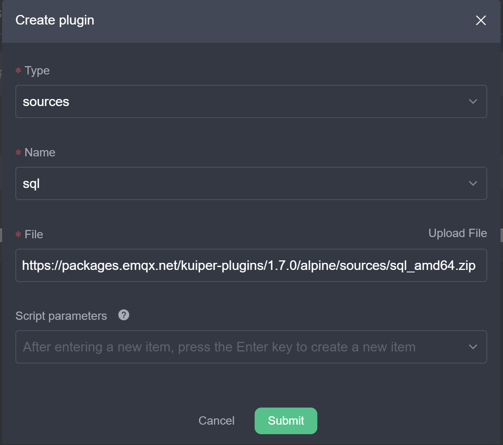

# 查询表使用场景

并非所有的数据都会经常变化，即使在实时计算中也是如此。在某些情况下，你可能需要用外部存储的静态数据来补全流数据。例如，用户元数据可能存储在一个关系数据库中，流数据中只有实时变化的数据，需要连接流数据与数据库中的批量数据才能补全出完整的数据。

在早期的版本中，eKuiper 支持了 Table 概念，用于在内存中保存较少数量的流数据，作为数据的快照供其他的流进行连接查询。这种 Table 适用于状态较少，状态实时性要求很高的场景。在 1.7.0 及之后的版本中，eKuiper 添加了新的查询表（Lookup Table）的概念，用于绑定外部静态数据，可以处理大量的批数据连接的需求。本教程主要基于查询表介绍如何进行批流结合计算。

## 动态预警场景

预警功能是边缘计算中最常见的场景之一。当告警标准固定时，我们通常可以通过简单的 `WHERE` 语句进行告警条件的匹配并触发动作。然而在更复杂的场景中，告警条件可能是动态可配置的，并且根据不同的数据维度，例如设备类型会有有不同的预警值。接下来，我们将讲解如何针对这个场景创建规则。当采集到数据后，规则需要根据动态预警值进行过滤警告。

### 场景输入

本场景中，我们有两个输入：

- 采集数据流，其中包含多种设备的实时采集数据。本教程中，采集的数据流通过 MQTT 协议进行实时发送。
- 预警值数据，每一类设备有对应的预警值，且预警值可更新。本教程中，预警值数据存储于 Redis 中。

针对这两种输入，我们分别创建流和查询表进行建模。

1. 创建数据流。假设数据流写入 MQTT Topic `scene1/data` 中，则我们可通过以下 REST API 创建名为 `demoStream` 的数据流。
   ```json
    {"sql":"CREATE STREAM demoStream() WITH (DATASOURCE=\"scene1/data\", FORMAT=\"json\", TYPE=\"mqtt\")"}
    ```
2. 创建查询表。假设预警值数据存储于 Redis 数据库0中，创建名为 `alertTable` 的查询表。此处，若使用其他存储方式，可将 `type` 替换为对应的 source 类型，例如 `sql`。
   ```json
    {"sql":"CREATE TABLE alertTable() WITH (DATASOURCE=\"0\", TYPE=\"redis\", KIND=\"lookup\")"}
    ```

### 预警值动态更新

动态预警值存储在 Redis 或者 Sqlite 等外部存储中。用户可通过应用程序对其进行更新也可通过 eKuiper 提供的 `Updatable Sink` 功能通过规则进行自动更新。本教程将使用规则，通过 Redis sink 对上文的 Redis 查询表进行动态更新。

预警值规则与常规规则无异，用户可接入任意的数据源，做任意数据计算，只需要确保输出结果中包含更新指令字段 `action`，例如 `{"action":"upsert","id":1,"alarm":50}`。本教程中，我们使用 MQTT 输入预警值更新指令通过规则更新 Redis 数据。

1. 创建 MQTT 流，绑定预警值更新指令数据流。假设更新指令通过 MQTT topic `scene1/alert` 发布。
   ```json
   {"sql":"CREATE STREAM alertStream() WITH (DATASOURCE=\"scene1/alert\", FORMAT=\"json\", TYPE=\"mqtt\")"}
   ```
2. 创建预警值更新规则。其中，规则接入了上一步创建的指令流，规则 SQL 只是简单的获取所有指令，然后在 action 中使用支持动态更新的 redis sink。配置了 redis 的地址，存储数据类型； key 使用的字段名设置为 `id`，更新类型使用的字段名设置为 `action`。这样，只需要保证指令流中包含 `id` 和 `action` 字段就可以对 Redis 进行更新了。
   ```json
   {
     "id": "ruleUpdateAlert",
     "sql":"SELECT * FROM alertStream",
     "actions":[
      {
        "redis": {
          "addr": "127.0.0.1:6379",
          "dataType": "string",
          "field": "id",
          "rowkindField": "action",
          "sendSingle": true
        }
     }]
   }
   ```

3. 接下来，我们可以向发送 MQTT 主题 `scene1/alert` 发送指令，更新预警值。例如：
   ```text
   {"action":"upsert","id":1,"alarm":50}
   {"action":"upsert","id":2,"alarm":80}
   {"action":"upsert","id":3,"alarm":20}
   {"action":"upsert","id":4,"alarm":50}
   {"action":"delete","id":4}
   {"action":"upsert","id":1,"alarm":55}
   ```

查看 Redis 数据库，应当可以看到数据被写入和更新。该规则为流式计算规则，后续也会根据订阅的数据进行持续的更新。

### 根据设备类型动态预警

前文中，我们已经创建了采集数据流，并且创建了可动态更新的预警条件查询表。接下来，我们可以创建规则，连接采集数据流与查询表以获取当前设备类型的预警值，然后判断是否需要预警。

```json
{
  "id": "ruleAlert",
  "sql":"SELECT device, value FROM demoStream INNER JOIN alertTable ON demoStream.deviceKind = alertTable.id WHERE demoStream.value > alertTable.alarm",
  "actions":[
    {
      "mqtt": {
        "server": "tcp://myhost:1883",
        "topic": "rule/alert",
        "sendSingle": true
      }
    }
  ]
}
```

在规则中，我们根据采集数据流中的 deviceKind 字段与查询表中的 id 字段（此处为 Redis 中的 key）进行连接，获得查询表中对应设备类型的预警值 `alarm`。接下来在 `WHERE` 语句中过滤出采集的数值超过预警值的数据，并将其发送到 MQTT 的 `rule/alert` 主题中进行告警。

发送 MQTT 指令到采集数据流的主题 `scene1/data`，模拟采集数据采集，观察规则告警结果。例如下列数据，虽然采集值相同，但因为不同的设备类型告警阈值不同，它们的告警情况可能有所区别。

```text
{"device":"device1","deviceKind":1,"value":54}
{"device":"device12","deviceKind":2,"value":54}
{"device":"device22","deviceKind":3,"value":54}
{"device":"device2","deviceKind":1,"value":54}
```

## 数据补全场景

流数据变化频繁，数据量大，通常只包含需要经常变化的数据；而不变或者变化较少的数据通常存储于数据库等外部存储中。在应用处理时，通常需要将流数据中缺少的静态数据补全。例如，流数据中包含了设备的 ID，但设备的具体名称，型号的描述数据存储于数据库中。本场景中，我们将介绍如何将流数据与批数据结合，进行自动数据补全。

### SQL 插件安装和配置

本场景将使用 MySQL 作为外部表数据存储位置。eKuiper 提供了预编译的 SQL source 插件，可访问 MySQL 数据并将其作为查询表。因此，在开始教程之前，我们需要先安装 SQL source 插件。使用 eKuiper manager 管理控制台，可直接在插件管理中，点击创建插件，如下图选择 SQL source 插件进行安装。



本场景将以 MySQL 为例，介绍如何与关系数据库进行连接。用户需要启动 MySQL 实例。在 MySQL 中创建表 `devices`, 其中包含 `id`, `name`, `deviceKind` 等字段并提前写入内容。

在管理控制台中，创建 SQL source 配置，指向创建的 MySQL 实例。由于 SQL 数据库 IO 延迟较大，用户可配置是否启用查询缓存及缓存过期时间等。

```yaml
  lookup:
    cache: true # 启用缓存
    cacheTtl: 600 # 缓存过期时间
    cacheMissingKey: true # 是否缓存未命中的情况
```

### 场景输入

本场景中，我们有两个输入：

- 采集数据流，与场景1相同，包含多种设备的实时采集数据。本教程中，采集的数据流通过 MQTT 协议进行实时发送。
- 设备信息表，每一类设备对应的名字，型号等元数据。本教程中，设备信息数据存储于 MySQL 中。

针对这两种输入，我们分别创建流和查询表进行建模。

1. 创建数据流。假设数据流写入 MQTT Topic `scene2/data` 中，则我们可通过以下 REST API 创建名为 `demoStream2` 的数据流。
   ```json
    {"sql":"CREATE STREAM demoStream2() WITH (DATASOURCE=\"scene2/data\", FORMAT=\"json\", TYPE=\"mqtt\")"}
    ```
2. 创建查询表。假设设备数据存储于 MySQL 数据库 devices 中，创建名为 `deviceTable` 的查询表。CONF_KEY 设置为上一节中创建的 SQL source 配置。
   ```json
    {"sql":"CREATE TABLE deviceTable() WITH (DATASOURCE=\"devices\", CONF_KEY=\"mysql\",TYPE=\"sql\", KIND=\"lookup\")"}
    ```
   
### 数据补全规则

流和表都创建完成后，我们就可以创建补全规则了。

```json
{
  "id": "ruleLookup",
  "sql": "SELECT * FROM demoStream2 INNER JOIN deviceTable ON demoStream.deviceId = deviceTable.id",
  "actions": [{
    "mqtt": {
      "server": "tcp://myhost:1883",
      "topic": "rule/lookup",
      "sendSingle": true
    }
  }]
}
```

在这个规则中，通过流数据中的 deviceId 字段与设备数据库中的 id 进行匹配连接，并输出完整的数据。用户可以根据需要，在 `select` 语句中选择所需的字段。

## 总结

本教程以两个场景为例，介绍了如何使用查询表进行流批结合的计算。我们分别使用了 Redis 和 MySQL 作为外部查询表的类型并展示了如何通过规则动态更新外部存储的数据。用户可以使用查询表工具探索更多的流批结合运算的场景。