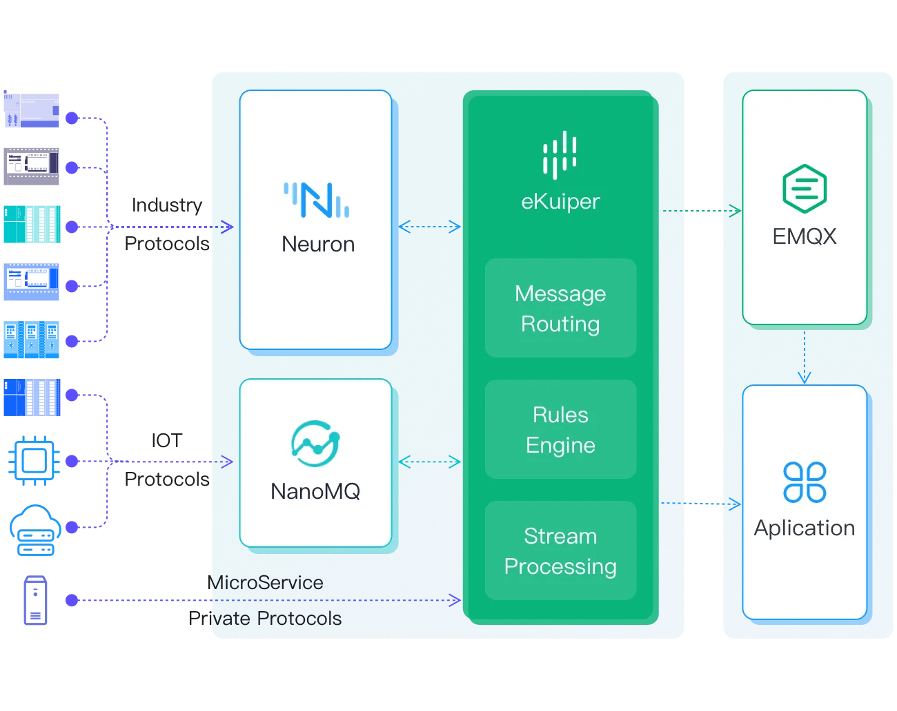

# 边云协同

基于开源产品，我们可以建立一个边云协作解决方案，应用于IIoT（工业物联网）、IoV（车联网）和其他物联网应用，如智慧城市等。

在这个解决方案中，eKuiper与以下开源产品集成。

- [Neuron](https://neugates.io/): 轻量级IIoT连接服务器
- [NanoMQ](https://nanomq.io/)：用于物联网边缘的超轻量级 MQTT 消息服务器
- [EMQX](https://www.emqx.io/)：大规模分布式物联网 MQTT 消息服务器

该解决方案实现了大量工业设备数据的连接、移动、处理、存储和分析。

eKuiper 部署在边缘侧，在整个架构的中间位置进行流处理、规则引擎和消息路由等。它可以从边缘的 Neuron、NanoMQ 或一般的 HTTP 服务中获取数据，对其进行处理或分析，并将结果发布到云端的EMQX或保存到本地存储。

关于如何处理 Neuron 收集的数据的细节，请查看[ Neuron 集成教程](../neuron/neuron_integration_tutorial.md)。