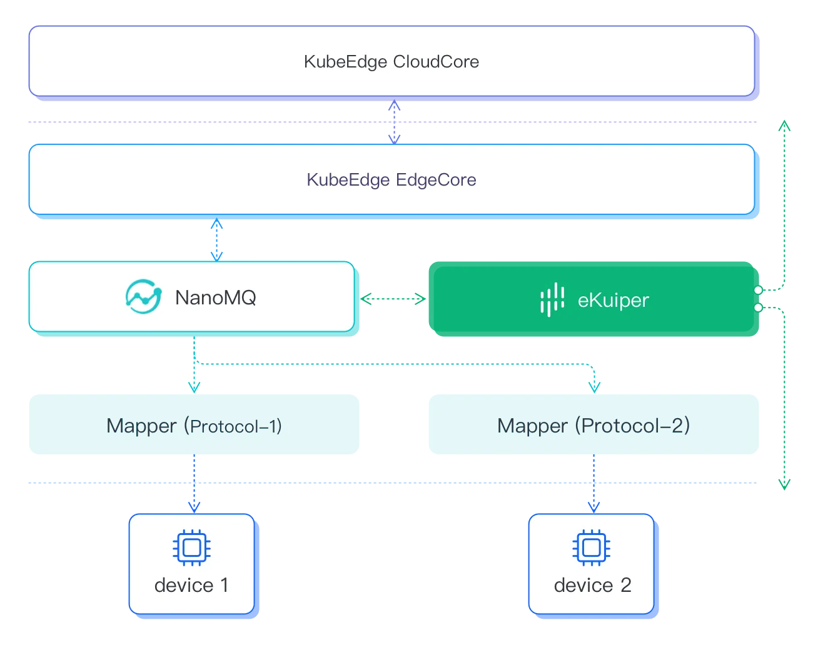

# KubeEdge 的分析引擎

[KubeEdge](https://kubeedge.io/) 是一个开源系统，用于将容器化应用程序编排功能扩展到 Edge 的主机。它基于 kubernetes 构建，并为网络应用程序提供基础架构支持。

作为一个兼容 kubernetes 的系统，KubeEdge 能够实现 eKuiper 实例的容器化部署。请查看 [installation](../../installation.md#通过-helm-安装k8sk3s)了解如何在类 k8s 系统中安装 eKuiper。

KubeEdge 的边缘部分使用 MQTT 在 deviceTwin 和设备之间进行通信。为了在双 mqtt 或外部模式下使用KubeEdge，用户可以将 MQTT 消息服务器配置为边缘节点的 NanoMQ。

eKuiper 可以从 MQTT 订阅设备数据，并为 KubeEdge 组件提供多功能的分析能力，以实现边缘的低延迟计算。
