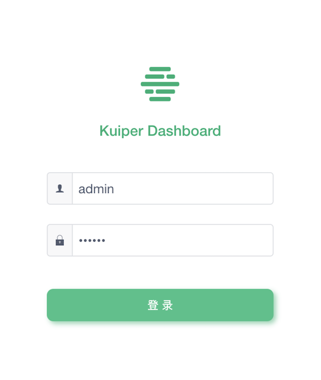
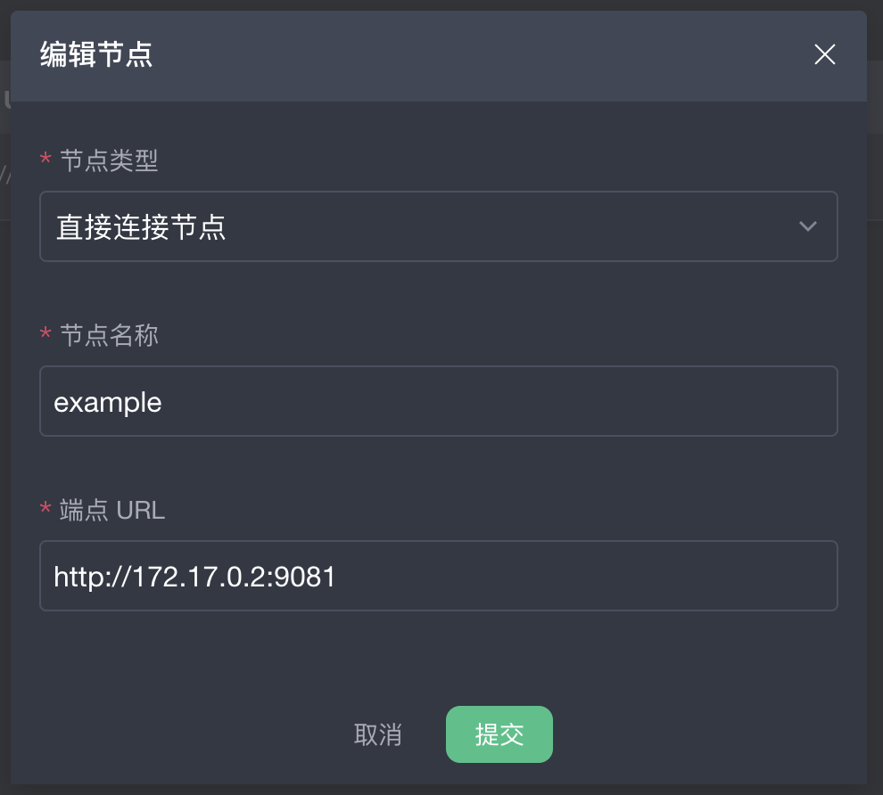
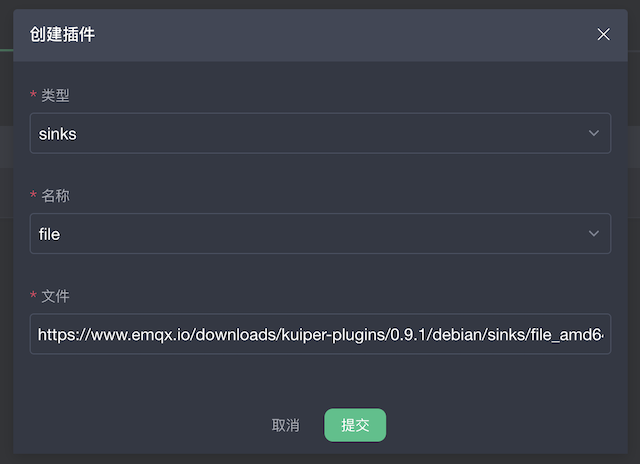
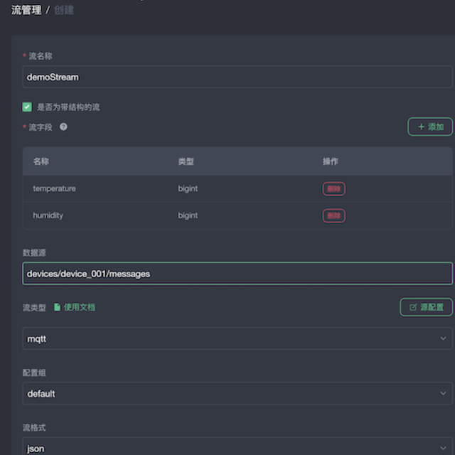
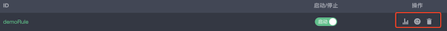

## Kuiper 管理控制台的使用

### 概览

从 Kuiper 0.9.1 版本开始，每发布一个 Kuiper 新版本，会随之发布对应版本的管理控制台。本文以一个实际例子来说明如何使用管理控制台对 Kuiper 节点进行操作与管理。本例将 MQTT 订阅到的数据发送到指定的文件中，演示说明如下：

- 创建一个 Kuiper 节点
- 创建一个流，用于订阅 source 端的数据。（本例演示订阅 MQTT 服务器，地址为：`tcp://broker.emqx.io:1883`，主题为：`devices/device_001/messages`，订阅数据为：`{"temperature": 40, "humidity" : 20}`）
- 创建一个规则，用于计算订阅到的数据，并将数据写入 sink 端。（本例演示将订阅到的消息写入到文件中）
- source 和 sink 支持多种类别，只需安装相对应的插件，便能实现对应的功能。（本例的 source 为 MQTT， 插件已内置，无需安装；source 为 file，插件未内置，需要安装）

### 架构设计

* Kuiper 端：提供 source 到 sink 端的数据计算与传输。
* Kuiper-Manager 端：提供用户管理，权限验证等服务。
* UI 端：提供可视化的界面，便于用户操作。


### 安装管理控制台

#### 安装 kuiper

- 从 `https://hub.docker.com/r/emqx/kuiper/tags` 拉取 Kuiper 的 Docker 镜像。本例使用`slim`镜像。

- 运行 kuiper 容器，(为了方便，我们将使用由 [EMQ](https://www.emqx.io) 提供的公有 MQTT 服务器，在运行容器时可通过 -e 选项设置地址。)

  ```shell
  docker run -d --name kuiper -e MQTT_SOURCE__DEFAULT__SERVERS=[tcp://broker.emqx.io:1883] emqx/kuiper:$(tag)
  ```

#### 安装管理控制台

- 从`https://hub.docker.com/r/emqx/kuiper-manager/tags`拉取kuiper-manager 的 Docker 镜像 。（0.9.1-ief 为华为用户专用镜像，本例使用0.9.1镜像）

- 运行 kuiper-manager 容器并暴露接口：

  ```shell
  docker run --name kuiperManager -d -p 9082:9082 $(tag)
  ```

#### 登录 kuiper-manager

登录时需要提供 kuiper-manager 的地址，用户名、密码。样例如下图所示：

* 地址：http://127.0.0.1:9082

* 用户名：admin

* 密码：public

  

#### 创建 Kuiper 节点

创建 kuiper 节点时需要填写 Node type、Node name、Endpoint 。

* Node type : 选择 `直接连接节点`  (`华为 IEF 节点` 专用于华为用户)。

* Node name : 自拟，本例为：example。

* Endpoint ：http://$IP:9081，IP获取命令如下：

  ```shell
  docker inspect $(Kuiper CONTAINER ID) |  grep IPAddress
  ```

创建 Kuiper 节点样例如下图所示：



#### 安装插件

**注意：插件安装、并且通过规则使用后，插件已经被加载到内存中，由于 Golang 语言的限制，在插件删除的时候，无法将其真正卸载，所以想重新进行插件的安装，Kuiper 必须重启才可生效；目前只支持在 debian 的 Docker 环境里的插件安装，其余环境暂不支持。**

在下拉列表中选择一个名为 file 的 sinks 插件进行下载，该插件将数据写入到用户指定的文件中。如下图所示：



#### 创建流

如下图，创建一个名为 demoStream 的流，用于订阅地址为 tcp://broker.emqx.io:1883 的 mqtt 服务器消息， 消息主题为 devices/device_001/messages，消息内容为 [{"temperature": 40, "humidity" : 20}]。



#### 创建规则

如下图，创建一条名为 demoRule 的规则，将订阅数据中 temperature > 30 的数据写入文件中。


本例文件路径为：/kuiper/demoFile ，通过下图进行设置


#### 查看执行结果

* 进入 Kuiper 容器创建文件：

```shell
docker exec -it $(kuiper CONTAINER ID) sh
touch demoFile
tail -f demoFile
```

* 使用 MQTT 客户端工具 mosquitto_pub 将传感器数据发送到 MQTT 服务器 `tcp://broker.emqx.io:1883`的主题 `devices/device_001/messages`  中，命令如下。如一切正常，此时名为`demoFile`的文件将收到数据：`[{"temperature": 40, "humidity" : 20}]`。

```shell
mosquitto_pub -h broker.emqx.io -m '{"temperature": 40, "humidity" : 20}' -t devices/device_001/messages
```

#### 了解更多

##### 关于 Source

上文中，我们在运行容器时通过 -e 选项设置了 MQTT 的地址，数据写到了 MQTT 的配置文件中，通过以下命令可以查看：

```shell
docker exec -it $(Kuiper CONTAINER ID) sh
cat etc/mqtt_source.yaml
```

输出为：

```yaml
default:
  concurrency: 1
  qos: 1
  servers:
  - tcp://broker.emqx.io:1883
  sharedSubscription: true
demo_conf:
  qos: 0
  servers:
  - tcp://10.211.55.6:1883
  - tcp://127.0.0.1
```

上文中，在创建流时选择的配置组为 default ，如上图所示，程序将使用 default 下的配置。同理，用户也可以根据需求编写自己的配置，具体操作为：在创建流的页面中点击`源配置`，如下图所示：


如下图所示，选项中提供了三个 icon ，从左到右依次代表：规则状态、重启规则、删除规则，用户可按需操作。



### 扩展阅读

- [如何将自定义的插件展示在管理控制台的安装列表](plugins_in_manager.md)：Kuiper 提供了插件的扩展机制，用户可以基于扩展接口来实现自定义的插件。在管理控制台上，用户可以直接通过界面进行插件的安装。如果读者有自定义的插件，也想出现在管理控制台的安装列表中，该文章可以给读者一些参考。
- [EMQ edge-stack 项目](https://github.com/emqx/edge-stack)：该项目可以让用户更简单地实现 EMQ 边缘系列产品的安装和试用，实现工业数据解析，边缘数据汇聚，以及基于 Kuiper 的边缘数据分析等一站式边缘解决方案。


