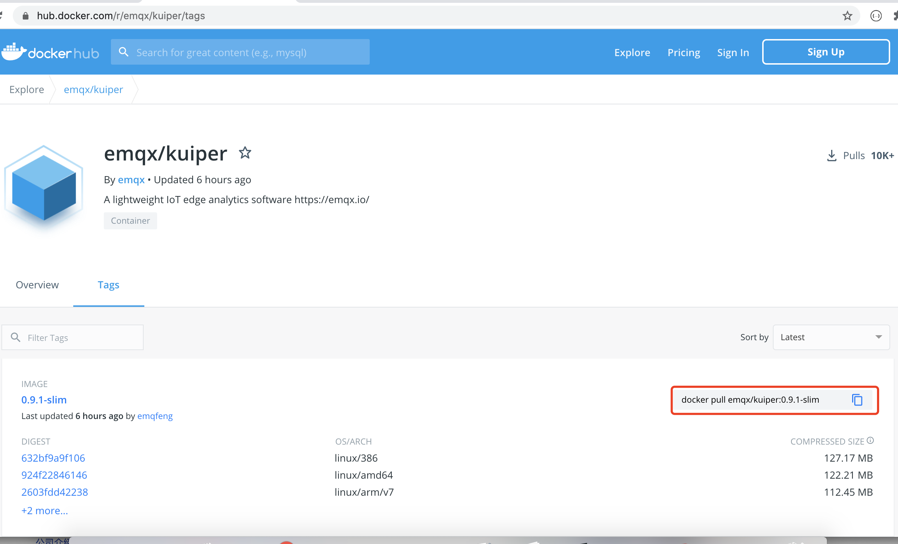
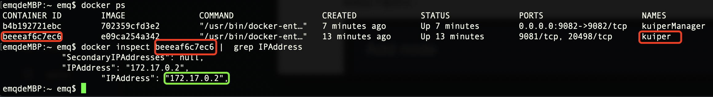
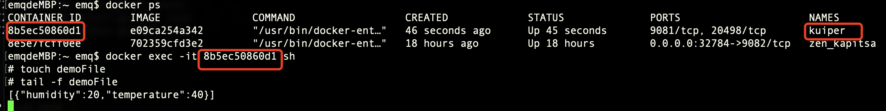

## Kuiper 管理控制台的使用

### 概览

从 Kuiper 0.9.1 版本开始，每发布一个 Kuiper 新版本，会随之发布对应版本的管理控制台。本文以一个实际例子来说明如何使用管理控制台对 Kuiper 节点进行操作与管理。本例将 MQTT 订阅到的数据发送到指定的文件中，演示说明如下：

- 创建一个 Kuiper 节点
- 创建一个流，用于订阅 source 端的数据。（本例演示订阅 MQTT 服务器，地址为：`tcp://broker.emqx.io:1883`，主题为：`devices/device_001/messages`，订阅数据为：`{"temperature": 40, "humidity" : 20}`）
- 创建一个规则，用于计算订阅到的数据，并将数据写入 sink 端。（本例演示将订阅到的消息写入到文件中）
- source 和 sink 支持多种类别，只需安装相对应的插件，便能实现对应的功能。（本例的 source 为 MQTT， 插件已内置，无需安装；source 为 file，插件未内置，需要安装）

### 安装管理控制台

#### 安装 kuiper

- 拉取 Kuiper 的 Docker 镜像，获取地址： https://hub.docker.com/r/emqx/kuiper/tags 。样例如下图所示，点击红框复制拉取镜像的命令，粘贴命令至终端运行。

  

- 运行 kuiper 容器：`docker run -d --name kuiper -e MQTT_SOURCE__DEFAULT__SERVERS=[tcp://broker.emqx.io:1883] $(IMAGE ID)` 。样例如下图所示：

  

#### 安装管理控制台

- 拉取 kuiper-manager 的 Docker 镜像：https://hub.docker.com/r/emqx/kuiper-manager/tags 。样例如下图所示，点击红框复制拉取镜像的命令，粘贴命令至终端运行。

  

- 运行 kuiper-manager 容器并暴露接口：`docker run --name kuiperManager -d -p 9082:9082 $(IMAGE ID)`  。样例如下图所示：

#### 登录 kuiper-manager

登录时需要提供 kuiper-manager 的地址，用户名、密码。样例如下图所示：

* 地址：http://127.0.0.1:9082

* 用户名：admin

* 密码：public

  

#### 创建 Kuiper 节点

创建 kuiper 节点时需要填写 Node type、Node name、Endpoint 。

* Node type : 选择 `Direct link node`  (Huawei IEF node 专用于华为用户)
* Node name : 自拟，本例为：example
* Endpoint ：http://$IP:9081 通过 `docker inspect $(kuiper CONTAINER ID) |  grep IPAddress` 获取 kuiper IP 地址。样例如下图所示：

创建 Kuiper 节点样例如下图所示：

#### 安装插件

**注意：插件安装、并且通过规则使用后，插件已经被加载到内存中，由于 Golang 语言的限制，在插件删除的时候，无法将其真正卸载，所以想重新进行插件的安装，Kuiper 必须重启才可生效。**

下载一个名为 file 的 sinks 插件，该插件将数据写入到用户指定的文件中。如下图所示：

#### 创建流

如下图，创建一个名为 demoStream 的流，用于订阅地址为 tcp://broker.emqx.io:1883 的 mqtt 服务器消息， 消息主题为 devices/device_001/messages，消息内容为 [{"temperature": 40, "humidity" : 20}]。

##### 关于配置组

配置分为多个组，用户可根据自己需求创建和选择。程序默认为 default 配置组，若用户选择其他配置组，则所选配置组和 default 配置组共同生效，若所选配置组中有数据和 default 配置组冲突，则冲突数据以所选配置组为准。

#### 创建规则

如下图，创建一条名为 demoRule 的规则，将订阅数据中 temperature > 30 的数据写入文件中。（本例文件路径为 /kuiper/demoFile）

#### 查看执行结果

 您可以使用 MQTT 客户端工具 mosquitto_pub 来发布传感器数据到服务器 `tcp://broker.emqx.io:1883`的主题 `devices/device_001/messages`  。运行shell命令：`mosquitto_pub -h broker.emqx.io -m '{"temperature": 40, "humidity" : 20}' -t devices/device_001/messages`。结果如下图所示：

如下图所示，选项中提供了三个 icon ，从左到右依次代表：rule状态、重启rule、删除rule，用户可按需操作。

### 扩展阅读

- [如何将自定义的插件展示在管理控制台的安装列表](plugins_in_manager.md)：Kuiper 提供了插件的扩展机制，用户可以基于扩展接口来实现自定义的插件。在管理控制台上，用户可以直接通过界面进行插件的安装。如果读者有自定义的插件，也想出现在管理控制台的安装列表中，该文章可以给读者一些参考。
- [EMQ edge-stack 项目](https://github.com/emqx/edge-stack)：该项目可以让用户更简单地实现 EMQ 边缘系列产品的安装和试用，实现工业数据解析，边缘数据汇聚，以及基于 Kuiper 的边缘数据分析等一站式边缘解决方案。

