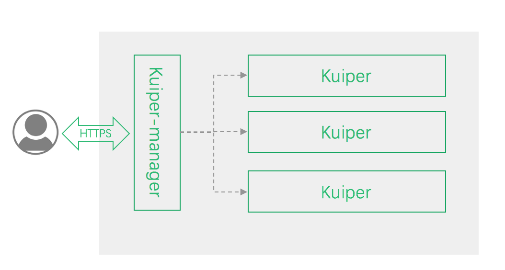
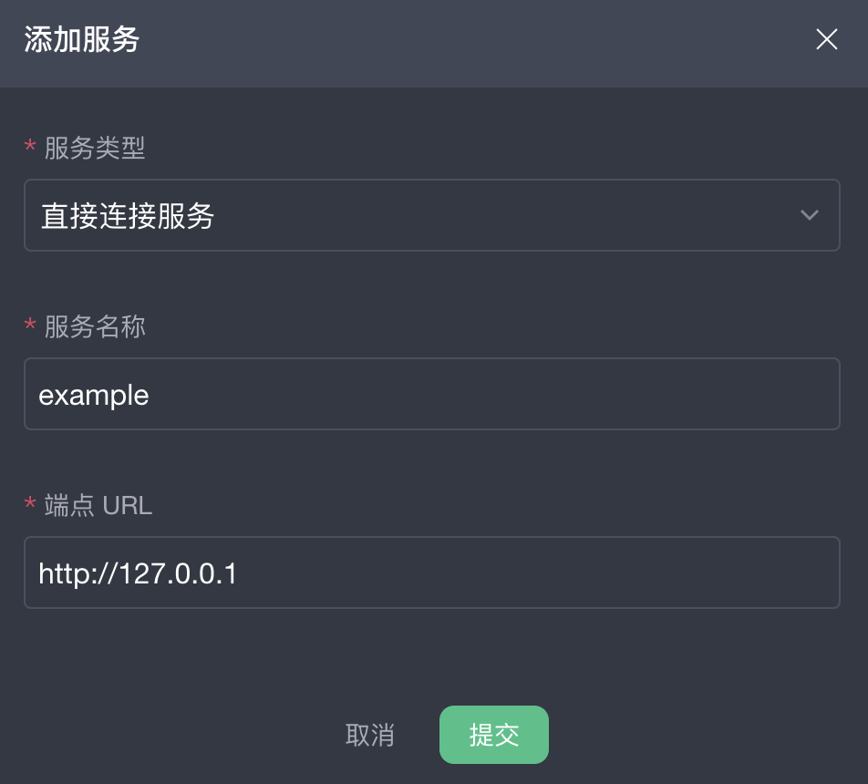
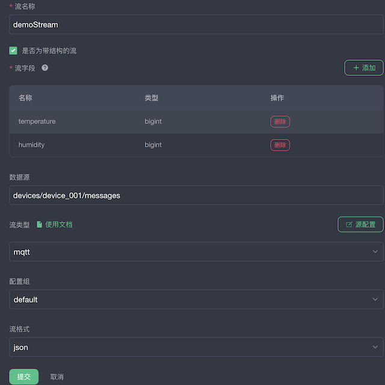

# eKuiper 管理控制台的使用

## 概览

从 eKuiper 0.9.1 版本开始，每发布一个 eKuiper 新版本，会随之发布对应版本的管理控制台。本文以一个实际例子来说明如何使用管理控制台对 eKuiper 节点进行操作与管理。文中将订阅来自于 MQTT 服务器的数据，通过 eKuiper 写好的规则，经过处理后发送到指定的文件中，演示说明如下：

- 通过管理控制台创建一个 eKuiper 节点
- 创建一个流，用于订阅 MQTT 服务器中的数据，本例演示订阅 MQTT 服务器，相关信息如下所示。
  - 地址为：`tcp://broker.emqx.io:1883`，
  - 主题为：`devices/device_001/messages`，
  - 数据为：`{"temperature": 40, "humidity" : 20}`
- 创建一个规则，用于计算订阅到的数据，并将数据写入目标 (sink) 端「本例演示将订阅到的消息写入到文件中」。
- eKuiper 目前已经支持多种源和目标。用户只需安装相对应的插件，便能实现对应的功能「本例的源为 MQTT源是内置支持，无需安装；目标为文件 (file)，非内置支持，需要另安装」

## 架构设计

* UI 端：可视化的界面，便于用户操作
* Kuiper-manager：管理控制台，本质是一个反向 HTTP 代理服务，提供用户管理，权限验证等服务。既可以部署在云端，也可以部署在边缘端
* eKuiper 实例，被管理的 eKuiper 节点实例，Kuiper-manager 可以同时管理多个 eKuiper 节点



## 安装管理控制台

### 安装 eKuiper

- 从 [Docker 镜像库](https://hub.docker.com/r/lfedge/ekuiper/tags)拉取 eKuiper 的 Docker 镜像。由于本文中要安装插件，必须使用`ekuiper:1.4-slim`镜像（`ekuiper:1.4-alpine` 镜像比较小，安装比较方便，但是由于缺少一些必要的库文件，插件无法正常运行；而 `ekuiper:1.4` 镜像是开发版本的镜像，适合于开发阶段使用）。

  ```shell
  docker pull lfedge/ekuiper:1.4-slim
  ```

- 运行 eKuiper 容器（为了方便，我们将使用由 [EMQ](https://www.emqx.cn) 提供的公有 MQTT 服务器，在运行容器时可通过 `-e` 选项设置地址）。如果您想通过主机访问 eKuiper 实例，可以通过在启动容器的时候加入 `-p 9081:9081` 参数来暴露 9081 端口。

  ```shell
  # docker run -d --name kuiper -e MQTT_SOURCE__DEFAULT__SERVER="tcp://broker.emqx.io:1883" lfedge/ekuiper:1.4-slim
  ```
  
  在运行容器时通过 `-e` 选项设置了 MQTT 服务器地址，数据写到了 MQTT 源配置文件中，通过以下命令可以查看：
  
  ```shell
  # docker exec -it kuiper sh
  # cat etc/mqtt_source.yaml
  ```
  
  该文件的部分输出如下所示，`server` 的值被设置为 `tcp://broker.emqx.io:1883`。
  
  ```yaml
  default:
    concurrency: 1
    qos: 1
    server: tcp://broker.emqx.io:1883
    sharedSubscription: true
  ....
  ```

### 安装管理控制台

- 从 [Docker 镜像库](https://hub.docker.com/r/emqx/ekuiper-manager/tags) 拉取 kuiper-manager 的 Docker 镜像 ，`1.4-ief` 为华为 IEF 用户专用镜像，本例使用`1.4` 镜像。

  ```shell
  docker pull emqx/ekuiper-manager:1.4
  ```

- 运行 Kuiper-manager 容器并暴露 9082 端口。

  ```shell
  docker run --name kuiperManager -d -p 9082:9082 emqx/ekuiper-manager:1.4
  ```

## 开始使用

### 登录 kuiper-manager

登录时需要提供 kuiper-manager 的地址，用户名、密码。如下图所示：

* 地址：`http://$yourhost:9082`

* 用户名：admin

* 密码：public

  

### 创建 eKuiper 服务

创建 eKuiper 服务时需要填写「服务类型」，「服务名称」和「端点 URL 」。

* 服务类型 : 选择 `直接连接服务`  (`华为 IEF 服务` 专用于华为用户)。

* 服务名称 : 自拟，本例为 `example`。

* 端点URL：`http://$IP:9081`，IP 获取命令如下：

  ```shell
  docker inspect kuiper |  grep IPAddress
  ```

创建 eKuiper 服务样例如下图所示，如果把端口暴露到了主机，那么也可以直接使用主机上的 9081 端口地址。



### 安装插件

我们的场景中会使用名为 file 的目标插件，选择「插件」> 「安装插件」，弹出以下对话框：在下拉列表中选择名为 file 的目标插件进行下载和安装，该插件将数据写入到用户指定的文件中。如下图所示，读者选择了对应名称的插件后，「文件」输入框中会自动填入对应的插件下载地址,「脚本参数」输入框中输入安装插件额外的参数配置。点击「提交」按钮后，eKuiper 将会从 `https://www.emqx.cn/downloads` 上相关的地址自动下载对应的插件，并自动安装到系统中。


**注意：插件安装、并且通过规则使用后，插件已经被加载到内存中，由于 Golang 语言的限制，在插件删除的时候，无法将其真正卸载，所以想重新进行插件的安装，eKuiper 必须重启才可生效；目前只支持在 debian 的 Docker 环境里的插件安装，其余环境暂不支持。**

### 创建流

如下图，创建一个名为 `demoStream` 的流，

- 用于订阅地址为 `tcp://broker.emqx.io:1883` 的 MQTT 服务器消息

- 消息主题为 `devices/device_001/messages`

- 流结构体定义包含了以下两个字段。 

  - temperature: bigint 
  - humidity: bigint

  用户也可以去掉「是否为带结构的流」来定义一个 schemaless 的数据源。

- 「流类型」可以不选择，不选的话为缺省的「mqtt」，或者如下图所示直接选择「mqtt」

- 「配置组」，与「流类型」类似，用户不选的话，使用缺省的「default」

- 「流格式」，与「流类型」类似，用户不选的话，使用缺省的「json」



如上所示用的是缺省的「default」配置组。用户也可以根据需求编写自己的配置，具体操作为，在创建流的页面中点击`源配置`，跳转到配置页面，展开你需要的配置类型，点击加号创建源配置，弹出如下对话框。


### 创建规则

如下图，创建一条名为 demoRule 的规则，将数据中 temperature > 30 的数据过滤出来。SQL 编辑器在用户写 SQL 的过程中可以给出提示，方便用户完成 SQL 的编写。


单击「添加」按钮，弹出对话框如下所示。输入结果存储的文件路径为 `/kuiper/demoFile` 。更多关于 file 目标的信息可以查看[帮助文件](../../extension/native/sinks/file.md)。目标 file 处于 `Beta` 状态，不能作为实际生产环境使用。


创建规则后，如果一切正常，那么规则处于运行状态。

### 查看执行结果

进入 eKuiper 容器创建文件：

```shell
# docker exec -it kuiper sh
# touch demoFile
# tail -f demoFile
```

使用 MQTT 客户端工具 `mosquitto_pub` 将传感器数据发送到 MQTT 服务器 `tcp://broker.emqx.io:1883`的主题 `devices/device_001/messages`  中，命令如下。如一切正常，此时名为`demoFile`的文件将收到数据：`{"temperature": 40, "humidity" : 20}`。

```shell
# mosquitto_pub -h broker.emqx.io -m '{"temperature": 40, "humidity" : 20}' -t devices/device_001/messages
```

**查看规则更多信息**

如下图所示，选项中提供了三个按钮 ，从左到右依次为。读者可以点击进行试用。

- 规则运行状态
- 重启规则
- 删除规则


## 扩展阅读

- [如何将自定义的插件展示在管理控制台的安装列表](./plugins_in_manager.md)：eKuiper 提供了插件的扩展机制，用户可以基于扩展接口来实现自定义的插件。在管理控制台上，用户可以直接通过界面进行插件的安装。如果读者有自定义的插件，也想出现在管理控制台的安装列表中，该文章可以给读者一些参考。
- 如果想开发自己的插件，读者可以参考[插件开发教程](../../extension/native/develop/plugins_tutorial.md)来获取更多信息。
- [EMQ edge-stack 项目](https://github.com/emqx/edge-stack)：该项目可以让用户更简单地实现 EMQ 边缘系列产品的安装和试用，实现工业数据解析，边缘数据汇聚，以及基于 eKuiper 的边缘数据分析等一站式边缘解决方案。
