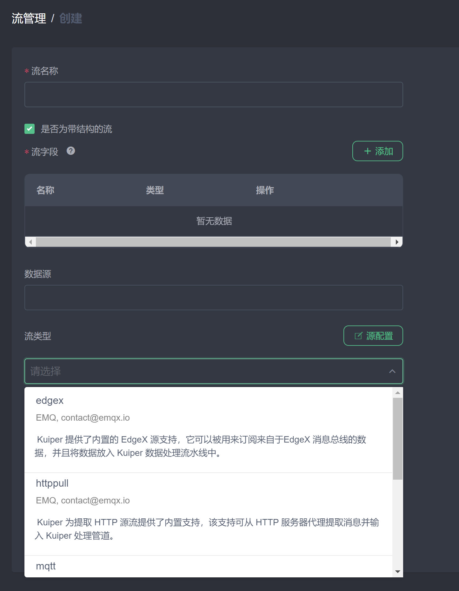
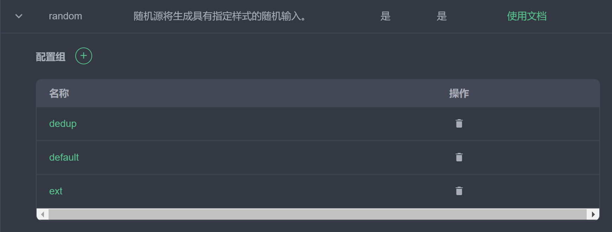
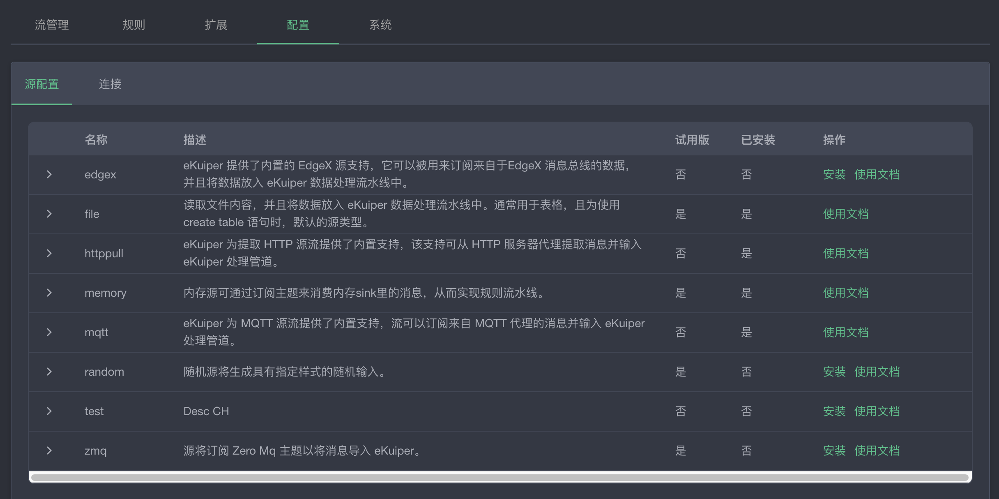
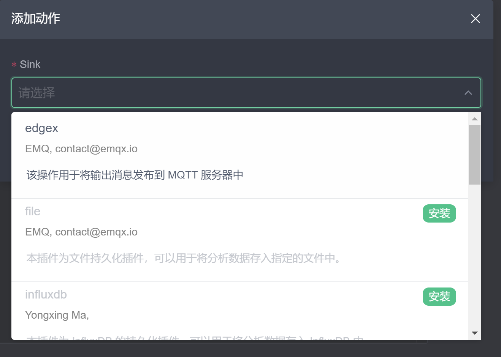
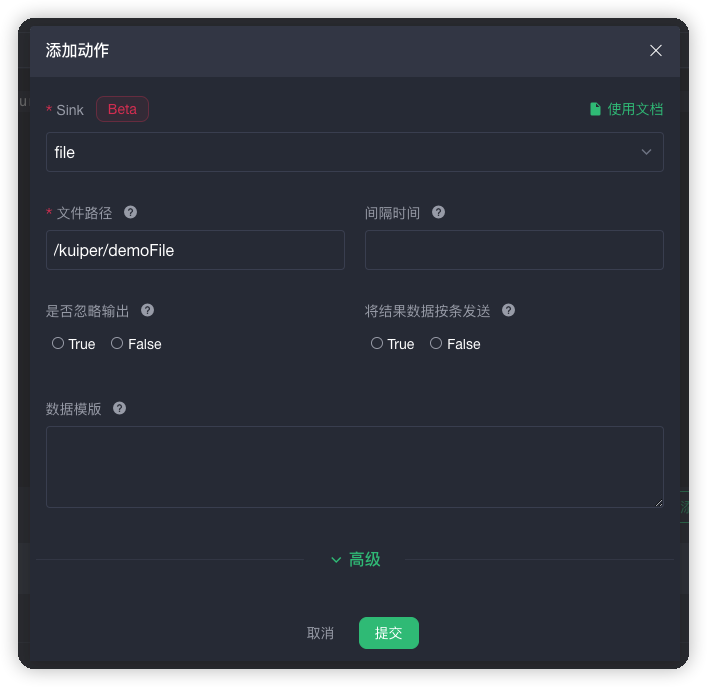
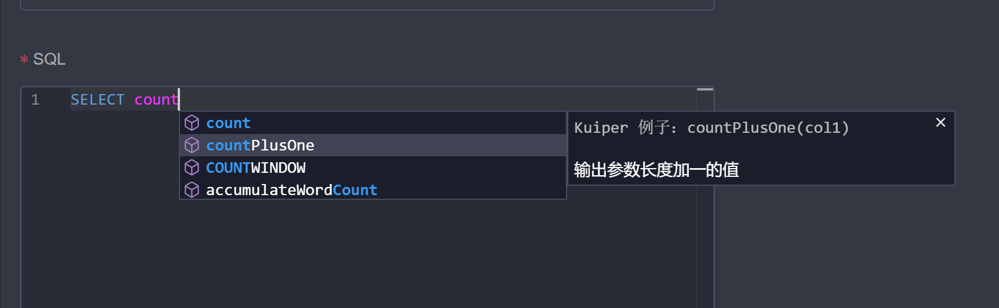

# 如何将自定义的插件展示在管理控制台的安装列表

## 概览

eKuiper 提供了插件的扩展机制，用户可以基于扩展接口来实现自定义的插件。在管理控制台上，用户可以直接通过界面进行插件的安装。如果读者有自定义的插件，也想出现在管理控制台的安装列表中，该文章可以给读者一些参考。

## 插件元数据

插件元数据是一个 json 格式文件，用于描述插件的信息。这些信息会展示在管理控制台上，同时用于管理控制台生成插件配置页面。

### 元数据格式

插件元数据为 json 格式文件，不同的插件类型支持不同的属性。

**源（Source）**

Source 元数据的详细配置请参考 [source 元数据配置](../../extension/native/develop/overview.md#source-)。配置文件的示例如下：

```json
{
  "about": {
    "trial": true,
    "author": {
      "name": "yourname",
      "email": "your@email.com",
      "company": "your company",
      "website": "https://www.your.website"
    },
    "helpUrl": {
      "en_US": "https://yourwebsite/help_en_US.md",
      "zh_CN": "https://yourwebsite/help_zh_CN.md"
    },
    "description": {
      "en_US": "your description",
      "zh_CN": "描述"
    }
  },
  "properties": {
    "default": [
      {
        "name": "prop1",
        "default": 1000,
        "optional": false,
        "control": "text",
        "type": "int",
        "hint": {
          "en_US": "The description",
          "zh_CN": "参数用法描述"
        },
        "label": {
          "en_US": "prop display name",
          "zh_CN": "参数显示名称"
        }
      }
    ]
  }
}
```

Source 元数据的配置参数主要由两部分组成：

**about**

描述插件的基本信息，包括插件作者，帮助文件，描述等。所有属性都支持多语言描述。插件安装后，在管理控制台的流管理页面选择流类型时，将会展示插件元数据中定义的信息。选中插件之后，界面上将展示元数据定义的帮助文档链接。



**properties**

描述插件的可配置属性信息，包括参数的信息以及如何进行界面展示。Source 的属性信息通过对应的配置文件指定，且配置文件中可指定多个配置组，详细请见[Source 配置文档](../../extension/native/develop/source.md#处理配置)。在元数据文件中，`properties`下可对应有多个配置组名，如例子中的`default`；每个配置组下又有多个属性的元数据。

在管理控制台的流管理页面，点击`源配置`，展开任意的源，则可展示元数据的所有配置组。



点击任一配置组，可查看配置组参数。点击添加符号，则可进入如下图参数配置页面。参数配置的展示名称，控件等信息均来自元数据json文件的定义。



**动作（Sink）**

Sink 元数据配置与 Source 基本相同。详细配置请参考 [sink 元数据配置](../../extension/native/develop/overview.md#sink-)。

Sink 元数据的配置参数主要也由两部分组成：

**about**

描述插件的基本信息，包括插件作者，帮助文件，描述等。所有属性都支持多语言描述。插件安装后，在管理控制台的规则创建页面，在动作模块点击`添加`按钮，在弹出窗口中，点击下拉框进行 sink 选择。在下拉框中将列出插件元数据中定义的信息。



**properties**

描述插件的可配置属性信息，包括参数的信息以及如何进行界面展示。与 Source 不同的时，Sink 的属性不保存在配置文件里，而是在规则创建时进行配置。对应的元数据配置中，Sink 不再有配置组概念。在管理控制台的规则创建页面，添加动作弹出窗口中，选中插件后将展示帮助文档链接以及元数据中定义的属性。需要注意的时，Sink 有一些[共同属性](../../rules/overview.md#目标/动作)，在所有 Sink 中都会展示。



**函数（Functions）**

Function 元数据详细配置请参考 [sink 元数据配置](../../extension/native/develop/overview.md#functions-)。其中，`about` 部分与 Source 和 Sink 完全相同。`function` 部分配置了函数的名称，样例和提示信息，用于新建规则的 SQL 编辑器中进行代码提示。



## 插件编译打包格式

插件的开发，编译和打包请参考[插件开发教程](../../extension/native/develop/plugins_tutorial.md)。自定义插件要展示在管理控制台，需要遵循如下原则：

1. 插件元数据文件名应当与插件名字相同，且为 json 文件，例如`mySource.json`。
2. 插件元数据文件应当放在打包的 zip 文件的跟目录下。

## 发布至 Web 服务器

在 `etc/kuiper.yaml` 中，有一个 `pluginHosts` 配置项，用户可以在这里配置服务器列表。除了官方的插件发布地址之外，用户可以在这里加入自己本地的插件发布地址。但是插件发布时候对目录的结构和内容有要求。部署服务应为

```
https://$host/$folder/$version/$os/$type/$plugin.zip
```

例如： https://127.0.0.1:9090/kuiper-plugins/1.3.1/debian/sinks/file.zip

其中：

1. $version: 插件编译所用的 eKuiper 版本号
2. $os: 插件编译所用的操作系统。在默认 eKuiper Docker 镜像中编译的插件，该值为 debian.
3. $type: 插件类型，可为`sources`, `sinks`, `functions`.


## 限制

由于`Go`语言插件机制的限制，插件的编译环境必须与`eKuiper`环境相同。因此，建议插件在`eKuiper`相同版本的`Docker` 容器中进行编译。同时，由于`alpine` 环境部分库缺失，不建议在上面运行插件。因此，若需要插件安装运行，建议使用如下容器：

- eKuiper: 使用 slim 镜像，例如 `1.3.1-slim`
- 插件：使用对应版本默认镜像进行编译，例如 `1.3.1`

## 总结

eKuiper 控制台提供了自定义插件的展示机制。用户只需要在自定义插件包中添加插件元数据文件即可。同时，用户可以自定义插件仓库，从而方便地从控制台进行插件的安装和使用。