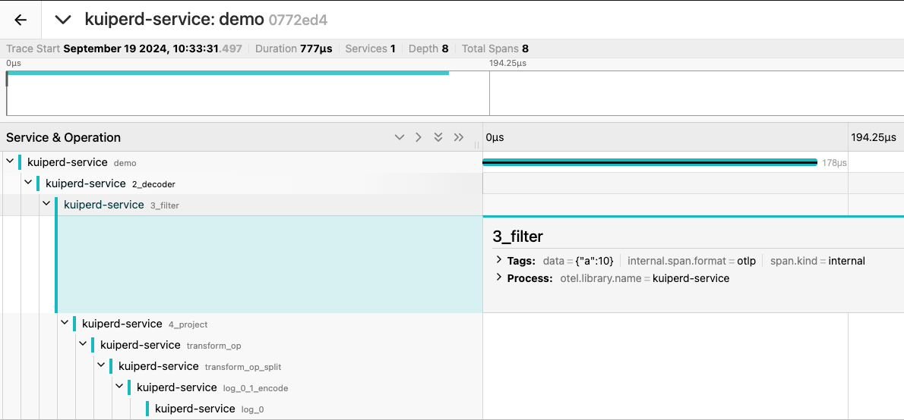
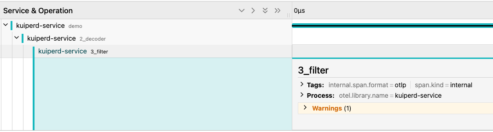

## 使用 Open Telemetry Tracing 来追踪数据

eKuiper 的规则是一个持续运行的流式计算任务。规则用于处理无界的数据流，正常情况下，规则启动后会一直运行，不断产生运行状态数据。我们可以使用 open telemetry tracing 来追踪每一条数据在各个算子中的数据变化。

## Open Telemetry Tracing 配置

你可以通过配置将 Open Telemetry 的数据暴露给远端的 Open Telemetry Collector, 同时 eKuiper 也支持内置收集 Open Telemtry Trcing 的数据，你可以通过以下配置限制最大保存数据的数量。

```yaml
openTelemetry:
  serviceName: kuiperd-service
  enableRemoteCollector: false
  remoteEndpoint: localhost:4318
  localTraceCapacity: 2048
```

## 开启规则级别的追踪

你可以通过 REST API 开启[特定规则的数据追踪](../../api/restapi/trace.md#开启特定规则的数据追踪)

## 获取每条数据的 Trace ID

你可以通过 Rest API 获取规则对应的最近 Trace ID。

[根据规则 ID 查看最近的 Trace ID](../../api/restapi/trace.md#根据规则-id-查看最近的-trace-id)

## 根据 Trace ID 查看追踪的数据流变化

如果你配置了 Open Telemetry Tracing 收集器，你可以通过 Trace ID 向 Open Telemetry 收集器背后的存储与查询平台进行查询。 同时，你也可以通过访问本地 Rest API 的方式获取详细的追踪数据。

[根据 Trace ID 查看详细追踪数据](../../api/restapi/trace.md#根据-trace-id-查看详细追踪数据)

## 通过 Open Telemetry Collector 和 Jaeger 集成数据追踪

eKuiper 支持将 Trace 数据暴露到 Open Telemetry Collector，Open Telemetry 则支持将 Tracing 的数据暴露到 Jaeger 中进行展示。 我们通过以下例子进行展示:

### 本地启动 Open Telemetry Collector 与 Jaeger

通过 docker-compose 启动 open telemetry collector 和 Jaeger

```shell
docker-compose up -d
```

```yaml
receivers:
  otlp:
    protocols:
      http:
        endpoint: 0.0.0.0:4318

exporters:
  otlp:
    endpoint: jaeger:4317
    tls:
      insecure: true

processors:
  batch:

service:
  pipelines:
    traces:
      receivers: [otlp]
      processors: [batch]
      exporters: [otlp]
```

```yaml
version: "3.8"

services:
  jaeger:
    image: jaegertracing/all-in-one:latest
    ports:
      - "16686:16686" # Jaeger UI
      - "14250:14250" # gRPC for Jaeger
      - "14268:14268" # HTTP for Jaeger
    networks:
      - otel-net

  otel-collector:
    image: otel/opentelemetry-collector-contrib:latest
    command: ["--config=/etc/otel-collector-config.yaml"]
    volumes:
      - ./collector.yaml:/etc/otel-collector-config.yaml
    ports:
      - "4318:4318" # OTLP HTTP receiver
    depends_on:
      - jaeger
    networks:
      - otel-net

networks:
  otel-net:
    driver: bridge
```

### 配置 eKuiper 开启将数据追踪发送到 Collector

```yaml
openTelemetry:
  serviceName: kuiperd-service
  enableRemoteCollector: true
  remoteEndpoint: localhost:4318
  localTraceCapacity: 2048
```

### 创建规则并开启规则数据链路追踪

通过 REST API [创建规则](../../api//restapi/rules.md#创建规则)

通过 REST API 为规则[开启数据追踪](../../api//restapi/trace.md#开启特定规则的数据追踪)

### 访问 Jaeger 查看 Trace 数据

访问 localhost:16686 查看 Jaeger 内的 Trace 数据

## 通过数据追踪来 debug 规则

在本例中我们将通过数据追踪来 debug 规则，查看在 SQL 中，数据是如何在各个算子中传输的。

### 创建规则

首先我们创建一个规则，该规则会根据 a 列来将数据进行筛选

```json
{
  "id": "rule1",
  "sql": "select * from demo where a > 5",
  "actions": [
    {
      "log": {}
    }
  ]
}
```

### 发送数据

发送两条数据，其中一条数据会被过滤条件过滤，另一条则不会。

```json
{"a":10}
{"a":4}
```

### 通过 REST API 获取规则的 TraceID 列表

我们可以通过 Rest API 来获取[规则的 TraceID 列表](../../api/restapi/trace.md#根据规则-id-查看最近的-trace-id)

### 通过 TraceID 在 Jaeger 中查看对应的数据追踪

对于 {"a":10} 这条数据，在 Jaeger 中可以查看该数据在各个算子中的传输：



由于 a 列满足了 SQL 的筛选条件，所以该数据没有被过滤，最终被输出了。

对于 {"a":4} 这条数据，在 Jaeger 中可以查看该数据在各个算子中的传输：



由于 a 列没有满足 SQL 的筛选条件，所以该数据被过滤，最终没有被输出。
