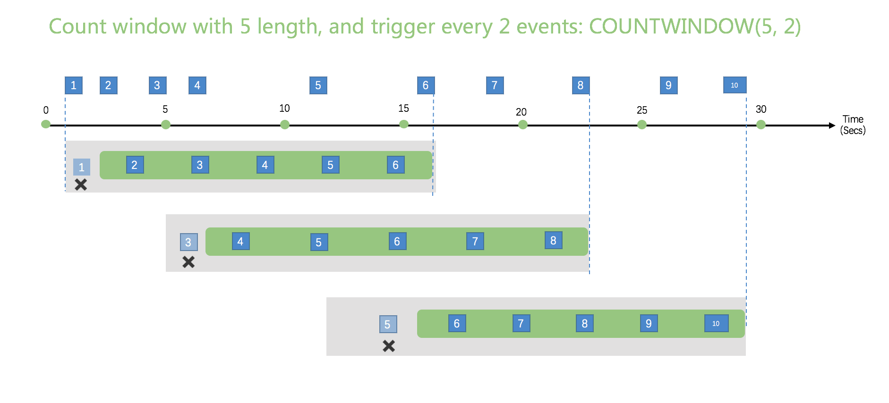

# 窗口

在时间流场景中，对时态窗口中包含的数据执行操作是一种常见的模式。eKuiper 对窗口函数提供本机支持，使您能够以最小的工作量编写复杂的流处理作业。

有五种窗口可供使用： [滚动窗口](#滚动窗口)， [跳跃窗口](#跳跃窗口)，[滑动窗口](#滑动窗口)，[会话窗口](#会话窗口)和[计数窗口](#计数窗口)。 您可以在 eKuiper 查询的查询语法的 GROUP BY 子句中使用窗口函数。

所有窗口操作都在窗口的末尾输出结果。窗口的输出将是基于所用聚合函数的单个事件。

## 时间单位

窗口中可以使用5个时间单位。 例如，`TUMBLINGWINDOW（ss，10）`，这意味着以10秒为间隔的滚动将数据分组。时间间隔会根据自然时间对齐。例如，10秒的窗口，不管规则何时开始运行，窗口结束时间总是10秒的倍数，例如20秒，30秒等。以天为单位的窗口，窗口结束时间总是在当地时间的24：00。

DD：天单位

HH ：小时单位

MI：分钟单位

SS：秒单位

MS ：毫秒单位

## 滚动窗口

滚动窗口函数用于将数据流分割成不同的时间段，并对其执行函数，例如下面的示例。滚动窗口的关键区别在于它们重复不重叠，并且一个事件不能属于多个滚动窗口。


```sql
SELECT count(*) FROM demo GROUP BY ID, TUMBLINGWINDOW(ss, 10);
```

## 跳跃窗口

跳跃窗口功能会在时间上向前跳一段固定的时间。 将它们视为可能重叠的翻转窗口可能很容易，因此事件可以属于多个跳跃窗口结果集。 要使跳跃窗口与翻转窗口相同，请将跳跃大小指定为与窗口大小相同。


```sql
SELECT count(*) FROM demo GROUP BY ID, HOPPINGWINDOW(ss, 10, 5);
```

## 滑动窗口

滑动窗口功能与翻转或跳动窗口不同，仅在事件发生时会产生输出。 每个窗口至少会有一个事件，并且该窗口连续向前移动€（ε）。 就像跳跃窗口一样，事件可以属于多个滑动窗口。


```sql
SELECT count(*) FROM demo GROUP BY ID, SLIDINGWINDOW(mi, 1);
```

## 会话窗口

会话窗口功能对在相似时间到达的事件进行分组，以过滤掉没有数据的时间段。 它有两个主要参数：超时和最大持续时间。


```sql
SELECT count(*) FROM demo GROUP BY ID, SESSIONWINDOW(mi, 2, 1);
```

当第一个事件发生时，会话窗口开始。 如果从上一次摄取的事件起在指定的超时时间内发生了另一个事件，则窗口将扩展为包括新事件。 否则，如果在超时时间内未发生任何事件，则该窗口将在超时时关闭。

如果事件在指定的超时时间内持续发生，则会话窗口将继续扩展直到达到最大持续时间。 最大持续时间检查间隔设置为与指定的最大持续时间相同的大小。 例如，如果最大持续时间为10，则检查窗口是否超过最大持续时间将在 t = 0、10、20、30等处进行。

## 计数窗口

请注意计数窗口不关注时间，只关注事件发生的次数。

### 滚动计数窗口

滚动计数窗口与一般的滚动窗口类似，在滚动窗口中的事件不重复、不重叠，一个事件不会属于多个滚动窗口。以下是一个长度为 5 的滚动计数窗口。


```sql
SELECT * FROM demo WHERE temperature > 20 GROUP BY COUNTWINDOW(5)
```

这个 SQL 按照 5 次对事件进行分组，并且只获取 `temperature`  大于 20 的数据。

### 其它计数窗口

`COUNTWINDOW(count, interval)`，这种计数窗口是被 COUNTWINDOW 中的第二个参数触发的，它定义了计数窗口触发所需的事件次数。

- 如果第二个参数值为 1， 那么每次事件进来的时候都会被触发
- 第二个参数的值不应该大于第一个参数的值

以下为 `COUNTWINDOW(5,1)` 的示意图，计数窗口长度为 5， 每接收一个事件就触发一次。


以下计数窗口的长度为 5，每 2 个事件触发一次窗口。输出为最近的 5 个事件。

1. 当收到事件 `2`，目前总共有 2 个事件，小于窗口长度 5，不会触发窗口
2. 当收到事件 `4`，目前总共有 4 个事件，小于窗口长度 5，不会触发窗口
3. 当收到事件 `6`，目前总共有 6 个事件，大于窗口长度 5，生成了1个窗口包含了 5 个事件。由于长度为 5，因此第一个事件将被忽略
4. 剩下窗口生成与之前的类似



```sql
SELECT * FROM demo WHERE temperature > 20 GROUP BY COUNTWINDOW(5,1) HAVING COUNT(*) > 2
```

这个 SQL 含有如下条件，

- 有一个计数窗口，长度为 5， 每接收一个事件就触发一次
- 只获取 `temperature`  大于 20 的数据
- 最后一个条件为消息的条数应该大于 2。如果 `HAVING`  条件为 `COUNT(*)  = 5`， 那么意味着窗口里所有的事件都应该满足 `WHERE` 条件

## 过滤窗口输入

在某些情况下，窗口不需要所有输入。`filter` 子句用于过滤给定条件下的输入数据。与 `where` 子句不同，`filter` 子句在窗口分区之前运行。结果会有所不同，特别是计数窗口。如果对带有长度为 3 的计数窗口的数据使用 `where` 子句进行过滤，则输出长度将随窗口的不同而变化；而使用 `filter` 子句进行筛选时，输出长度将始终为 3。

filter 子句必须跟在 window 函数后面。filter子句必须类似于 `FILTER(WHERE expr)`。例如：

```sql
SELECT * FROM demo GROUP BY COUNTWINDOW(3,1) FILTER(where revenue > 100)
```

## 时间戳管理

每个事件都有一个与之关联的时间戳。 时间戳将用于计算窗口。 默认情况下，当事件输入到源时，将添加时间戳，称为`处理时间`。 我们还支持将某个字段指定为时间戳，称为`事件时间`。 时间戳字段在流定义中指定。 在下面的定义中，字段 `ts` 被指定为时间戳字段。

```sql
CREATE STREAM demo (
                    color STRING,
                    size BIGINT,
                    ts BIGINT
                ) WITH (DATASOURCE="demo", FORMAT="json", KEY="ts", TIMESTAMP="ts"
```

在事件时间模式下，水印算法用于计算窗口。

## 窗口中的运行时错误

如果窗口从上游接收到错误（例如，数据类型不符合流定义），则错误事件将立即转发到目标（sink）。 当前窗口计算将忽略错误事件。
