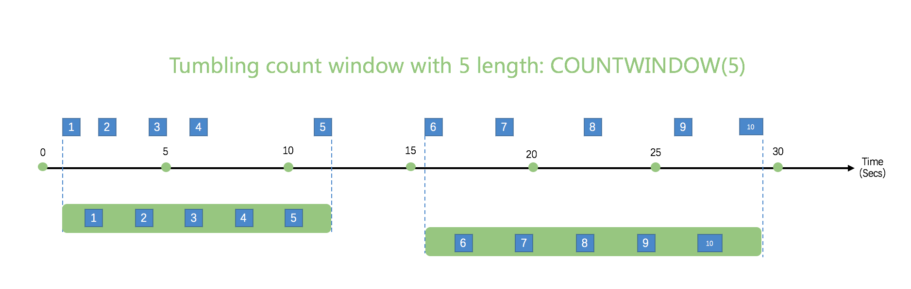
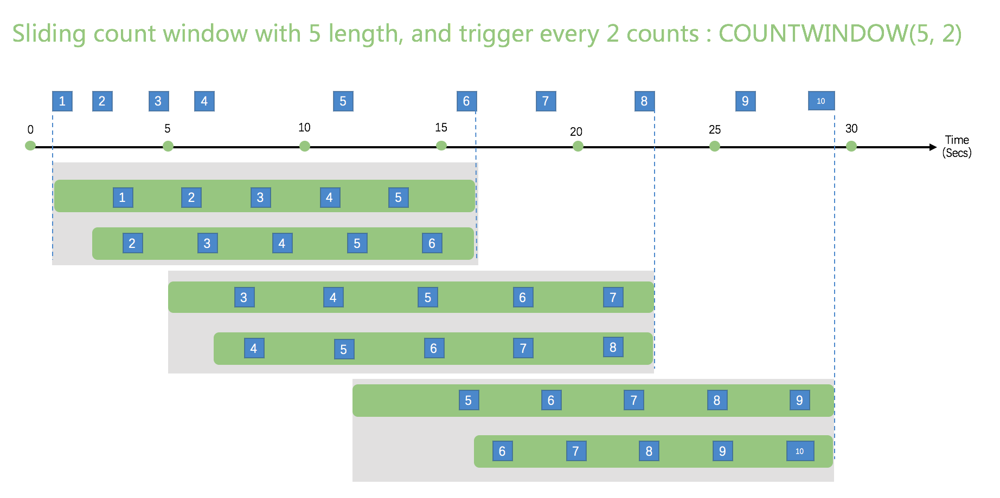

# 窗口

在时间流场景中，对时态窗口中包含的数据执行操作是一种常见的模式。Kuiper对窗口函数提供本机支持，使您能够以最小的工作量编写复杂的流处理作业。

有五种窗口可供使用： [滚动窗口](#TUMBLING WINDOW)， [跳跃窗口](#Hopping window)，[滑动窗口][Sliding window]，[会话窗口](#Session window)和[计数窗口](#计数窗口)。 您可以在Kuiper查询的查询语法的GROUP BY子句中使用窗口函数。

所有窗口操作都在窗口的末尾输出结果。窗口的输出将是基于所用聚合函数的单个事件。

## 时间单位

窗口中可以使用5个时间单位。 例如，``TUMBLINGWINDOW（ss，10）''，这意味着以10秒为间隔的滚动将数据分组。

DD：天单位

HH ：小时单位

MI：分钟单位

 SS：第二单位

MS ：毫秒单位

## 滚动窗口

滚动窗口函数用于将数据流分割成不同的时间段，并对其执行函数，例如下面的示例。滚动窗口的关键区别在于它们重复不重叠，并且一个事件不能属于多个翻滚窗口。


待办事项: 

- 是否需要时间戳？
- 不支持计数功能。21


```sql
SELECT count(*) FROM demo GROUP BY ID, TUMBLINGWINDOW(ss, 10);
```

## 跳跃窗口

跳跃窗口功能会在时间上向前跳一段固定的时间。 将它们视为可能重叠的翻转窗口可能很容易，因此事件可以属于多个跳跃窗口结果集。 要使“跳跃”窗口与“翻转”窗口相同，请将跳跃大小指定为与窗口大小相同。


待办事项: 

- 是否需要时间戳？
- 不支持计数功能。

```sql
SELECT count(*) FROM demo GROUP BY ID, HOPPINGWINDOW(ss, 10, 5);
```


## 滑动窗口

滑动窗口功能与翻转或跳动窗口不同，仅在事件发生时会产生输出。 每个窗口至少会有一个事件，并且该窗口连续向前移动€（ε）。 就像跳跃窗口一样，事件可以属于多个滑动窗口。


待办事项: 

- 是否需要时间戳？
- 不支持计数功能。

```sql
SELECT count(*) FROM demo GROUP BY ID, SLIDINGWINDOW(mm, 1);
```


## 会话窗口

会话窗口功能对在相似时间到达的事件进行分组，以过滤掉没有数据的时间段。 它有两个主要参数：超时和最大持续时间。


待办事项: 

- 是否需要时间戳？
- 不支持计数功能。


```sql
SELECT count(*) FROM demo GROUP BY ID, SESSIONWINDOW(mm, 2, 1);
```


当第一个事件发生时，会话窗口开始。 如果从上一次摄取的事件起在指定的超时时间内发生了另一个事件，则窗口将扩展为包括新事件。 否则，如果在超时时间内未发生任何事件，则该窗口将在超时时关闭。

如果事件在指定的超时时间内持续发生，则会话窗口将继续扩展直到达到最大持续时间。 最大持续时间检查间隔设置为与指定的最大持续时间相同的大小。 例如，如果最大持续时间为10，则检查窗口是否超过最大持续时间将在t = 0、10、20、30等处进行。

## 计数窗口

目前支持两种计数窗口：滚动计数窗口与滑动计数窗口，请注意计数窗口不关注时间，只关注事件发生的次数。

### 滚动计数窗口

滚动计数窗口与一般的滚动窗口类似，在滚动窗口中的事件不重复、不重叠，一个事件不会属于多个滚动窗口。以下是一个长度为 5 的滚动计数窗口。



```sql
SELECT * FROM demo WHERE temperature > 20 GROUP BY COUNTWINDOW(5)
```

这个 SQL 按照 5 次对时间进行分组，并且只获取`temperature` 大于 20 的数据。

### 滑动计数窗口

`COUNTWINDOW(count, interval)`，滑动计数窗口是被 COUNTWINDOW 中的第二个参数触发的，它定义了滑动计数窗口触发所需的事件次数。

- 如果第二个参数值为 1， 那么每次事件进来的时候都会被触发
- 第二个参数的值不应该大于第一个参数的值

以下的滑动计数窗口的长度为 5，每 2 个世界触发一次窗口。输出为在目前所有连续的 5 个事件。

1. 当收到时间 `2`，目前总共有 2 个事件，小于窗口长度 5， 不会触发窗口 
2. 当收到时间 `4`，目前总共有 2 个事件，小于窗口长度 5， 不会触发窗口 
3. 当收到时间 `6`，目前总共有 6 个事件，大于窗口长度 5， 有两个窗口包含了 5 个事件
4. 剩下时间窗口生成与之前的类似



```sql
SELECT * FROM demo WHERE temperature > 20 GROUP BY COUNTWINDOW(5,1) HAVING COUNT(*) > 2
```

SQL 有以下的条件，

- 它有一个滑动计数窗口，长度为 5， 每接收一个事件就触发一次
- 只获取`temperature` 大于 20 的数据
- 最后一个条件为消息的条数应该大于 2。如果 `HAVING` 条件为 `COUNT(*)  = 5`， 那么意味着窗口里所有的事件都应该满足 `WHERE` 条件

## Timestamp Management

Every event has a timestamp associated with it. The timestamp will be used to calculate the window. By default, a timestamp will be added when an event feed into the source which is called `processing time`. We also support to specify a field as the timestamp, which is called `event time`. The timestamp field is specified in the stream definition. In the below definition, the field `ts` is specified as the timestamp field.

``
CREATE STREAM demo (
					color STRING,
					size BIGINT,
					ts BIGINT
				) WITH (DATASOURCE="demo", FORMAT="json", KEY="ts", TIMESTAMP="ts"
``

In event time mode, the watermark algorithm is used to calculate a window.

## Runtime error in window

If the window receive an error (for example, the data type does not comply to the stream definition) from upstream, the error event will be forwarded immediately to the sink. The current window calculation will ignore the error event